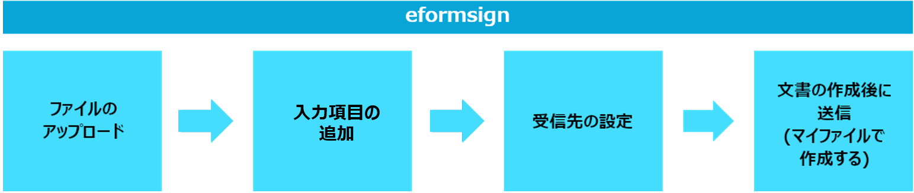

==================
eformsignのご紹介
==================

eformsign(イーフォームサイン)は、会社で発生する全ての紙の文書を誰でも簡単に電子文書化し、いつでもどこでも業務に活用できたり、保存された情報を様々な方法で活用できる電子文書サービスです。

eformsignが提供している、Webエディターの **Webフォームデザイナー（Web form designer)**\ を使用することで、これまで使用していた文書ファイルをアップロードして電子文書としてご使用できます。
また、Microsoft Officeのアドインとして提供している **フォームビルダー**\ は、Office製品で作成したご使用中の文書ファイルをそのままの形式で電子文書に変換し、テンプレートを作成することができます。

さらに、社内の業務プロセスに合わせたワークフローを設定することができます。
契約書・同意書・申込書などの外部文書だけでなく、稟議書などの社内文書に対しても、
文書の処理プロセスを自由に設定することができ、様々な業務に対応することが可能です。
ワークフローのステップや受信者ごとの通知、必須入力項目などの詳細設定ができ、
文書の進行情報と処理状況もリアルタイムで確認できます。

文書の偽造・改ざんを防ぐため、文書の基本情報、履歴、署名情報など、
全てのログを記載した監査証跡証明書を提供しています。

そのほか、作成者の情報やグループ関連情報、直近の入力値、日付情報の自動入力を提供しており、
これにより繰り返し入力の作業を省くことができます。また、複数の文書を一括で作成することができる一括作成機能、
会社のメンバーと権限の管理や文書に関する通知を自由に設定することができる通知設定機能や、
文書に入力されたデータをCSV形式で出力できる入力データ出力機能により、
データ管理・活用をより効率的に行うことができます。

.. figure:: resources/main_feature.png
   :alt: 主要機能
   :width: 700px

eformsignサービスの主要機能のひとつが電子署名機能です。

電子署名とは、紙に押印する署名と同様の役割を果たす、電子形態の署名です。
紙に署名する際、本人が直接署名しなければならないように、電子署名もしく本人認証により、
署名者が本人であることを証明することが必要です。
本人認証手段としてはメールアドレス、生年月日、パスワード、電話番号などが用いられます。

電子署名は多くの国で段階的に法的効力を区分して適用されています。eformsignの電子署名は、個人間取引（CtoC）及び消費者向け取引(BtoC)において法的効力を持ち、
否認防止のための様々な機能を提供しております。

.. note::

   電子署名の各国の法的効力（法的拘束力）については、以下をご参照ください。

   -  **日本**

      電子署名法及び認証業務に関する法律(電子署名法)により、完全性および本人性を備えた電子署名に対して法的効力が認められる。

   -  **韓国**

      電子署名法に基づき、電子署名は電子的形式であることで文書または署名の法的効力が否認されないものとする。また、公認認証書の独占的な地位を廃止し、直接署名を行ったり民間の様々な電子署名サービスに同一な法的効力を付与している。

   -  **アメリカ**

      1999年に制定された電子取引法 (Uniform Electronic Transactions Act, UETA) と2000年制定されたESIGN法 (Electronic Signature in Global and National Commerce Act, ESIGN) により、特定の要件に適合された電子署名に対して実署名と同様の法的効力を認めた。電子署名が法的効力を持つためには署名意図 (署名者認証)、意思及び同意、署名プロセスの記録、署名の保存など４つの主要要件を満たす必要がある。現在アメリカ本土48州で電子署名法案が採択されたことにより、大半の取引では電子署名が手書きの署名と同様の法的効力が認められている。

   -  **EU**

      eIDAS(Electronic Identification and Trust Services)規定に従い、あらゆる種類の電子署名に法的効力と拘束力を認めている。適格電子署名、高度電子署名、標準電子署名に区分し、文書の種類によって法的地位を付与している。

基本用語
-------------

eformsignの使用にあたり必須となる、
eformsignの基本用語をご紹介します。

-  **Webフォームデザイナー（Web form designer）**

   Webフォームデザイナーとは、既存の文書ファイルをeformsignにアップロードし、
   簡単に電子文書化することができるツールです。
   申込書、契約書、同意書などのPDFファイルに変換した文書に、
   署名やテキストボックス、チェックボックスなどを追加してテンプレートとして保存することができます。
   また、作成した電子文書を社内/社外の人に送信して文書の作成または署名を依頼することができます。

-  **フォームビルダー（Microsoft Officeアドイン）**

   フォームビルダーとは、Microsoft Office製品で作成した電子文書フォームからテンプレートを作成するためのツールです。
   申込書や契約書、同意書などの既存の文書（Office製品で作成した文書）を、
   署名やテキストボックスなどの入力項目を持つ電子文書に変換し、eformsignにアップロードする際に使用します。
   本ツールはMicrosoft Officeのリボンメニューの形に追加（アドイン)され、Word、Excel、PowerPointからすぐに使用することができます。

-  **ダッシュボード**

   ダッシュボードとは、eformsignにログインした際に最初に表示されるサービスのトップ画面です。
   ダッシュボードの左上のメニューアイコン (|image1|) をクリックすることでサイドバーメニューにアクセスできます。
   サイドバーメニューに表示される内容は、ユーザーの権限によって変化します。

   .. figure:: resources/dashboard.png
      :alt: eformsignのダッシュボード画面
      :width: 750px

-  **テンプレート**

   テンプレートとは、eformsignで使用する電子文書書式です。
   申請書や同意書のような繰り返し使用する文書を予めeformsign上に登録しておくことで、すぐに作成を開始できます。
   テンプレートはPCに保存されているファイルをeformsignにそのままアップロードするか、
   フォームビルダーからOfficeファイルを作成することでアップロードできます。

-  **文書**

   文書とは、テンプレートから作成・送信する電子文書、または使用中のファイルをアップロードして作成・送信する電子文書のことです。文書は **マイファイルで作成する** または **テンプレートで作成する** メニューから作成・送信することができます。このように作成された文書を基準として、eformsign内での使用文書件数を集計しています。

-  **文書トレイ**

   文書トレイとは、作成された文書を保存・閲覧することができるクラウドストレージです。
   文書のステータスによって4つの文書トレイに分けて保存されます。

   -  **要処理文書:** 本人が処理する必要がある文書（他のメンバーが作成・署名依頼をした文書）、またはメンバーではない受信者に送信した文書のうち、まだ処理されていない文書を一覧で確認することができます。

   -  **進行中の文書:** 本人が作成、または処理した文書のうち、まだ完了していない文書を一覧で確認することができます。

   -  **完了文書:** 本人が作成した文書のうち、完了した全ての文書を一覧で確認することができます。

   -  **一括作成文書:** 本人が一括作成して送信した文書のステータスを確認することができます。

-  **下書きとして保存**

   **マイファイルで作成する** から **文書作成をスタート** をクリックする前に下書き保存した文書が保存されます。

-  **ワークフロー**

   ワークフローとは、文書の作成から完了までの処理プロセスのことです。
   テンプレート管理者は、各テンプレートのワークフローのステップを設定することができます。
   ワークフローは **開始 — 完了**\ がデフォルトで設定されており、次の **受信者のタイプ**\ を追加することができます。

   -  **検討者:** 文書を検討後、承認または返戻します。

   -  **参加者:** 文書の入力欄に作成または署名します。

   -  **閲覧者:** 文書の閲覧のみできます。

   .. figure:: resources/workflow_new.png
      :alt: ワークフローのステップ
      :width: 600px

-  **CC**

ワークフローの受信者のタイプ以外にも、文書の送信ステップでその文書を参照するユーザー(CC)を設定することができます。CCに設定されたユーザーは、文書の進行状況の確認と閲覧ができます。文書送信または文書完了時にCCのユーザーには通知メールが送られ、文書を確認できます。
   
CCに設定された文書は、文書の進行状態に応じて、CCに設定されたユーザーの **進行中の文書トレイ** または **完了文書トレイ**\ に表示されます。

-  **代表管理者**

   会社の代表者として、eformsignの全ての機能を制御する権限を持ちます。

-  **会社管理の権限**

   会社の管理権限がある場合、会社管理メニューにアクセスできます。会社・グループ及びメンバーなどの管理を行うことができます。

-  **テンプレートの管理権限**

   テンプレートの管理権限がある場合、テンプレート管理メニューにアクセスできます。テンプレートの作成・変更・配布及び削除を行うことができます。

-  **テンプレートの使用権限**

   テンプレートを使用する際の、使用権限を設定できます。「テンプレートで文書を作成」画面でそのテンプレートを使用して文書を作成することが出来ます。

-  **テンプレートの修正権限**

   テンプレートの修正権限を設定できます。テンプレートの修正権限がある場合テンプレート管理メニューでそのテンプレートの設定を修正することが出来ます。

-  **文書の管理権限**

   文書の管理権限がある場合、文書管理メニューにアクセスすることができます。権限があるテンプレートで作成された文書を閲覧して、完了文書に対するキャンセル依頼を承認または文書をシステムで永久削除することができます。文書の管理権限はテンプレートごとに設定することができます。

使用プロセス
-------------------

eformsignを使用するには、PCに保存された文書ファイルをeformsignにアップロードしてテンプレートを利用せず直接電子文書化する方法、または予め作成・保存したテンプレートを利用して電子文書を送信する方法があります。

.. note::

   アップロード可能なファイル形式はpdf, hwp, doc, docx, xls, xlsx, ppt, pptx, odt, jpg, png, gif, tiffです。

マイファイルで作成する
~~~~~~~~~~~~~~~~~~~~~~~~~~
文書ファイルをeformsignにアップロード後、Webフォームデザイナーでテキスト・署名・コンボ及び日付などの入力コンポーネントを文書に追加して送信できます。

テンプレートのアップロードをせずとも、自由に文書をアップロードし、送信できます。アップロードされた文書に入力コンポーネントを追加し、ワークフロー設定で受信者を指定後 **文書作成をスタート**\ ボタンをクリックすることで受信者に送信されます。

受信者に送信する前に下書き保存をすることも可能です。

テンプレートで作成する
~~~~~~~~~~~~~~~~~~~~~~~~~~

テンプレートで文書を作成する場合、文書ファイルをeformsignにアップロード後、Webフォームデザイナーによって作成する方法と、MS Officeファイルからテンプレートを作成してアップロードする、フォームビルダーを活用した方法の２つがあります。

**１．Webフォームデザイナーによる使用方法**

文書ファイルをeformsignにアップロード後、サービス内でテキストや署名、日付などの入力コンポーネントを文書に追加してテンプレートを作成できます。

アップロードされた文書に入力コンポーネントを追加後、テンプレート管理のメニューから基本設定、ワークフロー設定、通知設定など設定後、配布します。

**テンプレートで作成する**\ メニューからテンプレートで文書を作成し、受信者に送信します。

   .. figure:: resources/use_flow_web.png
      :alt: Webフォームデザイナーとeformsignの間の使用プロセス
      :width: 700px

**２．フォームビルダーによる使用方法**

MS Office(Word、Excel、PowerPoint)で文書を作成する場合や、文書ファイルを開いた後MS Officeのリボンメニュー(OZ in Office)でテキスト・署名及び日付などの入力コンポーネントを文書に追加することでテンプレートを作成します。その後、リボンメニューの実行ボタンをクリックしてサービスにログインし、テンプレートをアップロード後eformsignサイトに移動します。

eformsignのテンプレート管理メニューでテンプレートがアップロードされたことを確認し、ワークフロー・基本設定及び権限設定などの設定後配布します。

**テンプレートで作成する**\ に移動して文書を作成し、受信者に送信します。

.. figure:: resources/use_flow.png
   :alt: フォームビルダーとeformsignの間の使用プロセス
   :width: 700px

.. tip::

   **マイファイルで作成する**\ と **テンプレートで作成する**\ の違い!

   最大の違いは **テンプレート**\ アップロードの有無です。
   **マイファイルで作成する**\ は **テンプレートをアップロードせずに**\ 直接文書をアップロードして送信することが可能です。**テンプレートで作成する**\ は既にアップロードされたテンプレートで文書を送信する場合に使用します。

   送信回数が1回のみの場合、**マイファイルで作成する**\ での文書の送信を推奨しています。また、類似した文書をよく使用する場合は、文書の書式をテンプレートとしてアップロード後 **テンプレートで作成する**\ の使用を推奨しています。

最小仕様
~~~~~~~~~~~~

フォームビルダーとeformsignの最小仕様は次の通りです。

-  **フォームビルダー（OZ in office）**

   -  **PC OS：** Windows 7 以降

   -  **Microsoft Office：** Microsoft Office 2010 以降

-  **eformsign**

   -  **PC OS：** Windows 7 以降、OS X Mavericks 以降

   -  **ブラウザー：** Internet Explorer 11 以降、Chrome 49
      以降、Safari 9 以降

   -  **モバイルOS：** iOS 6.1.6 以降、Android 5.0 （Lollipop）以降

   .. note::

      eformsignのモバイルアプリのインストールは必須ではありません。

活用分野
------------

eformsignは、様々な分野で多岐に渡り使用できます。主には契約書や同意書、申込書などに活用されています。全ての文書は暗号化（AES-256）され、PDF/A 形式で保存されます。

契約書
~~~~~~~~~~

電子文書を使用して、労務契約や購入・レンタル契約、代理店契約、保守契約などの様々な契約を締結することができます。
契約プロセスはすべて記録され、監査証跡証明書などを通じて文書の偽造・改ざんを防止することができ、顧客や契約相手と非対面で数百件の契約を簡単に結ぶことができます。

契約プロセスは次の通りです。

.. figure:: resources/contract_ex1.png
   :alt: 電子契約プロセス
   :width: 730px

同意書
~~~~~~~~~~~~~~~~~~~~

電子文書を使用して、個人情報取扱同意書や診療同意書、保護者同意書、転貸承諾書などを作成できます。スマートフォン、タブレット、PC 
など、様々なデバイスで作成でき、一括作成機能を使って一度に数百から数千名の同意を得ることができます。

電子文書を使って同意を得るプロセスは次の通りです。

.. figure:: resources/usecase-process.PNG
   :alt: 電子同意プロセス
   :width: 730px

申込書（申請書）
~~~~~~~~~~~~~~~~~~~~

電子文書を使用して、加入・参加申込書や見積申込書、医療申込書、購入申込書などを作成できます。社内の複数の部署の決裁や検討などが必要な文書もワークフローの設定により、柔軟に処理でき、顧客が作成した申請書を担当部署に直接配信できます。また、申込などが処理され次第、申請者にその結果を送信することができます。

申込書を作成するプロセスは次の通りです。

   

.. |image1| image:: resources/menu_icon.png
