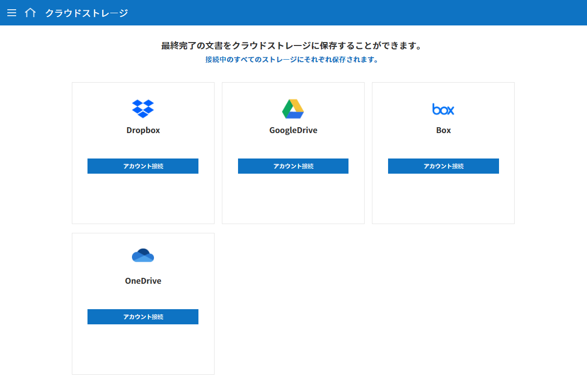
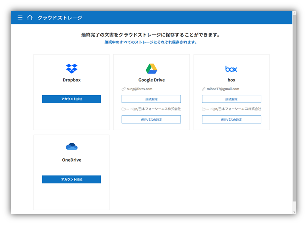
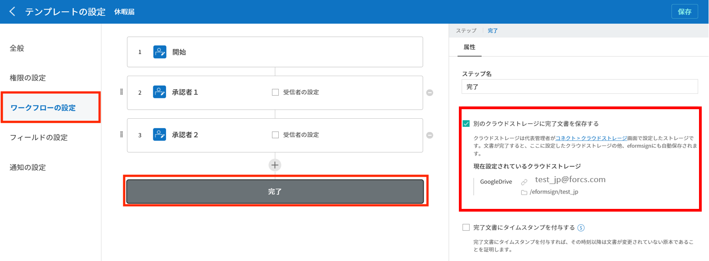
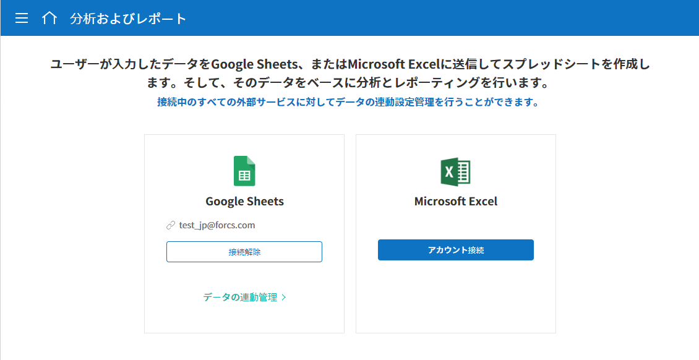
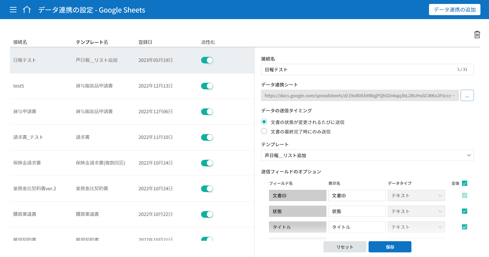
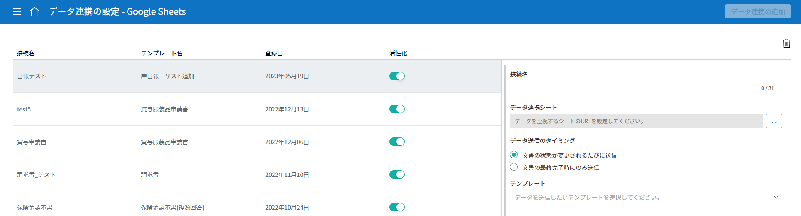
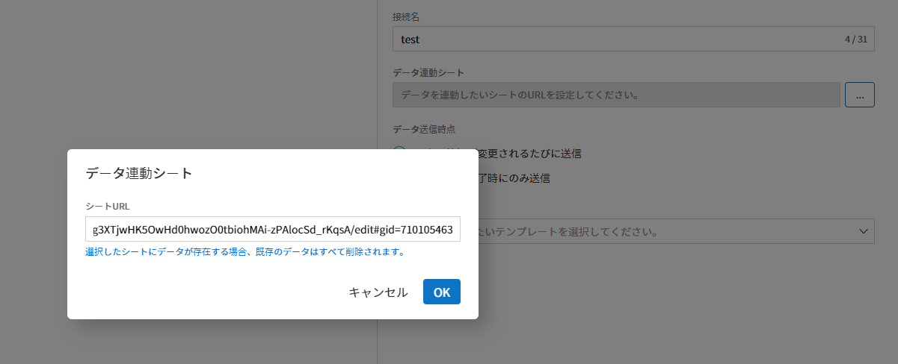
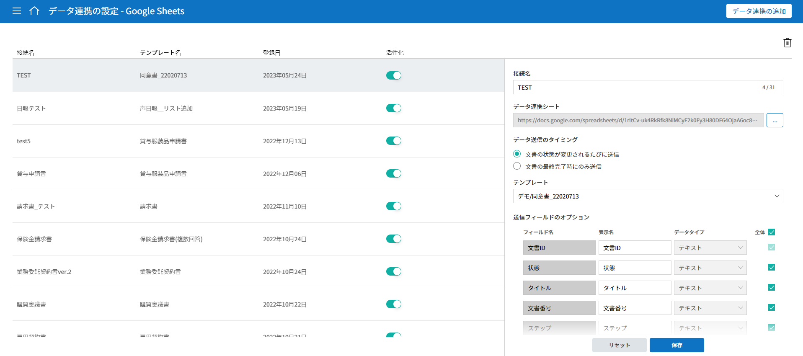
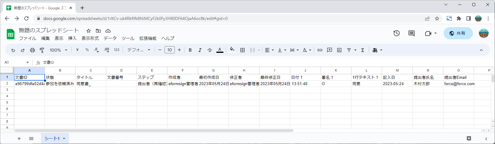
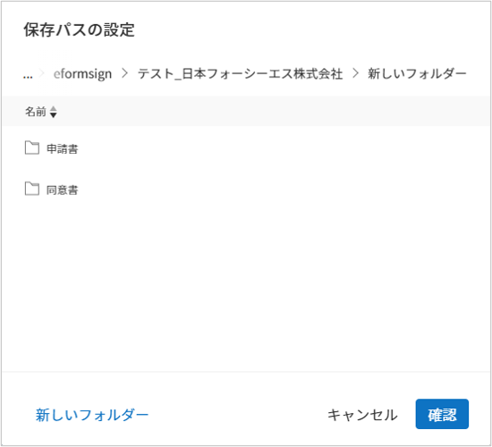

=======================
外部サービスとの連携
=======================

----------------------------------
クラウドストレージとの連携方法
----------------------------------

eformsignで作成した文書の完了後に、外部クラウドストレージサービスに自動的に保存されるよう設定することができます。

.. note::

   **Dropbox、Google Drive、OneDrive、box**\ との連携に対応しています。外部クラウドストレージとの連携は **代表管理者**\ のみ設定することができます。

1. メニューから **コネクト > クラウドストレージ**\ に移動します。

2. 完了文書を保存するクラウドストレージを選択後、 **アカウント接続** ボタンをクリックしてログインします。

3. ログインすると、 **接続解除**\ と **保存パスの設定** ボタンが表示されます。必要に応じて **保存パスの設定** ボタンをクリックして、保存パスを設定します。

.. note::

   保存パスの設定ポップアップは、次のように表示されます。

   デフォルトのパスには、eformsignのサブフォルダーとして会社名が入ります。 **新しいフォルダー** ボタンをクリックすることで新しいフォルダーを作成し、保存パスを変更することもできます。

   |image1|

4. **テンプレート管理** メニューに移動します。

5. クラウドストレージに保存したい文書のテンプレートをクリックし、**テンプレートの設定** 画面に移動します。

6. **ワークフローの設定** メニューに移動します。

7. **完了** ステップの属性タブで **別のクラウドストレージに完了文書を保存する** にチェックを入れます。 **クラウドストレージ** メニューで設定したクラウドストレージが連携されていることを確認します。連携したテンプレートで文書を作成すると、文書の完了後に連携した外部ストレージサービスに、完了文書が自動的に保存されます。

---------------------
分析およびレポート
---------------------

文書に入力したデータを、GoogleスプレッドシートもしくはOffice 365のエクセル文書に自動的に保存するよう設定できます。この機能を使うことで、新しい文書が追加される度にCSVファイルをダウンロードする手間を省くことができます。

.. note::

   **分析およびレポート**\ は **代表管理者**\ のみ設定することができます。

.. figure:: resources/analytic_1.png
   :alt: 分析およびレポートの画面
   :width: 750px

1. メニューの **コネクト > 分析およびレポート**\ に移動します。

2. Googleスプレッドシート、Office 365から連携するサービスを選択し、 **アカウント接続** ボタンをクリックしてログインします。

3. **データ連携の設定** ボタンをクリックします。

4. 画面中央または右上にある **データ連携の追加** ボタンをクリックします。

5. 接続名、データ連携シート、データの送信タイミング、テンプレートを設定し **保存** ボタンをクリックします。

.. figure:: resources/analytic_6.png
   :alt: データ連携の設定画面
   :width: 750px

.. note::

      データ連携シートとは、Googleシートでいう、シートのURLにあたります。

6. **データ連携の設定** 画面に、データが連携されたシートが表示されます。

7. 連携したシートに移動すると、データをインポートするカラム（フィールド）が表示されていることが確認できます。今後作成される文書において、文書にデータが入力される度に自動的にデータがアップデートされます。

