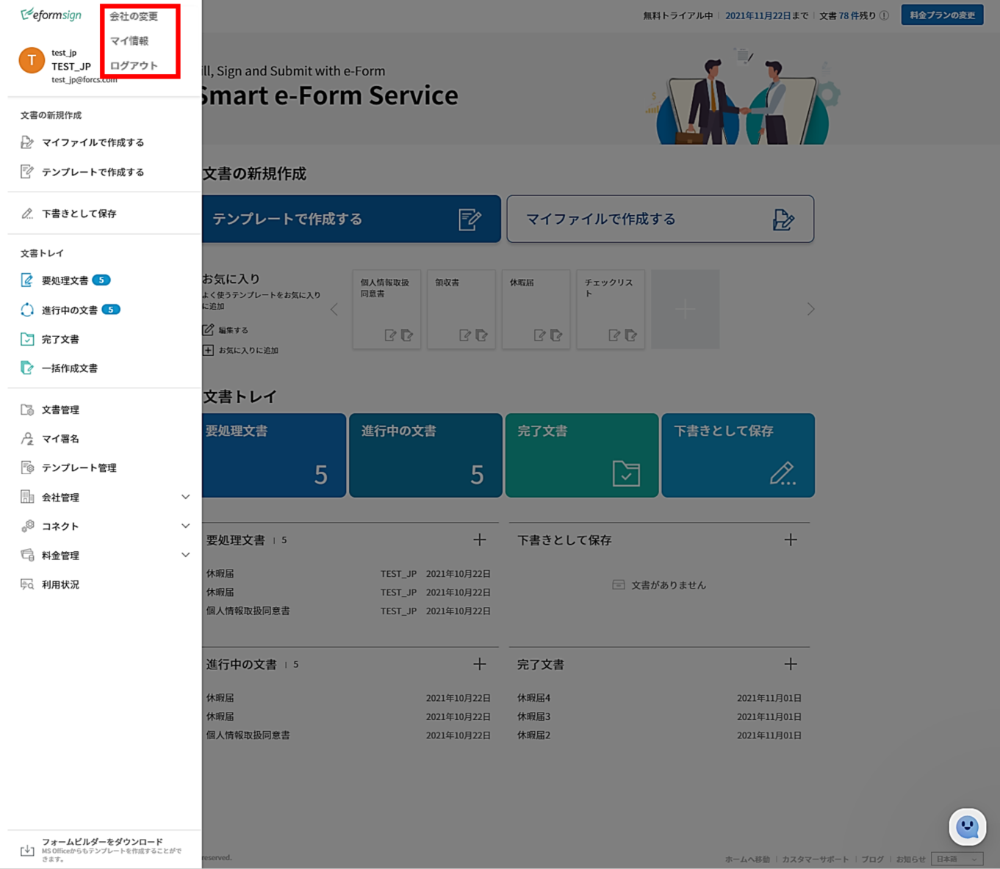
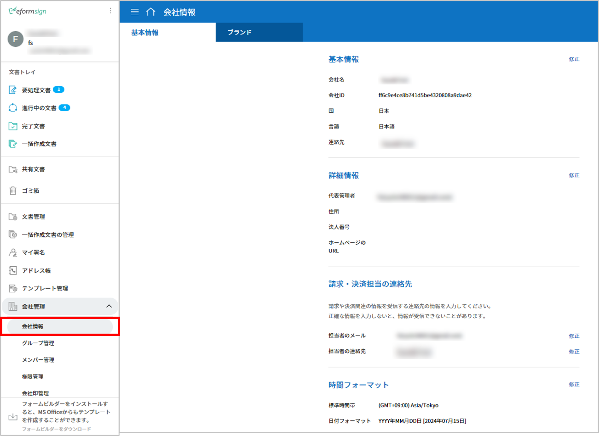
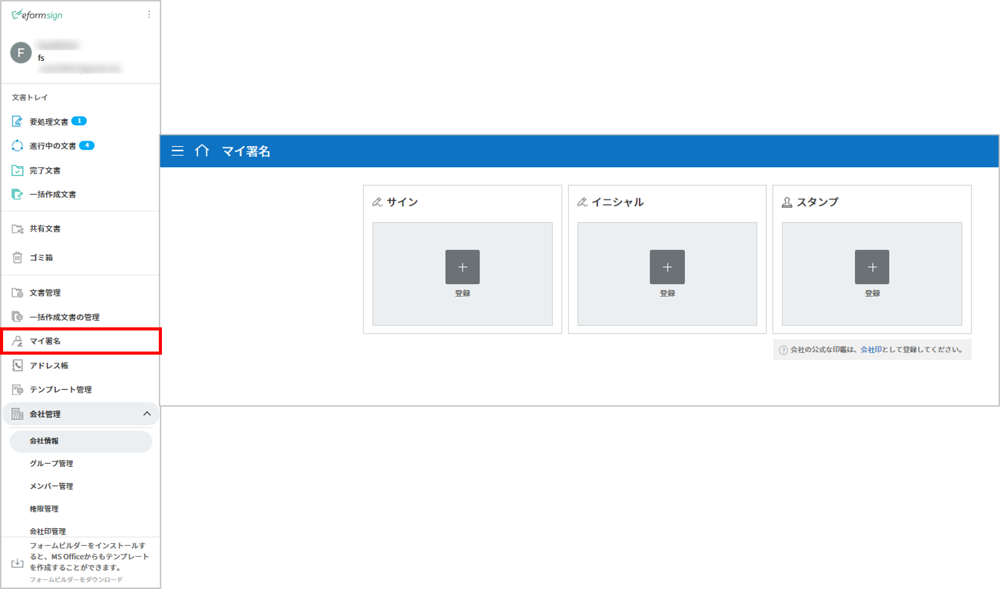

============
基本情報
============

------------
ダッシュボード
------------

メニューの構成
~~~~~~~~~~~~~

eformsignにログインした後、ダッシュボード画面の左上のメニュー (|image1|) をクリックすると、次のようなサイドバーメニューが表示されます。

.. note::

メニューは、ユーザーの権限によって内容が異なります。代表管理者には全てのメニューが表示され、全ての権限を持ちます。

.. figure:: resources/dashboard_menu_expand.png
   :alt: eformsignのメニューの構成
   :width: 700px

各メニューは次の通りです。

-  **文書の新規作成：** 
   PCに保存されている文書ファイルまたはeformsignにアップロードされている作成可能なテンプレートを選択し、文書を作成します。

   -  **マイファイルで作成する：**　PCに保存されている文書ファイルをeformsignにアップロードした後、入力コンポーネントを設定することで文書を作成します。

   -  **テンプレートで作成する：**　文書の作成ができるテンプレートのリストが表示され、そこからテンプレートを選択して文書を作成します。

-  **下書きとして保存：** **マイファイルで作成する** で下書き保存した文書のリストを確認することができます。

-  **文書トレイ：** 文書のステータスごとのリストが表示されます。

   -  **要処理文書：** 本人が作成もしくは検討しなければならない文書（他のメンバーより作成・署名依頼をされた文書）、またはメンバーではない受信者に送信した文書の中でまだ検討されていない文書のリストを確認することができます。

   -  **進行中の文書：** 本人が作成もしくは検討した文書の中でまだ完了されていない文書のリストを確認することができます。

   -  **完了文書：** 本人が作成もしくは検討した文書の中で完了された全ての文書のリストを確認することができます。

   -  **一括作成文書：** 本人が一括作成して送信した文書のステータスを確認することができます。

-  **文書管理：** このメニューには、文書の管理権限がある場合にのみアクセスできます。文書の管理権限を持っているテンプレートで作成された文書を確認することができます。ただし、代表管理者の場合は全ての文書を確認及び管理することができます。

-  **マイ署名：** 自分の署名を登録することで、文書の作成時に使用することができます。

-  **テンプレート管理：** このメニューには、テンプレート管理の権限がある場合にのみアクセスできます。テンプレートのリストを確認し、テンプレートの作成や設定ができます。

-  **会社管理：** このメニューには、会社の代表管理者と会社管理の権限を与えられたメンバーのみアクセスできます。会社情報の確認・変更ができます。

   -  **会社情報：** 会社情報を確認・修正し、ダッシュボードやメールなどに適用されるブランドのロゴ、シンボルを設定することができます。

   -  **グループ管理：** メンバーのグループを作成し、グループ情報を修正することができます。

   -  **メンバー管理：** メンバーを招待し、メンバー情報を修正することができます。

   -  **会社印管理：** 会社印を登録し、それぞれの印鑑の使用権限の設定、印鑑使用履歴を確認することができます。

   -  **署名の設定：** 手書きキーボードの中から署名する方法を設定することができます。

   -  **通知テンプレート管理：** eformsignから送信されるメール及びSMSの通知テンプレートのリストを確認・修正することができます。

   -  **カスタムフィールド管理：** 会社、グループ、メンバーに関する情報を追加・変更することができます。

-  **コネクト：** このメニューには、代表管理者のみアクセスできます。外部のサービスと連携して使用する機能を確認することができます。

   -  **クラウドストレージ：** Dropbox、Googleドライブ、Box、OneDriveのアカウントと連携して、完了文書が自動保存されるように設定することができます。

   -  **分析およびレポート：** 文書に入力されたデータがGoogleスプレッドシートとOffice365 Excelに自動保存されるように設定することができます。

   -  **API / Webhook:** eformsignのAPIを使用する際に必要なAPI及びWebhookキーを管理することができます。

-  **料金管理：** 料金プランや決済履歴の確認、料金プランや決済方法を変更することができます。

   -  **料金プランの変更**\ ：使用中の料金プランを変更することができます。

   -  **リアルタイム料金**\ ：現在までの利用履歴や料金をリアルタイムで確認することができます。

   -  **決済手段の設定**\ ：決済時に使用するクレジットカード情報を登録することができます。

-  **利用状況：** 週間、月間、年間の利用状況が表示されます。

-  **eformsignフォームビルダーのダウンロード：** MS Officeで電子書式 (テンプレート) を作成するためのフォームビルダーをダウンロードします。

ダッシュボード画面の構成
~~~~~~~~~~~~~~~~~~~~~~~~~~~~

eformsignにログインすると、アクセス権限に関係なく、同じダッシュボード画面が表示されます。処理が必要な文書や進行中の文書などをリスト表示しており、**文書の新規作成**、**文書トレイ** などのメインメニューへショートカットすることが可能です

.. figure:: resources/dashboard_main.png
   :alt: ダッシュボード画面
   :width: 700px

**① テンプレートで作成する**
   保存されたテンプレートを使用して、文書の新規作成ができる **テンプレートで作成する** 画面に移動します。

**② マイファイルで作成する**
   PCに保存されているファイルをそのままアップロードして文書の新規作成ができる\ **マイファイルで作成する** 画面に移動します。

**③ お気に入り**
   本人がお気に入りに追加したテンプレートが表示されます。該当テンプレートをクリックすると、テンプレートを使用して文書の作成ができる画面に移動します。テンプレートをお気に入りに追加するためには、追加アイコン (|image2|) をクリックして新規登録します。お気に入りに登録されたテンプレートを削除するためには、編集アイコン (|image3|) をクリックします。

   .. tip::

      **頻繁に使うテンプレートをお気に入りに追加する方法！**

      よく使うテンプレートをお気に入りとして追加して文書を作成できます。テンプレートの **お気に入り**\ への追加は、ダッシュボードで行うことができます。

      1. ダッシュボードでお気に入り追加アイコン( |image4|) をクリックします。

      2. お気に入りに追加されていないテンプレートのリストがポップアップで表示されます。

      3. お気に入りに追加したいテンプレートのチェックボックスをクリックします。

         |image5|

      4. **選択**\ をクリックするとお気に入りに追加されます。

**④ 要処理文書**
   本人が処理する必要のある文書の件数が表示されます。クリックすると **要処理文書**\ に移動します。

**⑤ 進行中の文書**
   現在進行中の文書の件数が表示され、クリックすると、進行中の文書のリストが確認できる **進行中の文書**\ に移動します。

**⑥ 完了文書**
   クリックすると、 **完了文書**\ に移動します。

**⑦下書きとして保存**
   **マイファイルで作成する**\ メニューから **文書作成をスタート** をクリックする前に下書き保存した文書の件数が表示され、クリックすると、 **下書きとして保存**\ に移動します。

**⑧ 要処理文書**
   本人が処理する必要のある文書の件数と、最新文書リストが3件分表示されます。リスト内の文書名をクリックすると、その文書に移動します。

**⑨下書きとして保存**
   下書きとして保存に保存された文書の件数と、最新文書リストが3件分表示されます。リスト内の文書名をクリックすると、その文書に移動します。

**⑩ 進行中の文書**
   現在進行中の文書の件数と、最新文書リストが3件分表示されます。リスト内の文書名をクリックすると、その文書接移動します。

**⑪ 完了文書**
   最新の完了文書リストが3件分表示されます。リスト内の文書名をクリックすると、その文書に移動します。

基本情報の確認及び変更
-----------------------

eformsignに会員登録する際入力した個人情報及び登録した会社の情報は、サイドバーメニューの右上のアイコン(|image6|) をクリックすることで確認できます。

.. figure:: resources/menu-personalinfo.png
   :alt: マイ情報を含むメニューアイコン
   :width: 700px

サイドバーのメニュー右上のアイコン (|image7|) をクリックすると、サブメニューが次のように表示されます。

-  **会社の変更：** 本人が所属している会社が複数登録されている場合、会社の変更をクリックすることで会社の一覧が表示されます。変更する会社をクリックすることで所属会社を変更できます。

-  **マイ情報：** eformsignに会員登録した際に入力した個人情報の確認・修正、所属会社の情報を確認できます。

-  **ログアウト：** eformsignからログアウトします。

マイ情報
~~~~~~~~~~~~

**マイ情報 > 個人情報**

.. figure:: resources/myinfor-personalinfo-main.png
   :alt: マイ情報 > 個人情報画面
   :width: 730px

**個人情報**
   会員登録をした際入力した名前、メールまたはID、パスワード、連絡先の詳細を確認及び修正することができます。

**SNSアカウントで接続**
   GoogleやFacebookのアカウントを使用して接続、アカウントの追加、接続解除ができます。

**お知らせ**
   マーケティング情報の受信に対する同意の可否を確認、及び受信の同意、同意の解除ができます。

**eformsignを脱退する**
   eformsignから会員脱退をしたい場合は、画面の下部の **eformsignを脱退する**\ をクリックすることで脱退できます。

**マイ情報 > 会社情報**

.. figure:: resources/myinfo-companyinfo.png
   :alt: マイ情報 > 会社情報画面
   :width: 730px

**基本情報**
   本人が所属している会社の会社名、国、言語、連絡先などの基本情報を確認できます。

**詳細情報**
   本人が所属している会社の住所、登録事業所番号、ホームページのURL、代表管理者の名前、メールアドレスを確認することができます。

   .. note::

      マイ情報では、会社情報の確認のみ可能です。会社関連情報の修正は、**会社管理 > 会社情報** メニューから可能です。会社情報の修正は、**代表管理者**または**会社管理の権限**\を持っているメンバーのみ可能です。

**この会社を脱退する**
   所属している会社を脱退したい場合は、画面下部の **この会社を脱退する**\ をクリックします。 **この会社を脱退する**\ をクリックすると、所属している会社のリストが表示され、そのリストから脱退したい会社を選択して脱退を行うことができます。

   .. important::

      一般メンバーが所属会社を退社する場合、個人のアカウントは削除されないので、別の会社に所属したり、新しい会社を登録したりすることができます。

      代表管理者の場合は、脱退時に会社が削除されます。会社を削除せず会社を脱退したい場合は、代理管理者を別の人に委任した後、会社を脱退する必要があります。

      代表管理者の権限委任は **会社管理** **> 会社情報 > 基本情報**\ で行うことができます。

会社情報の修正及び追加
~~~~~~~~~~~~~~~~~~~~~~~~~~~~

**マイ情報** で確認可能な会社情報については、 **会社管理 > 会社情報** で修正できます。 

.. note::

   この作業は **代表管理者** または **会社管理の権限**\ が必要です。

**登録された会社の情報を修正する方法**

1. サイドバーのメニューで **会社管理 > 会社情報**\ に移動します。

   |image8|

2. **会社情報 > 基本情報** 画面上で修正したい情報の **修正**\ をクリックします。

3. 修正が完了したら、 **保存** ボタンをクリックします。

   |image9|

.. _brand:

ブランド
~~~~~~~~~~~~

会社のロゴやシンボルを登録して、eformsignのダッシュボードとサイドバーのメニューに表示できます。文書の検討を依頼する際に送信するメールのテンプレートにも表示できます。

.. note::

   **ロゴとシンボルの相違点**

   ロゴもシンボルも会社を代表するイメージです。ロゴは一般的にブランド名が書いてある横長の形であり、シンボルは画像のみ表示される正方形のイメージです。

   eformsignでは、ロゴには 512 x 128 の横長の画像を、シンボルには 120 x 120 の正方形の画像を使用することを推奨しております。

**会社のロゴを登録する方法**

.. figure:: resources/managecompany-brand.png
   :alt: 会社情報 > ブランドのロゴ、シンボルの登録
   :width: 750px

1. サイドバーのメニューで **会社管理 > 会社情報**\ に移動します。

2. **ブランド** タブをクリックします。

3. **ブランドイメージ > ロゴ** 領域の画像をクリックします。

4. 画像アップロードのポップアップが表示されたら、PCに保存されているロゴの画像ファイルを選択してアップロードします。

   -  画像サイズ：幅 512 px、縦 128 px を推奨

   -  ファイルサイズ：最大 300 KBまで

   -  ファイル形式：PNG、JPG、JPEG、GIF

   .. figure:: resources/managecompany-logo-upload.png
      :alt: 画像アップロードのポップアップ画面
      :width: 650px

5. 画面右上の保存ボタンをクリックします。

6. ダッシュボードで変更されたロゴを確認します。

   .. figure:: resources/logo-change.png
      :alt: ロゴが変更されたダッシュボード
      :width: 750px

.. _permissions:

-------------
権限の区分
-------------

eformsignはメンバーに権限を付与することができ、6段階の権限ごとに管理ができます。各ユーザーの権限は、次のように区分できます。

-  **代表管理者**

   会社の代表者として、eformsignの全ての機能を制御する権限を持ちます。

-  **会社管理**

   **会社管理** メニューにアクセスできます。会社情報、メンバー、グループなどを管理ができ、 **メンバーの招待** 及び **文書の移管** ができます。

-  **テンプレート管理**

   **テンプレート管理** メニューにアクセスできます。フォームビルダーを使用して、フォームファイルを作成したり、Webフォームデザイナーでファイルをアップロードして新しいテンプレートを登録したりすることができます。また、テンプレートを修正、配布及び削除ができます。

-  **テンプレート別権限**\

   テンプレートごとにメンバーまたはグループに対し、次のような権限を付与できます。

   -  **テンプレートの使用権限**\

   テンプレートを使用して文書を作成できる権限です。権限を持っているメンバーの **テンプレートで文書を作成する** 画面にそのテンプレートが表示され、文書を作成できます。

   - **テンプレートの修正権限**

   テンプレートを修正できる権限です。

   - **文書の管理権限** 

   **文書管理** メニューにアクセスし、テンプレート別に作成された文書の閲覧、ダウンロードができます。

代表管理者
~~~~~~~~~~~~~~

会員登録時に会社を新規登録したユーザーが代表管理者となります。eformsignの使用に関する全ての権限を持つ最上位レベルの管理者です。

代表管理者は、

-  全てのメニューにアクセスできます。

-  テンプレートの作成、変更、削除、管理ができます。

-  全ての文書を作成、表示、管理ができます。

-  代表管理者の変更が必要な場合は、他のメンバーに権限を委任ができます。

代表管理者が脱退した場合、会社は削除されます。会社を削除せずに脱退するには、他のメンバーに代表管理者の権限を委任してから脱退する必要があります。

**代表管理者の権限を委任する方法**

.. note::

   この作業には **代表管理者** の権限が必要です。

1. サイドバーのメニューで **会社管理 > 会社情報**\ に移動します。

2. **詳細情報**\ の **修正** ボタンをクリックすると、 **代表管理者** の右側に **権限委任** のリンクが表示されます。**権限委任** のリンクをクリックします。

   .. figure:: resources/Admin-auth-change_1.png
      :alt: 代表管理者の権限委任の位置
      :width: 700px

3. **権限委任** のポップアップウィンドウで、権限を委任したいメンバーを検索及び選択します。

   .. figure:: resources/Admin-auth-change-popup_1.png
      :alt: 権限委任のポップアップ画面
      :width: 500px

4. 代表管理者アカウントのパスワードを入力します。

5. **保存** ボタンをクリックして、変更内容を保存します。

会社の管理権限
~~~~~~~~~~~~~~~~~~

会社管理者は **会社管理** メニューへのアクセスできる権限を持ち、会社やメンバー・グループに関する情報を確認、修正、削除することができます。会社の管理権限は代表管理者がメンバーに付与することができます。

**会社管理の権限を付与する方法**

.. note::

   この作業には **代表管理者** の権限が必要です。

1. サイドバーのメニューで **会社管理 > メンバー管理**\ に移動します。

2. メンバーリストから**会社管理**権限を付与したいメンバーを選択します。

3. 右側の **メンバー情報** の詳細画面の下部にある **権限**\ で **会社管理**\ にチェックを入れます。

   .. figure:: resources/company-manage-auth.png
      :alt: 会社管理の権限の位置
      :width: 700px

4. **保存** ボタンをクリックします。

テンプレート管理の権限
~~~~~~~~~~~~~~~~~~~~~~~~~~

テンプレート管理者は **テンプレート管理** メニューへのアクセス権限を持ち、テンプレートの登録、修正、配布、削除ができます。

テンプレートを登録したテンプレート管理者が、登録したテンプレートの所有者になります。テンプレート管理者が存在する場合、テンプレート所有者とテンプレート管理者は異なる場合があります。

テンプレート管理者がテンプレート所有者でない場合、テンプレート設定を表示して設定内容の確認、テンプレートの複製ができます。

**テンプレート管理の権限を付与する方法**

.. note::

   この作業には **代表管理者** または **テンプレート管理** の権限が必要です。

1. サイドバーのメニューから **会社管理 > メンバー管理**\ に移動します。

2. メンバーリストから、テンプレート管理の権限を付与するメンバーを選択します。

3. 右側の **メンバー情報** 詳細画面の下部の **権限**\ から **テンプレート管理**\ にチェックを入れます。

   .. figure:: resources/template-manage-auth.png
      :alt: テンプレート管理の権限の位置
      :width: 700px

4. **保存** ボタンをクリックします。

.. _permissionsfortemplate:

テンプレートごとの権限
~~~~~~~~~~~~~~~~~~~~~~~~~~~~~~~~~~~~~~~~~

文書の作成ができる *テンプレートの使用権限*\ 、テンプレートを修正できる **修正権限**\ 、テンプレートで作成された文書とその文書に入力されたデータを管理できる **文書の管理権限** を、テンプレートごとにメンバーに対して付与することができます。

- **テンプレートの使用権限**\ この権限が付与されたメンバーは **文書の新規作成** メニュー画面から、対象のテンプレートと使用して文書を作成できます。

- **テンプレートの修正権限**\ この権限が付与されたメンバーは **テンプレート管理**\ から対象のテンプレートを修正することができます。

- **文書の管理権限**\ この権限が付与されたメンバーは **文書管理** メニュー画面からテンプレートで作成した文書を表示、削除、ダウンロードすることができます。

**権限を付与する方法**

.. note::

   この作業には **代表管理者** または **テンプレート管理** の権限が必要です。

1. サイドバーのメニューから **テンプレート管理** に移動します。

2. **テンプレートの設定** ボタン ( |image10|) をクリックします。

   .. figure:: resources/template-manage-setting.png
      :alt: テンプレートの設定ボタンの位置
      :width: 700px

3. **権限の設定** タブを選択します。

   .. figure:: resources/document-creator-auth_1.png
      :alt: テンプレート設定 > 権限の設定タブの位置
      :width: 700px

4. それぞれの権限を付与するグループまたはメンバーを選択します。

5. **保存** ボタンをクリックします。

--------------------
メンバー及びグループの管理
--------------------

**会社管理** メニューでは、メンバーの招待/削除/修正、新しいグループの作成/追加/削除ができます。

.. figure:: resources/menu-group-member-manage.png
   :alt: 企業管理 > グループ/メンバー管理
   :width: 700px

メンバー管理
~~~~~~~~~~~~~~~~

**メンバー管理** メニューでは、メンバーを会社に招待したり、招待したメンバーを管理することができます。

.. figure:: resources/manage-member.png
   :alt: 会社管理 > メニュー管理
   :width: 700px

**① 活性メンバー**
   招待を承諾して活性化しているメンバーのリストと情報を確認することができます。

**② 非活性メンバー**
   非活性メンバーのリストと情報を確認することができます。

**③ 招待メンバー**
   招待したメンバーのリストと情報を確認することができます。

**④ メンバーリスト**
   リスト内のメンバーをクリックすることで、右側の **メンバー情報** タブから情報を確認、修正、削除することができます。

**⑤ メンバー情報**
   メンバー情報の確認や、メンバー状態の変更、会社管理とテンプレート管理の権限の付与ができます。

**⑥ フィールド値の設定**
   そのメンバーに関連したフィールドの値を設定することができます。

**⑦ 文書の移管**
   メンバーがeformsignを使用しなくなった場合に、eformsignを使用しなくなったメンバーが処理または処理予定の文書を別のメンバーのアカウントに移管することができます。

**⑧ メンバーを一括招待**
   メンバー招待の際、複数のメンバーを一括招待できます。

**⑨ メンバー招待**
   メールまたはIDでメンバーを招待することができます。

**⑩ メンバーの削除**
   **ごみ箱** アイコンをクリックすると、メンバーリストの左側のチェックボックスが活性化します。削除したいメンバーを選択し、**削除** ボタンをクリックすると、メンバーが削除されます。

グループ管理
~~~~~~~~~~~~~~~~

グループ管理メニューでは、グループの作成、グループ情報の確認/変更/削除ができます。

.. figure:: resources/manage-group.png
   :alt: 企業管理 > グループ管理
   :width: 700px

**① グループ情報**
   グループリストから情報を確認したいグループをクリックし、右側にあるグループ情報タブからグループ名とグループの詳細内容を修正することができます。

**② メンバーリスト**
   グループに所属しているメンバーのリストが表示され、メンバーを追加または削除することができます。

**③ フィールド値の設定**
   グループに関するフィールド値を設定することができます。

**④ グループの追加**
   グループの追加をクリックすることで、**グループの追加** ポップアップウィンドウが表示されます。グループ名とグループの詳細を入力し、メンバーを検索して追加するとグループが追加されます。

**⑤ グループの削除**
   **ごみ箱** アイコンをクリックすると、グループリストの左側にあるチェックボックスが活性化します。削除したいグループを選択し、 **削除** ボタンをクリックするとグループが削除されます。

.. _mysignature:

----------------
マイ署名の管理
----------------

**マイ署名** メニューから **サイン、イニシャル、印鑑・スタンプ**\ を登録しておくと、文書を作成する際に登録されている署名を簡単に使うことができます。

.. _registersignature:

**サイン/イニシャルを登録する方法**
~~~~~~~~~~~~~~~~~~~~~~~~~~~~~~~~~~

.. note::

   作業は **PC、モバイル、アプリケーション** で行うことができます。

|image11|

1. サイドバーのメニューから **マイ署名** に移動します。

2. 登録ボタンをクリックします。

   .. figure:: resources/mysignature-register.png
      :alt: 署名の登録画面
      :width: 700px

   -  **手書き**\

      画面に署名を描画して入力します。

   -  **キーボード**\

      名前を入力して、フォントを選択します。

   -  **QRコード**\

      スマートフォンのカメラでQRコードを認識すると、署名パッド画面に移動します。署名パッドに直接署名を描画して入力します。

   -  **アプリプッシュ通知**\

      接続したいモバイルデバイスを選択した後、**送信** ボタンをクリックすると、そのデバイスの eformsign アプリで署名をすることができます。

3. **OK** ボタンをクリックして、署名を保存します。

4. **編集、削除** ボタンをクリックして、署名を編集または削除します。

.. tip::

   電子文書に添付される署名方式を設定することができます。

   **会社管理** > **署名の設定** から手書き、テキストの中から文書の署名欄に表示される署名方式を制限及び許可できます。

   .. figure:: resources/signature-method.png
      :alt: 署名方式の設定画面
      :width: 400px

.. _registerstamp:

**印鑑・スタンプを登録する方法**
~~~~~~~~~~~~~~~~~~~~~~~~~~~~~~

文書に直接署名するのではなく、印鑑やスタンプを使用する必要がある場合に使用します。印鑑やスタンプの画像を登録しておけば、文書の署名欄に登録した印鑑やスタンプを押印することができます。

**印鑑・スタンプの登録**
-----------------------------

.. note::

   印鑑・スタンプの画像イメージを事前に準備する必要があります。

   -  ファイル形式：PNG、JPG
   -  ファイルサイズ：最大 300 KBまで

1. サイドバーのメニューから **マイ署名**\ に移動します。

2. **スタンプ** タブの **登録** ボタンをクリックします。

   .. figure:: resources/signature-stamp-register.png
      :alt: 印鑑・スタンプの登録ボタン
      :width: 700px

3. **スタンプ** のイメージ領域をクリックすると、PCに保存されている画像をアップロードできるポップアップウィンドウが表示されます。登録したい印鑑・スタンプ画像を選択します。

   .. figure:: resources/signature-stamp-image-upload1.png
      :alt: マイ署名 > 印鑑・スタンプを登録
      :width: 400px

4. **OK** ボタンをクリックして、印鑑・スタンプを保存します。

5. **編集、削除**ボタンをクリックして、登録した印鑑・スタンプを編集または削除します。

.. _scanstamp:

**スタンプのスキャン**
~~~~~~~~~~~~~~~~~~~~~~~~~~~

.. note::

   登録したい印鑑とeformsignから提供される**スタンプスキャン用紙**\ をダウンロード後、印刷して使用します。スキャン用紙は必ずスキャン領域がキレイに映るようにしてください。 

- **PCでのスタンプスキャン**

+++++++++++++++++++++++++++++++

1. **マイ署名**\ のメニューから**印鑑登録**\ ボタンをクリックし、**スタンプのスキャン**\ というタブをクリックします。

   .. figure:: resources/signature-stamp-scan-popup.png
      :alt: スタンプ登録のボタン
      :width: 300px

2. **スキャン用紙**\ をダウンロードして印刷します。

   .. figure:: resources/signature-stamp-scan-paper.png
      :alt: スタンプスキャン用紙
      :width: 400px

3. **スキャン用紙**\ のスキャン領域の中央に押印します。

4. モバイルデバイスのカメラを起動し、QRコードを読み取るとスタンプスキャン画面に遷移します。

5. スタンプスキャン画面で押印したスキャン用紙のスキャン領域を認識します。 

6. 出力された印鑑イメージを確認して保存すると印鑑が登録されます。

- **モバイルデバイスでのスタンプスキャン**

+++++++++++++++++++++++++++++++++++++++++

1. **マイ署名**\ のメニューより**印鑑登録**\ ボタンをクリックし、**スタンプのスキャン** タブをクリックします。 

   .. figure:: resources/signature-stamp-scan-popup-mobile.png
      :alt: スタンプスキャンのポップアップ
      :width: 300px

2. **スキャン用紙**\ をダウンロードして印刷します。

3. **スキャン用紙**\ のスキャン領域の中央に押印します。

4. スタンプのスキャンタブをクリックし、**開始**\ ボタンをクリックします。

5. 起動したカメラ画面でカメラの使用を許可します。

   .. figure:: resources/stamp-scan-mobile-camera.png
      :alt: カメラ使用の許可
      :width: 300px

6. カメラ画面にスキャン領域を写すと印鑑が自動的に認識されます。

7. 出力された印鑑イメージを確認して保存すると印鑑が登録されます。

.. _caution_scanstamp:

**スタンプのスキャン時の注意事項**
^^^^^^^^^^^^^^^^^^^^^^^^^^^^^^^^^^^^^^^

.. tip::

   **Tip 1. スキャンの画面に移動しない場合**
   
   デバイスのモデル及び環境によってスタンプスキャンの画面に移動されない場合があります。この場合、以下の方法でスタンプスキャンを行うことができます。

   1. メインブラウザではない他のアプリを使用している場合

      モバイルデバイスのメインブラウザで文書を開いたかご確認ください。他のアプリを利用してスキャンを行う場合、印鑑が認識されない場合があります。この場合、モバイルデバイスのメインブラウザに変更し、スタンプスキャンを再実行してください。

   2. スキャンの画面が表示されず作業選択の画面が表示される場合

      一部のAndroidデバイスではスキャンの画面に移動せずカメラやアルバムなどの選択画面が表示される場合があります。その場合、以下の手順を行います。

      ① 選択画面で**カメラ**\ を選択します。

      ② カメラ画面でスタンプスキャン領域がキレイに映るように撮影します。

      ③ 撮影した写真から印鑑が自動的に認識されます。

   **Tip 2. 印鑑が認識できない場合**

   一部モバイルのブラウザのカメラの画面では解像度が低いために、印鑑が認識されない場合があります。その場合、以下の手順を行います。

   1. 携帯電話のカメラを起動します。
   2. スキャン領域がキレイに映るように撮影します。
   3. 印鑑の画面に戻ります。
   4. **画像のアップロード** ボタンをクリックします。
   5. (必要時)写真のアルバムにアクセスします
   6. スキャン領域を撮影した画像を選択します。
   7. 画像をアップロードすると印鑑が自動的に認識されます。
 

.. _company_stamp:

----------------
会社印管理
----------------

**会社印管理** メニューでは、社内で使われる法人印、社用印などの会社印を複数登録して管理することができます。
印鑑ごとにメンバーまたはグループに印鑑の使用権限を付与し、印鑑使用の履歴を確認することができます。

.. note::

   会社印の管理は代表管理者または会社管理の権限が必要です。 

**会社印**
~~~~~~~~~~~~~~~~~~~~~~

会社で使われる印鑑を複数登録して管理することができます。印鑑ごとに使用権限を付与することができ、印鑑に対する全ての変更履歴を確認することができます。

.. figure:: resources/menu-company-stamp.png
   :alt: 会社印管理の画面
   :width: 700px

会社印の登録は、 **会社印の登録** ボタンをクリックすることで行なえます。印影名、説明、画像のアップロードまたはスタンプのスキャン、印影の使用権限を設定できます。

.. figure:: resources/company-stamp-register.png
   :alt: 会社印登録のポップアップ
   :width: 400px

- **印影名**: 印影名を入力します。

- **説明**: 会社印を使用する際、参考となる説明文を入力します。

- **印影画像**\: 印影画像は **画像のファイルをアップロード** 、 **スタンプのスキャン**\ から登録できます。

- **印影の使用権限**: 印影の使用権限をメンバー全体または特定のグループ、特定のメンバーに付与することができます。 

登録された印影に対しては編集、削除、変更履歴の確認が可能です。印影に対する変更履歴は次のように表示されます。

.. figure:: resources/company-stamp-register-history.png
   :alt: 会社印変更履歴の画面
   :width: 700px

**社印使用履歴**
~~~~~~~~~~~~~~~~~~~~~~

使用された全ての会社印の履歴を確認することができます。それぞれの会社印を使用したメンバーと日付、文書などの情報が表示され、CSVファイルでのダウンロードが可能です。

.. figure:: resources/company-stamp-history.png
   :alt: 社印使用履歴の画面
   :width: 700px

.. |image1| image:: resources/menu_icon.png
.. |image2| image:: resources/favorites-add.PNG
.. |image3| image:: resources/favorites-edit.PNG
.. |image4| image:: resources/favorites-add.PNG
.. |image5| image:: resources/favorites-add-popup2.PNG
   :width: 400px
.. |image6| image:: resources/menu-hamberger-icon.png
.. |image7| image:: resources/menu-hamberger-icon.png
.. |image8| image:: resources/managecompany-companyinfo.png
   :width: 700px

.. |image10| image:: resources/config-icon.PNG
.. |image11| image:: resources/mysignature.PNG
   :width: 700px
