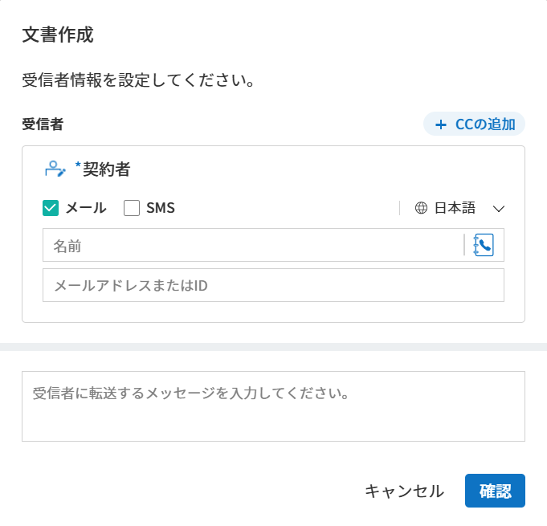
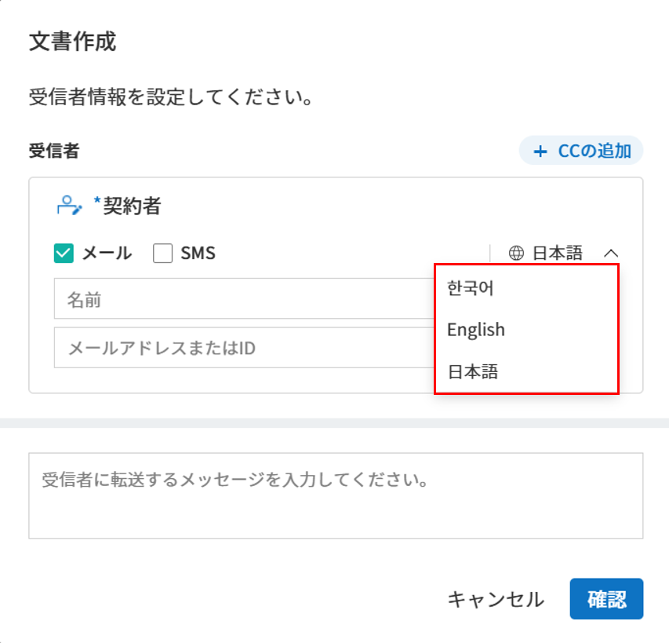
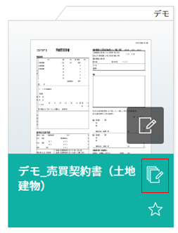
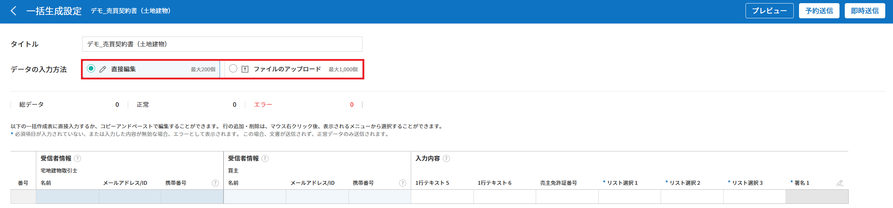

.. _createnew:

==================
文書の新規作成
==================

eformsignによる電子文書の作成と送信の方法は2つあります。PCに保存されているファイルをそのままアップロードして電子文書を作成する方法と、eformsignに保存されているテンプレートを使用する方法です。

-  **マイファイルで作成する**\ ：PC内の既存の文書ファイルを使用して文書を作成し、受信者に送信することができます。1回のみ使用する文書はこちらから作成します。

-  **テンプレートで作成する**\ ：予め作成したテンプレートを使用して文書を作成します。このメニューをクリックすると、代表管理者/テンプレートの管理権限を持つメンバーが作成したテンプレートが表示されます。

.. note::

   テンプレートはテンプレート管理またはOffice製品から作成することができます。
   詳しくは `ウェブフォームデザイナーでテンプレート作成 <chapter5.html#template_wd>`__\ と `Office製品からeformsignのテンプレートを作成 <chapter7.html#template_fb>`__\ をご参照ください。

.. Tip::

   💡よく使用する文書は、 **テンプレート** としてアップロードしておくと便利です。

.. _createnewfrommyfile:

--------------------------
マイファイルで作成する
--------------------------

使用したい文書ファイルをアップロードし、文書上の任意の位置に入力項目を配置することができます。
また、各入力項目に参加者/検討者を割り当てることで、参加者/検討者の情報を入力してから送信できます。

1. ダッシュボードにファイルをドラッグ＆ドロップするか、サイドバーをクリックして **マイファイルで作成する** メニューに移動します。

   .. figure:: resources/newfrommyfile-menu1.png
      :alt: ファイル追加
      :width: 700px

2. 文書ファイルをアップロードするか、マイファイルトレイに保存されたファイルを選択します。

   .. figure:: resources/newfrommyfile-uploadfile1.png
      :alt: ファイル追加
      :width: 700px

   .. note::

      - アップロード可能なファイル形式はpdf、doc、docx、xls、xlsx、ppt、pptx、odt、jpg、png、gif、tiffです。

      - アップロード可能なファイルの容量は最大 **9MB** までです。

3. **AIアシスタント** 機能を使用する場合、分析タイプを選択を選択した後、 **AI分析**\ をクリックします。

.. figure:: resources/AI-assistant-popup_JP.png
   :alt: AI アシスタント ポップアップ
   :width: 400px

.. Tip::

   💡 **AIアシスタント**\ を使用すると, AIが文書を自動的に分析し、入力項目の位置や種類を自動で設定・配置します。 

      - **基本分析:** 文書内の入力項目の位置や種類を分析し、自動で配置します。
      - **高度な分析:** 基本分析に加え、参加者や入力権限などの入力項目の属性やワークフローまで自動で設定します。

      AIアシスタントはいつでも左上のアイコンをクリックしてご利用いただけます。 

   .. figure:: resources/AI-assistant-icon_jp.png
      :alt: AI アシスタント アイコン
      :width: 500px
      
   **※ 注意事項**

      - 文書の構成やサイズによって分析にかかる時間は異なり、高度な分析の場合は多少お時間がかかることがあります。 
      - 高度な分析を選択しても、ファイルが20ページ以上の場合は基本分析が実行されます。 
      - AI分析の結果は必ずしも完全ではないため、追加された入力項目は必ずご確認ください。

4. 文書の作成に参加する **参加者**\ を追加し、役割を設定します。

   .. figure:: resources/newfrommyfile-participants-popup_jp.png
      :alt: ファイルの追加
      :width: 400px

   .. note::

      参加者は最大30人まで追加することができ、ポップアップ画面下側の **参加者を追加**\ をクリックして追加することもできます。

      フォームのデザイン後に **受信先を指定する** から、追加した参加者の情報の変更、追加、削除ができます。

5. 各参加者が入力する入力項目を追加し、各入力項目の詳細設定を右側の画面で設定します。

   .. figure:: resources/newfrommyfile-formdesign.png
      :alt: ファイル追加
      :width: 700px

   .. tip::

      **追加した入力項目のタイプを変更する方法**

      1. 当該入力項目を右クリックします。 
      2. **入力項目変更**\ をクリックします。
      3. 変更する項目タイプを選択します。 

      .. figure:: resources/change-field-type.png
         :alt: 入力項目タイプ変更
         :width: 300px

   .. tip::

      **原本ファイルの追加や修正はできますか？** 

      **ファイルの追加**

      複数のファイルを1つの文書にまとめて送信したい場合、ファイルを追加して1つの文書にまとめることができます。
      また、入力項目を維持したまま原本ファイルの変更、追加したファイルの順序変更・削除をすることもできます。

      .. figure:: resources/add-file1.png
         :alt: ファイルの追加
         :width: 700px

      **ファイルの変更、削除、移動**

      アップロードしたファイルを修正するには、ファイルを修正後、下段の「もっと見る」アイコンをクリックし、「ファイル変更」を選択して修正したファイルをアップロードします。既に追加されている入力項目は全て維持されたまま原本ファイルだけが変更されます。各ファイルに詳しく見るメニュー(⋮)からファイル名の変更、ファイルの変更、ファイルの削除、前後に移動ができます。

      .. figure:: resources/add-file-menu.png
         :alt: ファイル追加：詳しく見るメニュー
         :width: 400px

6. 入力項目を追加後、**受信先を指定する** ス添付で文書を送信する受信者をステップごとに設定し、 **受信先のオプション**\ を設定します。

   .. figure:: resources/newfrommyfile-recipients.png
      :width: 700px

7. **オプション**\ をクリックして文書の受信者の設定と、完了文書に対するタイムスタンプの付与などを設定します。

.. figure:: resources/newfrommyfile-option.png
   :alt: オプション設定
   :width: 700px

.. note::

   💡 **タイムスタンプとは？**

   タイムスタンプとは、電子文書の生成タイミングの確認（存在証明）及び真正性の確認（内容証明）のための公開鍵基盤（PKI）の国際標準技術であり、電子文書がある特定の時刻に存在していたことを証明するとともに、その時刻以降にデータが変更されていないことを証明する電磁的技術です。

   文書にタイムスタンプを適用すると、特定の時点で当該文書が存在し、それ以降変更されていない原本であることが認証機関によって客観的に証明されます。

   ❗タイムスタンプの適用時、追加料金が発生します。

.. tip::

   ここまでが文書フォームの設定ステップです。 **文書作成をスタート**\ のクリック前に **保存** をクリックすると、設定した内容をそのまま `マイファイルトレイ <chapter8.html#myfiles>`__ または**テンプレートとして保存**\ することができます。

   .. figure:: resources/newfrommyfile-save-option.png
      :alt: 保存オプション
      :width: 600px

   - **マイファイルトレイに保存:** 設定した内容がそのままマイファイルトレイに保存され、保存したファイルを再度開いて文書を編集した後に送信することができます。  

   - **テンプレートとして保存:** テンプレートの作成画面に移動し、追加した入力項目と設定値そのままテンプレートの作成を継続して行うことができます。テンプレートとして保存する際、以下の項目はマイファイルで文書を作成する時に設定した値のまま読み込まれます。

      - フォームのデザイン設定および入力項目の属性値
      - テンプレート名および略称
      - 署名の参加者数およびステップ名
      - ワークフローのステップおよび各ステップの属性設定値
      - フィールド設定及び通知設定値

   ❗テンプレートとして保存をクリックして、「テンプレートの作成」画面に移動すると、以前の画面（マイファイルで文書を作成する）に戻ることはできません。

8. 全ての設定完了後、 **文書作成をスタート**\ をクリックします。

.. figure:: resources/newfrommyfile-option.png
   :alt: オプション設定
   :width: 700px

.. note::

   - アップロードしたファイル名が自動的に文書のタイトルに設定され、画面左上から修正することができます。

      .. figure:: resources/newfrommyfile-edit-title.png
         :alt: CC追加
         :width: 500px

   - **下書きとして保存** をクリックすると下書きとして保存され、要処理文書トレイで確認することができます。
        
   - **文書作成をスタート**\ をクリックした時点で課金対象の文書数にカウントされます。

9. 文書を確認し、 **送信** をクリックすると、受信先に文書が送信されます。

.. _recipient_settings:

受信先を指定する
---------------------

**デザインする**\  ステップで文書作成に参加する参加者(文書の受信者)を追加して各受信者の入力項目を設定します。

**受信先を指定する** ステップでは **デザインする** ステップで追加した文書参加者の連絡先を含む詳細設定を行います。参加者の順番変更・削除、文書を検討する **検討者** 、 **閲覧者**\  を追加することができます。

送信するには、各受信者の名前と送信先のメールアドレス/IDを入力する必要があります。参加者がメンバーである場合、リストから選択することで登録されている情報を呼び出すことができます。

   |image12|

**受信先の指定設定**
~~~~~~~~~~~~~~~~~~~~~~~~~~~~~~~~~~~~~~~~~~

文書の受信者は、 **参加者、検討者、閲覧者**\ に分けられます。文書の作成時に追加された参加者が **受信先を指定する** ステップに表示され、文書の処理プロセスに応じて検討者と閲覧者を追加することができます。 **受信先の指定する**\ から参加者、検討者、閲覧者を削除/追加することができます。各受信者のメールアドレスなどの連絡先情報を入力して詳細な設定を行います。

   .. tip::

      **❗参加者、検討者、閲覧者の違い**

      - **参加者**\ は文書への署名、作成など、入力項目に **入力**\ することができます。 
      - **検討者**\ は文書に入力することはできず、文書の検討後 **承認の有無のみ決定**\ できます。 
      - **閲覧者**\ は文書の承認や作成することはできず、 **閲覧**\ のみできます。

         |image6|

-  **署名の進み方の選択:** 署名者と対面して、一つのデバイス(タブレットPCやスマホなど)で文書に署名を行うには、対面署名者に設定する受信者ステップで**対面署名**/ を選択します。当該ステップは **対面署名者**\ 、直前のステップは **立会人**\ になります。対面署名者は文書署名の前に本人確認を行うよう設定することもできます。

   - **立会人:** 対面署名を開始・完了することができ、参加者であれば署名も行うことができます。メンバーのみ設定することができ、閲覧者は立会人になることはできません。
   - **対面署名者：** 対面署名を行います。ワークフロー受信者タイプのうち、参加者のみが対面署名者に設定することができます。

   .. figure:: resources/inperson-signing-wf.png
      :alt: 対面署名設定
      :width: 700px

   ✅ 対面署名設定時の詳細な文書の作成方法は `こちら <https://www.eformsign.com/jp/blog/announcement-2022311/>`__\ をご参照ください。 

-  **文書送信手段の選択:** 電子メールとSMSの中から1つを選択または全て選択することができます。メンバーを選択すると、保存されているメールアドレスと携帯電話番号が自動入力されます。

   .. caution::

      SMSを選択した場合、文書はSMS経由で送信され、1通あたり追加料金が発生します。

-  **通知メッセージ言語選択:** 文書のリクエスト際に送信される通知メッセージの表示言語を **日本語/韓国語/英語** から選択します。

   .. figure:: resources/notification-lang.png
      :alt: 通知言語設定
      :width: 500px

   .. Tip::

      💡 **通知メッセージの編集方法**

      受信者に送信される通知メッセージを直接修正することができます。

      1. 受信者ステップで通知言語を選択します。
      2. 右上の **受信先のオプション > 通知** にて **内容編集** ボタンをクリックします。
      3. **依頼メッセージの編集** ポップアップでメールのタイトル、本文などをご希望の内容に修正します。
      4. **保存** ボタンをクリックします。 

      ✅ 選択した言語によって、 **依頼メッセージの編集** ポップアップ画面に当該言語でメッセージが表示されます。

- **受信者ステップの結合 - 同時送信ワークフロー**

受信者ステップを追加すると、通常は設定された手順に従って各ステップの受信者に文書が送信されます。
複数のステップのワークフローを結合した場合、結合されたワークフローのステップの受信者に文書を同時に送信することができます。

1. 結合する受信者ステップのうち、 **下側の受信者をクリック**\ すると左側に **送信順序を結合** アイコン(|image17|)が表示されます。
2. 当該アイコン(|image17|)をクリックすると、下側と上側のステップが結合されます。

   .. figure:: resources/merge_steps.png
      :alt: 受信先を指定する > 結合
      :width: 500px

   .. note::

      **結合されたワークフローの分割**

      結合されたワークフローをクリックすると、アイコンが表示されます。分割するワークフローのステップをクリック後、 **送信順序を分割** アイコン(|image18|)をクリックすると結合したワークフローが分割されます。

      .. figure:: resources/split_steps.png
         :alt: 受信先を指定する > 分割
         :width: 500px

   
   -  **CC(参照者)の追加**

   文書送信時に、CC(参照者)を追加することができます。　参照者は文書の進行状況をモニタリングでき、文書が送信・完了した際に、CC(参照者)として追加されたユーザーへ通知が送信されます。 

   .. figure:: resources/add-cc_new.png
      :alt: CCの追加
      :width: 500px

受信先のオプション設定
~~~~~~~~~~~~~~~~~~~~~~~

受信者ごとに通知、文書の送信期限、本人確認などの詳細な属性を設定します。

-  **通知:** **内容編集**\ をクリックすると、文書を送信する際に送られる通知メール・SMSの内容を編集できます。受信者ステップで選択した言語によって当該言語でメッセージが表示されます。

-  **文書の送信期限:** 受信者が文書を閲覧し提出できる期限を設定できます。提出期限が過ぎると文書の検討と作成ができなくなります。

   .. tip::

      文書の送信期限を無期限にしてメンバーを受信者として送信するためには、 **文書の送信期限を0日 0時間**\ と設定してください。
      外部受信者は文書の送信期限を最大50日まで設定できます。

- **文書のアクセスコード:** 文書の閲覧時に入力するアクセスコードを設定します。アクセスコード設定は **送信者が直接入力、受信者の氏名、文書に入力された内容**\  の中から選択できます。また、アクセスコードのヒントを設定しておくことで、入力時にヒントを表示することができます。

   .. figure:: resources/doc-password-setting.png
      :alt: 文書のアクセスコード設定
      :width: 400px

   - **送信者が直接入力:** 閲覧時に必要なアクセスコードを入力します。アクセスコードのヒントには受信者が分かりやすい文章を入力しておくことをお勧めします。

   - **受信者の氏名:** 受信欄に入力した氏名をアクセスコードとします。

   - **文書に入力された内容:** 文書内の入力項目を選択し、選択した項目に入力された値をアクセスコードとします。

-  **文書の閲覧前に本人確認する：** 受信者が本人確認するタイミングと手段を設定できます。文書の閲覧前または文書の送信前に本人確認を行うように設定できます。

   .. figure:: resources/additional-verification.png
      :alt: 文書の閲覧前に本人確認する
      :width: 400px 

   -  **文書の閲覧前に本人確認:** 受信者が文書の閲覧前に受信者が本人確認をし、本人確認完了に文書を閲覧できるよう設定します。受信者のメールアドレスまたは電話番号宛てに6桁の認証番号を送信します。受信者は認証番号を入力後、文書の閲覧が可能となります。

      .. tip::

         文書が完了後に文書を閲覧する時にも設定した認証を行うためには **完了文書の閲覧時にも認証を行う**\ をチェックしてください。

   -  **文書の送信前に本人確認：** 受信者が文書の送信前に受信者が本人確認をし、本人確認完了に文書を閲覧できるよう設定します。受信者のメールアドレスまたは電話番号宛てに6桁の認証番号を送信します。受信者は認証番号を入力後、文書の送信が可能となります。

      .. note::
         
         ❗SMS認証は追加費用が発生します。

-  **電子認証による電子署名の設定** 

      .. figure:: resources/digital-signature.png
         :alt: 認証書署名設定
         :width: 400px 
   
   -  **事業者署名型(立会人型)電子署名を適用する：** 当該ステップの受信者が文書を作成した後、事業者署名型の電子署名を追加するように設定します。❗文書の送信前に本人確認と重複して設定することはできません。
   
      .. tip::

         事業者向け電子署名を付与することで、書類の完全性を保証します。電子署名が適用された文書は、PDFファイルとしてダウンロードした後、Adobe Acrobat Readerで開いて電子署名の詳細を確認できます。
         ❗証明書ベースの電子署名には追加費用が発生します。

-  **文書差戻し制限：** 受信者が文書を差戻せないように設定します。オプションにチェックを入れると、当該受信者の文書の画面に **差戻し** ボタンが表示されなくなります。

  .. note::

      **❗閲覧者ステップでの文書送信オプションを設定**

      受信者ステップで閲覧者を選択した場合、右側の **受信先のオプション > 文書送信オプション**\ から文書の処理する方法を設定できます。

      .. figure:: resources/needtoview_option.png
         :width: 300px

      - **受信者が文書を閲覧したら次のステップに送信:** 閲覧者ステップの受信者が文書を閲覧すると、次のステップに送信されます。

      - **受信者の文書閲覧有無に関わらず、即時次のステップに送信:** 閲覧者ステップの受信者の文書閲覧の有無に関わらず、文書が次のステップに送信されます。

.. _hide1:

**文書の非表示設定**
+++++++++++++++++++++++++++++++++

.. tip::

   **ファイルの追加と受信者ごとのファイル表示/非表示**

   複数のファイルを1つの文書にまとめて送信することができます。

   1. 文書の下部の **ファイル追加** ボタンをクリックします。
   2. ポップアップウィンドウから追加する文書を選択します。
   3. 各ファイルの詳しく見るメニュー(⋮)から名前の変更、ファイルの変更、ファイルの削除、前/後ろへの移動ができます。

   .. figure:: resources/add-file1.png
      :alt: ファイルの追加
      :width: 700px

   .. figure:: resources/add-file-menu.png
      :alt: ファイル追加：詳しく見るメニュー
      :width: 400px

   追加した各ファイルを、指定した受信者に表示/非表示するよう設定できます。
   ❗ただし、受信者が社内メンバーの場合、非表示設定は適用されません。

   1. ファイル追加をクリックし、ファイルを追加します。
   2. 受信先を指定するステップで、当該ステップの **受信先のオプション**\ から **文書の非表示設定** オプションにチェックを入れます。 
   3. 文書内のファイルごとに **表示** または **非表示**\ を選択します。

      - **表示:** 表示を選択すると、選択したステップの受信者に対して当該文書を表示します。

      - **非表示:** 非表示を選択すると、選択したステップの受信者に対して当該文書を表示しません。

   .. figure:: resources/newfrom-hide.png
      :alt: マイファイルで作成する-ファイル非表示
      :width: 700px

.. _option:

**オプション設定**
---------------------

最後のステップであるオプション設定では、文書の通知設定・編集を行うことができます。また、タイムスタンプの付与も可能です。

.. figure:: resources/newfrommyfile-option.png
   :alt: オプション設定の画面
   :width: 700px

- **通知の設定:** 文書の進行状態と文書の完了に関する通知を受け取る受信者の設定、通知メッセージのプレビュー・編集ができます。

   **文書の完了通知の編集**

      .. figure:: resources/template-setting-notification-editl1.png
        :alt: 通知内容の編集
        :width: 400px

   - **通知テンプレートの選択:** 通知テンプレートはデフォルトで設定されており、別途作成したテンプレートがあれば変更することができます。新規テンプレートの追加方法は `通知テンプレート管理 <chapter9.html#notification-template>`__\ をご参照ください。

   - **メールのタイトル:** 文書の完了時に送信するメールのタイトルを設定します。

   - **SMS:** 文書の完了通知をSMSで送信する場合に、SMSで送信するメッセージを設定します。設定したメッセージと同時に文書を閲覧できるリンクが送信されます。 

      .. note::

         メッセージの長さは最大65バイト(全角32文字、半角65文字)までです。

   - **本文の編集:** 通知メッセージの内容を編集することができます。

   - **添付ファイルの設定:** 完了通知と一緒に送るファイルと、その添付方法を選択します。

      - **文書閲覧リンク:** 完了文書がリンク(ボタン)形式でメールまたはSMS通知と一緒に送信されます。リンク(ボタン)をクリックすると文書閲覧ページが開きます。閲覧ページでは完了文書の閲覧とダウンロードができます。

      - **ファイル添付:** メールにPDFファイルを添付して送信します。ただし、添付ファイルのサイズが10MBを超えたり.SMSによる通知の場合は **文書閲覧リンク**\  形式で送信されます。

      .. caution::

         **ファイル添付** 形式でメール通知を送ると、メールに完了文書を添付して送信します。そのため文書の閲覧前に本人確認をするように設定したとしても、本人確認せず文書を閲覧/ダウンロードすることができるためご注意ください。

- **完了文書にタイムスタンプを付与する:** 完了文書にタイムスタンプが適用されるよう設定します。

.. note::

   💡 **タイムスタンプとは？** 

   タイムスタンプとは、電子文書の作成タイミングの確認（存在証明）と真正性の確認（内容証明）のための公開鍵基盤（PKI）の国際標準技術です。電子文書がある特定の時刻に存在していたことを証明するとともに、その時刻以降にデータが変更されていないことを証明する電磁的技術です。

   文書にタイムスタンプを適用すると、特定の時点でその文書が存在し、それ以降変更されていない原本であることが認証機関によって客観的に証明されます。

   ❗タイムスタンプの適用時、追加料金が発生します。

.. _createnewfromtemplate:

------------------------
テンプレートで作成する
------------------------

よく使用するフォームをテンプレート化しておくと、ワークフロー（文書の処理プロセス）等の設定をテンプレートごとに保存できるため、次回の作業時にすぐに文書の作成・送信ができます。

テンプレートは **テンプレート管理** または **Office製品**\ から作成することができます。詳しくは `ウェブフォームデザイナーでテンプレート作成 <chapter5.html#template_wd>`__\ と `Office製品からeformsignのテンプレートを作成 <chapter7.html#template_fb>`__\ をご参照ください。

.. note::

   文書の作成は、テンプレート管理の権限を持つメンバーが **テンプレートの設定 > 権限の設定**\ から **テンプレートの使用権限**\ (=文書の作成権限) を付与したグループ/メンバーのみ可能です。テンプレートの使用権限を付与されたグループ/メンバーの **テンプレートで作成する**\ リストでのみ、そのテンプレートが表示され、作成することができます。

1. サイドバーから **文書の新規作成 > テンプレートで作成する** に移動するか、ダッシュボードの当該テンプレートの文書作成アイコン(|image2|)をクリックします。

   .. figure:: resources/startfromtemplate.png
      :alt: テンプレートで作成する
      :width: 700px
   
   .. figure:: resources/startfromtemplate-create.png
      :alt: テンプレートで作成する
      :width: 700px

2. 文書の作成後、右上の **送信** をクリックすると、次のステップの受信者情報を入力するポップアップウィンドウが表示されます。

   .. figure:: resources/startfromtemplate-create1.png
      :alt: テンプレートで作成する1
      :width: 700px

   .. note::

      テンプレートに設定されているワークフローによって、**送信** または **完了** ボタンが表示されます。

   .. important::

      ❗テンプレートで作成する途中で **下書き保存** ボタンをクリックして下書き保存した文書は、 **要処理文書**\ で確認することができます。

      下書き保存した文書の作成を続けたい場合は **要処理文書** のリストから下書き保存した文書の **編集** をクリックして進めることができます。

3. **文書送信** ポップアップウィンドウで、文書を送信する手段をメールまたはSMSの中で、1つまたは全てを選択します。

4. 受信者に送信される通知メッセージ言語を変更したい場合、言語をクリックすると選択できます。

.. important::

   ❗ **テンプレート管理 > テンプレートの設定 > ワークフローの設定**\ で、各ワークフローのステップごと言語オプションを追加することができます。ここで設定した言語が **文書送信** ポップアップの言語選択オプションメニューに表示され、文書の送信時に受信者に送られる通知メッセージの言語を選択することができます。

   テンプレート管理での設定方法は、  `ウェブフォームデザイナーでテンプレート作成 <chapter5.html#template_wd>`__\ 와 `Office製品からeformsignのテンプレートを作成 <chapter7.html#template_fb>`__\ をご参照ください。

5. 受信者情報(氏名、メールアドレス/携帯電話番号)を入力し、必要に応じて添付するメッセージを入力します。

.. tip::

   **CC(参照者)の追加方法**

   文書送信時にCC(参照者)を追加するにはポップアップウィンドウで **CCの追加**\ をクリックします。CCの追加ポップアップから文書を参照するメンバー/グループを選択するか、参照者情報を入力します。

   参照者は文書の進行状況をモニタリングでき、文書の送信・完了した際に、参照者に通知が送信されます。

   .. figure:: resources/add-cc_new.png
      :alt: オプション設定画面
      :width: 400px

.. _bulksend:

-----------------------------------------
一括作成で文書をまとめて送信する
-----------------------------------------

テンプレートで文書を作成する際、 **一括作成** 機能を使用することで、一度に複数の文書を送信することができます。

.. note::

   この作業を行うには、 **代表管理者** または **テンプレート使用権限**\ が必要です。

**一括作成する**

1. サイドバーから **新規文書の文書作成 > テンプレートで文書作成** メニューに移動するか、ダッシュボードで当該テンプレートの一括作成アイコン(|image1|)をクリックします。

2. 一括作成する文書にデータを入力する方法を選択します。eformsignの画面に **直接編集** または **ファイルのアップロード**\ をすることで、データの入力ができます。

.. tip::

   **一括作成文書のデータ入力方法**

   **方法 1. データの直接編集: 最大200件まで一括作成可能**

   **直接編集**\ をクリックすると、eformsign画面にデータを入力できる表が表示されます。文書の入力項目1つを1列として表示します。各入力項目の名前が、各列のタイトルとして表示されます。1行を1件の文書として扱います。1列目(番号列)の最下行にある数字が、作成される文書の件数です。

   表はExcelのような感覚で使用できます。各セルをダブルクリックすることで内容の入力、右クリックすることで行の追加、削除ができます。セルに入力した値をコピー、貼り付け・ドラッグ＆ドロップして入力することもできます。

   .. figure:: resources/bulksend-edit.png
      :alt: 一括作成_直接編集 
      :width: 700px

   **方法 2. ファイルのアップロード: 最大1,000件まで一括作成可能**

   ファイルのアップロードを選択することで、文書の入力項目が書かれたエクセルファイルをダウンロードできます。そのファイルに各入力項目のデータを入力し、アップロードします。

   .. figure:: resources/bulksend-file-upload.png
      :alt: ファイルのアップロード方法
      :width: 700px

3. 右上の **プレビュー** をクリックして、作成した文書の内容を確認します。

4. **予約送信** もしくは **即時送信** をクリックすると文書の一括作成が完了します。

   .. figure:: resources/bulksend-sending.png
      :alt: 一括作成送信
      :width: 700px

   .. note::

      **予約送信** をクリックすると、文書予約送信ポップアップが表示されます。送信する日時を選択してください。
      予約送信は現在時刻を基準に、10分後から可能です。

      .. figure:: resources/bulksend-schedule.png
         :alt: 一括作成予約送信
         :width: 400px

5. **一括作成文書**\ で文書の送信状況等の文書に関する情報を確認します。

.. tip::

   **一括作成文書 TIP 1: 一括作成時に入力したデータエラーの確認**

   **直接編集** または **ファイルのアップロード** で文書を一括作成する際、入力したデータのエラーを確認することができます。不正なデータの入力や、必須項目のデータが無い場合は、データエラーとして表示されます。エラーで表示された文書は送信不可能であり、正常なデータのみ送信可能です。

   .. figure:: resources/bulksend-error.png
      :alt: データエラーの確認
      :width: 400px

.. tip::

   **一括作成文書 TIP 2: 一括作成時、要チェック!**

   テンプレートの入力項目のうち、一部だけ **一括作成** 画面に表示されない場合、以下の2つの項目を確認してください。

   1. 一括作成で入力できない入力項目: カメラ、録音、グループ化された入力項目は一括作成で入力できません。

   2. 作成ステップでアクセス許可された入力項目の確認: **テンプレート管理 > テンプレートの設定 > ワークフローの設定 >**\  ワークフローステップ内で、アクセスが許可された入力項目のみ表示されます。

.. |image1| image:: resources/bulksend-icon-dashboard.png
   :width: 30px
.. |image2| image:: resources/create-icon2.png
   :width: 20px
.. |image3| image:: resources/newfrommyfile-participants-popup.png
   :width: 400px
.. |image4| image:: resources/newfrommyfile-formdesign.png
   :width: 700px
.. |image5| image:: resources/newfrommyfile-recipients.png
   :width: 700px
.. |image6| image:: resources/newfrommyfile-recipients-type.png
.. |image7| image:: resources/newfrommyfile-option.png
   :width: 700px
.. |image8| image:: resources/menu_icon_3.png
   :width: 20px
.. |image9| image:: resources/newfrommyfile-saveasdrafts.png
.. |image10| image:: resources/newfrommyfile-startfromnow.png
   :width: 700px
.. |image11| image:: resources/newfrommyfile-startfromnow-send.png
   :width: 700px
.. |image12| image:: resources/newformmyfile-recipientoption-member.png
   :width: 700px
.. |image13| image:: resources/newformmyfile-recipientoption-external.png
   :width: 400px
.. |image14| image:: resources/menu-startfromtemplate.png
   :width: 700px
.. |image15| image:: resources/create-icon.PNG
   :width: 30px
.. |image16| image:: resources/startfromtemplate-create.png
   :width: 700px
.. |image17| image:: resources/workflow_merge_icon.png
      :width: 30px
.. |image18| image:: resources/workflow_unmerge_icon.png
      :width: 30px
