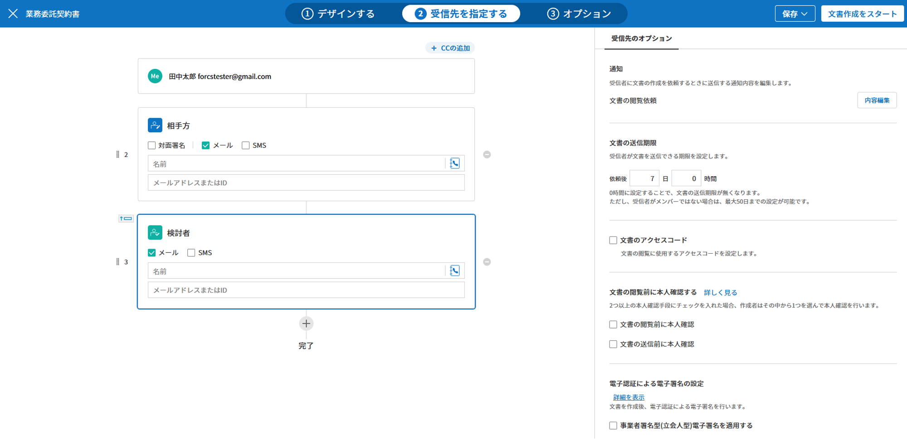

.. _createnew:

文書の新規作成
==================

eformsignを使用することで、既存のファイルを簡単に電子文書化し、文書を作成、依頼、および処理することができます。eformsignによる電子文書の作成と送信のやり方は2種類にあります。PCに保存されているファイルをそのままアップロードして電子文書を作成する方法と、eformsignに保存されているテンプレートを使用する方法があります。

-  **マイファイルで作成する**\ ：PC内の既存の文書ファイルを使用して文書を作成します。電子フォームを作成し、受信者に送信することができます。

-  **テンプレートで作成する**\ ：既存のテンプレートを使用して文書を作成します。
   **テンプレートで作成する**\ をクリックすると、代表管理者およびテンプレートの管理権限を持つメンバーがアップロードしたテンプレートが表示されます。

.. note::

   テンプレートの作成は、代表管理者およびテンプレート管理の権限を持つメンバーのみ可能です。また、 アップロードされたテンプレートはそのテンプレートの権限設定で **使用権限**\ を付与されたメンバーの **テンプレートで作成する**\ の画面に表示されます。詳しくは `Web フォームデザイナー <chapter6.html#template_wd>`__\ と `フォームビルダー <chapter7.html#template_fb>`__\ をご参照ください。

.. tip::

   **マイファイルで作成する**\ で文書作成する場合は、テンプレートを変更・保存することはできません。 従って、頻繁に使用する文書は、テンプレートとしてアップロードすることで、スムーズな作業が可能になります。

マイファイルで作成する
--------------------------

使用したい文書ファイルをアップロードし、文書上に入力コンポーネントを自由に配置することができます。
また、各コンポーネントを参加者ごとに指定することで、参加者および検討者情報を入力した上で、送信できます。

1. **マイファイルで作成する** メニューに移動します。

   |image1|

2. 文書ファイルをアップロードします。

   |image2|

   .. note::

      アップロード可能なファイル形式は pdf, hwp, doc, docx, xls, xlsx, ppt, pptx, odt, jpg, png, gif, tiff となります。
      アップロード可能なファイルの容量は最大9MBまでです。

3. 文書の作成に参加する **参加者**\ を追加し、役割を設定します。

   |image3|

   .. note::

      画面左上の **参加者を追加する**\ をクリックすると参加者を追加することが可能で、最大30人まで設定できます。
      フォームデザインの次に **受信先を指定する**\ では、追加した参加者の情報を変更、追加および削除ができます。

4. 各参加者が入力するコンポーネントを追加し、各コンポーネントの詳細設定を右側の画面で指定します。

   |image4|

5. コンポーネントを追加した後、 **受信先を指定する**\ でメールアドレス、携帯電話番号等の連絡先を入力し **各受信者の詳細オプション**\を設定します。

   |image5|

   .. note::

      受信者は、参加者と検討者に分けられます。追加した参加者は受信先を指定するステップで表示されます。各受信者のメールアドレスなどの連絡先を入力します。受信先を指定する画面では、参加者/検討者の削除/追加、各受信者の詳細オプションを設定できます。

   .. tip::

      **参加者と検討者の相違点**

      参加者は入力コンポーネントに署名・記入等を入力することができます。検討者は文書に入力不可能で、文書の承認の可否のみ入力します。

      |image6|

6. **オプション**\ をクリックして文書のタイトル、完了文書に対するタイムスタンプの付与などを設定します。

   |image7|

   .. note::

      このステップまでがフォームを設定するステップです。 **文書作成をスタート**\ をクリックする前に下書き保存して作成を終了する場合、`下書きとして保存 <chapter8.html#drafts>`__\ トレイに保存されます。保存されたファイルを開くと、作成を再開することができます。文書の下書き保存は右上のメニュー (|image8|) アイコンをクリックして表示される **下書きとして保存** をクリックすることで可能です。

      |image9|

7. 全ての設定を完了した後、 **文書作成をスタート**\ をクリックします。

   |image10|

   .. caution::

      **文書作成をスタート**\をクリックした時点から課金の対象として集計されます。

8. 文書を確認し、 **送信**\ をクリックすると、受信先に文書が送信されます。

   |image11|

**受信先を指定する > 受信先のオプション設定**
~~~~~~~~~~~~~~~~~~~~~~~~~~~~~~~~~~~~~~~~~~~~~~~~

**デザインする**\ ステップで文書作成に参加する参加者、つまり文書の受信者を追加して各受信者の入力コンポーネントを設定します。**受信先を指定する**\ で追加した参加者の詳細設定を行います。参加者の順番変更や作成した文書検討者の追加が可能です。

各参加者もしくは検討者には、名前・送信先のメールアドレスまたはIDを入力する必要があります。参加者がメンバーである場合、リストを選択すると
登録されたメンバーが自動的に入力されます。受信先のオプションは、参加者もしくは検討者がメンバー/非メンバーかで設定が異なります。

-  **受信者がメンバーである場合**

   -  **文書送信手段の選択:** メールとSMSの中から1つを選択または全て選択することができます。保存されているメールアドレスと携帯電話番号が表示されます。

      .. caution::

        SMSは追加料金が発生します。

   -  **通知:**\ **通知編集**\ をクリックすることで、文書を送信する際に送られる通知メール、及びSMSの内容を編集できます。         

   -  **文書の送信期限の設定:**\ 受信者が文書を送信できる期限を設定できます。提出期限が過ぎると文書の検討および作成ができなくなります。

      .. tip::

         文書の送信期限を無期限にするには、 **文書の送信期限をOO日OO時間**\ と設定します。

   |image12|

-  **受信者がメンバーではない場合**

   入力した情報がメンバーの情報と一致しない場合、外部受信者として認識され、次の項目に対して詳細オプションを設定する必要があります。

   -  **文書送信手段の選択:** メールおよびSMSから選択できます。SMSを選択した場合は送信先の携帯電話番号を入力する必要があります。

      .. caution::

         SMSは追加料金が発生します。

   -  **文書の送信期限の設定:** 受信者が文書を送信できる期限を設定できます。提出期限が過ぎると文書の検討および作成ができなくなります。文書の送信期限を無期限に設定できません。

   -  **文書の閲覧前に本人確認する** 

      -  **本人確認情報**\ : 各項目にチェックを入れると、外部受信者が文書を検討する際に、チェックされた項目に関する情報の入力が必須になります。入力内容に関するヒントを入力することもできます。

      -  **追加確認手段**\ : **メール確認** を行った後、検討ができるように設定します。

**オプション設定**
~~~~~~~~~~~~~~~~~~~~~~~~~~~~~~~~~~~~~~~~~~
最後のステップであるオプション設定では、文書タイトルの作成、通知の設定及び編集、することができます。また、タイムスタンプの付与も可能です。

.. figure:: resources/wfd-option.png
   :alt: オプション設定の画面
   :width: 700px

テンプレートで作成する
--------------------------

頻繁に使用するフォームをテンプレート化することで、ワークフロー（文書の処理プロセス）等の設定をテンプレートごとに保存し、必要な際に文書の作成及び送信ができます。テンプレートは **Webフォームデザイナー** または **フォームビルダー** を使って作成できます。詳しくは `Webフォームデザイナー <chapter6.html#template_wd>`__ と `フォームビルダー <chapter7.html#template_fb>`__ をご参照ください。

.. note::

   文書の作成は、テンプレート管理の権限を持つメンバーが **テンプレートの設定 > 権限の設定** から **テンプレートの使用権限** (=文書の作成権限) を付与したグループまたはメンバーのみ可能です。テンプレートの使用権限を付与されたグループまたはメンバーの **テンプレートで作成する** リストでのみ、そのテンプレートが表示され、作成することができます。

1. ダッシュボードまたはサイドバーのメニューから **テンプレートで作成する**\ をクリックします。

   |image14|

2. 使用したいテンプレートの作成アイコン(|image15|) をクリックします。

   |image16|

3. 文書を作成して右上の **完了** もしくは **送信**\ をクリックすると文書に設定されているワークフローにしたがって次のステップに送信されます。途中で作成を中止したい場合は **下書き保存**\ をクリックして保存します。

   .. note::
      テンプレートに設定されているワークフローによって、*完了* 、 *提出* 、 *送信* ボタンのいずれかが表示されます。

   .. important::

      テンプレートで作成する途中で **下書き保存** ボタンをクリックして下書き保存した文書は、 **下書きとして保存**\ トレイではなく、 **要処理文書**\で確認することができます。

      下書き保存した文書の作成を続けたい場合は **要処理文書** のリストから下書き保存した文書の **編集** をクリックして進めることができます。

.. _bulksend:

一括作成して文書を送信する
-----------------------------------------

テンプレートで文書を作成する際、一括作成機能を使用することで、一度に複数の文書を送信できます。

.. note::

   この作業を行うには、代表管理者の権限またはテンプレート管理の権限が必要です。

**一括作成する**

1. **文書の新規作成** **> テンプレートで作成する** メニューに移動します。

2. 使用したいテンプレートの一括生成アイコンをクリックします。

   .. figure:: resources/bulk-creation-icon.png
      :alt: 一括作成アイコン

3. 一括作成したい文書にデータを入力する方法を選択します。eformsignの画面に **直接編集** または **ファイルのアップロード**\ することで、データの入力ができます。

   .. figure:: resources/bulksend.png
      :alt: 一括作成
      :width: 700px

.. tip::

   **一括作成文書データの入力方法**

   **方法 1. データの直接編集: 最大200件まで一括作成可能**

   **直接編集**\ をクリックすると、eformsign画面で直接データを入力できる表が表示されます。文書の入力コンポーネント1つを1列として表示します。各入力コンポーネントの名前が、各列のタイトルとして表示されます。1行を1件の文書として扱います。1列目の最下行にある数字が、作成される文書の総件数です。

   表は、エクセルのような感覚で使用できます。各セルをダブルクリックすることで内容の入力、右クリックすることで行の追加、削除ができます。セルに入力された値をコピー、貼り付けまたはドラッグ＆ドロップして入力することもできます。

   .. figure:: resources/bulksend-edit.png
      :alt: 一括作成_直接編集 
      :width: 700px

   **方法 2. ファイルのアップロード: 最大1,000件まで一括作成可能**

   ファイルのアップロードを選択すると、文書の入力コンポーネントが書かれたエクセルファイルがダウンロードされます。そのファイルに各入力コンポーネントのデータを入力し、アップロードします。

   .. figure:: resources/bulksend-fileupload.png
      :alt: 一括作成_ファイルのアップロード
      :width: 400px

4. 右上の **プレビュー**\ をクリックして、作成した文書の内容を確認します。

5. **予約送信**\ もしくは **即時送信**\ をクリックすると文書の一括作成が完了します。

   .. figure:: resources/bulksend-sending.png
      :alt: 一括作成送信
      :width: 700px

   .. note::

      **予約送信**\ をクリックすると、文書予約送信ポップアップが表示されます。送信する日時を選択してください。
      予約送信は現在時刻を基準に、10分後から可能です。

   .. figure:: resources/bulksend-schedule.png
         :alt: 一括作成予約送信
         :width: 400px

6. **一括作成文書**\ で文書の送信状況等の文書に関する情報を確認します。

.. tip::

   **一括作成文書 TIP 1: 一括作成時に入力されたデータのエラーの確認**

   **直接編集**\ または **ファイルのアップロード**\ で文書を一括作成する際、入力されたデータのエラーを確認することができます。不当なデータの入力や、必須項目のデータが無い場合は、データエラーとして表示されます。エラーで表示された文書は送信不可能であり、正常なデータのみ送信可能です。

   .. figure:: resources/bulksend-error.png
      :alt: データエラーの確認
      :width: 400px

.. tip::

   **一括作成文書 TIP 2: 一括作成時、要チェック!**

   テンプレートの入力コンポーネントのうち、一部が **一括作成**\ 画面に表示されない場合、以下2つの内容を確認する必要があります。

   1. 一括作成で入力できないコンポーネントの確認: カメラ、録音、グループ化されたコンポーネント

   2. 作成ステップでアクセス許可されたコンポーネントの確認: **テンプレート管理 > テンプレートの設定(⚙) > ワークフローの設定 >**\ 作成ステップのうち、アクセスが許可されたコンポーネントのみ表示されます。

.. |image1| image:: resources/newfrommyfile-menu.png
   :width: 700px
.. |image2| image:: resources/newfrommyfile-uploadfile.png
   :width: 700px
.. |image3| image:: resources/newfrommyfile-participants-popup.png
   :width: 400px
.. |image4| image:: resources/newfrommyfile-formdesign.png
   :width: 700px

.. |image6| image:: resources/newfrommyfile-recipients-type.png
.. |image7| image:: resources/newfrommyfile-option.png
   :width: 700px
.. |image8| image:: resources/menu_icon_3.png
.. |image9| image:: resources/newfrommyfile-saveasdrafts.png
.. |image10| image:: resources/newfrommyfile-startfromnow.png
   :width: 700px
.. |image11| image:: resources/newfrommyfile-startfromnow-send.png
   :width: 700px
.. |image12| image:: resources/newformmyfile-recipientoption-member.png
   :width: 700px
.. |image13| image:: resources/newformmyfile-recipientoption-external.png
   :width: 400px
.. |image14| image:: resources/menu-startfromtemplate.png
   :width: 700px
.. |image15| image:: resources/create-icon.PNG
.. |image16| image:: resources/startfromtemplate-create.png
   :width: 700px
.. |image17| image:: resources/bulk-creation-table-blue-section.png
   :width: 700px

