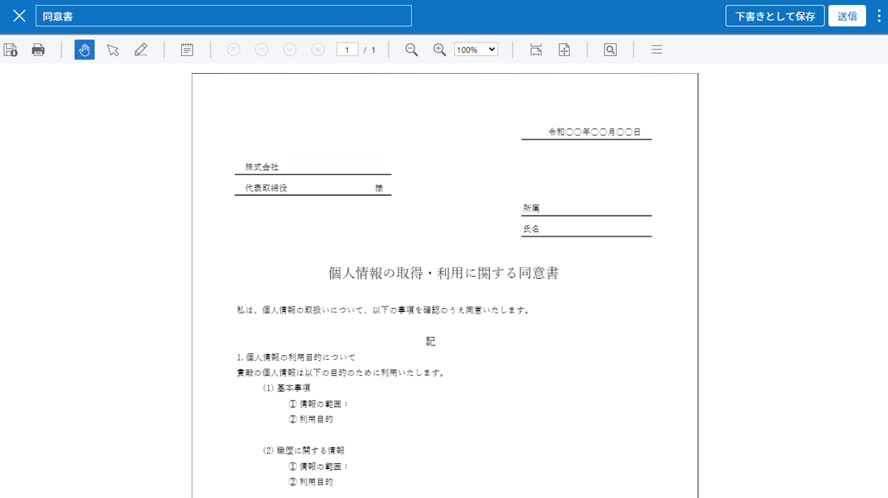

.. _createnew:

文書の新規作成
==============

概要
----

eformsign
を使用すると、誰もが簡単にお手持ちのファイルを電子文書化し、文書を作成、依頼、および処理できます。
eformsign
で電子文書を作成および送信する方法は、大きく2種類に分けられます。PCに保存されているファイルを直接アップロードして電子文書を作成する方法と、eformsign
に保存されている既存のテンプレートを利用する方法です。

-  **マイファイルで作成する**\ ：PCに保存された文書ファイル (PDF形式)
   を使って電子フォームを作成し、参加者に送信できます。

-  **テンプレートで作成する**\ ：既存のテンプレートを使用して文書を作成します。\ **テンプレートで作成する**
   メニューをクリックすると、代表管理者または
   テンプレートの管理権限を持つメンバーが作成しておいたテンプレートが画面に表示されます。

.. note::

   テンプレートの作成は、代表管理者またはテンプレー管理の権限を持つメンバーのみが可能です。また、\ **テンプレートで作成する**
   メニューで表示されるテンプレートは、各テンプレートの **権限の設定**
   で **テンプレートの使用権限**
   を付与したメンバーのみに表示されます。テンプレートは、\ **Webフォームデザイナー**
   と **フォームビルダー** で作成できます。詳しくは
   `??? <#template_wd>`__ と `??? <#template_fb>`__ をご参照ください。

.. important::

   **マイファイルで作成する**
   で文書を作成する場合、作成した文書をテンプレートに変更したり保存したりすることはできません。よく使う文書の場合、テンプレートに登録しておくと便利です。

マイファイルで作成する
----------------------

PDF形式の
ファイルを直接アップロードして、文書の上にコンポーネントを自由に配置します。各コンポーネントを
参加者毎に指定した後、参加者および/または検討者の情報を入力し、送信することができます。

1. **マイファイルで作成する** メニューに移動します。

   |image1|

2. 文書ファイル (PDF形式) をアップロードします。

   |image2|

   .. note::

      現在は PDF
      形式のみをサポートしていますが、今後様々なファイル形式にも対応していく予定です。

3. 文書の作成に参加する **参加者** を追加し、タイプを設定します。

   |image3|

   .. note::

      画面左上の **参加者を追加する**
      ボタンをクリックして参加者を追加することもでき、最大30人まで設定できます。

      **受信先を指定する**
      ステップでも設定した参加者の情報を変更および追加、削除できます。

4. 各参加者が入力するコンポーネントを追加し、各コンポーネントの詳細設定を右側の
   **プロパティ** タブで指定します。

   |image4|

5. コンポーネントを追加した後、\ **受信先を指定する**
   ステップでメールアドレス、携帯電話番号など連絡先の情報を入力し、\ **各受信者の詳細オプション**\ を設定します。

   |image5|

   .. note::

      受信者は、\ **参加者** と **検討者**
      に区別されます。文書を作成するときに追加した参加者が
      **受信先を指定する**
      ステップに表示され、各受信者のメールアドレスなど連絡先の情報を入力します。
      **受信先を指定する**
      画面で参加者/検討者を削除/追加でき、各受信者の詳細オプションを設定します。

   .. tip::

      **参加者と検討者の違い**

      参加者は署名、記入など文書のコンポーネントに入力することができます。一方、検討者は文書に入力することができず、文書を検討し、承認するかどうかのみを決定します。

      ただし、コンポーネントの作成権限を **誰でも作成可能**
      に設定した場合、検討者もコンポーネントに入力することができます。

      |image6|

6. **オプション**
   をクリックし、文書のタイトル、完了文書に対するタイムスタンプの付与などを設定します。

   |image7|

   .. note::

      このステップまでがフォームを設定するステップです。\ **文書作成をスタート**
      をクリックする前に下書き保存して作成を終了する場合、\ `下書きとして保存 <#drafts>`__
      トレイに保存されます。保存されたファイルを開けば、作成を再開できます。文書の下書き保存は右上のメニュー
      (|image8|) アイコンをクリックして表示される **下書きとして保存**
      をクリックします。

      |image9|

7. すべての設定を完了した後、\ **文書作成をスタート** をクリックします。

   |image10|

   .. caution::

      **文書作成をスタート**
      をクリックした時点から課金の対象として集計されます。

8. 文書を確認し、\ **送信**
   ボタンをクリックすると、受信先に文書が送信されます。

   |image11|

**受信先を指定する > 受信先のオプション**

**デザインする** または **受信先を指定する**
ステップで文書の参加者、つまり文書の受信先を追加することができます。

**受信先を指定する** ステップでは、参加者に対する詳細設定を行う
**受信先のオプション**
の設定はもちろん、参加者を追加または削除したり、文書を検討する検討者を追加したりできます。

各参加者または検討者に対し、名前と送信先のメールアドレスまたは ID
を入力する必要があります。参加者がメンバーである場合、リストから選択すると、登録されたメンバー情報が自動で入力されます。\ **受信先のオプション**
は、参加者または 検討者がメンバーである場合と、メンバーではない外部の
受信者である場合でそれぞれ異なって表示されます。

-  **受信者がメンバーである場合**

   登録されたメールアドレスと携帯電話番号が自動で表示され、文書を送信する手段を選択できます。

   .. caution::

      **モバイル**
      を選択する場合、SMSまたはカカオトーク通知で送信され、件数に比例して追加料金が発生します。

   |image12|

-  **メンバーではない外部の受信者である場合**

   入力した情報がメンバーの情報と一致しない場合、外部受信者と認識され、次の項目についての詳細オプションを設定する必要があります。

   -  **送信手段の選択：メール** と **モバイル**
      のうち一つまたは両方を選択でき、\ **モバイル**
      を選択した場合は携帯電話番号を入力する必要があります。

      .. caution::

         **モバイル**\ を選択する場合、SMSまたはカカオトーク通知で送信され、件数に比例した追加料金が発生します。

   -  **文書の送信期限：**\ 外部受信者が文書を閲覧し、送信できる期限を設定でき、設定された期限が切れると文書を作成することができません。

   -  **パスワードの設定：**\ チェックを入れると、外部受信者が文書を閲覧する前に、設定しておいたパスワードを入力する必要があります。\ **パスワードのヒント**
      で、受信者がパスワードを推測できるようなヒントを設定し、表示することができます。

   -  **文書の検討前に携帯電話で本人確認する：**\ 外部受信者が文書を閲覧/作成する前に、携帯電話で本人確認を行うよう設定します。この機能は追加料金が発生します。

   -  **完了文書の閲覧前に携帯電話で本人確認する：**\ 外部受信者が完了文書を閲覧する前に、携帯電話で本人確認を行うよう設定します。この機能は追加料金が発生します。

   |image13|

テンプレートで作成する
----------------------

よく使うフォームをテンプレート化しておくと、文書の処理過程であるワークフローなどの詳細設定をテンプレート毎に保存し、必要に応じて文書を作成および送信できます。テンプレートは
**Webフォームデザイナー** または **フォームビルダー**
を使って作成できます。詳しくは `Webフォームデザイナー <#template_wd>`__
と `フォームビルダー <#template_fb>`__ をご参照ください。

.. note::

   文書の作成は、テンプレート管理の権限を持つメンバーが
   **テンプレートの設定 > 権限の設定** で **テンプレートの使用権限**
   (=文書の作成権限)
   を付与したグループまたはメンバーのみが可能です。テンプレートの使用権限を付与されたグループまたは
   メンバーのテンプレートリストのみにそのテンプレートが表示され、作成できます。

1. ダッシュボードまたはサイドバーのメニューで
   **テンプレートで作成する**\ をクリックします。

   |image14|

2. 目的のテンプレートの **作成** アイコン(|image15|) をクリックします。

   |image16|

3. 文書を作成し、画面右上の **作成完了** もしくは **依頼**
   ボタンをクリックすると、文書のワークフローに指定された次のステップに送信されます。途中で作成をやめて保存する場合は、\ **下書き保存**
   ボタンをクリックして保存します。

   .. note::

      テンプレートに設定されたワークフローによっては **作成完了、提出**
      もしくは **依頼** ボタンに異なって表示されます。

   .. important::

      テンプレートで作成する途中に **下書き保存**
      ボタンをクリックして下書き保存した文書は、\ **下書きとして保存**
      トレイではなく、\ **要処理文書** トレイに保存されます。

      **要処理文書** のリストから下書き保存した文書の **編集**
      ボタンをクリックすると、作成を続行できます。

一括生成
~~~~~~~~

文書トレイ 一括生成 テンプレートで作成する場合、\ **一括生成**
の機能を使用すると、一度に複数の文書を作成できます。

.. note::

   この作業を行うには、代表管理者の権限またはテンプレートの管理権限が必要です。

1. **文書の新規作成** **> テンプレートで作成する**
   メニューに移動します。

2. 目的のテンプレートの **一括生成** アイコンをクリックします。

   .. figure:: resources/bulk-creation-icon.png
      :alt: 一括生成アイコン

      一括生成アイコン

3. 画面に表示される各コンポーネントに説明を入力します。

   .. figure:: resources/bulk_create.png
      :alt: 一括生成画面
      :width: 700px

      一括生成画面

   .. note::

      文書内のコンポーネントが各カラムとして表示されているテーブルです。コンポーネントの
      ID が、各カラムのタイトルとして表示されます。\ **番号**
      カラムの一番下の行の番号が作成される文書の数です。

      テーブルは、Excel
      と同様の方法で入力します。各セルをダブルクリックして内容を入力し、マウスを右クリックして行を追加または削除できます。セルに入力した値をコピーと貼り付け、ドラッグして入力することができます。

4. 右上の **プレビュー**
   ボタンをクリックして、作成した文書の内容を確認した後、\ **生成**
   ボタンをクリックして文書の作成を完了します。

   .. note::

      **一括生成**
      のテーブルに表示される青い領域には、依頼を送信する外部受信者の名前、メールアドレスなどを入力します。外部受信者の処理ステップの設定に応じて、携帯電話番号、認証パスワードなどを入力できます。

      |image17|

   .. tip::

      テンプレートのコンポーネントの一部が **一括生成**
      画面に表示されない場合は、次の2つのケースを確認してください。

      1.\ **一括生成**
      で入力できないコンポーネント：\ **写真**\ 、\ **録音**\ 、およびグループ化されている
      **ラジオ** コンポーネントは、\ **一括生成**
      では作成できないコンポーネントです。

      2.\ **作成**
      ステップでアクセスが許可されているコンポーネント：\ **テンプレート管理
      > テンプレートの設定(⚙) > ワークフローの設定**
      でアクセスが許可されているコンポーネントのみが表示されます。

.. |image1| image:: resources/newfrommyfile-menu.png
   :width: 700px
.. |image2| image:: resources/newfrommyfile-uploadfile.png
   :width: 700px
.. |image3| image:: resources/newfrommyfile-participants-popup.png
   :width: 400px
.. |image4| image:: resources/newfrommyfile-formdesign.png
   :width: 700px
.. |image5| image:: resources/newfrommyfile-recipients.png
   :width: 700px
.. |image6| image:: resources/newfrommyfile-recipients-type.png
.. |image7| image:: resources/newfrommyfile-option.png
   :width: 700px
.. |image8| image:: resources/menu_icon_3.png
.. |image9| image:: resources/newfrommyfile-saveasdrafts.png

.. |image11| image:: resources/newfrommyfile-startfromnow-send.png
   :width: 700px
.. |image12| image:: resources/newformmyfile-recipientoption-member.png
   :width: 400px
.. |image13| image:: resources/newformmyfile-recipientoption-external.png
   :width: 400px
.. |image14| image:: resources/menu-startfromtemplate.png
   :width: 700px
.. |image15| image:: resources/create-icon.PNG
.. |image16| image:: resources/startfromtemplate-create.png
   :width: 700px
.. |image17| image:: resources/bulk-creation-table-blue-section.png
   :width: 700px
