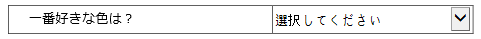

.. _webform:

Web フォームデザイナーの紹介
============================

Web フォームデザイナーの概要
----------------------------

Webフォームデザイナー **Web フォームデザイナー**
は、既存の文書ファイルを eformsign
サービスにアップロードし、コンポーネントを追加することで簡単に電子形式で作成できるツールです。\ **マイファイルで作成する**
または **テンプレート管理** メニューで、電子文書の背景書式になる PDF
ファイルをアップロードすると、Web
フォームデザイナーが表示されます。eformsign
が提供する様々なコンポーネントから目的のコンポーネントを選択して、文書の上にドラッグアンドドロップし、各コンポーネントのプロパティを設定することで、テンプレートを簡単に作成できます。

.. note::

   現在は PDF ファイルのみをサポートしていますが、今後 Microsoft
   OfficeやJPG、PNG
   などの画像ファイルを含め、様々なファイル形式にも対応していく予定です。

.. note::

   Microsoft Office アドイン（Add-in）機能（OZ in Office
   フォームビルダー）も用意されており、Microsoft Office
   から電子文書を直接生成することもできます。フォームビルダーについては、
   `??? <#formbuilder>`__ を参考に、Microsoft Office
   にフォームビルダーをインストールしてから使用してください。

-  **マイファイルで作成する** メニューで PDF ファイルをアップロードする

1. メニューのうち、 **マイファイルで作成する**
   メニューをクリックします。

   |image1|

2. 画面に直接ファイルをドラッグするか、\ **PCからファイルを選択**
   をクリックして、ローカル PC
   からアップロードしたいファイルを選択します。ファイルがアップロードされれば、次のような画面が表示されます。

   |image2|

3. ファイルがアップロードされれば、次のように文書にコンポーネントを追加できる
   Web フォームデザイナー画面が表示されます。

   |image3|

-  **テンプレート管理** メニューで PDF ファイルをアップロードする

   1. **テンプレート管理** メニューに移動します。

      .. figure:: resources/web-form_1.png
         :alt: Web フォームデザイナーの画面
         :width: 700px

         Web フォームデザイナーの画面

   2. **テンプレート管理**
      画面にファイルを直接ドラッグするか、\ **PCからファイルを選択**
      をクリックして、ローカルコンピューターからアップロードしたいファイルを選択します。

      .. figure:: resources/web-form_2.png
         :alt: Web フォームデザイナーの画面
         :width: 700px

         Web フォームデザイナーの画面

   3. ファイルがアップロードされれば、次のような画面が表示されます。

      .. figure:: resources/web-form_3.png
         :alt: Web フォームデザイナーの画面
         :width: 700px

         Web フォームデザイナーの画面

Web フォームデザイナーのメニューの構成
~~~~~~~~~~~~~~~~~~~~~~~~~~~~~~~~~~~~~~

**Web フォームデザイナー**
は、大きく、文書を全面表示する文書表示ペイン、トップバー、そして左右ペインの４つの領域で構成されています。

.. figure:: resources/web-form_4.png
   :alt: Web フォームデザイナーのメニューの構成：テンプレートの作成
   :width: 750px

   Web フォームデザイナーのメニューの構成：テンプレートの作成

.. figure:: resources/myfile_create_document4.png
   :alt: Web フォームデザイナーのメニューの構成：マイファイルで作成する
   :width: 700px

   Web フォームデザイナーのメニューの構成：マイファイルで作成する

1. **文書表示ペイン：**\ アップロードした背景書式の文書が表示されます。

2. **トップバー：テンプレートの作成** の場合、\ **デザインする** と
   **設定する**
   の2ステップが表示され、テンプレート管理のリスト画面に戻ったり、コンポーネントを追加したテンプレートをプレビューしたりできます。
   **マイファイルで作成する** の場合、\ **デザインする**
   、\ **受信先を指定する** 、\ **オプション**
   の3ステップが表示され、デザインを完了して **文書作成をスタート**
   したり、 **下書き保存** して作成を終了することができます。

   .. note::

      トップバーに表示される各ステップをクリックすると、そのステップの画面が表示されます。各画面でワークフローや権限などを設定できます。\ **テンプレートの作成**
      または **マイファイルで作成する**
      を終了する前に設定を完了する必要があります。

3. **コンポーネントのリスト：**\ 現在の時点では、 **1行テキスト 、
   複数行テキスト 、 署名 、 チェック 、 選択** を含む 13
   の基本コンポーネントと、 **文書ID 、 文書番号**
   の2つの情報コンポーネントをサポートしていますが、今後、カスタムアイテムや図形などの新しいコンポーネントを継続して追加する予定です。

4. **プロパティ：\ 署名 、 テキスト 、 チェック**
   などのコンポーネントを背景書式にドラッグして、各コンポーネントのプロパティを設定します。

コンポーネントの概要
--------------------

コンポーネント
コンポーネントは、ユーザーが電子文書に内容を入力するための入力欄として機能します。署名、チェック、日付、テキストなど多様な種類のコンポーネントがあり、各コンポーネントは、プロパティタブを介して詳細に設定することができます。

.. figure:: resources/component_web_1.png
   :alt: Webフォームデザイナーでコンポーネントを追加した例
   :width: 700px

   Webフォームデザイナーでコンポーネントを追加した例

コンポーネントのタイプ
~~~~~~~~~~~~~~~~~~~~~~

eformsign は次ようなのコンポーネントをサポートしています。

**基本コンポーネント**

-  `署名 <#signature2>`__\ **\ ：** コンポーネント 署名
   署名を入力します。

-  `1行テキスト <#text2>`__\ **\ ：** コンポーネント 1行テキスト
   1つまたは2つの短い単語を入力します。

-  `複数行テキスト <#text2>`__\ **\ ：** コンポーネント 複数行テキスト
   複数行の長いテキストを入力します。

-  `ラベル <#label2>`__\ **\ ：** コンポーネント ラベル
   別途設定した値を文書に表示する場合に使用します。

-  `チェック <#check2>`__\ **\ ：** コンポーネント チェック
   チェックする項目がある場合に使用します。複数選択も設定できます。

-  `ラジオ <#select2>`__\ **\ ：** コンポーネント ラジオ
   複数の項目から1つを選択します。

-  `リスト選択 <#combo2>`__\ **\ ：** コンポーネント リスト選択
   クリックすると、ドロップダウンメニューが表示され、複数の項目のうち1つを選択します。

-  `トグル <#toggle2>`__\ **\ ：** コンポーネント トグル
   複数の値を入力すると、ボタンをクリックするたびに異なる値に切り替わります。

-  `日付 <#date2>`__\ **\ ：** コンポーネント 日付
   特定の日付を入力します。

-  `増減 <#numeric2>`__\ **\ ：** コンポーネント 増減 数字を入力します。

-  `写真 <#camera2>`__\ **\ ：** コンポーネント 写真
   カメラを搭載しているデバイス（スマートフォン、タブレットなど）では、カメラで写真を撮るか、アルバムから写真を選択します。カメラが搭載されていないデバイス（通常の
   PC ）では、画像ファイルを選択します。

-  `録音 <#record2>`__\ **\ ：** コンポーネント 録音
   録音機能を搭載している端末でボタンをクリックして録音します。

-  `添付 <#attach2>`__\ **\ ：** コンポーネント 添付
   ファイル添付機能を追加します。

**情報コンポーネント**

-  `文書ID <#document2>`__\ **\ ：** コンポーネント 文書ID 文書内に文書
   ID を入力します。

-  `文書番号 <#document2>`__\ **\ ：** コンポーネント 文書番号
   文書内に文書番号 を入力します。

各コンポーネントのプロパティの設定
----------------------------------

すべてのコンポーネントには、共通のプロパティと固有なプロパティがあります。コンポーネントのプロパティ画面で、各コンポーネントの共通のプロパティと固有なプロパティを表示できます。共通のプロパティには、
**名前** と **ツールヒントの内容**
があり、各プロパティの意味は次のとおりです。

-  **名前：** コンポーネント 名前
   外部プログラムがコンポーネントの値を抽出するときに使用する固有なキーです。

-  **プレースホルダー:** コンポーネント プレースホルダー
   入力欄に入力する前に表示されるメッセージです。

-  **ツールヒントの内容：** コンポーネント ツールヒントの内容
   文書が受信者に表示される Windows
   環境では、コンポーネントにカーソルを合わせるとツールヒントのテキストが吹き出しの形で表示されます。モバイル環境では、コンポーネントがダイアログで起動されるときにツールヒントの内容がダイアログのタイトルとして表示されます。

.. note::

   文書に関する情報を提供するための情報コンポーネントには、\ **ツールヒントの内容**
   プロパティがありません。

各コンポーネントの説明は次のとおりです。

.. _signature2:

署名
~~~~

コンポーネント 署名
文書への署名依頼をする必要がある場合は、署名コンポーネントを使用します。

**署名** コンポーネントを入力すると、署名が必要な文書に次のように
**署名**
ポップアップが表示されます。署名を直接手書きで描画するか、テキストを入力して署名を生成できます。既存の署名がある場合は、その署名を使用することもできます。

|image4|

**コンポーネントのプロパティ**

.. figure:: resources/Signature-component-properties_web.png
   :alt: 署名コンポーネントのプロパティの設定

   署名コンポーネントのプロパティの設定

**① 名前**

**署名** コンポーネントの **名前**
を入力します。たとえば、契約者の署名である場合、コンポーネントの
**名前** は「契約者の署名」にします。

**② 署名タイプ**

署名時に使用する署名を選択します。

-  **直接署名：**
   署名欄をクリックすると、署名のポップアップウィンドウが表示され、手書き、テキスト、モバイル、印鑑・スタンプ、または登録済み署名タブのうち、入力したい方式で署名を入力します。

-  **登録の署名：** 文書の作成者が **マイ署名**
   を事前に登録している場合は、署名欄をクリックすると、登録済みの署名が自動的に入力されます。

-  **登録のイニシャル：** 登録の署名と同様に、 **マイ署名**
   にイニシャルが登録されている場合、署名欄をクリックすると登録済みのイニシャルが自動的に入力されます。

-  **登録の印鑑・スタンプ**\ ： 登録の署名と同様に、 **マイ署名**
   に印鑑・スタンプが登録されている場合、署名欄をクリックすると登録済みの印鑑・スタンプが自動的に入力されます。

.. note::

   署名とイニシャル、印鑑・スタンプが登録されている場合、署名は自動的に署名欄に入力されますが、署名とイニシャル、印鑑・スタンプが登録されていない場合は、直接署名と同じ署名ポップアップが表示されます。

.. note::

   署名ではなく印鑑やスタンプを使用する必要がある場合もあります。eformsign
   では、印鑑やスタンプの画像を使用して文書の署名欄に印鑑・スタンプを入れることもできます。印鑑・スタンプの画像を使用するには、\ **署名**
   ポップアップで **印鑑・スタンプ**
   タブをクリックして、印鑑・スタンプの画像を選択した後、\ **OK**
   ボタンをクリックします。

**③ 署名ペンの太さ**

署名を手書きで描画するときに表示される線の太さを設定します。

**④ 署名ペンの色**

署名を手書きで描画するときに表示される線の色を設定します。

**⑤ プレースホルダー**

署名する前にコンポーネントに表示されるテキストを設定できます。

**⑥ ツールヒントの内容**

入力欄にカーソルを合わせると、入力した説明がツールヒントのテキストとして表示されます。eformsign
アプリではキーパッドの上部中央に表示されます。

.. tip::

   **署名日** および **署名者** の自動入力を設定する

   **署名**
   コンポーネントをクリックして表示されるアイコンをクリックすると、
   **署名日** および **署名者** を追加することができます。

   .. figure:: resources/Signature-component-properties_web_icon.png
      :alt: 署名日および署名者

      署名日および署名者

   **① 署名日:**
   署名した日付が自動入力されます。署名日の領域をクリックして右側に表示されるコンポーネントプロパティで日付の表示形式を設定できます。

   .. figure:: resources/Signature-component-properties_web_date.png
      :alt: 署名者
      :width: 700px

      署名者

   **② 署名者:** 署名者の情報が自動入力されます。\ **署名**
   コンポーネントをクリックして右側に表示されるアイコンをクリックすると、ID、名前、部門役職、携帯電話、固定電話のうち、署名人の情報として表示される情報を指定できます。

   .. figure:: resources/Signature-component-properties_web_signer.png
      :alt: 署名者

      署名者

   .. note::

      一つの署名と紐づけられた署名日および署名者コンポーネントを複数追加することができます。契約書などの文書の中で繰り返し署名日を入力したり、署名者の情報を詳しく入力したりすることができます。

.. _text2:

1行テキストと複数行テキスト
~~~~~~~~~~~~~~~~~~~~~~~~~~~

コンポーネント 1行テキスト コンポーネント 複数行テキスト **1行テキスト**
のコンポーネントと **複数行テキスト**
のコンポーネントの両方とも、テキストの入力欄を作成するときに使用します。\ **1行テキスト**
のコンポーネントは 1 ～ 2単語の短いテキストに、 **複数行テキスト**
のコンポーネントは1行以上の長いテキストに適用します。

**コンポーネントのプロパティ**

.. figure:: resources/text-component-properties_web.png
   :alt: 1行テキストと複数行テキストのプロパティの設定

   1行テキストと複数行テキストのプロパティの設定

**① 名前**

**1行テキスト** もしくは **複数行テキスト** のコンポーネント項目の
**名前**
を入力します。たとえば、木村、鈴木などが入力されるコンポーネントの名前は「氏名」です。

.. note::

   **名前**
   は自動的に付与されますが、コンポーネントを追加した後、受信者に入力を依頼するかどうかを決める際に、その
   **名前**
   が表示されるので、認識しやすい名前を設定することを推奨します。

**② デフォルト値**

基本表示されるテキストを設定できます。デフォルトは「0」が設定されており、文字数に制限はありません。

.. note::

   テキストのコンポーネントでのみ設定可能なプロパティです。テキスト入力時に入力した内容がアスタリスク（*）やパスワード文字（●）で入力され、入力内容を隠すことができます。入力された内容は
   PDF ではパスワード文字で表示されます。ただし、CSV
   データをダウンロードしたときには入力内容が表示されます。

**③入力可能な最大文字数**

入力可能な最大文字数（空白を含む）を設定できます。\ **1行テキスト**
の場合は 100 文字、 **複数行テキスト** の場合は 400 文字が基本設定です。

**④ モバイル入力時のキーパッドタイプ**

スマートフォン、タブレットのようなモバイル環境で文書を作成するとき表示するキーパッドのタイプを設定します。

**⑤ プレースホルダー**

何も入力されていない場合にコンポーネントに表示されるテキストを設定できます。

**⑥ ツールヒントの内容**

入力欄にカーソルを合わせると、入力した説明がツールヒントのテキストとして表示されます。eformsign
アプリではキーパッドの上部中央に表示されます。

.. _label2:

ラベル
~~~~~~

コンポーネント ラベル **ラベル**
コンポーネントは、別途設定した値を文書に表示する場合に使用します。

**コンポーネントのプロパティ**

   ラベルコンポーネントのプロパティの設定

**① 名前**

**ラベル** コンポーネントの **名前** を設定します。

**②テキスト**

文書に表示するテキストをここで入力します。

.. _check2:

チェック
~~~~~~~~

コンポーネント チェック **チェック**
コンポーネントは、各項目にチェックが入っているかどうかを確認する場合に使用します。同様のコンポーネントには、
**ラジオ**
コンポーネントがあります。両方の違いは、チェックコンポーネントは項目へのチェック有無を確認するときに使用し、
**ラジオ**
コンポーネントは何を選択したのかを確認する必要があるときに使用することにあります。

.. tip::

   **チェック** **コンポーネントと** **ラジオ** **コンポーネントの違い**

   **チェック** コンポーネントは複数選択が可能ですが、 **ラジオ**
   コンポーネントは複数選択ができません。

**チェック**
コンポーネントの入力値は、データをダウンロードすれば、次のように表示されます。

-  項目にチェックが入っている場合：true

-  項目にチェックが入っていない場合：false

Word、PowerPoint では、\ **チェック**
コンポーネントが長方形の図形のように表示されます。コンポーネントの内容は、コンポーネントの図形の中に入力する必要があります。

**コンポーネントのプロパティ**

.. figure:: resources/check-component-properties-1_web.png
   :alt: チェックコンポーネントのプロパティの設定

   チェックコンポーネントのプロパティの設定

**① 名前**

**チェック** コンポーネントは、各コンポーネントごとに異なる **名前**
を指定する必要があります。複数の\ **チェック** コンポーネントに同じ
**名前**
が与えられている場合は、最後のコンポーネントの入力値のみが表示されます。

**② アイテムリスト**

各コンポーネントに表示されるテキストを入力できます。複数の **チェック**
コンポーネントを追加して複数選択ができるよう設定することもできます。

**② チェックスタイル**

**チェック**
コンポーネントは、プロパティでスタイルを設定できます。チェックを入れると、プロパティでチェックボックスがデフォルト設定されることになります。チェックボックス以外に、ラジオボタン、赤い丸囲みの円の形を選択することもできます。

次の例では、左からチェック/ラジオ/丸囲みを選択すると、各チェックボックスがどのように表示されるか確認できます。

|image5|

.. tip::

   右上のアイコンをクリックすると、各スタイルの色を指定することができます。活性化されたアイコンは、アイコンの下部に現在表示される色の線が表示されます。たとえば、チェックボックスの場合、チェックボックスの背景色、チェックボックスの輪郭線、チェックの色をそれぞれ指定できます。また、ラジオボタンの場合、外側の円と中央の丸の色をそれぞれ指定でき、丸囲みの円の形の場合、円の色を指定できます。

   |image6|

**④ 非選択スタイル**

選択されていないコンポーネントに表示されるスタイルを指定できます。チェックボックスの場合は四角形、ラジオボタンの場合は円形、丸囲みの円の形の場合は何も表示されません。

**⑤ ツールヒントの内容**

入力欄にカーソルを合わせると、入力した説明がツールヒントのテキストとして表示されます。eformsign
アプリではキーパッドの上部中央に表示されます。

.. _select2:

ラジオ
~~~~~~

コンポーネント ラジオ **ラジオ**
コンポーネントは、複数の項目のうち、どの項目が選択されているかを確認する必要がある場合に使用します。\ **ラジオ**
コンポーネントの選択値は、データがダウンロードされると、選択した項目の名前で表示されます。

**コンポーネントのプロパティ**

.. figure:: resources/Radio-component-properties_web.png
   :alt: ラジオコンポーネントのプロパティの設定

   ラジオコンポーネントのプロパティの設定

**① 名前**

**ラジオ** コンポーネント内の選択項目には、各選択グループに対して同じ
**名前** を指定する必要があります。

たとえば、問題 1 に対して 1、2、3、4、5
の選択肢がある場合、1、2、3、4、5の項目に同じ 名前の
「問題1」を指定します。問題 2 の選択肢の1、2、3、4、5 に対しては 名前 を
「問題2」にします。次の例では、すべての選択項目の **名前** を
「年齢の選択」とします。

   選択コンポーネントの設定の例

**② アイテムリスト**

同じ名前を設定したコンポーネントは、プロパティの **アイテムリスト**
に一括表示され、 **アイテムリスト** で便利にテキストを修正できます。

**③ 選択スタイル**

**ラジオ**
コンポーネントは、プロパティでスタイルを設定できます。黒い丸囲みの円がデフォルトで設定されており、ドロップボックスメニューでスタイルを変更できます。

.. tip::

   右上のアイコンをクリックすると、各スタイルの色を指定することができます。活性化されたアイコンは、アイコンの下部に現在表示されている色の線が表示され、外側の円と中央の丸の色をそれぞれ指定できます。

   |image7|

**④ 非選択スタイル**

選択されていないコンポーネントに表示されるスタイルを指定できます。

**⑤ ツールヒントの内容**

入力欄にカーソルを合わせると、入力した説明がツールヒントのテキストとして表示されます。eformsign
アプリではキーパッドの上部中央に表示されます。

.. _combo2:

リスト選択
~~~~~~~~~~

コンポーネント リスト選択 複数の項目から 1
つの項目を選択する必要がある場合は、\ **リスト選択**
コンポーネントを使用します。

チェックボックスをクリックすると、項目のリストが表示されます。

|image8|

**コンポーネントのプロパティ**

.. figure:: resources/combo-component-properties_web.png
   :alt: リスト選択コンポーネントのプロパティの設定

   リスト選択コンポーネントのプロパティの設定

**① 名前**

リスト選択コンポーネントの **名前**
を入力します。たとえば、お気に入りの色を選択するコンポーネントの
**名前** は「お気に入りの色」とします。

**② アイテム数**

選択肢の項目を入力します。複数の項目を Enter キーで区切ります。

**③ 基本表示アイテム**

基本表示するアイテムを設定します。

**④ プレースホルダー**

何も入力されていない場合にコンポーネントに表示されるテキストを設定できます。

.. note::

   **リスト選択**
   コンポーネントの最上部に「選択してください」を表示するには、\ **プレースホルダー**
   に「選択してください」を入力し、\ **基本表示アイテム**
   を「選択してください」に設定します。

**⑤ ツールヒントの内容**

入力欄にカーソルを合わせると、入力した説明がツールヒントのテキストとして表示されます。eformsign
アプリではキーパッドの上部中央に表示されます。

.. _toggle2:

トグル
~~~~~~

コンポーネント トグル ON や OFF
など、特定の状態を示すために使用します。\ **トグル**
コンポーネントを使用すれば、コンポーネントをクリックするたびに、予め設定しておいた項目順で入力値が切り替わります。

次のようにコンポーネントをクリックして、「良好」または「不良」に変更できます。

|image9|

**コンポーネントのプロパティ**

.. figure:: resources/toggle-component-properties_web.png
   :alt: トグルコンポーネントのプロパティの設定

   トグルコンポーネントのプロパティの設定

**① 名前**

**トグル** コンポーネントの **名前**
を入力します。たとえば、最初の点検項目に対するコンポーネントであれば、「点検項目
1」にします。

**② アイテム数**

**トグル**
コンポーネントをクリックするたびに、切り替わる項目のリストを入力します。複数の項目を
Enter キーで区切ります。

**③ 基本表示アイテム**

基本表示するアイテムを設定します。

**④ ツールヒントの内容**

入力欄にカーソルを合わせると、入力した説明がツールヒントのテキストとして表示されます。eformsign
アプリではキーパッドの上部中央に表示されます。

.. _date2:

日付
~~~~

コンポーネント 日付
日付を入力する必要がある場合に使用します。入力欄をクリックすると、日付ピッカーが表示され、目的の日付を選択できます。

**コンポーネントのプロパティ**

.. figure:: resources/datetime-component-properties_02_web.png
   :alt: 日付コンポーネントのプロパティの設定

   日付コンポーネントのプロパティの設定

**① 名前**

日付コンポーネントの **名前**
を入力します。たとえば、休暇の開始日を選択するコンポーネントの名前 は
「休暇の開始日」 にします。

**② デフォルト値**

基本表示される日付を設定できます。\ **今日の日付で設定**
にチェックを入れると、文書を開いたときに今日の日付が自動で入力されます。

**③ 書式設定**

日付を表示する書式を指定します。デフォルト設定は、date_yyyy-MM-dd です。

-  **yyyy：年度**\ を表示します。（yyyy年＝2020年）

-  **MM：月**\ を表示します。月の表現は大文字にする必要があります。（MM月＝8月）

-  **dd：日**\ を表示します。（dd日 = 10日）

「2020年 2月 5日」のように表示するには、書式設定に\ **「**\ yyyy年 MM月
dd日」と入力します。

**④ 入力可能な最小/最大日付**

日付の選択時に選択可能な最小日付と最大日付を指定して、入力可能な日付の範囲を設定します。

**⑤ プレースホルダー**

何も入力されていない場合にコンポーネントに表示されるテキストを設定できます。

**⑥ ツールヒントの内容**

入力欄にカーソルを合わせると、入力した説明がツールヒントのテキストとして表示されます。eformsign
アプリではキーパッドの上部中央に表示されます。

.. _numeric2:

増減
~~~~

コンポーネント 増減
数字を入力する必要がある場合に使用します。入力欄をクリックすると、2つの矢印が表示されます。
**上へ** もしくは **下へ** の矢印ボタンを押して、数字を増減できます。PC
のキーボード環境では、入力欄に任意の数字を直接入力できます。スマートフォンやタブレット環境では、入力範囲の数字リストをスクロールして目的の数字を選択できます。

**コンポーネントのプロパティ**

.. figure:: resources/number-component-properties_web.png
   :alt: 数字コンポーネントのプロパティの設定

   数字コンポーネントのプロパティの設定

**① 名前**

**数字** コンポーネントの **名前**
を入力します。たとえば、予約人員の数を入力するコンポーネントの 名前
は、「予約人数」にします。

**② デフォルト値**

基本表示される数字を設定できます。

**③ 変化の増分**

入力欄の増加/減少のアイコンをクリックするたびに、現在入力されている値から増減する値を入力します。たとえば、増分の単位を
100
に設定して文書を作成する場合、入力欄の右側にある上への矢印（▲）をクリックすると、入力値から
200、300、... に増加します。

**④ 入力可能な最小値/最大値**

入力可能な最小値と最大値を指定して、入力可能な数字の範囲を設定します。たとえば、生年月日の場合は、通常、最小値を1900、最大値を現在の年度、増分の単位を1で指定します。最小値または最大値が指定されている状態で範囲外の数字を入力すると、最小値または最大値が自動で入力されます。つまり、最大値が
100 の場合、入力欄に 101 を入力すると、数字が自動的に最大値の 100
に変更されます。

**⑤ プレースホルダー**

何も入力されていない場合にコンポーネントに表示されるテキストを設定できます。

**⑥ ツールヒントの内容**

入力欄にカーソルを合わせると、入力した説明がツールヒントのテキストとして表示されます。eformsign
アプリではキーパッドの上部中央に表示されます。

.. _camera2:

写真
~~~~

コンポーネント 写真
スマートフォンやタブレットなどのカメラを搭載したデバイスで写真を撮り、文書にアップロードするときに使用します。カメラのない
PC
環境では、コンポーネントをクリックすると選択ウィンドウが表示され、画像ファイルを選択できます。

選択した画像のサイズが入力欄のサイズより大きい場合、入力欄内に入るサイズに縮小してアップロードされます。

.. note::

   **写真**
   コンポーネントの場合、カメラを利用できる環境ではカメラ機能が実行され、カメラの利用できない環境では画像ファイルの選択ウィンドウが実行されます。

   |image10|

**コンポーネントのプロパティ**

.. figure:: resources/Camera-component-properties_web.png
   :alt: カメラコンポーネントのプロパティの設定

   カメラコンポーネントのプロパティの設定

**① 名前**

**写真** コンポーネントの **名前**
を入力します。たとえば、IDカードの写真を撮影するコンポーネントの名前は「身分証明のための写真」です。

**⑤ プレースホルダー**

撮影前にコンポーネントに表示されるテキストを設定できます。

**⑥ ツールヒントの内容**

入力欄にカーソルを合わせると、入力した説明がツールヒントのテキストとして表示されます。eformsign
アプリではキーパッドの上部中央に表示されます。

.. tip::

   **写真アイコンの表示**
   にチェックを入れると、写真領域にアイコンが表示されます。

   |image11|

.. _record2:

録音
~~~~

コンポーネント 録音
ユーザーの録音データを文書に保存する必要がある場合に使用します。\ **録音**
コンポーネントを追加すると、ビューアーで録音したコンテンツを再生したり、新しい録音を行ったりすることができます。

|image12|

.. note::

   録音機能はeformsignアプリ意外では動作しません。

**コンポーネントのプロパティ**

.. figure:: resources/record_component_web.png
   :alt: 録音コンポーネントのプロパティの設定

   録音コンポーネントのプロパティの設定

**① 名前**

**録音** コンポーネントの **名前**
を入力します。たとえば、録音を再生するコンポーネントの 名前
を「録音」に設定します。

**⑤ プレースホルダー**

録音前にコンポーネントに表示されるテキストを設定できます。

**⑥ ツールヒントの内容**

入力欄にカーソルを合わせると、入力した説明がツールヒントのテキストとして表示されます。eformsign
アプリではキーパッドの上部中央に表示されます。

.. tip::

   **録音アイコンの表示**\ にチェックを入れると、録音領域にアイコンが表示されます。

   |image13|

.. _attach2:

添付
~~~~

コンポーネント 添付
文書に添付が必要な他の文書がある場合に使用します。\ **添付**
コンポーネントを使用して文書を添付すると、添付した文書は元来の文書の最後に新しいページとして追加されます。

添付可能なファイルのタイプとサイズは次のとおりです。

-  ファイルタイプ：PDF、JPG、PNG、GIF

-  ファイルサイズ：最大 5 MB までサポート

**コンポーネントのプロパティ**

.. figure:: resources/Attachment-component-properties_web.png
   :alt: 添付コンポーネントのプロパティの設定

   添付コンポーネントのプロパティの設定

**① 名前**

**添付** コンポーネントの **名前**
を入力します。たとえば、在職証明書を添付するコンポーネントの 名前
は「在職証明書」とします。

**② プレースホルダー**

添付前にコンポーネントに表示されるテキストを設定できます。

**③ ツールヒントの内容**

入力欄にカーソルを合わせると、入力した説明がツールヒントのテキストとして表示されます。eformsign
アプリではキーパッドの上部中央に表示されます。

.. tip::

   **添付アイコンの表示**
   にチェックを入れると、添付領域にアイコンが表示されます。

   |image14|

.. _document2:

文書ID/文書番号
~~~~~~~~~~~~~~~

コンポーネント 文書ID/文書番号 **情報**
コンポーネントは、文書内に文書関連の情報を入力する必要がある場合に使用します。\ **文書
ID** と **文書番号** を入力します。

-  **文書 ID：**\ システムがすべての文書に付与する文書固有の ID で、32
   桁の英数字の組み合わせで表示されます。例）0077af27a98846c8872f5333920679b7

-  **文書番号：** **テンプレートの設定 >
   全般**\ で設定した文書番号です。文書番号の設定については、\ `??? <#docnumber_wd>`__\ をご参照ください。

   .. note::

      **文書 ID**
      はシステムで付与される文書の固有IDのため、別途設定する必要はありません。

**コンポーネントのプロパティ**

   文書コンポーネントのプロパティの設定

**① 名前**

**情報** コンポーネントの **名前**
を入力します。たとえば、文書番号を入力すると、コンポーネントの 名前
は「文書番号」になります。

テンプレートを追加設定する
--------------------------

背景書式の上にコンポーネントを追加したら、テンプレートで作成した文書について、テンプレートのタイトル、文書番号、ワークフローなどの追加設定を行うことができます。

**デザインする** の画面で、 **設定する** ボタンをクリックして設定する
に移動します。\ **設定する**
画面では、次の5つの設定を行い、テンプレートを設定することができます。

-  **全般：**\ テンプレート名、略称、文書のタイトル、文書番号などを設定します。

-  **権限の設定：**\ テンプレートを使って文書を作成するメンバーまたはグループと、作成した文書を管理するメンバーまたはグループを指定します。

-  **ワークフローの設定：**\ 文書の作成から完了までのステップをを設定します。

-  **フィールドの設定：**\ フィールドの表示有無、順番、基本値、自動入力値などのデフォルト値を設定します。

-  **通知の設定：**\ テンプレートを利用して作成した文書を依頼するときとその文書に関する通知を送信するときの通知メッセージを設定します。

.. figure:: resources/component_web_2.png
   :alt: テンプレートの 5つの設定項目
   :width: 750px

   テンプレートの 5つの設定項目

.. important::

   作成したテンプレートを使って文書を作成できるようにするためには、テンプレートを保存した後、\ **配布**
   する必要があります。

   テンプレートを配布せず保存した場合、保存したテンプレートはテンプレートの使用権限を持つメンバーの
   **テンプレートで作成する** 画面に表示されません。

.. note::

   テンプレートの詳細な説明については、\ `??? <#template_wd>`__\ をご参照ください。

.. |image1| image:: resources/myfile_create_document.png
   :width: 700px
.. |image2| image:: resources/myfile_create_document2.png
   :width: 700px
.. |image3| image:: resources/myfile_create_document3.png
   :width: 700px
.. |image4| image:: resources/signature.png
   :width: 380px
.. |image5| image:: resources/check-component-style-settings.png
   :width: 700px
.. |image6| image:: resources/check-component-properties-web-style.png
.. |image7| image:: resources/Radio-component-properties_web-style.png

.. |image9| image:: resources/toggle.png
.. |image10| image:: resources/camera1.png
.. |image11| image:: resources/Camera-component-properties_web_icon.png
.. |image12| image:: resources/record1.png
   :width: 300px
.. |image13| image:: resources/record_component_web_icon.png
.. |image14| image:: resources/Attachment-component-properties_web_icon.png
