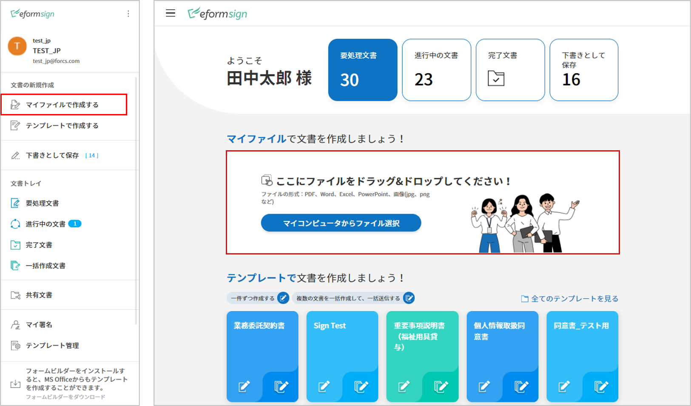
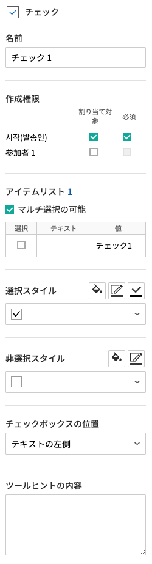
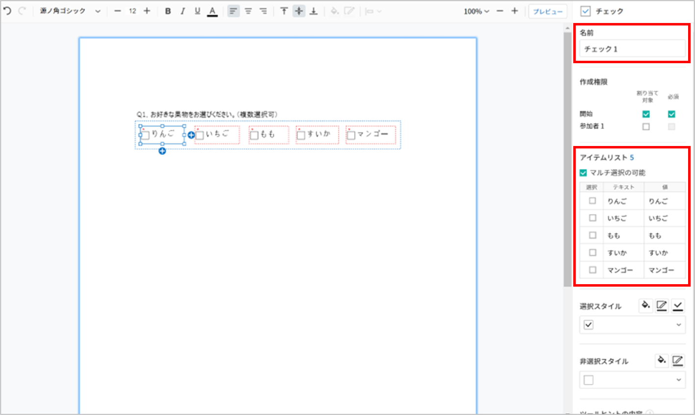
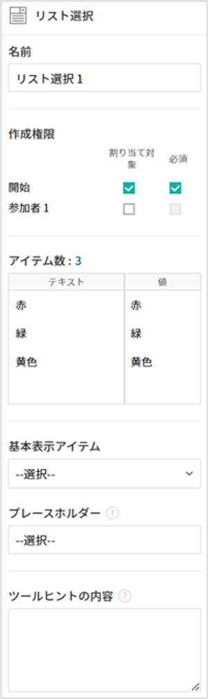
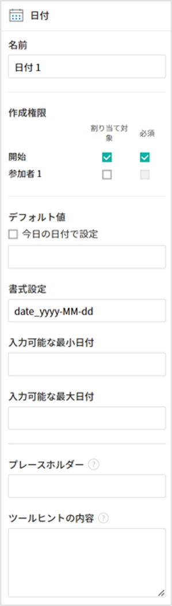
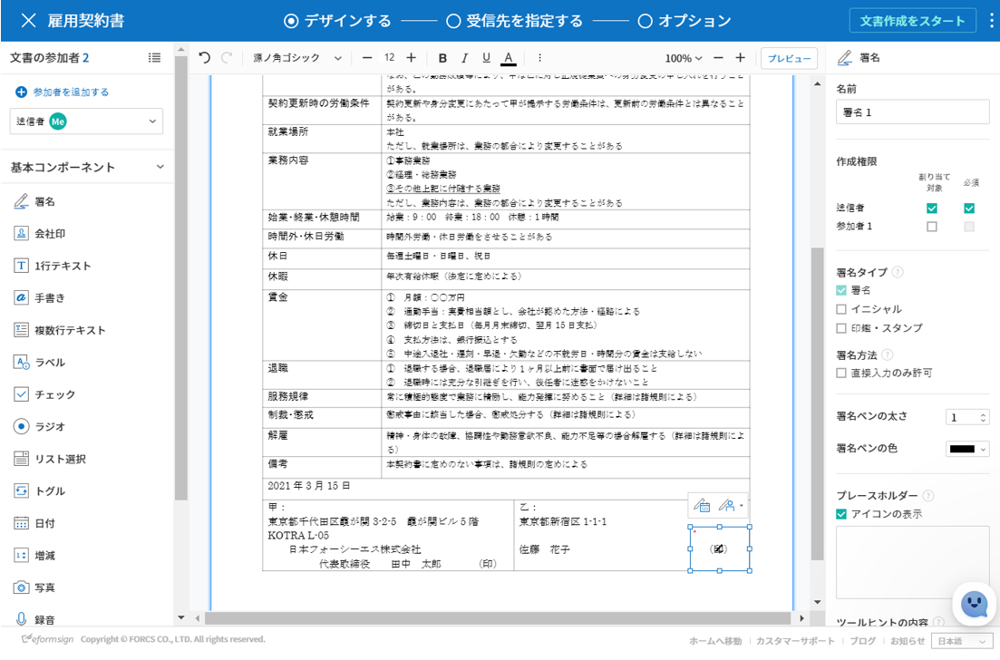

.. _webform:

Web フォームデザイナーの紹介
============================

**Web フォームデザイナー**\ は、既存の文書ファイルを eformsign サービスにアップロードし、コンポーネントを追加することで簡単に電子形式で作成できるツールです。 **マイファイルで作成する**\ または **テンプレート管理**\ メニューで文書ファイルをアップロードすると、Webフォームデザイナーが表示されます。eformsignが提供する様々なコンポーネントの中から目的のコンポーネントを選択して、文書上にドラッグアンドドロップし、各コンポーネントのプロパティを設定することで、テンプレートを簡単に作成できます。

.. note::

   アップロード可能なファイル形式はpdf, hwp, doc, docx, xls, xlsx, ppt, pptx, odt, jpg, png, gif, tiffです。 ファイルの最大サイズは9MBまでで、それより大きいサイズのファイルはアップロードができません。

.. note::

   Microsoft Office から電子文書を直接生成できる、Microsoft Office アドイン（Add-in）機能（OZ in Office フォームビルダー）も提供しております。フォームビルダーに関する情報は、`フォームビルダー <chapter5.html#formbuilder>`__\ をご参考ください。

----------------------------
ファイルのアップロード
----------------------------

**マイファイルで作成する**\ メニューからファイルをアップロード
~~~~~~~~~~~~~~~~~~~~~~~~~~~~~~~~~~~~~~~~~~~~~~~~~~~~~~~~~~~~~~~~~~~~~

1. サイドバーメニューまたはダッシュボードの **マイファイルで作成する**\ をクリックします。

2. 画面に直接ファイルをドラッグ＆ドロップするか、 **PCからファイルを選択**\ をクリックして、ローカルコンピュータからアップロードしたいファイルを選択します。

   |image2|

3. 文書作成に参加する参加者及び役割を追加、設定します。その後、文書にコンポーネントを追加するWebフォームデザイナー画面が表示されます。

   .. figure:: resources/myfile_create_document_addparticipants.png
      :alt: 参加者追加画面

   |image3|

**テンプレート管理**\ メニューからファイルをアップロード
~~~~~~~~~~~~~~~~~~~~~~~~~~~~~~~~~~~~~~~~~~~~~~~~~~~~~~~~

   1. **テンプレート管理**\ メニューに移動します。

      .. figure:: resources/web-form_1.png
         :alt: Web フォームデザイナーの画面

   2. **テンプレート管理**\ 画面に直接ファイルをドラッグ＆ドロップするか、 **PCからファイルを選択**\ をクリックして、ローカルコンピュータからアップロードしたいファイルを選択します。

      .. figure:: resources/web-form_2.png
         :alt: Web フォームデザイナーの画面

   3. 文書作成に参加する参加者及び役割を追加、設定します。その後、文書にコンポーネントを追加するWebフォームデザイナー画面が表示されます。

.. figure:: resources/web-form_3.png
   :alt: Web フォームデザイナーの画面

.. figure:: resources/web-form_5.png
   :alt: Web フォームデザイナーの画面

.. _webformdesigner_menus:

-----------------------------------------
Webフォームデザイナー画面の構成
-----------------------------------------

**Web フォームデザイナー**\  は、文書を表示する文書表示領域、上部のメニューバー、左側の参加者及びコンポーネントリスト、右側のコンポーネントプロパティと、大きく分けて4つの領域で構成されています。

.. figure:: resources/myfile_create_document4.png
   :alt: フォームデザイナーのメニューの構成：マイファイルで作成する

**1. メニューバー：** **テンプレートの設定**\ の場合、**デザインする、設定する**\ の2つのステップが表示されます。テンプレート管理のリスト画面に戻る、コンポーネントを追加したテンプレートのプレビューが可能です。 **マイファイルで作成する**\ の場合、**デザインする、受信先を指定する、オプション**\ の3つのステップが表示されます。また、デザインを完了して**文書作成をスタート**\、**下書きとして保存**\ することでWebフォームデザイナーを終了できます。

.. note::

   メニューバーに表示される各ステップをクリックすると、そのステップの画面が表示されます。**設定する**\ をクリックすると、ワークフロー、権限などを設定できます。テンプレートからの作成または、マイファイルからの作成前に設定が必要です。

**2. 文書表示領域：**\ アップロードした文書が表示されます。

**3. 参加者：**\ 文書作成に参加する参加者を選択後、参加者が入力するコンポーネントを文書にドラッグ&ドロップして追加します。参加者追加をクリックすることで参加者を追加できます。1つの文書に参加者は最大30人まで追加できます。

**4. コンポーネントリスト：**\ 1行テキスト、複数行テキスト、署名、チェック、選択等14個の基本コンポーネントと文書ID、文書番号の2つの情報コンポーネントをサポートしています。

**5. プロパティ：**\ 署名、1行テキスト、チェック等のコンポーネントをクリックし追加すると、各コンポーネントID、作成権限等、詳細なプロパティを設定できます。

.. _components:

---------------------------
コンポーネントの概要
---------------------------

コンポーネントは、ユーザーが電子文書に内容を入力するための入力欄として機能します。署名、チェック、日付、1行テキストなど多種多様なコンポーネントがあります。各コンポーネントは、プロパティタブから詳細な設定が可能です。

.. figure:: resources/component_web_1.png
   :alt: Webフォームデザイナーでコンポーネントを追加した例
   :width: 750px

コンポーネントのタイプ
~~~~~~~~~~~~~~~~~~~~~~~~~~

eformsign は下記コンポーネントをサポートしています。

**基本コンポーネント**
--------------------------

- `署名 <#signature2>`__\ **:** 署名を入力します。

- `会社印 <#company stamp2>`__\ **:** 登録されている会社印を入力します。

- `1行テキスト <#text2>`__\ **:** 1つまたは2つ程度の短い単語を入力します。

- `手書き <#handwriting2>`__\ **:** なぞり書き用のテキストを入力します。

- `複数行テキスト <#text2>`__\ **:** 複数行の長いテキストを入力します。

- `ラベル <#label2>`__\ **:** 別途設定した値を文書に表示する場合に使用します。

- `チェック <#check2>`__\ **:** チェックする項目がある場合に使用します。複数選択することもできます。

- `ラジオ <#select2>`__\ **:** 複数の項目から1つを選択します。

- `リスト選択 <#combo2>`__\ **:** クリックすると、ドロップダウンメニューが表示され、複数の項目のうち1つを選択します。

- `トグル <#toggle2>`__\ **\ :** 複数の値を入力すると、ボタンをクリックするたびに異なる値に切り替わります。

- `日付 <#date2>`__\ **:** 特定の日付を入力します。

- `増減 <#numeric2>`__\ **:** 数字を入力します。

- `写真 <#camera2>`__\ **:** カメラを搭載しているデバイス（スマートフォン、タブレットなど）であればカメラで写真を撮る、またはアルバムから写真を選択します。カメラが搭載されていないデバイス（通常のPC）では、画像ファイルを選択します。

- `録音 <#record2>`__\ **:** 録音機能を搭載しているデバイスであれば、ボタンをクリックして録音します。

- `添付 <#attach2>`__\ **:** ファイル添付機能を追加します。

**情報コンポーネント**
--------------------------

-  `文書ID <#document2>`__\ **:** 文書内に文書 ID を入力します。

-  `文書番号 <#document2>`__\ **:** 文書内に文書番号 を入力します。

各コンポーネントのプロパティ設定
~~~~~~~~~~~~~~~~~~~~~~~~~~~~~~~~~~~~~~~~~

全てのコンポーネントには、共有プロパティと固有プロパティがあります。共有プロパティと固有プロパティは、コンポーネントのプロパティ画面で確認できます。共有プロパティには名前、作成権限、プレースホルダー、ツールヒントの内容があります。詳細は以下の通りです。

- **名前：** 各コンポーネントを識別するための固有の名前です。設定ステップで必須入力または、編集制限時コンポーネントの名前で確認して保存することができます。また、CSVで入力データを抽出する際に、コンポーネント名前で区別することができます。

- **作成権限:** 参加者ごとの、コンポーネントに入力できる権限を設定します。作成権限は追加された参加者一覧を表示し、割り当て対象または必須にチェックできます。文書送信時、割り当て対象にチェックされたコンポーネントは黄色に、必須にチェックされたコンポーネントは赤色で表示されます。

   - **割り当て対象:** 割り当て対象の参加者はコンポーネントに任意で入力できるようになります。

   - **必須:** 割り当て対象の参加者のコンポーネントへの入力が必須になります。

- **プレースホルダー:** 入力欄に入力する際に表示されるメッセージです。

- **ツールヒントの内容：** 文書が受信者に表示されるWindows環境では、コンポーネントにカーソルを合わせるとツールヒントのテキストが吹き出しの形で表示されます。モバイル環境では、コンポーネントがダイアログで起動されるときにツールヒントの内容がダイアログのタイトルとして表示されます。

.. note::

   文書に関する情報を提供するための情報コンポーネントには、ツールヒントの内容プロパティがありません。

各コンポーネントの説明は次通りです。

.. _signature2:

署名
--------------------

署名コンポーネントは、文書に署名を受ける必要がある場合に使用します。

署名コンポーネントを入力すると、署名が必要な文書に次のような署名ポップアップが表示されます。署名を直接手書きで入力するか、テキストを入力することで署名を生成できます。既存の署名がある場合は、その署名を使用することもできます。

|image4|

**コンポーネントのプロパティ**

.. figure:: resources/Signature-component-properties_web.png
   :alt: 署名コンポーネントのプロパティの設定

**① 名前**

署名コンポーネントの名前を入力します。例えば、契約者の署名である場合、コンポーネントの名前は「契約者の署名」とします。

**署名** コンポーネントの **名前**\ を入力します。たとえば、契約者の署名である場合、コンポーネントの **名前**\ は「契約者の署名」にします。

**② 署名タイプ**

署名時に使用する署名の種類を選択します。

- **署名：** **マイ署名**\ に登録済みの署名がある場合、署名欄をクリック、または署名入力ボタンをクリックすることで、登録済みの署名が自動的に入力されます。

- **イニシャル：**\ **マイ署名**\ に登録済みのイニシャルがある場合、署名欄をクリック、またはイニシャル入力ボタンをクリックすることで、登録済みのイニシャルが自動的に入力されます。

- **印鑑・スタンプ：**\ **マイ署名**\ に登録済みの印鑑・スタンプがある場合、署名欄をクリック、または印鑑・スタンプ入力ボタンをクリックすることで、登録済みの印鑑・スタンプが自動的に入力されます。

.. note::

   登録済みの署名、イニシャル、印鑑・スタンプがある場合、署名は署名欄に自動的にに入力されます。登録済みの署名、イニシャル、印鑑・スタンプが無い場合、署名を直接入力可能なポップアップ画面が表示されます。
   タイプを1つだけ選択した場合、署名欄をクリックすると署名タイプが表示されます。署名タイプを2つ以上選択した場合、署名欄をクリックすると下記のような選択可能な署名のタイプボタンが表示されます。

   .. figure:: resources/select-signature-type.png
      :alt: 署名タイプ選択

.. tip::

   文書に直接署名するのではなく、職印や個人の印鑑を使用しなければならない場合もあります。eformsignでは印鑑・スタンプの画像を使用することで、文書欄に印鑑・スタンプを押すことができます。印鑑・スタンプの画像を使用するには、署名ポップアップで *印鑑・スタンプ* タブをクリックし、印鑑・スタンプの画像を選択後、 *確認*　ボタンを押します。会社実印等、会社の実印がある場合、会社の印鑑を登録しておけば会社の印鑑コンポーネントで安全かつ簡単に使用にすることができます。

**③ 署名方法**

**直接入力のみ許可**\ にチェックを入れると、タブレットPC等で署名欄に直接署名できるように設定します。署名欄をクリックすると署名ポップアップが表示されます。**手書き、キーボード、モバイル、eformsignアプリ**\ タブの中から選択し、署名を入力します。

**④ 署名ペンの太さ**

署名を手書きで入力するときに表示される線の太さを設定します。

**⑤ 署名ペンの色**

署名を手書きで入力するときに表示される線の色を設定します。

.. tip::

   **署名に対する署名日及び署名者の自動入力を設定する**

   署名コンポーネントをクリックすると表示されるアイコンをクリックすることで、署名日及び署名者を追加できます。

   .. figure:: resources/Signature-component-properties_web_icon.png
      :alt: 署名日および署名者

   **① 署名日:** 署名した日の日付が自動的に入力されます。署名日の領域をクリックすることで、右側に表示されるコンポーネントプロパティで日付の表示形式を設定できます。

   .. figure:: resources/Signature-component-properties_web_date.png
      :alt: 署名日
      :width: 700px

   **② 署名者:** 署名者の情報が自動的に入力されます。署名コンポーネントをクリックし、右側に表示されるアイコンをクリックすることで、ID、名前、部門、役職、携帯電話、固定電話のうち、署名者の情報として表示される情報を指定できます。

   .. figure:: resources/Signature-component-properties_web_signer.png
      :alt: 署名者

   .. note::

      一つの署名と紐づけられた署名日および署名者コンポーネントを複数追加することができます。契約書などの文書内で繰り返し署名日を入力したり、署名者の情報を詳しく入力するときに便利です。

.. _company stamp2:

会社印
--------------------

会社代表の印鑑、社用印、法人印等、 **会社管理 > 会社印管理**\ に登録されている会社印を利用する際に使用します。 会社印は **会社管理 > 会社印管理**\ に登録されている印鑑と使用権限を付与されたメンバーのみ使用可能で、会社印の履歴は **会社印管理**\ メニューに記録されます。

**コンポーネントのプロパティ**

   .. figure:: resources/companystamp-component-properties_web.png
      :alt: 会社印コンポーネントのプロパティの設定

**① 名前**

会社印コンポーネントの名前を入力します。例えば、法人印の場合、コンポーネントの名前を「法人印」と設定します。

.. _text2:

1行テキストと複数行テキスト
-----------------------------------------

1行テキストコンポーネントと複数行テキストコンポーネントは全て、テキスト入力欄を作成する際に使用します。1行テキストコンポーネントは1, 2個単語の短い文章、複数行テキストは1行以上長い文章を入力するのに適しています。

**コンポーネントのプロパティ**

.. figure:: resources/text-component-properties_web.png
   :alt: 1行テキストと複数行テキストのプロパティの設定

**① 名前**

**1行テキスト**\ もしくは **複数行テキスト**\ のコンポーネント項目の **名前**\ を入力します。たとえば、木村、鈴木などが入力されるコンポーネントの名前は「氏名」です。

.. note::

   名前は自動的に付与されます。コンポーネントの配置後、受信者への入力依頼の有無を決める際に、コンポーネントの名前が表示されるため、分かりやすい名前の設定を推奨します。

**② デフォルト値**

基本表示するテキストを設定します。

.. note::

   テキストのコンポーネントでのみ設定可能な、伏せ字プロパティがあります。テキスト入力時に入力した内容がアスタリスク(*)またはパスワード文字(●)で入力され、入力内容を隠すことができます。入力された内容はPDFでも伏せ字で表示されますが、CSVデータをダウンロードした場合、入力した文字が伏せ字にならずそのまま表示されます。

**③入力可能な最大文字数**

入力可能な最大文字数（空白を含む）を設定できます。1行テキストの場合は 100 文字、複数行テキストの場合は400 文字が基本設定となっています。

**④ モバイル入力時のキーパッドタイプ**

スマートフォン、タブレットのようなモバイル環境で文書を作成する際に表示する、キーパッドのタイプを設定します。

.. _handwriting2:

手書き
--------------------

手書きコンポーネントは事前に入力された文章をなぞり書きする必要がある場合に使用します。

.. figure:: resources/handwriting-component-example.png
   :alt: 手書きコンポーネント例示

**コンポーネントのプロパティ**

.. figure:: resources/handwriting-component-properties_web.png
   :alt: 手書きコンポーネントのプロパティの設定

**① 名前**

手書きコンポーネントの名前を入力します。

**② 文字の太さ**

なぞり書きする際に表示される線の太さを設定します。

**③ 文字の色**

なぞり書きする際に表示される線の色を設定します。

**④ なぞり書きテキストを表示**

背景に入力したテキストのなぞり書きが表示されるように設定します。

.. _label2:

ラベル
--------------------

**ラベル** コンポーネントは、別途設定した値を文書に表示する場合に使用します。

**コンポーネントのプロパティ**

.. figure:: resources/label_property_web.png
   :alt: ラベルコンポーネントのプロパティの設定

**① 名前**

ラベルコンポーネントの名前を設定します。

**②テキスト**

この入力欄に入力されたテキストが文書上に表示されます。

.. _check2:

チェック
--------------------

**チェックコンポーネントとラジオコンポーネントの違い**

.. tip::

   チェックコンポーネントは複数選択が可能ですが、ラジオコンポーネントは1つの項目のみ選択可能です。また、チェックコンポーネントは **マルチ選択の可能**\ の有無を設定できます。

**コンポーネントのプロパティ**

**① 名前**

チェックコンポーネントの選択項目は選択グループごとに名前を付けなければいけません。例えば、設問1に選択項目を5つ設定する場合、5つの選択項目の名前はまとめて「設問1の回答項目」と登録します。登録した名前は以下のようにグループ化して表示されます。

コンポーネントを追加する際 、(+)ボタンをクリックすることで登録された名前(アイテム)を追加できます。

**② アイテムリスト**

各コンポーネントに表示されるテキストを入力できます。テキストは文書に表示され、値はCSVファイルで入力データをダウンロードする際に表示されます。 **複数選択可能**\ のチェックを外すとアイテムリストの中から１つの項目のみ選択することができます。

**③ チェックスタイル**

**チェック** コンポーネントは、プロパティから色や図形設定が行えます。基本的なチェックボックスの他、ラジオボタン、丸く囲む円を選択できます。

次の例では、チェック/ラジオ/丸囲みを選択時、どのように表示されるか確認できます。

次の例では、左からチェック/ラジオ/丸囲みを選択すると、各チェックボックスがどのように表示されるか確認できます。

|image5|

.. tip::

   右上のアイコンをクリックすると、各スタイルの色を指定することができます。指定されている色は各アイコン下部の線の色で判断することができます。チェックボックスの場合、チェックボックスの背景色、チェックボックスの輪郭線、チェックの色を指定できます。ラジオボタンの場合、外側の円と中央の丸の色を指定できます。丸く囲む円の場合、円の色を指定できます。

   |image6|

**④ 非選択スタイル**

選択されていない項目に表示されるスタイルを指定できます。チェックボックスは四角形、ラジオボタンは円形のスタイルを指定できます。丸く囲む円の場合は、非選択項目に何も表示されません。

.. _select2:

ラジオ
--------------------

ラジオコンポーネントは、複数の項目の中から1つの項目を選択する場合に使用します。

**コンポーネントのプロパティ**

.. figure:: resources/Radio-component-properties_web.png
   :alt: ラジオコンポーネントのプロパティの設定

**① 名前**

ラジオコンポーネントの選択項目は、選択グループごとに名前を付けなければいけません。

例えば、問題1に対して1～5の選択肢がある場合、1～5の項目をまとめて「問題1」と指定します。問題2の選択肢の 1～5 に対しても同様にまとめて「問題2」と指定します。

コンポーネントを追加する際 、(+)ボタンをクリックすることで登録された名前(アイテム)を追加できます。

**② アイテムリスト**

同じ名前を付与した項目はコンポーネントのプロパティ欄のアイテムリストに表示され、アイテムリストで簡単にテキストを修正できます。**テキスト**\ は文書に表示され、**値**\ はCSVファイルで入力データをダウンロードする際に表示されます。

**③ 選択スタイル**

ラジオコンポーネントでは、プロパティから色や図形設定が行えます。黒い丸囲みの円がデフォルト設定となっており、ドロップボックスメニューからスタイルの変更が可能です。

.. tip::

   右上のアイコンをクリックすると、各スタイルの色を指定することができます。指定されている色は各アイコン下部の線の色で判断することができます。外側の円と中央の丸の色を指定できます。

   |image7|

**④ 非選択スタイル**

選択されていないコンポーネントに表示されるスタイルを指定できます。

.. _combo2:

リスト選択
--------------------

リスト選択コンポーネントは、複数の項目の中から1つの項目を選択する場合に使用します。

次のような選択欄をクリックすると、選択項目のリストが表示されます。

|image8|

**コンポーネントのプロパティ**

**① 名前**

リスト選択コンポーネントの名前を入力します。例えば、お気に入りの色を選択するコンポーネントの名前は「お気に入りの色」とします。

**② アイテム数**

選択肢の項目を入力します。Enterキーを押すことで、複数項目を作成できます。
**テキスト**\ は文書に表示され、**値**\ はCSVファイルで入力データをダウンロードする際に表示されます。

**③ 基本表示アイテム**

基本表示するアイテムを設定します。

**④ プレースホルダー**

何も入力されていない場合にコンポーネントに表示されるテキストを設定できます。

.. note::

   **リスト選択**\ コンポーネントの最上部に「選択してください」を表示するには、 **プレースホルダー**\ に「選択してください」を入力し、 **基本表示アイテム**\ を「選択してください」に設定します。

.. _toggle2:

トグル
--------------------

ON や OFF など、特定の状態を示すために使用します。トグルコンポーネントを使用すれば、コンポーネントをクリックするたびに、予め設定しておいた項目順に入力値が切り替わります。

次のようにコンポーネントをクリックすることで、「良好」または「不良」に変更できます。

|image9|

**コンポーネントのプロパティ**

.. figure:: resources/toggle-component-properties_web.png
   :alt: トグルコンポーネントのプロパティの設定

**① 名前**

トグルコンポーネントの名前を入力します。例えば、最初の点検項目に対するコンポーネントであれば、「点検項目 1」にします。

**② アイテム数**

トグルコンポーネントをクリックするたびに、切り替わる項目のリストを入力します。Enterキーを押すことで、複数項目を作成できます。
テキスト\ は文書に表示され、*値*\はCSVファイルで入力データをダウンロードする際に表示されます。

**③ 基本表示アイテム**

基本表示するアイテムを設定します。

.. _date2:

日付
--------------------

日付を入力する場合に使用します。入力欄をクリックすると、日付ピッカーが表示され、目的の日付を選択できます。

**コンポーネントのプロパティ**

**① 名前**

日付コンポーネントの名前を入力します。例えば、休暇の開始日を選択するコンポーネントの名前は「休暇の開始日」 とします。

**② デフォルト値**

基本表示する日付を設定します。**今日の日付で設定**\ にチェックを入れると、文書を開いた際に自動的に今日の日付が入力されます。

**③ 書式設定**

日付を表示する書式を指定します。デフォルト設定は、date_yyyy-MM-dd です。

- **yyyy：** 年度を表示します。

- **MM：** 月を表示します。大文字で表記する必要があります。(MM月＝8月)

- **dd：** 日を表示します。

「2020年 2月 5日」と表示するには、書式設定に「yyyy年 MM月 dd日」と入力します。

**④ 入力可能な最小/最大日付**

日付の選択時に選択可能な最小日付と最大日付を指定して、入力可能な日付の範囲を設定します。

.. _numeric2:

増減
--------------------

数字を入力する場合に使用します。入力欄をクリックすると、2つの矢印が表示されます。
上向き、もしくは下向きの矢印ボタンをクリックすることで、数字を増減できます。PCのキーボード環境では、入力欄に任意の数字を直接入力できます。スマートフォンやタブレット環境では、入力範囲の数字リストをスクロールして目的の数字を選択できます。

**コンポーネントのプロパティ**

.. figure:: resources/number-component-properties_web.png
   :alt: 数字コンポーネントのプロパティの設定

**① 名前**

数字コンポーネントの名前を入力します。例えば、予約人員の数を入力するコンポーネントの名前は、「予約人数」にします。

**② デフォルト値**

基本表示する数字を設定できます。

**③ 変化の増分**

入力欄の増加/減少のアイコンをクリックするたびに、現在入力されている値から増減する値を入力します。例えば、増減の単位を100に設定して文書を作成した場合、入力欄の右側にある上向き矢印（▲）をクリックすると、入力値から 200、300、... と増加します。

**④ 入力可能な最小値/最大値**

入力可能な最小値と最大値を指定して、入力可能な数字の範囲を設定します。例えば、生年月日の場合は、通常、最小値を1900、最大値を現在の年度、増分の単位を1で指定します。最小値または最大値が指定されている状態で範囲外の数字を入力すると、最小値または最大値が自動的に入力されます。最大値が100の場合、入力欄に101と入力すると、自動的に最大値である100に変更されます。

.. _camera2:

写真
--------------------

スマートフォンやタブレットなどのカメラを搭載したデバイスで写真を撮り、文書にアップロードするときに使用します。カメラのないPC環境では、コンポーネントをクリックすることで表示されるウィンドウから、アップロードする画像ファイルを選択できます。
選択した画像のサイズが入力欄のサイズより大きい場合、入力欄内に入るサイズに縮小してアップロードされます。

.. note::

   写真コンポーネントの場合、カメラを利用できる環境ではカメラ機能が実行され、カメラの利用できない環境では画像ファイルの選択ウィンドウが開かれます。

   |image10|

**コンポーネントのプロパティ**

.. figure:: resources/Camera-component-properties_web.png
   :alt: 写真コンポーネントのプロパティの設定

**① 名前**

写真コンポーネントの名前を入力します。例えば、免許証の写真を撮影するコンポーネントの名前は「免許証の写真」です。

.. tip::

   **写真アイコンの表示**\ にチェックを入れると、写真領域にアイコンが表示されます。

   |image11|

.. _record2:

録音
--------------------

ユーザーの録音データを文書に保存する必要がある場合に使用します。録音コンポーネントを追加すると、ビューアーから録音されたコンテンツを再生したり、新しく録音を行ったりすることができます。

|image12|

.. note::

   録音機能はeformsignアプリ以外では動作しません。

**コンポーネントのプロパティ**

.. figure:: resources/record_component_web.png
   :alt: 録音コンポーネントのプロパティの設定

**① 名前**

録音コンポーネントの名前を入力します。例えば、音声による同意を録音するコンポーネントの名前は「音声による同意」とします。

.. tip::

   **アイコンの表示**\ にチェックを入れると、録音領域にマイクアイコンが表示されます。

   |image13|

.. _attach2:

添付
--------------------

文書に別途添付が必要な文書がある場合に使用します。添付コンポーネントを使用して文書を添付した場合、添付した文書は本来の文書の最後に新しいページとして追加されます。

添付可能なファイルのタイプとサイズは次のとおりです。

-  ファイルタイプ：PDF、JPG、PNG、GIF

-  ファイルサイズ：最大 5 MB まで

**コンポーネントのプロパティ**

.. figure:: resources/Attachment-component-properties_web.png
   :alt: 添付コンポーネントのプロパティの設定

**① 名前**

添付コンポーネントの名前を入力します。例えば、在職証明書を添付するコンポーネントの名前は「在職証明書」とします。

.. tip::

   **アイコンの表示**\ にチェックを入れると、添付領域にクリップアイコンが表示されます。

   |image14|

.. _document2:

文書ID/文書番号
--------------------

情報コンポーネントは、文書内に文書関連の情報を入力する際に使用します。また、文書ID、文書番号が表示されるよう設定できます。

- **文書 ID：**\ システムがすべての文書に付与する、文書固有のIDです。32桁の英数字の組み合わせで表示されます。 例）0077af27a98846c8872f5333920679b7

- **文書番号：**\ **テンプレートの設定 > 全般**\ で設定された文書番号です。文書番号の設定方法は、 `文書番号の自動生成 <chapter6.html#docnumber_wd>`__\ をご参照ください。

   .. note::

      文書IDはシステムで付与される文書の固有IDのため、別途設定する必要はありません。文書番号設定はテンプレートをアップロード後、 **テンプレートの設定 > 全般**\ で行えます。

**コンポーネントのプロパティ**

.. figure:: resources/document-domponent-properties_web.png
   :alt: 文書コンポーネントのプロパティの設定

--------------------------------
テンプレートを追加設定する
--------------------------------

文書にコンポーネントを追加することで、テンプレートのタイトル、文書番号、ワークフローなど、テンプレートから生成された文書の詳細設定を行うことができます。

**デザインする**\ の画面で、 **設定する**\ ボタンをクリックすることで、設定画面に移動します。設定画面では、次の5つの設定を行うことで、テンプレートの設定ができます。

- **全般：**\ テンプレート名、略称、文書のタイトル、文書番号などを設定します。

- **権限の設定：**\ テンプレートを使って文書を作成するメンバーまたはグループ、作成した文書を管理するメンバーまたはグループを指定します。

- **ワークフローの設定：**\ 文書の作成から完了までのステップを設定します。

- **フィールドの設定：**\ フィールドの表示有無、順番、基本値、自動入力値などのデフォルト値を設定します。

- **通知の設定：**\ 作成する文書に対するステータス通知の受信者の設定と、最終完了通知メッセージを編集します。

.. figure:: resources/component_web_2.png
   :alt: テンプレートの 5つの設定項目
   :width: 750px

.. important::

   テンプレートから作成した文書を使用して文書を作成するには、テンプレートの保存後に **配布**\ する必要があります。
   テンプレートを配布せず、保存のみした場合、テンプレート使用権限があるメンバーの **テンプレートで作成する**\ 画面に表示されません。

.. note::

   テンプレートの詳細な説明については、`Web フォームデザイナー <chapter6.html#template_wd>`__\ をご参照ください。

.. |image2| image:: resources/myfile_create_document2.png
   :width: 500px

.. |image4| image:: resources/signature.png
.. |image5| image:: resources/check-component-style-settings.png
.. |image6| image:: resources/check-component-properties-web-style.png
.. |image7| image:: resources/Radio-component-properties_web-style.png
.. |image8| image:: resources/combo-1.png
.. |image9| image:: resources/toggle.png
.. |image10| image:: resources/camera1.png
.. |image11| image:: resources/Camera-component-properties_web_icon.png
.. |image12| image:: resources/record1.png
   :width: 400px
.. |image13| image:: resources/record_component_web_icon.png
.. |image14| image:: resources/Attachment-component-properties_web_icon.png