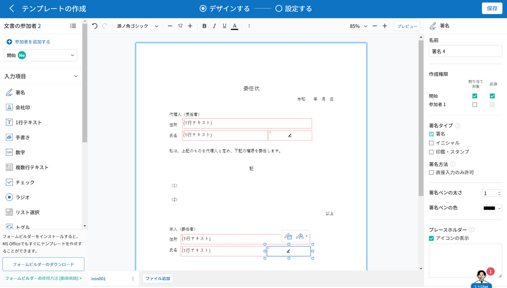
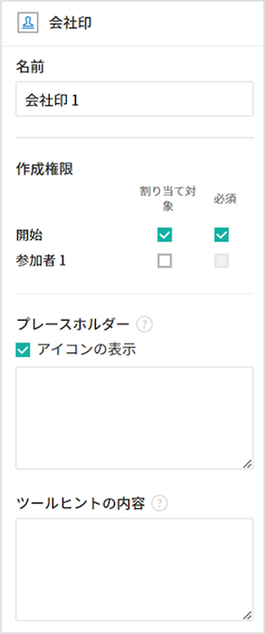
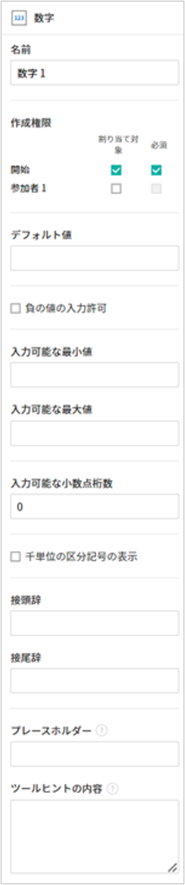
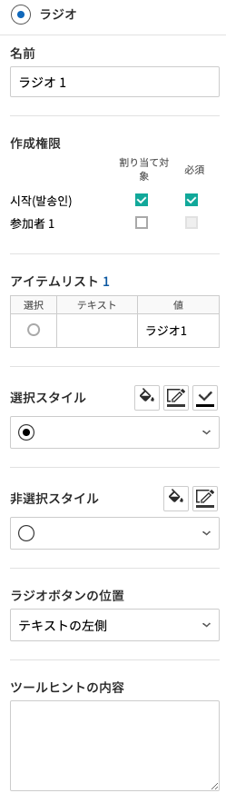
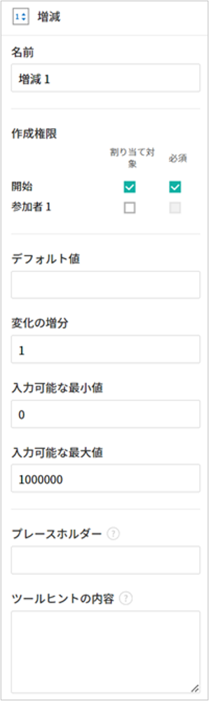

.. _webform:

============================
Webフォームデザイナーの紹介
============================

**Webフォームデザイナー**\ は、既存の文書ファイルをeformsignサービスにアップロードし、電子文書化できるエディターです。

**マイファイルで作成する** または **テンプレート管理** メニューから文書ファイルをアップロードするとWebフォームデザイナーが起動します。eformsignで用意している様々な入力項目から任意の入力項目を選択して、文書上にドラッグアンドドロップし、各入力項目のプロパティを設定することで、電子フォームを簡単に作成できます。

.. note::

   アップロード可能なファイル形式はpdf、hwp、doc、docx、xls、xlsx、ppt、pptx、odt、jpg、png、gif、tiffです。
   アップロード可能なファイルの最大サイズ（合計）は9MBです。

.. note::

   Microsoft Officeから電子文書を作成できる、Microsoft Officeアドイン機能（OZ in Office フォームビルダー）も提供しております。フォームビルダーに関する情報は、`フォームビルダー <chapter5.html#formbuilder>`__\ をご参照ください。

-------------------------
ファイルのアップロード
-------------------------

**マイファイルで作成する** メニューからファイルをアップロード
~~~~~~~~~~~~~~~~~~~~~~~~~~~~~~~~~~~~~~~~~~~~~~~~~~~~~~~~~~~~~~~~

1. サイドバーメニューまたはダッシュボードの **マイファイルで作成する** をクリックします。

   .. figure:: resources/myfile_create_document.png
      :alt: マイファイルで作成するメニュー
      :width: 700px

2. 画面上にファイルをドラッグ＆ドロップするか、 **PCからファイルを選択**\ をクリックして、コンピュータ内からアップロードしたいファイルを選択します。

   |image2|

3. 文書作成に参加する参加者とその役割を追加・設定します。設定後、文書に入力項目を追加するWebフォームデザイナー画面が表示されます。

   .. figure:: resources/myfile_create_document_addparticipants.png
      :alt: 参加者追加画面

.. tip::

   ファイルを追加・変更する場合、画面下側の **ファイル追加** またはファイル名の横の三点メニュー(⋮)から **ファイル変更**\ をクリックします。

   ❗ファイルの数に関わらず、全ファイルの合計サイズで数えて9MBまで追加できます。

   .. figure:: resources/add-file.png
      :alt: ファイル追加/変更

   .. figure:: resources/add-file-menu.png
      :alt: ファイル追加三点メニュー
      :width: 400px

**テンプレート管理** メニューからファイルをアップロード
~~~~~~~~~~~~~~~~~~~~~~~~~~~~~~~~~~~~~~~~~~~~~~~~~~~~~~~~~

.. note::

   テンプレート管理メニューからテンプレート作成する場合代表管理者、またはテンプレート管理者権限が必要です。  

1. **テンプレート管理** メニューに移動します。

   .. figure:: resources/web-form_1.png
      :alt: Webフォームデザイナーの画面

2. テンプレート管理画面でファイルをドラッグ＆ドロップするか、 **PCからファイルを選択**\ をクリックして、コンピュータ内からアップロードするファイルを選択します。

   .. figure:: resources/web-form_2.png
      :alt: Webフォームデザイナーの画面

3. 文書作成に参加する参加者と役割を追加・設定します。設定後、文書に入力項目を追加するWebフォームデザイナー画面が表示されます。

   .. figure:: resources/web-form_3.png
      :alt: Webフォームデザイナーの画面

.. tip::

   ファイルを追加・変更する場合、画面下側の **ファイル追加** またはファイル横の三点メニュー(⋮)から **ファイル変更**\ をクリックします。

   ❗ファイルの個数に関わらず、全体のサイズで見て9MBまで追加できます。 

   .. figure:: resources/template_addfile.png
      :alt: ファイル追加/変更

   .. figure:: resources/add-file-menu.png
      :alt: ファイル追加三点メニュー
      :width: 400px

.. _webformdesigner_menus:

----------------------------------
Webフォームデザイナー画面の構成
----------------------------------

Webフォームデザイナーは、文書を表示する文書表示領域、上部のメニューバー、左側の参加者・入力項目リスト、右側の入力項目プロパティと、大きく分けて4つの領域で構成されています。

.. figure:: resources/myfile_create_document4.png
   :alt: フォームデザイナーのメニューの構成：マイファイルで作成する

**① メニューバー：** 文書のタイトルと現在のステップを確認することができます。また、次のステップに進むためのボタンと三点メニューが表示されます。

**テンプレートの設定**\ の場合、**デザインする、設定する**\ の2つのステップが表示されます。テンプレート管理リストの画面に戻ったり、入力項目を追加したテンプレートのプレビューができます。 **マイファイルで作成する**\ の場合、**デザインする、受信先を指定する、オプション**\ の3つのステップが表示されます。また、デザインを完了して **文書作成をスタート**\ したり、**下書きとして保存**\ して文書を下書き保存後することで、Webフォームデザイナーを終了できます。

**マイファイルで文書作成**\ の場合、 **デザインする、受信先を指定する、オプション**\ の3段階が表示され、フォームデザインを完了して文書作成を開始するか、下書きとして保存することができます。

.. note::

   メニューバーに表示される各ステップをクリックすると、そのステップの画面の設定画面に移動します。 **設定する**\ をクリックすると、ワークフロー、権限などを設定できます。テンプレートで作成、またはマイファイルで作成を完了する前に一緒に設定してください。

**② 文書表示領域：** アップロードした文書が表示されます。

**③ 文書の参加者：** 文書作成に参加する参加者を選択後、参加者が入力する入力項目を文書にドラッグ&ドロップして追加します。参加者追加をクリックすることで参加者を追加できます。1つの文書に参加者を最大30人まで追加できます。

**④ 入力項目：** 1行テキスト、複数行テキスト、署名、チェック、選択などの16個の入力項目と、文書ID、文書番号の2つの文書情報があります。

**⑤ プロパティ：** 署名、1行テキスト、チェック等の入力項目をクリックし追加すると、各入力項目の名前、作成権限など、詳細なプロパティを設定できます。

**⑥ ファイルタブ：** ファイル名が表示され、ファイルを追加することができるファイル追加ボタン、各ファイルの三点メニューからファイル名変更・順序変更・ファイルの削除を行うことができます。

.. _components:

---------------------------
入力項目の概要
---------------------------

**入力項目**\ は、ユーザーが電子文書に内容を入力するための入力欄として機能します。署名、チェック、日付、1行テキストなど、様々な入力項目があります。各入力項目は、プロパティタブから詳細な設定が可能です。

入力項目の種類
~~~~~~~~~~~~~~~~~~~~~~~~~~

eformsignでは、下記の入力項目を使用できます。

**入力項目**
--------------------------

- `署名 <#signature2>`__\ **:** 署名を入力します。

- `会社印 <#company stamp2>`__\ **:** 登録されている会社印を入力します。

- `1行テキスト <#text2>`__\ **:** 1、2個程度の短いテキストを入力します。

- `手書き <#handwriting2>`__\ **:** なぞり書き用のテキストを入力します。

- `数字 <#number2>`__\ **:** 数字を入力します。 

- `複数行テキスト <#text2>`__\ **:** 複数行の長いテキストを入力します。

- `チェック <#check2>`__\ **:** チェックする項目がある場合に使用します。複数選択することもできます。

- `ラジオ <#select2>`__\ **:** 複数の項目から1つを選択します。

- `リスト選択 <#combo2>`__\ **:** クリックすると、ドロップダウンメニューが表示され、複数の項目から1つを選択します。

- `トグル <#toggle2>`__\ **\ :** 2個以上の値を入力すると、ボタンをクリックするたびに値が切り替わります。

- `日付 <#date2>`__\ **:** 特定の日付を入力します。

- `増減 <#numeric2>`__\ **:** 増加・減少ボタンを使って数字を入力します。

- `ハイパーリンク <#hyperlink2>`__\ **:** 文書のハイパーリンクを追加します。

- `ラベル <#label2>`__\ **:** 事前に設定した値を文書に表示する場合に使用します。

- `写真 <#camera2>`__\ **:** カメラを搭載しているデバイス（スマートフォン、タブレットなど）であればカメラで写真を撮るか、アルバムから写真を選択します。カメラが搭載されていないデバイス（PCなど）では、画像ファイルを選択します。

- `録音 <#record2>`__\ **:** 録音機能を搭載しているデバイスの場合に、ボタンをクリックして録音します。

- `添付 <#attach2>`__\ **:** ファイル添付機能を追加します。

**文書情報**
--------------------------

-  `文書ID <#document2>`__\ **:** 文書内に文書IDを入力します。

-  `文書番号 <#document2>`__\ **:** 文書内に文書番号を入力します。

各入力項目のプロパティ設定
~~~~~~~~~~~~~~~~~~~~~~~~~~~~~~~~~

全ての入力項目には、共有プロパティと固有プロパティがあります。共有プロパティと各入力項目の固有プロパティは、プロパティ画面で確認できます。共有プロパティには名前、作成権限、プレースホルダー、ツールヒントがあります。詳細は以下の通りです。

- **名前：** 各入力項目を識別するための固有の名称です。設定ステップで必須入力、または編集制限時には入力項目の名前で確認して保存することができます。また、CSVで入力データを抽出する際に、入力項目の名前で識別することができます。

- **作成権限:** 参加者ごとの、入力項目に入力できる権限を設定します。作成権限では、追加した参加者の一覧を表示し、割り当て対象・必須の設定をすることができます。文書送信時、割り当て対象に設定された入力項目は黄色に、必須に設定された入力項目は赤色で表示されます。

   - **割り当て対象:** 指定された参加者は、その入力項目に入力できます。
   - **必須:** 指定された参加者は、その入力項目への入力が必須になります。(入力後、送信できるようになります)

- **プレースホルダー:** 入力欄に入力する前に、案内文として表示されるメッセージです。

- **ツールヒントの内容：** 受信者の文書閲覧時、Windows環境では入力項目にカーソルを合わせるとツールヒントのテキストが吹き出し形式で表示されます。モバイル環境では、ツールヒントはキーパッド上部・中央に表示されます。

.. note::

   文書に関する情報を提供するための文書情報には、ツールヒントの内容プロパティがありません。

------------------------------------------------------------

各入力項目の説明は次のとおりです。

.. _signature2:

署名
--------------------

署名入力項目は、文書に署名をしてもらう必要がある場合に使用します。

署名入力項目を配置すると、署名が必要な文書に次のような **署名** ポップアップが表示されます。署名を手書きで入力するか、テキストを入力すると署名を作成できます。登録済みの署名がある場合は、その署名を使用することもできます。

|image4|

**入力項目のプロパティ**

.. figure:: resources/Signature-component-properties_web.png
   :alt: 署名入力項目のプロパティの設定

**① 名前**

署名入力項目の名前を入力します。
例）契約者が署名する場合、入力項目の名前は「契約者の署名」にします。

**② 署名タイプ**

署名時に使用する署名の種類を選択します。

- **署名：** 文書作成しているユーザーが事前に登録した **マイ署名**\ がある場合、署名欄をクリック、または署名入力ボタンをクリックすることで、登録済みの署名が自動的に入力されます。

- **イニシャル：** **マイ署名**\ に登録済みのイニシャルがある場合、署名欄をクリック、またはイニシャル入力ボタンをクリックすることで、登録済みのイニシャルが自動的に入力されます。

- **スタンプ：** **マイ署名**\ に登録済みのスタンプがある場合、署名欄をクリック、またはスタンプ入力ボタンをクリックすることで、登録済みのスタンプが自動的に入力されます。

.. note::

   登録済みの署名、イニシャル、スタンプがある場合、署名は署名欄に自動的にに入力されます。署名、イニシャル、スタンプが登録されていない場合、署名を入力可能なポップアップ画面が表示されます。

   署名タイプを1つだけ選択した場合、署名欄をクリックすると署名タイプが表示されます。署名タイプを2つ以上選択して署名欄をクリックすると、以下のような選択可能な署名タイプボタンが表示されます。

   .. figure:: resources/select-signature-type.png
      :alt: 署名タイプ選択

.. tip::

   署名ではなく、職印や個人の印鑑の使用が必要となる場合があります。eformsignではスタンプの画像を使用して、文書欄にスタンプを押すことができます。スタンプの画像を使用するには、署名ポップアップで **スタンプ** タブをクリックし、スタンプの画像を選択後、 **確認**　ボタンを押します。会社印・法人印などの場合、会社印鑑として登録しておくと、会社印入力項目から安全かつ簡単に使用にすることができます。

   会社法人印鑑など会社印鑑がある場合、 **会社印鑑**\ として登録しておけば、「会社印鑑」入力項目として使用権限のあるメンバーのみ安全かつ手軽に使用できます。

**③ 署名方法**

**直接入力のみ許可**\ にチェックを入れると、タブレットPCなどで署名欄に署名できるようになります。署名欄をクリックすると署名ポップアップが表示され、 **手書き、キーボード、モバイル、eformsignアプリ** タブの中から選択し、署名を入力します。

**④ 署名ペンの太さ**

署名を手書きで入力する際に表示される線の太さを設定します。

**⑤ 署名ペンの色**

署名を手書きで入力するときに表示される線の色を設定します。

.. tip::

   **署名に対する署名日と署名者の自動入力を設定する**

   署名入力項目をクリックすると表示されるアイコンをクリックすることで、署名日と署名者を追加できます。

   .. figure:: resources/Signature-component-properties_web_icon.png
      :alt: 署名日と署名者

   **① 署名日:** 署名すると、署名日の日付が自動的に入力されます。署名日の領域をクリックすることで、右側に表示される入力項目プロパティで日付の表示形式を設定できます。

   .. figure:: resources/Signature-component-properties_web_date.png
      :alt: 署名日
      :width: 700px

   **② 署名者:** 署名者の情報が自動的に入力されます。署名入力項目をクリックすると表示される人型アイコンをクリックすることで、ID、名前、部門、役職、携帯電話、固定電話のうち、署名者の情報として表示される情報を指定できます。

   .. figure:: resources/Signature-component-properties_web_signer.png
      :alt: 署名者

   .. note::

      一つの署名に対し、署名日・署名者入力項目を複数追加することができます。契約書などの文書内で繰り返し署名日を入力したり、署名者の情報を詳しく入力する際に便利です。

----------------------------------------------------------

.. _company stamp2:

会社印
--------------------

会社代表の印鑑、社印、法人印など、 **会社管理 > 会社印管理**\ に登録されている会社印を利用する際に使用します。

会社印は **会社管理 > 会社印管理**\ に登録されている印鑑と使用権限を付与されたメンバーのみ使用可能で、会社印の履歴は **会社印管理**\ メニューに記録されます。

**入力項目のプロパティ**

**① 名前**

会社印入力項目の名前を入力します。
例）法人印の場合、入力項目の名前を「法人印」と設定します。

----------------------------------------------------------

.. _text2:

1行テキストと複数行テキスト
---------------------------------

1行テキスト入力項目と複数行テキスト入力項目は全て、テキスト入力欄を作成する際に使用します。1行テキスト入力項目は1, 2単語程度の短い文章、複数行テキストは2行以上の長い文章を入力するのに適しています。

**入力項目のプロパティ**

.. figure:: resources/text-component-properties_web.png
   :alt: 1行テキストと複数行テキストのプロパティ設定

**① 名前**

1行テキスト/複数行テキストの入力項目の名前を入力します。
例）木村、鈴木などが入力される入力項目の名前は「氏名」です。

.. note::

   名前は自動的に付与されますが、入力項目の配置後の各入力項目に対する各受信者の入力有無を決める際に、入力項目の名前が表示されるため、分かりやすい名前の設定を推奨します。

**② デフォルト値**

初期表示するテキストを設定します。

**③ テキストタイプ**

テキストの種類をテキスト、パスワードから選択します。 

- **プレーンテキスト:** 一般的なテキストを入力する際に使用します。
- **パスワード:** 入力した内容が表示されないよう設定します。テキストを入力すると、入力した値がアスタリスク(*)またはパスワード文字 (●)で入力され、入力内容を隠すことができます。入力された内容はPDFでも伏せ字で表示されますが、CSVデータをダウンロードした場合のみ、入力した文字が隠されず表示されます。
- **ユーザー指定:** 入力項目に入力されるテキストのタイプを選択します。

**④ 入力ルール設定**

電話番号、生年月日、マイナンバーなど、基本入力ルールタイプの中から選択するか、直接入力を選択してルールを作成することができます。

   .. figure:: resources/text-component-rule-option.png
      :alt: 入力ルール設定
      :width: 300px

   .. tip:: 

      入力ルール設定で **直接入力**\ を選択すると、数字、アルファベットなど、入力する文字の種類と文字数などのルールを設定することができます。
      例）パスポートの旅券番号を入力するには、旅券番号のタイプに応じてルールを次のように設定できます。

      旅券番号は「アルファベット2桁+数字7桁」の組み合わせで構成されているため、アルファベット大文字で始められるように「>LL」、数字のみ入力できる「0」、を使用して **>LL0000000**\ とルールを設定します。

      .. figure:: resources/text-component-rule.png
         :alt: 入力ルール設定 - 直接入力
         :width: 300px

     

**⑤ テキストの調整**

- **横幅に合わせて文字数制限:** 入力項目のサイズに合わせて文字数を自動的に制限します。短いテキストは項目サイズを小さく、長いテキストを入力する必要がある場合は項目サイズを大きく設定してください。
- **文字の大きさを自動調整:** 入力項目のサイズに合わせて文字サイズを自動的に調整します。（文字サイズの縮小）
- **入力可能な文字数を指定:** 入力項目に入力できる最大文字数を設定します。オプションを選択すると、デフォルトで最大文字数が設定されます。1行テキストは「1000文字」、複数行テキストは「8000文字」まで入力できます。

**⑥ キーパッドタイプ(モバイルにのみ適用)**

スマートフォン、タブレットのようなモバイル環境で文書を作成する際に表示する、キーパッドのタイプを設定します。

----------------------------------------------------------

.. _handwriting2:

手書き
--------------------

手書き入力項目は、事前に入力された文章をなぞり書きする必要がある場合に使用します。
文書の背景に表示されるテキストを設定することができ、文書の受信者は表示されたテキストをなぞり書きすることで入力します。

.. figure:: resources/handwriting-component-example.png
   :alt: 手書き入力項目の例

**入力項目のプロパティ**

.. figure:: resources/handwriting-component-properties_web.png
   :alt: 手書き入力項目のプロパティの設定

**① 名前**

手書き入力項目の名前を入力します。

**② 文字の太さ**

なぞり書きする際に表示される線の太さを設定します。

**③ 文字の色**

なぞり書きする際に表示される線の色を設定します。

**④ なぞり書きテキストを表示**

背景になぞり書き用テキストが表示されるように設定します。

----------------------------------------------------------

.. _number2:

数字
--------------------

数字入力項目は、金額などの数字を入力する際に使用します。

**入力項目のプロパティ**

**① 名前**

数字入力項目の名前を入力します。
例） 決済金額を入力する入力項目名は「決済金額」と設定します。

**② デフォルト値**

初期表示するテキストを設定します。

**③ 負の値の入力許可**

このオプションにチェックを入れると、負の値も入力できるようになります。

**④ 入力可能な最小値/最大値**

入力可能な最小値と最大値を設定します。

.. note:: 

   最小値を設定すると、入力した値が最小値よりも小さい場合は最小値が入力されます。
   最大値を設定すると、入力した値が最大値よりも大きい場合は最大値が入力されます。

**⑤ 入力可能な小数点桁数**

入力可能な小数点の桁数を設定します。小数点の桁数は0～10まで入力することができます。

**⑥ 千単位の区分記号の表示**

オプションにチェックを入れると、入力した値に自動的に千単位区切りのカンマ(,)が表示されます。

**⑦ 接頭辞/接尾辞**

数字に必要な接頭辞/接尾辞が自動的に入力されるよう設定します。
例） 「計10,000円」と入力する場合、接頭辞に「計」、接尾辞に「円」を設定します。

----------------------------------------------------------

.. _check2:

チェック
--------------------

チェック入力項目は複数の選択項目の中から、複数の項目を選択する場合に使用します。

.. tip::

   **チェック入力項目とラジオ入力項目の違い**

   チェック入力項目では **マルチ選択の可能**\ を設定できます。これにより、チェック入力項目では複数項目の選択ができますが、ラジオ入力項目では複数項目の選択ができません。

**入力項目のプロパティ**

.. figure:: resources/check-component-properties-1_web.png
   :alt: チェック入力項目のプロパティの設定

**① 名前**

チェック入力項目の選択項目は選択グループごとに名前を付ける必要があります。
例）設問1に5つの選択項目を設定する場合、5つの選択項目の名前を全て「設問1の回答項目」と登録します。登録した名前は以下のようにグループ化して表示されます。

.. tip::

   入力項目を追加する際(+)ボタンをクリックすることで、登録された名前で項目(アイテム)を追加できます。

   .. figure:: resources/check-component-properties-2_web.png
      :alt: チェック入力項目のプロパティの設定2

**② アイテムリスト**

各入力項目に表示されるテキストを入力できます。テキストは文書に表示される文字列で、値はCSVファイルで入力データをダウンロードする際に表示されます。 **マルチ選択の可能**\ のチェックを外すとアイテムリストの中から１つの項目のみ選択することができます。

**③ 選択スタイル**

プロパティから色や図形設定を行うことができます。チェックを選択した初期状態ではチェックボックスが設定されおり、これ意外にもラジオボタン、丸囲みを選択できます。

次の例では、左からチェック/ラジオ/丸囲みを選択した場合に、各チェックボックスがどのように表示されるか確認できます。

|image5|

.. tip::

   右上のアイコンをクリックすると、各スタイルの色を指定することができます。
   指定されている色は各アイコンの下線の色で判断することができます。

   例）チェックボックスの場合、チェックボックスの背景色、チェックボックスの輪郭線、チェックの色を指定できます。
   ラジオボタンの場合、外側の円と中央の丸の色を指定できます。丸囲みの場合、円の色を指定できます。

   |image6|

**④ 非選択スタイル**

選択されていない項目に適用するスタイルを指定できます。チェックボックスは四角形、ラジオボタンは円形のスタイルを指定できます。丸囲みの場合は、非選択項目に何も表示されません。

**⑤ チェックボックスの位置**

チェックボックスの位置を指定します。

- テキストの左側: チェックボックスの位置をテキストの左側に設定します。
- テキストの右側: チェックボックスの位置をテキストの右側に設定します。

----------------------------------------------------------

.. _select2:

ラジオ
--------------------

ラジオ入力項目は、複数項目の中から1つの項目を選択する場合に使用します。

**入力項目のプロパティ**

**① 名前**

ラジオ入力項目の選択項目は、選択グループごとに名前を付ける必要があります。

例）問題1に対して1～5の選択肢がある場合、1～5の項目をまとめて「問題1」と指定します。問題2の選択肢の1～5に対しても同様にまとめて「問題2」と指定します。

入力項目を追加する際 (+)ボタンをクリックすることで、登録された名前で項目(アイテム)を追加できます。

**② アイテムリスト**

同じ名前を付与した項目は入力項目のプロパティ欄のアイテムリストに表示され、アイテムリストから簡単にテキストを修正できます。**テキスト**\ は文書に表示される文字列で、**値**\ はCSVファイルで入力データをダウンロードする際に表示されます。

**③ 選択スタイル**

ラジオ入力項目では、プロパティから色や図形設定が行えます。黒い円で囲われた丸がデフォルト設定となっており、ドロップボックスメニューからスタイルを変更できます。

.. tip::

   右上のアイコンをクリックすると、各スタイルの色を指定することができます。指定されている色は各アイコンの下線の色で判断することができます。外側の円と中央の丸の色を指定できます。

   |image7|

**④ 非選択スタイル**

選択されていない入力項目に表示されるスタイルを指定します。

**⑤ ラジオボタンの位置**

ラジオボタンの位置を指定します。

- テキストの左側: ラジオボタンの位置をテキストの左側に設定します。
- テキストの右側: ラジオボタンの位置をテキストの右側に設定します。

----------------------------------------------------------

.. _combo2:

リスト選択
--------------------

リスト選択入力項目は、複数の項目の中から1つの項目を選択する場合に使用します。
次のような選択欄をクリックすると、選択項目のリストが表示されます。

|image8|

**入力項目のプロパティ**

.. figure:: resources/combo-component-properties_web.png
   :alt: リスト選択入力項目のプロパティの設定

**① 名前**

リスト選択入力項目の名前を入力します。
例）お気に入りの色を選択する入力項目の名前は「お気に入りの色」とします。

**② アイテム数**

選択項目の内容を入力します。Enterキーを押すことで、複数の項目を作成できます。
**テキスト**\ は文書に表示される文字列で、**値**\ はCSVファイルで入力データをダウンロードする際に表示されます。

**③ 基本表示アイテム**

基本表示するアイテムを設定します。

**④ プレースホルダー**

何も入力されていない場合に入力項目に表示するテキストを設定します。

.. note::

   **リスト選択**\ 入力項目の最上部に「選択してください」と表示するには、 **プレースホルダー**\ に「選択してください」と入力し、 **基本表示アイテム**\ を「選択してください」に設定します。

----------------------------------------------------------

.. _toggle2:

トグル
--------------------

ONやOFFなど、特定の状態を示すために使用します。トグル入力項目を使用すると、入力項目をクリックするたびに、予め設定しておいた順番で項目の入力値が切り替わります。
次のように入力項目をクリックすることで、「良好」または「不良」に変更することができます。

|image9|

**入力項目のプロパティ**

.. figure:: resources/toggle-component-properties_web.png
   :alt: トグル入力項目のプロパティの設定

**① 名前**

トグル入力項目の名前を入力します。
例）最初の点検項目に対する入力項目の場合、「点検項目1」とします。

**② アイテム数**

トグル入力項目をクリックするたびに、切り替わる項目のリストを入力します。Enterキーを押すことで、複数の項目を作成できます。
**テキスト**\ は文書に表示される文字列で、**値**\ はCSVファイルで入力データをダウンロードする際に表示されます。

**③ 基本表示アイテム**

基本表示するアイテムを設定します。

----------------------------------------------------------

.. _date2:

日付
--------------------

日付を入力する場合に使用します。入力欄をクリックすると、日付ピッカーが表示され、目的の日付を選択できます。

**入力項目のプロパティ**

.. figure:: resources/datetime-component-properties_02_web.png
   :alt: 日付入力項目のプロパティの設定

**① 名前**

日付入力項目の名前を入力します。
例）休暇の開始日を選択する入力項目の名前は「休暇の開始日」とします。

**② デフォルト値**

基本表示する日付を設定します。**今日の日付で設定**\ にチェックを入れると、文書を開いた際に自動的に今日の日付が入力されます。

**③ 書式設定**

日付を表示する書式を指定します。デフォルト設定は、date_yyyy-MM-dd です。

- **yyyy：** 年度を表示します。(西暦：yyyy年→2023年、和暦：ggge年→令和5年)

- **MM：** 月を表示します。大文字で表記する必要があります。(MM月→8月)

- **dd：** 日を表示します。(dd日→10日)

「2020年 2月 5日」と表示するには、書式設定に「yyyy年 MM月 dd日」と入力します。

**④ 入力可能な最小/最大日付**

日付の選択時に選択可能な最小日付と最大日付を指定して、入力可能な日付の範囲を設定します。

----------------------------------------------------------

.. _numeric2:

増減
--------------------

数字を入力する場合に使用します。入力欄をクリックすると、2つの矢印が表示されます。入力項目をクリックすると右側に2つの矢印ボタンが表示され上向き/下向きの矢印ボタンをクリックすることで、数字を増減できます。

PCのキーボード環境では、入力欄に任意の数字を直接入力できます。スマートフォンやタブレット環境では、入力範囲の数字リストをスクロールすることで目的の数字を選択できます。

**入力項目のプロパティ**

**① 名前**

数字入力項目の名前を入力します。
例）予約人員の数を入力する入力項目の名前は、「予約人数」にします。

**② デフォルト値**

基本表示する数字を設定できます。

**③ 変化の増分**

入力欄の増加/減少のアイコンをクリックするたびに、現在入力されている値から増減する値を入力します。
例）増減の単位を100に設定して文書を作成した場合、入力欄の右側にある上向き矢印（▲）をクリックすると、入力値から 200、300、... と増加します。

**④ 入力可能な最小値/最大値**

入力可能な最小値と最大値を指定して、入力可能な数字の範囲を設定します。
例）生年月日の場合は、最小値を1900、最大値を現在の年度、増減単位を1に指定します。最小値/最大値が指定されている状態で範囲外の数字を入力すると、最小値/最大値が自動的に入力されます。最大値が100の場合、入力欄に101と入力すると、自動的に最大値である100に変更されます。

----------------------------------------------------------

.. _label2:

ラベル
--------------------

**ラベル** 入力項目は、事前に設定した値を文書に表示する場合に使用します。

**入力項目のプロパティ**

.. figure:: resources/label_property_web.png
   :alt: ラベル入力項目のプロパティの設定

**① 名前**

ラベル入力項目の名前を設定します。

**②テキスト**

この入力欄に入力したテキストが文書上に表示されます。

----------------------------------------------------------

.. _hyperlink2:

ハイパーリンク
--------------------

ハイパーリンクの入力項目を使用するとクリックすると特定のwebページに移動するか、メールアドレスのリンク、電話番号のリンクを作成することができます。

**입력 항목 속성**

**① 表示文字列**

文書に表示する文字を入力します。表示文字列に入力しなかった場合、アドレスに入力したテキストが表示されます。

**② アドレス**

リンクする住所を入力します。webページアドレス、メールアドレス、電話番号を入力し、
リンクは次のような形式で入力します。

- webページアドレス: http://www.eformsign.com または https://www.eformsign.com
- メールアドレス   : mailto: eformsign@forcs.com
- 電話番号         : tel: 000-0000-0000

----------------------------------------------------------

.. _camera2:

写真
--------------------

スマートフォンやタブレットなどのカメラを搭載したデバイスで写真を撮り、文書にアップロードするときに使用します。カメラのないPC環境では、入力項目をクリックすることで表示されるウィンドウから、アップロードする画像ファイルを選択できます。
選択した画像のサイズが入力欄のサイズより大きい場合、入力欄内に収まるサイズに縮小されてアップロードします。

.. note::

   写真入力項目の場合、カメラを利用できる環境ではカメラ機能が実行され、カメラの利用できない環境では画像ファイルの選択ウィンドウが開かれます。

|image10|

**入力項目のプロパティ**

**① 名前**

写真入力項目の名前を入力します。
例）免許証の写真を撮影する入力項目の名前は「免許証の写真」とします。

.. tip::

   **写真アイコンの表示**\ にチェックを入れると、写真領域にアイコンが表示されます。

   |image11|

----------------------------------------------------------

.. _record2:

録音
--------------------

ユーザーの録音データを文書に保存する必要がある場合に使用します。録音入力項目を追加すると、ビューアーから録音されたコンテンツを再生したり、新しく録音を行ったりすることができます。

|image12|

.. note::

   録音機能はeformsignアプリでのみ動作します。

**入力項目のプロパティ**

.. figure:: resources/record_component_web.png
   :alt: 録音入力項目のプロパティの設定

**① 名前**

録音入力項目の名前を入力します。例えば、音声による同意を録音する入力項目の名前は「音声による同意」とします。

.. tip::

   **アイコンの表示**\ にチェックを入れると、録音領域にマイクアイコンが表示されます。

   |image13|

----------------------------------------------------------

.. _attach2:

添付
--------------------

文書に添付ファイルを追加する場合に使用します。添付入力項目を使用して文書を添付すると、添付した文書は本来の文書の最後に新規ページとして追加されます。

添付可能なファイル形式とサイズは次のとおりです。

-  ファイル形式：PDF、JPG、PNG、GIF

-  サイズ：最大5MB まで

**入力項目のプロパティ**

.. figure:: resources/Attachment-component-properties_web.png
   :alt: 添付入力項目のプロパティ設定

**① 名前**

添付入力項目の名前を入力します。
例）在職証明書を添付する入力項目の名前は「在職証明書」とします。

.. tip::

   **アイコンの表示**\ にチェックを入れると、添付領域にクリップアイコンが表示されます。

   |image14|

----------------------------------------------------------

.. _document2:

文書ID/文書番号
--------------------

文書情報は、文書内に文書関連の情報を入力する際に使用します。また、文書ID、文書番号が表示されるよう設定できます。

- **文書 ID：** システムが全ての文書に対して付与する、文書固有のIDです。32桁の英数字の組み合わせで構成されます。　（例：0077af27a98846c8872f5333920679b7）

- **文書番号：** **テンプレートの設定 > 全般**\ で設定された文書番号です。文書番号の設定方法は、 `文書番号の自動生成 <chapter6.html#docnumber_wd>`__\ をご参照ください。

   .. note::

      文書IDはシステムで付与される文書の固有IDのため、ユーザー側で設定する必要はありません。文書番号設定はテンプレートをアップロード後、 **テンプレートの設定 > 全般**\ から行うことができます。

**入力項目のプロパティ**

.. figure:: resources/document-domponent-properties_web.png
   :alt: 文書入力項目のプロパティ設定

----------------------------------------------------------

--------------------------------
テンプレートの追加設定
--------------------------------

文書に入力項目を追加することで、テンプレートのタイトル、文書番号、ワークフローなど、テンプレートから作成された文書の詳細設定を行うことができます。

**デザインする** の画面で、 **設定する** ボタンをクリックすることで、設定画面に移動します。設定画面では、次の5つの設定を行うことで、テンプレートの設定ができます。

- **全般：** テンプレート名、略称、文書のタイトル、文書番号などを設定します。

- **権限の設定：** テンプレートを使って文書を作成するメンバーまたはグループ、作成した文書を管理するメンバーまたはグループを指定します。

- **ワークフローの設定：** 文書の作成から完了までのステップを設定します。

- **フィールドの設定：** フィールドの表示有無、順番、基本値、自動入力値などの初期値を設定します。

- **通知の設定：** 作成する文書に対するステータス通知の受信者の設定と、最終完了通知メッセージを編集します。

.. important::

   **テンプレートの配布とは？** 

   当該テンプレートで文書を作成できるようにするためには、テンプレートを保存した後、必ず **配布(公開)**\ する必要があります。
   テンプレートの配布をすることで、作成者以外のメンバーが当該テンプレートを使用できるようになります。

   テンプレートを配布せずに保存のみした場合、テンプレート使用権限のあるメンバーの **テンプレートで作成する** 画面には表示されません。

   配布していないテンプレートは、以下の画像のようにテンプレートに **配布前**\ と表示されます。テンプレートを配布するには、テンプレートの詳細メニューをクリックして配布するか、テンプレート設定から保存ボタンをクリック後、配布するか選択できます。

   .. figure:: resources/template_publish.png
      :alt: テンプレートの5つの設定項目
      :width: 750px

.. note::

   テンプレートの詳細な説明については、`Webフォームデザイナーでテンプレート作成 <chapter6.html#template_wd>`__\ をご参照ください。

.. |image1| image:: resources/myfile_create_document.png

.. |image4| image:: resources/signature.png
.. |image5| image:: resources/check-component-style-settings.png
.. |image6| image:: resources/check-component-properties-web-style.png
.. |image7| image:: resources/Radio-component-properties_web-style.png
.. |image8| image:: resources/combo-1.png
.. |image9| image:: resources/toggle.png
.. |image10| image:: resources/camera1.png
.. |image11| image:: resources/Camera-component-properties_web_icon.png

.. |image13| image:: resources/record_component_web_icon.png
.. |image14| image:: resources/Attachment-component-properties_web_icon.png
