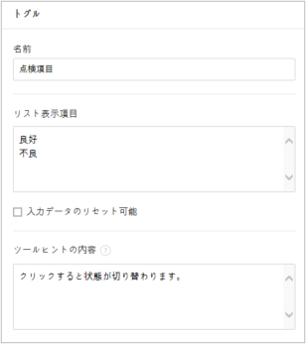
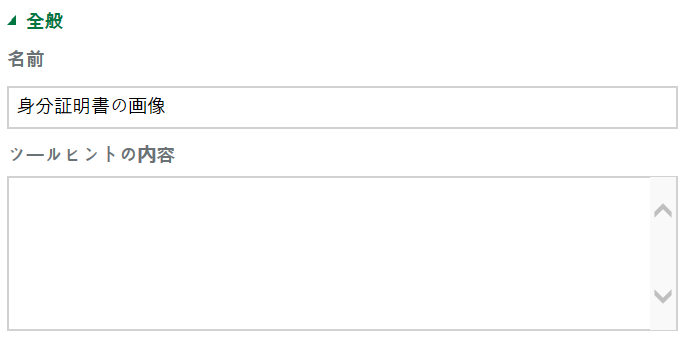
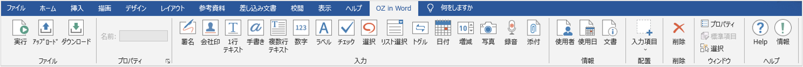
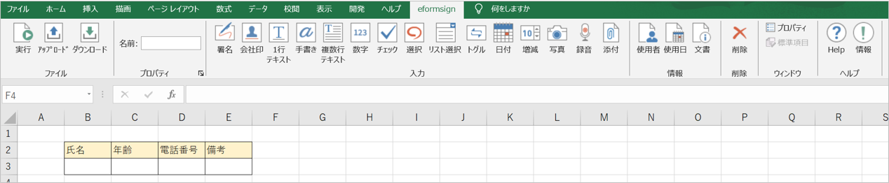
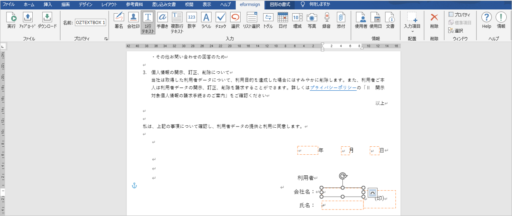
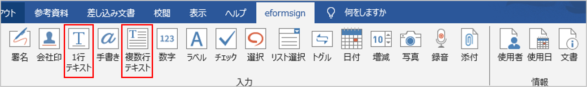
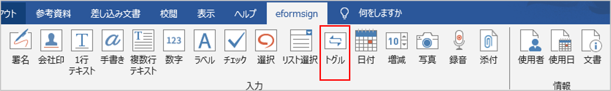

.. _formbuilder:

フォームビルダーの紹介
======================

概要
----

フォームビルダー フォームビルダーは、\ **OZ in Office**
とも言います。\ **OZ in Office** とは、Microsoft Office
で作成した文書を入力機能を備えた電子文書に変換するフォームエディターです。\ **OZ
in Office** を使用すると、既存の Excel、Word、PowerPoint の文書フォーム
(契約書、申込書、同意書、稟議書など) を電子文書に簡単に変換できます。

従来は、会社で Excel、Word、PowerPoint
文書を電子文書として開発するには、プログラミング開発が必要で、開発者向けのプログラミング開発ツールが必要でした。一方、\ **OZ
in Office** を使用すると、Office
製品を使用できるユーザーであれば、誰もが電子文書を簡単に作成できます。

**OZ in Office** は MS Office の Add-in
として搭載され、リボンメニューに表示されます。\ **電子署名、チェック、テキスト、カメラ、録音**
など、OZ 製品の多様な入力機能を提供しています。

**OZ in Office**
の入力機能を利用して電子文書を作成するプロセスは次のとおりです。

.. figure:: resources/ozinoffice-flow_1.png
   :alt: OZ in Office の使用フロセス
   :width: 700px

   OZ in Office の使用フロセス

フォームビルダーのダウンロードおよびインストール フォームビルダーのダウンロード
~~~~~~~~~~~~~~~~~~~~~~~~~~~~~~~~~~~~~~~~~~~~~~~~~~~~~~~~~~~~~~~~~~~~~~~~~~~~~~~

1. eformsign
   にログインした後、ダッシュボード画面の左上にあるメニューアイコン
   (|image1|)
   をクリックしたら、サイドバーメニューが表示されます。そのサイドバーメニューの一番下にある
   **フォームビルダーをダウンロード** ボタンをクリックします。

   |image2|

2. eformsign
   フォームビルダーのダウンロードページが次のように表示されます。ページの一番下に
   **フォームビルダーのダウンロード** ボタンをクリックします。

   |image3|

3. フォームビルダーの実行可能ファイルをクリックして実行すると、次のウィザード画面が表示されます。オプションのうち
   **すべて（C）**\ を選択し、 **次へ（N） >** ボタンをクリックします。

   |image4|

4. インストールを続行すると、次の画面が表示されます。

   |image5|

5. インストールが完了したら、\ **完了**
   ボタンをクリックして、インストール画面を閉じます。

   |image6|

6. MS Office (Word、Excel、PowerPoint)
   を実行して、フォームビルダーが正しくインストールされていることを確認します。次のように
   **OZ in Word/Excel/PowerPoint**
   が表示されれば、正常にインストールされていることです。

   |image7|

フォームビルダーのメニューの構成
~~~~~~~~~~~~~~~~~~~~~~~~~~~~~~~~

フォームビルダーをインストールした後、MS Office の Excel や Word
、PowerPoint を実行すると、リボンメニューに OZ in Excel、OZ in Word、OZ
in PowerPoint タブが追加されていることが確認できます。

.. figure:: resources/formbuilder-ozinword-menu.png
   :alt: Microsoft Office のOZ in Office リボンメニュー
   :width: 700px

   Microsoft Office のOZ in Office リボンメニュー

1. **ファイル：**\ 作成した文書を電子フォームで実行することもできますし、eformsign
   にファイルをアップロードしたり、eformsign
   からダウンロードしたりすることもできます。

2. **プロパティ：**\ コンポーネントの **名前** 、 **アイテム**
   などのプロパティを設定します。

3. **入力：**\ 電子フォームに使用するコンポーネントを追加します。

4. **情報：**\ 電子フォームにメンバーまたは使用日情報を自動で入力するために、使用者、使用日情報のコンポーネントを追加します。

5. **配置：**\ コンポーネントを選択して、目的の箇所とサイズで追加します。\ **配置**
   は、Word と PowerPoint でのみサポートします。

6. **削除：**\ コンポーネントを選択した後、 **削除**
   ボタンをクリックすると、コンポーネントがを削除されます。

7. **ウィンドウ：**\ コンポーネントの **プロパティ**
   タブを開くか、コンポーネントを選択します。

8. **ヘルプ：** フォームビルダーのバージョンを確認し、更新を実行します。

コンポーネントの概要
--------------------

コンポーネント
コンポーネントは、ユーザーが電子文書にコンテンツを入力するための入力欄として機能します。署名、チェック、日付、テキストなど多様な種類のコンポーネントがあり、各コンポーネントは、
**プロパティ** タブを介して詳細に設定することができます。

コンポーネントのタイプ
~~~~~~~~~~~~~~~~~~~~~~

eformsign は次のコンポーネントをサポートしています。

.. figure:: resources/components-in-word.png
   :alt: コンポーネントのタイプ
   :width: 700px

   コンポーネントのタイプ

-  `チェック <#check>`__\ **\ ：** コンポーネント チェック
   チェックする項目がある場合に使用します。

-  `選択 <#select>`__\ **\ ：** コンポーネント 選択
   複数の項目から1つを選択します。複数選択も設定できます。

-  `1行テキスト <#text>`__\ **\ ：** コンポーネント 1行テキスト
   1つまたは2つの短い単語を入力します。

-  `複数行テキスト <#text>`__\ **\ ：** コンポーネント 複数行テキスト
   複数行の長いテキストを入力します。

-  `リスト選択 <#combo>`__\ **\ ：** コンポーネント リスト選択
   クリックすると、ドロップダウンメニューが表示され、複数の項目のうち1つを選択します。

-  `日付 <#date>`__\ **\ ：** コンポーネント 日付
   特定の日付を入力します。

-  `数字 <#numeric>`__\ **\ ：** コンポーネント 数字 数字を入力します。

-  `トグル <#toggle>`__\ **\ ：** コンポーネント トグル
   複数の値を入力すると、ボタンをクリックするたびに異なる値に切り替わります。

-  `署名 <#signature>`__\ **\ ：** コンポーネント 署名
   署名を入力します。

-  `カメラ <#camera>`__\ **\ ：** コンポーネント カメラ
   カメラを搭載しているデバイス（スマートフォン、タブレットなど）では、カメラで写真を撮るか、アルバムから写真を選択します。カメラのないデバイス（通常の
   PC ）では、画像ファイルを選択します。

-  `録音 <#record>`__\ **\ ：** コンポーネント 録音
   録音機能を搭載している端末でボタンをクリックして録音します。

-  `添付 <#attach>`__\ **\ ：** コンポーネント 添付
   ファイル添付機能を追加します。

-  `使用者 <#user>`__\ ： コンポーネント 使用者
   文書を作成または修正したメンバーの情報を入力します。

-  `使用日 <#usedate>`__\ **\ ：** コンポーネント 使用日
   文書を作成または修正した日付を入力します。

-  `文書 <#document>`__\ **\ ：** コンポーネント 文書
   文書内の文書番号または文書 ID を入力します。

-  `ラベル <#label>`__\ **\ ：** コンポーネント ラベル
   別途設定した値を文書に表示する場合に使用します。

コンポーネントのプロパティを確認する方法
~~~~~~~~~~~~~~~~~~~~~~~~~~~~~~~~~~~~~~~~

すべてのコンポーネントには、設定を行う **プロパティ**
タブがあります。プロパティを表示するには、\ **プロパティ表示**
アイコン、または **プロパティ** メニューをクリックします。

.. figure:: resources/checking-components-properties.png
   :alt: コンポーネントのプロパティを表示する
   :width: 700px

   コンポーネントのプロパティを表示する

.. note::

   すべてのコンポーネントには **名前** が必要です。 **名前**
   の場合、コンポーネントを追加すれば自動的に生成されますが、コンポーネントへの入力内容を示す明確な意味を持つ単語に変更することを推奨します。たとえば、木村、佐々木などの名前を入力するコンポーネントの名前は「氏名」に設定します。

コンポーネントを追加する方法
~~~~~~~~~~~~~~~~~~~~~~~~~~~~

コンポーネントを追加する方法には大きく、Excel で追加する方法と、Word や
PowerPoint で追加する方法があります。Word または PowerPoint
では、次の2つの方法でコンポーネントを追加できます。

Excel でコンポーネントを追加する
^^^^^^^^^^^^^^^^^^^^^^^^^^^^^^^^

1. Excel を開いて、 **OZ in Excel** リボンメニューに移動します。

   |image8|

2. コンポーネントを追加したいセルを選択します。

   |image9|

3. 目的のコンポーネントをクリックします。

   |image10|

4. コンポーネントのプロパティで、詳細項目を設定します。

Word または PowerPoint でコンポーネントを追加する
^^^^^^^^^^^^^^^^^^^^^^^^^^^^^^^^^^^^^^^^^^^^^^^^^

**方法 1：コンポーネントをクリックして追加する**

1. Word または PowerPoint
   を開き、文書でコンポーネントを追加したい箇所を選択します。

   |image11|

2. **OZ in Word** または **OZ in PowerPoint**
   のリボンメニューで、追加したいコンポーネントをクリックします。

   |image12|

3. 追加したコンポーネントのサイズを調整します。

   |image13|

**方法 2：コンポーネントを描画して配置する**

1. Word または PowerPoint を開いて、 **OZ in Word** または **OZ in
   PowerPoint** のリボンメニューに移動します。

2. **入力項目**
   アイコンをクリックして、表示されるドロップダウンリストから追加したいコンポーネントを選択します。

   |image14|

3. 目的の箇所とサイズでコンポーネントを追加します。

   |image15|

コンポーネントを削除する方法
~~~~~~~~~~~~~~~~~~~~~~~~~~~~

削除したいコンポーネントを選択し、 **OZ in Office** メニューの
**削除**\ （\ |image16|\ ）
アイコンをクリックします。コンポーネントを複数選択して削除することもできます。

各コンポーネントの使用方法
--------------------------

eformsign は Microsoft Office の **OZ in Office**
リボンメニューでは、\ **チェック**\ 、\ **リスト選択**\ 、\ **テキスト**\ 、\ **署名**\ などのさまざまなコンポーネントをサポートしています。

**OZ in Office**
のすべてのコンポーネントには、共通のプロパティと固有なプロパティがあります。コンポーネントのプロパティウィンドウで、各コンポーネントの共通のプロパティと固有なプロパティを表示できます。共通のプロパティには、
**名前** と **ツールヒントの内容**
があり、各プロパティの意味は次のとおりです。

-  **名前：** コンポーネント 名前
   各コンポーネントを識別できる固有な値です。ワークフローまたはフィールドの設定ステップで必須入力または修正制限がかかっている場合、コンポネントの名前で確認して指定でき、CSV
   形式で入力データを抽出して確認する場合もコンポーネントの **名前**
   で区別できます。

-  **ツールヒントの内容：** コンポーネント ツールヒントの内容
   文書が受信者に表示される Windows
   環境では、コンポーネントにカーソルを合わせるとツールヒントの内容が吹き出しの形で表示されます。モバイル環境では、コンポーネントがダイアログで起動されるときにツールヒントの内容がダイアログのタイトルとして表示されます。

.. note::

   コンポーネントの **プロパティ**
   ウィンドウは、コンポーネントが適用された箇所を選択した後、\ **OZ in
   Office** メニューの **プロパティ** アイコン（\ |image17|
   ）をクリックしたら、表示されます。

.. note::

   情報タイプの **使用者** 、 **使用日** 、 **文書** 、 **ラベル** には
   **ツールヒントの内容** プロパティがありません。

各コンポーネントの説明は次のとおりです。

.. _check:

チェック
~~~~~~~~

コンポーネント チェック **チェック**
コンポーネントは、各項目にチェックが入っているかどうかを確認する場合に使用します。同様のコンポーネントには、
**選択** コンポーネントがあります。両方の違いは、 **チェック**
コンポーネントは項目へのチェック有無を確認するときに使用し、\ **選択**
コンポーネントは何を選択したのかを確認する必要があるときに使用することにあります。

|image18|

**チェック**
コンポーネントの入力値は、データをダウンロードすれば、次のように表示されます。

-  項目にチェックが入っている場合：true

-  項目にチェックが入っていない場合：false

Word、PowerPoint
では、チェックコンポーネントが長方形の図形のように表示されます。コンポーネントの内容は、コンポーネントの図形の中に入力する必要があります。

**コンポーネントのプロパティ**

.. figure:: resources/check-component-properties-1.png
   :alt: チェックコンポーネントのプロパティの設定

   チェックコンポーネントのプロパティの設定

**① 名前**

**チェック** コンポーネントは、コンポーネント毎に異なる **名前**
を指定する必要があります。複数の **チェック** コンポーネントに同じ
**名前**
が与えられている場合は、最後のコンポーネントの入力値のみが表示されます。

**② チェックスタイル**

**チェック**
コンポーネントは、プロパティでスタイルを設定できます。チェックを入れると、プロパティでチェックボックスがデフォルト設定されることになります。チェックボックス以外に、ラジオボタン、赤い丸囲みの円の形で選択することもできます。

次の例では、左からチェック/ラジオ/丸囲みを選択すると、各チェックボックスがどのように表示されるかが確認できます。

|image19|

.. _select:

選択
~~~~

コンポーネント 選択 **選択**
コンポーネントは、複数の項目のうち、どの項目が選択されているかを確認する必要がある場合に使用します。\ **選択**
コンポーネントの選択値は、データがダウンロードされると、選択した項目の名前で表示されます。

|image20|

Word、PowerPoint では、\ **選択**
コンポーネントが長方形の図形のように表示されます。コンポーネントの内容は、コンポーネントの図形の中に入力する必要があります。

**コンポーネントのプロパティ**

.. figure:: resources/Radio-component-properties.png
   :alt: 選択コンポーネントのプロパティの設定

   選択コンポーネントのプロパティの設定

**① 名前**

**選択** コンポーネント内の選択項目には、各選択グループに対して同じ
**名前** を指定する必要があります。

たとえば、問題 1 に対して 1、2、3、4、5
の選択肢がある場合、1、2、3、4、5の項目に同じ **名前** の
「問題1」を指定します。問題 2 の選択肢の1、2、3、4、5 に対しては
**名前** を 「問題2」にします。次の例では、すべての選択項目の **名前**
を 「年齢の選択」とします。

.. figure:: resources/radio-items-should-have-same-ID.png
   :alt: 選択コンポーネントの設定の例
   :width: 600px

   選択コンポーネントの設定の例

**② 選択スタイル**

**選択**
コンポーネントは、プロパティでスタイルを設定できます。赤い丸囲みの「円」がデフォルトで設定されており、それ以外にチェックボックスとラジオボタン表示を選択することもできます。

**③ マルチ選択の可能**

**マルチ選択の可能**
にチェックを入れれば、複数の項目を選択できます。複数の項目が選択されている場合、データを保存するときに、選択した複数の項目がコンマ（
, ）で区切られて保存されます。

**④ 未選択可能**

**未選択可能**
にチェックを入れれば、選択した項目をもう一度クリックして選択解除できます。

**⑤ ツールヒントの内容**

入力欄にカーソルを合わせると、入力した説明がツールヒントの内容として表示されます。

.. _combo:

リスト選択
~~~~~~~~~~

コンポーネント リスト選択 複数の項目から 1
つの項目を選択する必要がある場合は、\ **リスト選択**
コンポーネントを使用します。

|image21|

チェックボックスをクリックすると、項目のリストが表示されます。

|image22|

**コンポーネントのプロパティ**

.. figure:: resources/combo-component-properties.png
   :alt: リスト選択コンポーネントのプロパティの設定

   リスト選択コンポーネントのプロパティの設定

**① 名前**

**リスト選択** コンポーネントの **名前**
を入力します。たとえば、お気に入りの色を選択するコンポーネントの
**名前** は「お気に入りの色」とします。

**② リスト表示項目**

選択肢の項目を入力します。複数の項目をEnter キーで区切ります。

.. note::

   **リスト選択**
   コンポーネントの最上部に「選択してください」を表示するには、リスト表示項目の第一項目として「選択してください」と入力します。その後、文書を送信する前のプレビュー時に、そのコンポーネント内で「選択してください」を選択してから送信してください。

**③ 入力データを初期化可能**

**入力データを初期化可能**
にチェックを入れると、選択した項目を選択解除できます。入力データの初期化は、次のように実行します。

-  PC
   環境：コンポーネントを右クリックして表示されるポップアップメニューから
   **入力データを初期化可能** を選択します。

-  モバイル環境：\ **ごみ箱** アイコンをクリックします。

**④ ツールヒントの内容**

選択欄にカーソルを合わせると、入力した説明がツールヒントの内容に表示されます。

.. _text:

1行テキストと複数行テキスト
~~~~~~~~~~~~~~~~~~~~~~~~~~~

コンポーネント 1行テキスト コンポーネント 複数行テキスト **1行テキスト**
のコンポーネントと **複数行テキスト**
のコンポーネントの両方とも、テキストの入力欄を作成するときに使用します。\ **1行テキスト**
のコンポーネントは 1 ～ 2単語の短いテキストに適用し、 **複数行テキスト**
のコンポーネントは1行以上の長いテキストに適用します。

|image23|

**コンポーネントのプロパティ**

   1行テキストと複数行テキストのプロパティの設定

**① 名前**

**1行テキスト** もしくは **複数行テキスト** のコンポーネント項目の
**名前**
を入力します。たとえば、木村、鈴木などが入力されるコンポーネントの
**名前** は「氏名」です。

**② 入力可能な最大文字数**

入力可能な最大文字数（空白を含む）を設定できます。デフォルトは「0」が設定されており、文字数に制限はありません。

**③ キーボードタイプ**

コンポーネントに入力時に実行するキーボードのタイプを選択します。キーボードタイプは、スマートフォンやタブレットなどのモバイル環境でのみ動作します。

**④ パスワード文字で表示**

テキストのコンポーネントでのみ設定可能なプロパティです。テキスト入力時に入力した内容がパスワード文字（●）で入力され、入力内容を隠すことができます。入力された内容は
PDF ではパスワード文字で表示されます。ただし、CSV
データをダウンロードしたときには入力内容が表示されます。

**④ ツールヒントの内容**

入力欄にカーソルを合わせると、入力した説明がツールヒントの内容として表示されます。

.. _date:

日付
~~~~

コンポーネント 日付
日付を入力する必要がある場合に使用します。入力欄をクリックすると、日付ピッカーが表示され、目的の日付を選択できます。

|image24|

**コンポーネントのプロパティ**

.. figure:: resources/datetime-component-properties_02.png
   :alt: 日付コンポーネントのプロパティの設定

   日付コンポーネントのプロパティの設定

**① 名前**

**日付** コンポーネントの **名前**
を入力します。たとえば、休暇の開始日を選択するコンポーネントの **名前**
は 「休暇の開始日」 にします。

**② 書式設定**

日付を表示する形式を指定します。

-  **yyyy：年度**\ を表示します。（yyyy年＝2020年）

-  **MM：**
   **月**\ を表示します。月の表現は大文字にする必要があります。（MM月＝8月）

-  **dd：** **日**\ を表示します。(dd日 = 10日)

「2020年 2月 5日」のように表示するには、書式設定に「yyyy年 MM月
dd日」と入力します。

**③ 入力可能な最小/最大日付**

日付の選択時に選択可能な最小日付と最大日付を指定して、入力可能な日付の範囲を設定します。

**④ 空の値の場合、今日の日付を表示**

文書を開いたときに今日の日付が自動で入力されるように設定します。\ **日付**
コンポーネントを追加すると、デフォルトでチェックが入っています。別の日付を選択するには、今日の日付が入力されている入力欄をもう一度クリックしてください。

**⑤ 入力データを初期化可能**

**入力データを初期化可能**
にチェックを入れると、選択した日付を削除できます。\ **日付**
コンポーネントは一度選択すると、別の日付に変更はできますが、日付の選択を解除することはできません。ただし、\ **入力データを初期化可能**
にチェックを入れると、何も選択されていない状態に変更できます。一方、何も選択されていないときに
**空の値の場合、今日の日付を表示**
にチェックが入っている場合は、今日の日付が選択されます。

-  PC
   環境：コンポーネントを右クリックして表示されるポップアップメニューから
   **入力データを初期化可能** を選択します。

-  モバイル環境：\ **ごみ箱** アイコンをクリックします。

**⑥ ツールヒントの内容**

入力欄にカーソルを合わせると、入力した説明がツールヒントの内容として表示されます。

.. _numeric:

数字
~~~~

コンポーネント 数字
数字を入力する必要がある場合に使用します。入力欄をクリックすると、2つの矢印が表示されます。
**上へ** もしくは **下へ**
の矢印ボタンを押して、数字を増減できます。PCのキーボード環境では、入力欄に任意の数字を直接入力できます。スマートフォンやタブレット環境では、入力範囲の数字リストをスクロールして目的の数字を選択できます。

|image25|

**コンポーネントのプロパティ**

   数字コンポーネントのプロパティの設定

**① 名前**

**数字** コンポーネントの **名前**
を入力します。たとえば、予約人員の数を入力するコンポーネントの **名前**
は、「予約人員」にします。

**② 変化の増分**

入力欄の増加と減少のアイコンをクリックするたびに、現在入力されている値から増減する値を入力します。たとえば、増分の単位を
100
に設定して文書を作成する場合、入力欄の右側にある上への矢印（▲）をクリックすると、入力値から
200、300、... に増加します。

**③ 入力可能な最小値/最大値**

**入力可能な最小値** と **最大値**
を指定して、入力可能な数字の範囲を設定します。たとえば、生年月日の場合は、通常、最小値を1900、最大値を現在の年度、増分の単位を1で指定します。最小値または最大値が指定されている状態で範囲外の数字を入力すると、最小値または最大値が自動で入力されます。つまり、最大値が
100 の場合、入力欄に 101を入力すると、数字が自動的に最大値の 100
に変更されます。

**④ 入力データを初期化可能**

**入力データを初期化可能**
にチェックを入れると、入力した数字を削除できます。\ **数字**
コンポーネントは一度数字を入力すると別の数字に変更はできますが、数字を削除することはできません。ただし、
**入力データを初期化可能**
にチェックを入れると、何も入力されていない状態に変更できます。

-  PC
   環境：コンポーネントを右クリックして表示されるポップアップメニューから
   **入力データを初期化可能** を選択します。

-  モバイル環境：\ **ごみ箱** アイコンをクリックします。

**⑤ ツールヒントの内容**

入力欄にカーソルを合わせると、入力した説明がツールヒントの内容として表示されます。

.. _toggle:

トグル
~~~~~~

コンポーネント トグル ON や OFF
など、特定の状態を示すために使用します。\ **トグル**
コンポーネントを使用すれば、コンポーネントをクリックするたびに、予め設定しておいた項目順で入力値が切り替わります。

|image26|

次のようにコンポーネントをクリックして、「良好」または「不良」に変更できます。

|image27|

**コンポーネントのプロパティ**

   トグルコンポーネントのプロパティの設定

**① 名前**

**トグル** コンポーネントの 名前
を入力します。たとえば、最初の点検項目に対するコンポーネントであれば、「点検項目
1」にします。

**② リスト表示項目**

**トグル**
コンポーネントをクリックするたびに、切り替わる項目のリストを入力します。複数の項目を
Enter キーで区切ります。

**③ 入力データを初期化可能**

**入力データを初期化可能**
にチェックを入れると、入力した項目を削除できます。\ **トグル**
コンポーネントは一度選択すると、別の項目に変更はできますが、項目の選択を解除することはできません。ただし、
**入力データを初期化可能**
にチェックを入れると、何も入力していない状態に変更できます。

-  PC
   環境：コンポーネントを右クリックして表示されるポップアップメニューから
   **入力データを初期化可能** を選択します。

-  モバイル環境：\ **ごみ箱** アイコンをクリックします。

**④ ツールヒントの内容**

入力欄にカーソルを合わせると、入力した説明がツールヒントの内容として表示されます。

.. _signature:

署名
~~~~

コンポーネント 署名 文書への署名依頼をする必要がある場合は、\ **署名**
コンポーネントを使用します。

|image28|

**署名** コンポーネントを入力すると、署名が必要な文書に次のように
**署名**
ポップアップが表示されます。署名を直接手書きで描画するか、テキストを入力して署名を生成できます。既存の署名がある場合は、その署名を使用することもできます。

|image29|

**コンポーネントのプロパティ**

.. figure:: resources/Signature-component-properties.png
   :alt: 署名コンポーネントのプロパティの設定
   :width: 600px

   署名コンポーネントのプロパティの設定

**① 名前**

**署名** コンポーネントの **名前**
を入力します。たとえば、契約者の署名である場合、コンポーネントの
**名前** は「契約者の署名」にします。

**② 署名タイプ**

署名時に使用する署名を選択します。

-  **直接署名：**
   署名欄をクリックすると、署名ポップアップが表示され、手書き、テキスト、モバイル、印鑑・スタンプ、または登録済み署名タブのうち、入力したい方式で署名を入力します。

-  **登録の署名：** 文書の作成者が **マイ署名**
   を事前に登録している場合は、署名欄をクリックすると、登録済みの署名が自動的に入力されます。

-  **登録のイニシャル：** 登録の署名と同様に、 **マイ署名**
   にイニシャルが登録されている場合、署名欄をクリックすると登録済みのイニシャルが自動的に入力されます。

-  **登録の印鑑・スタンプ**\ ： 登録の署名と同様に、 **マイ署名**
   に印鑑・スタンプが登録されている場合、署名欄をクリックすると登録済みの印鑑・スタンプが自動的に入力されます。

.. note::

   署名とイニシャルが登録されている場合、署名は自動的に署名欄に入力されますが、署名とイニシャルが登録されていない場合は、直接署名と同じ署名ポップアップが表示されます。

.. note::

   署名ではなく印鑑やスタンプを使用する必要がある場合もあります。eformsign
   では、印鑑やスタンプの画像を使用して文書の署名欄に印鑑・スタンプを入れることもできます。印鑑・スタンプの画像を使用するには、\ **署名**
   ポップアップで **印鑑・スタンプ**
   タブをクリックして、印鑑・スタンプの画像を選択した後、OK
   ボタンをクリックします。

**③ 署名ペンの太さ**

署名を手書きで描画するときに表示される線の太さを設定します。

**④ 署名ペンの色**

署名を手書きで描画するときに表示される線の色を設定します。

**⑤ ツールヒントの内容**

入力欄にカーソルを合わせると、入力した説明がツールヒントの内容として表示されます。

.. note::

   電子契約書や電子同意書など、署名の入る文書に署名日付が自動的に入力されるように設定できます。

   1.電子書式に変換する文書ファイル（Word、Excel、PowerPoint）を開くか、新しい文書を作成します。

   2.署名が必要な箇所に **署名** コンポーネントを追加します。

   3.追加した **署名** コンポーネントのプロパティタブにコンポーネントの
   **名前** を入力します。例）署名

   4.署名の日付を入力したい箇所に **使用日**
   コンポーネントを追加します。

   5.使用日コンポーネントのプロパティタブを開きます。

   6.使用日の書式設定を **入力値の変更日** とします。

   7.下部に表示されるコンポーネントの 名前の入力欄に、\ **署名**
   コンポーネントの 名前の「署名\ **」** を入力します。

   \* 使用日コンポーネントの **書式設定**
   を設定することで、日付の表示形式を任意に変更できます。

.. _camera:

写真
~~~~

コンポーネント 写真
スマートフォンやタブレットなどのカメラを搭載したデバイスで写真を撮り、文書にアップロードするときに使用します。カメラのない
PC
環境では、コンポーネントをクリックすると選択ウィンドウが表示され、画像ファイルを選択できます。

|image30|

選択した画像のサイズが入力欄のサイズより大きい場合、入力欄内に入るサイズに縮小してアップロードされます。

.. note::

   **写真**
   コンポーネントの場合、カメラを利用できる環境ではカメラ機能が実行され、カメラの利用できない環境では画像ファイルの選択ウィンドウが実行されます。

   |image31|

**コンポーネントのプロパティ**

   カメラコンポーネントのプロパティの設定

**① 名前**

**写真** コンポーネントの **名前**
を入力します。たとえば、IDカードの写真を撮影するコンポーネントの
**名前** は「身分証明のための写真」です。

**② ツールヒントの内容**

入力欄にカーソルを合わせると、入力した説明がツールヒントの内容として表示されます。

.. _record:

録音
~~~~

コンポーネント 録音
ユーザーの録音データを文書に保存する必要がある場合に使用します。最大録音時間を設定することも、すでに録音された内容を聴けるように設定することもできます。

OZ in Office に **録音**
コンポーネントを追加すると、ビューアーで録音したコンテンツを再生したり、新しい録音を行ったりすることができます。

|image32|

.. note::

   録音のタイムアウトが1以上に設定されている場合、設定した時間（単位：秒）の分だけ録音したら、自動で録音が完了します。

   ActiveX ビューアーでは、Windows 8 以降から、録音の再生 UI
   をサポートしています。

   **録音** コンポーネントを PC
   環境で実行する場合、ボイスレコーダーを利用できるときだけ機能します。

**コンポーネントのプロパティ**

.. figure:: resources/record_component.png
   :alt: 録音コンポーネントのプロパティの設定

   録音コンポーネントのプロパティの設定

**① 名前**

**録音** コンポーネントの **名前**
を入力します。たとえば、録音を再生するコンポーネントの **名前**
を「録音」に設定します。

**② ツールヒントの内容**

入力欄にカーソルを合わせると、入力した説明がツールヒントの内容として表示されます。

.. _attach:

添付
~~~~

コンポーネント 添付
文書に添付が必要な他の文書がある場合に使用します。\ **添付**
コンポーネントを使用して文書を添付すると、添付した文書は元来の文書の最後に新しいページとして追加されます。

|image33|

添付可能なファイルのタイプとサイズは次のとおりです。

-  ファイルタイプ：PDF、JPG、PNG、GIF

-  ファイルサイズ：最大 5 MB までサポート

**コンポーネントのプロパティ**

.. figure:: resources/Attachment-component-properties.png
   :alt: 添付コンポーネントのプロパティの設定

   添付コンポーネントのプロパティの設定

**① 名前**

**添付** コンポーネントの **名前**
を入力します。たとえば、在職証明書を添付するコンポーネントの **名前**
は「在職証明書」とします。

**② ツールヒントの内容**

入力欄にカーソルを合わせると、入力した説明がツールヒントの内容として表示されます。

.. _user:

使用者
~~~~~~

コンポーネント 使用者
文書を作成または変更したメンバーの情報を文書に自動的に入力する場合に使用します。設定によって、名前、連絡先のようなメンバーの基本情報またはカスタムフィールド情報が
**使用者** コンポーネントに自動で入力されます。

|image34|

**コンポーネントのプロパティ**

.. figure:: resources/user-component-properties-.png
   :alt: 使用者コンポーネントのプロパティの設定

   使用者コンポーネントのプロパティの設定

**① 名前**

**使用者** コンポーネントの **名前**
を入力します。たとえば、文書を作成したメンバーの名前を表示するコンポーネントの
**名前** は「作成者名」とします。

**② 使用者表示タイプ**

-  **作成者：** 最初に文書を作成したメンバーの情報を表示します。

-  **アクセス者：**
   文書を最後に閲覧または変更したメンバーの情報を表示します。

-  **入力値の修正者：**
   特定のコンポーネントに内容を入力したメンバーの情報を表示します。

**入力値の修正者**
を選択すると、コンポーネントの名前の入力欄が次のように表示されます。リンクしたいコンポーネントの
**名前** をここに入力します。

|image35|

.. note::

   この作業には、会社管理（代表管理者）権限またはテンプレート管理者の権限が必要です。

.. note::

   担当者の **署名**
   コンポーネントに署名した担当者の名前を自動的に入力するには、まず担当者の署名欄に
   **署名** コンポーネントを作成した後、\ **署名**
   コンポーネントの名前を「担当者の署名」に指定します。担当者の名前を入力する
   **使用者** コンポーネントをもう一つ作成します。\ **使用者**
   コンポーネントの使用者表示タイプの項目として **入力値の修正者**
   を選択し、コンポーネントの 名前の入力欄に\ **「**\ 担当者の署名」
   と入力します。

**③ 使用者の表示情報**

表示したいメンバーの情報を選択します。メンバーの基本情報、またはカスタムフィールドに入力した追加情報のうち、必要な情報を選択します。

-  メンバー基本情報タイプ：名前、ID、部署、職位、携帯電話、電話番号

.. note::

   メンバーの基本情報を変更するには、会社管理（代表管理者）権限が必要です。

   メンバーの基本情報を変更するには、eformsign にログインした後、
   **会社管理 > メンバー管理**
   メニューに移動します。メンバーリストからメンバーを選択し、画面の右側に表示される詳細情報で変更した後、
   **保存** ボタンをクリックします。

.. _usedate:

使用日
~~~~~~

コンポーネント 使用日
文書が作成または変更された日付を文書に自動的に入力する場合に使用します。設定によって、文書を作成した日付、文書にアクセスした日付、または特定のコンポーネントを入力した日付が自動的に入力されます。

|image36|

**コンポーネントのプロパティ**

.. figure:: resources/date-component-properties_.png
   :alt: 使用日コンポーネントのプロパティの設定

   使用日コンポーネントのプロパティの設定

**① 名前**

**使用日** コンポーネントの **名前**
を入力します。たとえば、文書に署名した日付を表示するコンポーネントの
**名前** は「署名日」とします。

**② 書式設定**

日付を表示する書式を指定します。

-  **yyyy：** **年度** を表示します。（yyyy年＝2020年）

-  **MM：** **月**
   を表示します。月の表現は大文字にする必要があります。（MM月＝8月）

-  **dd：** **日** を表示します。（dd日 = 10日）

「2020年 2月 5日」のように表示するには、書式設定に「yyyy年 MM月
dd日」と入力します。

**③ 使用日表示タイプ**

-  **作成日付：** 文書を最初に作成した日付が表示されます。

-  **アクセス日付：** 文書を修正または閲覧した最新の日付が表示されます。

-  **入力値の修正日付：**\ 特定のコンポーネントに内容を入力した日付が表示されます。

**入力値の修正日付** を選択すると、コンポーネントの **名前**
の入力欄が次のように表示されます。リンクしたいコンポーネントの **名前**
をここに入力します。

|image37|

.. note::

   この作業には、会社管理（代表管理者）権限またはテンプレート管理者の権限が必要です。

.. note::

   契約者の署名日を自動的に入力するには、まず契約書の署名欄に **署名**
   コンポーネントを作成した後、\ **署名**
   コンポーネントの名前を「契約者の署名」に指定します。署名日を入力したい
   **使用日** コンポーネントをもう1つ作成します。\ **使用日**
   コンポーネントの使用日の表示タイプのプロパティで **入力値の変更日**
   を選択し、\ **入力**
   コンポーネントの名前の入力欄に「契約者の署名」と入力します。

.. _document:

文書
~~~~

コンポーネント 文書 **文書**
コンポーネントは、文書内に文書関連の情報を入力する必要がある場合に使用します。\ **文書
ID** と\ **文書番号** のいずれかを選択した後、必要な情報を入力します。

|image38|

**文書 ID** は、システムが付与する文書固有の ID
であるため、設定を必要としません。\ **文書番号**
に関する設定は、テンプレートをアップロードした後、\ **テンプレート設定 >
全般** で行えます。

**コンポーネントのプロパティ**

.. figure:: resources/document-domponent-properties.png
   :alt: 文書コンポーネントのプロパティの設定

   文書コンポーネントのプロパティの設定

**① 名前**

**文書** コンポーネントの **名前**
を入力します。たとえば、文書番号を入力すると、コンポーネントの **名前**
は「文書番号」になります。

**② 文書情報のタイプ**

使用したい文書情報を選択します。

-  **文書 ID：**\ システムがすべての文書に付与する文書固有の ID で、32
   桁の英数字の組み合わせで表示されます。例）0077af27a98846c8872f5333920679b7

-  **文書番号：** **テンプレート設定 > 全般**
   で設定した文書番号です。文書番号の設定については、\ `??? <#docnumber_wd>`__\ をご参照ください。

.. _label:

ラベル
~~~~~~

コンポーネント ラベル **ラベル**
コンポーネントは、別途設定した値を文書に表示する場合に使用します。

**コンポーネントのプロパティ**

   ラベルコンポーネントのプロパティの設定

**① 名前**

**ラベル** コンポーネントの **名前** を設定します。

フォームファイルのアップロード
------------------------------

**OZ in Office**
で作成完了したフォームファイルは、次の順序でアップロードします。

1. リボンメニューのファイルグループの
   **実行**\ （\ |image39|\ ）アイコンをクリックすると、次のログインページがポップアップウィンドウで表示されます。

   |image40|

2. ログインすると、フォームに変換された文書がプレビュー形式で表示されます。

   |image41|

3. アップロードのプレビュー画面で、 **フォームファイルのアップロード**
   をクリックするか、リボンメニューの
   **アップロード**\ （\ |image42|\ ）アイコンをクリックすると、テンプレートのリストとともにテンプレートを新規追加できるカードが表示されます。

   |image43|

4. **テンプレートの新規追加**
   カードをクリックすると、作成したフォームがアップロードされた状態で、テンプレートを設定する画面が表示されます。右上の
   **保存** ボタンをクリックして、テンプレートを作成します。

   |image44|

アップロードしたテンプレートを追加設定する
------------------------------------------

テンプレートをアップロードしたら、テンプレートで作成した文書について、テンプレートのタイトル、文書番号、ワークフローなどの追加設定を行うことができます。

1. eformsign にログインします。

2. **テンプレート管理** メニューに移動します。

3. **テンプレート設定** アイコンをクリックします。

   -  **全般：**\ テンプレート名、略称、文書のタイトル、文書番号などを設定します。

   -  **権限の設定：**\ テンプレートを使って文書を作成するメンバーまたはグループと、作成した文書を管理するメンバーまたはグループを指定します。

   -  **ワークフローの設定：**\ 文書の作成から完了までのステップをを設定します。

   -  **フィールドの設定：**\ フィールドの表示有無、順番、基本値、自動入力値などのデフォルト値を設定します。

   -  **通知の設定：**\ テンプレートを利用して作成した文書を依頼するときとその文書に関する通知を送信するときの通知メッセージを設定します。

4. すべての設定が完了したら、 **保存**
   ボタンをクリックした後、テンプレートを配布します。

.. important::

   作成したテンプレートを使って文書を作成できるようにするためには、テンプレートを保存した後、\ **配布**\ する必要があります。

   テンプレートを配布せず保存した場合、保存したテンプレートはテンプレートの使用権限を持つメンバーの\ **テンプレートで作成する**
   画面に表示されません。

.. note::

   テンプレートの詳細な説明については、
   `??? <#template_fb>`__\ をご参照ください。

.. |image1| image:: resources/menu_icon.png
.. |image2| image:: resources/formbuilder_download.png
   :width: 700px
.. |image3| image:: resources/formbuilder_download_2.png
   :width: 700px
.. |image4| image:: resources/formbuilder_wizard_1.png
.. |image5| image:: resources/formbuilder_wizard_2.png
.. |image6| image:: resources/formbuilder_wizard_3.png

.. |image8| image:: resources/ozinexcel_1.png

.. |image12| image:: resources/ozinword_2.png
.. |image13| image:: resources/ozinword_3.png
.. |image14| image:: resources/ozinword_2_1.png

.. |image16| image:: resources/delete-icon.png
.. |image17| image:: resources/property-icon.png
.. |image18| image:: resources/form-builder-components_check.png
   :width: 700px
.. |image19| image:: resources/check-component-style-settings.png
   :width: 700px
.. |image20| image:: resources/form-builder-components.png
   :width: 700px
.. |image21| image:: resources/form-builder-components_Combo.png
   :width: 700px
.. |image22| image:: resources/combo-1.png

.. |image24| image:: resources/form-builder-components_datetime.png
   :width: 700px
.. |image25| image:: resources/form-builder-components_numeric.png
   :width: 700px

.. |image27| image:: resources/toggle.png
.. |image28| image:: resources/form-builder-components_signature.png
   :width: 700px
.. |image29| image:: resources/signature.png
.. |image30| image:: resources/form-builder-components_camera.png
   :width: 700px

.. |image32| image:: resources/record1.png
   :width: 300px
.. |image33| image:: resources/form-builder-components_attachment.png
   :width: 700px
.. |image34| image:: resources/form-builder-components_user.png
   :width: 700px
.. |image35| image:: resources/user-input-certain-component.png
.. |image36| image:: resources/form-builder-components_date.png
   :width: 700px
.. |image37| image:: resources/date-component-connecting-other-component.png
.. |image38| image:: resources/document-component-in-list.png
   :width: 700px
.. |image39| image:: resources/excute_button.png
.. |image40| image:: resources/form_upload_login.png
   :width: 700px
.. |image41| image:: resources/upload_preview.png
   :width: 700px
.. |image42| image:: resources/upload_button.png
.. |image43| image:: resources/upload_list.png
   :width: 700px

