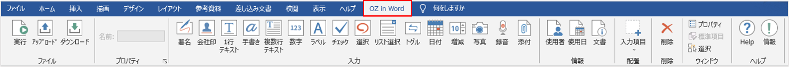
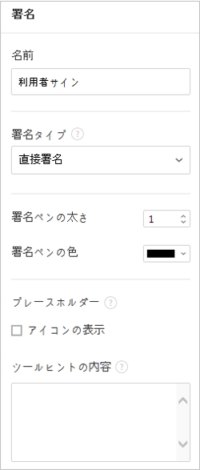
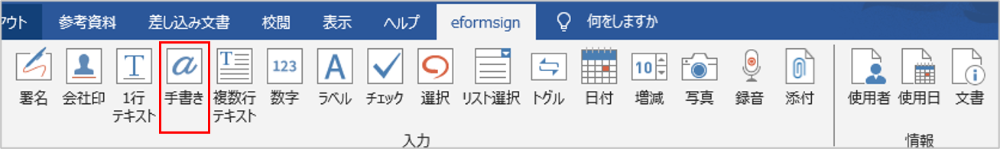
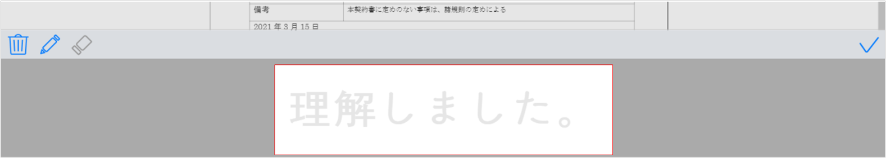
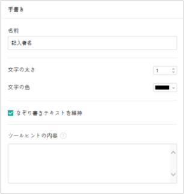
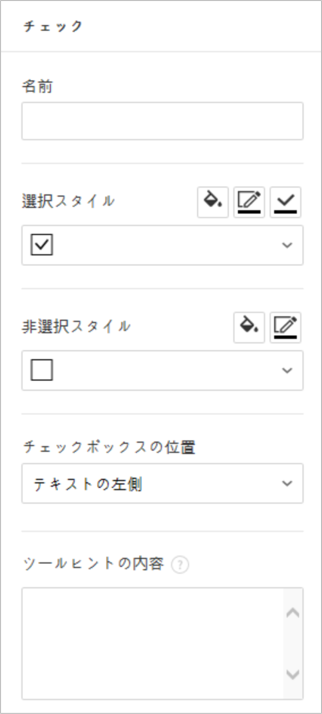
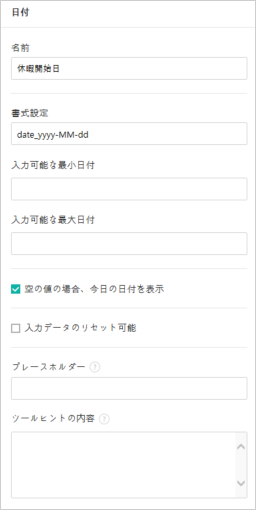
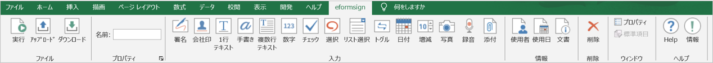
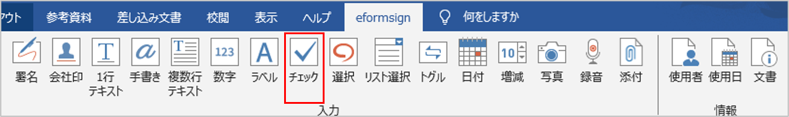

.. _formbuilder:

==========================
フォームビルダーの紹介
==========================

フォームビルダー(Microsoft Officeアドイン)とは、Excel、Word、PowerPointなどのMicrosoft Office製品で作成した文書を、入力機能を備えた電子文書に変換するフォームエディターです。フォームビルダーを使用することで、現在使用中のExcel、Word、PowerPointで作成した文書 (契約書、申込書、同意書、稟議書など) を簡単に電子文書に変換することができます。

フォームビルダーはExcel、Word、PowerPointなどのMicrosoft Office製品のリボンメニューにアドインとして追加して使用します。電子署名、チェックボックス、テキストボックス、カメラ、録音など、様々な入力機能を備えています。

フォームビルダーを利用して電子文書を作成するプロセスは次の通りです。

.. figure:: resources/ozinoffice-flow_1.png
   :alt: OZ in Officeの使用プロセス
   :width: 750px

------------------------------------------------------
フォームビルダーのダウンロード及びインストール手順
------------------------------------------------------

1. eformsignにログイン後、ダッシュボード画面の左上にあるメニューアイコン (|image1|) をクリックすると、サイドバーメニューが表示されます。サイドバーメニューの一番下にある **フォームビルダーをダウンロード** ボタンをクリックします。

   |image2|

2. 以下のような、eformsignフォームビルダーのダウンロードページが表示されます。ページ下部の **フォームビルダーのダウンロード** ボタンをクリックします。

   |image3|

3. ダウンロードしたフォームビルダーの実行ファイルをクリックすると、以下のようなインストール画面が表示されます。オプションから **すべて（C）**\ を選択し、 **次へ（N） >** ボタンをクリックします。

   |image4|

4. インストールを続行すると、以下のような画面が表示されます。

   |image5|

5. インストールが完了したら、 **完了** ボタンをクリックして、インストール画面を閉じます。

   |image6|

6. Microsoft Office製品(Word、Excel、PowerPoint) を実行して、フォームビルダーが正しくインストールされていることを確認します。次のように **OZ in Word/Excel/PowerPoint**\ が表示されていることを確認します。

   |image7|

---------------------------------
フォームビルダーのメニューの構成
---------------------------------

フォームビルダーのインストール後、Excel、 Word、PowerPoint を実行すると、リボンメニューにOZ in Excel、OZ in Word、OZ in PowerPointタブが追加されていることが確認できます。

**1. ファイル：** 作成した文書を電子フォームとして実行することで、eformsignにテンプレートのアップロード、eformsignからファイルのダウンロードができます。

**2. プロパティ：** コンポーネント(入力項目)の名前、項目などのプロパティを設定します。

**3. 入力：** テンプレートに使用する入力項目を選択します。

**4. 情報：** テンプレートにメンバーや使用日情報の自動入力を行う、使用者と使用日情報の入力項目を選択します。

**5. 配置：** コンポーネントを選択し、任意の箇所、サイズで追加します。 **配置**\ は、WordとPowerPointでのみサポートしている機能です。

**6. 削除：** コンポーネントを選択後し、削除 ボタンをクリックすると、コンポーネントが削除されます。

**7. ウィンドウ：** コンポーネントのプロパティタブを開くか、コンポーネントを選択します。

**8. ヘルプ：** フォームビルダーのバージョンの確認と、アップデートを行います。

-----------------------
コンポーネントの概要
-----------------------

コンポーネント(入力項目)は、ユーザーが電子文書にコンテンツを入力するための入力欄として機能します。署名、チェック、日付、テキストなど、様々なコンポーネントがあります。各コンポーネントは、プロパティタブから詳細な設定を行うことができます。

コンポーネントのタイプ
~~~~~~~~~~~~~~~~~~~~~~~~~~

eformsignは、次のコンポーネントをサポートしています。

.. figure:: resources/components-in-word.png
   :alt: コンポーネントの種類
   :width: 700px

入力コンポーネント
--------------------------

- `署名 <#signature>`__\ **:** 署名を入力します。

-  `社印 <#company stamp>`__\ **:** 登録されている社印を入力します。

- `1行テキスト <#text>`__\ **:** １, 2単語程度の短いテキストを入力します。

- `手書き <#handwriting>`__\ **:** 下書きとなるテキストを入力します。入力した文字をなぞり書きすることができます。

- `複数行テキスト <#text>`__\ **:** 複数行の長いテキストを入力します。

-  `数字 <#number>`__\ **:** 数字を入力します。 

- `ラベル <#label>`__\ **：** 事前に設定した値を文書に表示する場合に使用します。

- `チェック <#check>`__\ **：** チェックボックスを作成し、チェックする項目がある場合に使用します。

- `選択 <#select>`__\ **：** 複数の項目から1つを選択します。複数選択も可能です。

- `リスト選択 <#combo>`__\ **：** クリックすると、ドロップダウンメニューが表示されます。複数項目から1つを選択します。

- `トグル <#toggle>`__\ **：** 2つ以上の値を入力すると、ボタンをクリックするたびに値が切り替わります。

- `日付 <#date>`__\ **：** 特定の日付を入力します。

- `増減 <#numeric>`__\ **：** 増減ボタンをクリックして数字を入力します。

- `カメラ <#camera>`__\ **：** カメラを搭載しているデバイス（スマートフォン、タブレットなど）では、カメラで写真を撮るか、アルバムから写真を選択します。カメラのないデバイス（PCなど）では、画像ファイルを選択します。

- `録音 <#record>`__\ **：** 録音機能を搭載している端末において、ボタンをクリックして録音します。

- `添付 <#attach>`__\ **：** ファイル添付機能を追加します。

情報コンポーネント
--------------------------

- `使用者 <#user>`__\ **:** 文書を作成、または修正したメンバーの情報を入力します。

- `使用日 <#usedate>`__\ **:** 文書を作成、または修正した日付を入力します。

- `文書 <#document>`__\ **:** 文書内に文書番号や文書IDを入力します。

コンポーネントプロパティの確認方法
~~~~~~~~~~~~~~~~~~~~~~~~~~~~~~~~~~~~~~~~

全てのコンポーネントは、プロパティタブから詳細設定を行うことができます。プロパティを表示するには、プロパティアイコン、またはプロパティメニューをクリックします。

.. figure:: resources/checking-components-properties.png
   :alt: コンポーネントのプロパティを表示
   :width: 750px

.. note::

   全てのコンポーネントに名前をつける必要があります。
   名前は、コンポーネントを追加すると自動的に生成されますが、コンポーネントへの入力内容が一目で分かるような単語に設定することを推奨します。
   例) 木村、佐々木などの名前を入力するコンポーネントの名前は **「氏名」** と設定します

コンポーネントの追加方法
~~~~~~~~~~~~~~~~~~~~~~~~~~~~~~~~

コンポーネントを追加する方法には、Excelから追加する方法と、WordやPowerPointから追加する方法があります。WordまたはPowerPointでは、次の2つの方法でコンポーネントを追加することができます。

-  **Excelからコンポーネントを追加**

	1. Excelを開き、 **OZ in Excel** リボンメニューに移動します。

	   |image8|

	2. コンポーネントを追加するセルを選択します。

	   |image9|

	3. 任意のコンポーネントをクリックします。

	   |image10|

	4. コンポーネントのプロパティから、詳細項目を設定します。

-  **WordまたはPowerPointからコンポーネントを追加**

	**方法 1：コンポーネントをクリックして追加する**

	1. WordまたはPowerPointファイルを開き、コンポーネントを追加する箇所を選択します。

	   |image11|

	2. **OZ in Word** または **OZ in PowerPoint** のリボンメニューから、追加するコンポーネントをクリックします。

	   |image12|

	3. 追加したコンポーネントのサイズを調整します。

	   |image13|

	**方法 2：コンポーネントを選択して配置する**

	1. WordまたはPowerPointを開き、 **OZ in Word** または **OZ in PowerPoint** のリボンメニューに移動します。
	
	2. **入力項目** アイコンをクリックして、表示されるドロップダウンリストから追加するコンポーネントを選択します。

	   |image14|

	3. 任意の位置とサイズでコンポーネントを追加します。

	   |image15|

コンポーネントの削除方法
~~~~~~~~~~~~~~~~~~~~~~~~~~~~~~~~

削除するコンポーネントを選択し、 **OZ in Office** メニューの **削除**\ （|image16|）アイコンをクリックします。コンポーネントを複数選択して削除することもできます。

各コンポーネントの使用方法
~~~~~~~~~~~~~~~~~~~~~~~~~~~~~~~~

eformsignはMicrosoft Officeの **OZ in Office** リボンメニューでは、チェックボックス、リスト選択、テキスト、署名など、様々なコンポーネントをサポートしています。

**OZ in Office**\ の全てのコンポーネントは、共通プロパティと固有プロパティを持ちます。 **OZコンポーネントの属性** ウィンドウから、共通プロパティと固有プロパティを表示することができます。共通プロパティには、名前とツールヒントの内容があり、各プロパティの機能は次のとおりです。

-  **名前：**  各コンポーネントを識別するための固有の名前です。ワークフローまたはフィールドの設定ステップで必須入力または修正制限がかかっている場合、コンポーネントの名前で確認・指定ができます。CSV形式で入力データを抽出して確認する場合もコンポーネントの 名前で区別することができます。

-  **ツールヒントの内容：** 受信者が文書を閲覧する際、Windows環境ではコンポーネントにカーソルを合わせるとツールヒントの内容が吹き出し形式で表示されます。モバイル環境では、コンポーネントがダイアログで実行される際に、ツールヒントの内容がダイアログのタイトルとして表示されます。

.. note::

   OZコンポーネントの属性ウィンドウは、コンポーネントが適用された箇所を選択後、OZ in Officeメニューの **プロパティ**\ アイコン(|image17|)をクリックすると表示されます。

.. note::

   情報タイプの使用者、使用日、文書、ラベルには、ツールヒントの内容がありません。

.. _signature:

署名
--------------------

署名コンポーネントは、文書への署名依頼をする必要がある場合に使用します。

|image28|

署名コンポーネントを追加すると、署名が必要な文書に次のような **署名** ポップアップが表示されます。署名を手書きで描画するか、テキストを入力することで署名を作成することができます。既に登録されている署名がある場合は、その署名を使用することもできます。

|image29|

**コンポーネントのプロパティ**

**① 名前**

署名コンポーネントの名前を入力します。
例）契約者の署名の場合、コンポーネントの名前は「契約者の署名」とする)

**② 署名タイプ**

署名時に使用する署名を選択します。 

- **サイン:** 文書の作成者が事前に登録した **マイ署名**\ がある場合、署名欄をクリックまたは署名入力ボタンをクリックすることで、登録済みの署名が自動的に入力されます。

- **イニシャル:**  **マイ署名**\ に登録されたイニシャルがある場合、署名欄をクリックまたはイニシャル入力ボタンをクリックすることで登録済みのイニシャルが自動的に入力されます。

- **スタンプ:** **マイ署名**\ に登録されたスタンプがある場合、署名欄をクリックまたはスタンプ入力ボタンをクリックすることで登録済みのスタンプが自動的に入力されます。

- **直接入力のみ許可**: **直接入力のみ許可**\ にチェックを入れると、タブレットPCなどで署名欄に直接サインできるよう設定します。署名欄をクリックすると署名ポップアップが表示され、 **手書き、キーボード、モバイル、eformsignアプリ** タブから任意の方法で署名を入力します。

.. note::

   登録された署名、イニシャル、スタンプがある場合、その署名が署名欄に自動的に入力されます。署名、イニシャル、スタンプが登録されていない場合、署名を入力するポップアップが表示されます。
   署名タイプを1種類だけ選択した場合、署名欄をクリックするとその署名タイプが表示されます。署名タイプを2種類以上選択した場合、署名欄をクリックすると次のような選択可能な署名タイプボタンが表示されます。 

   .. figure:: resources/select-signature-type.png
      :alt: 署名タイプ選択

.. tip::

   **文書にスタンプ押印**

   署名ではなく、職印や個人印鑑を使用する場合もあります。eformsignではスタンプ画像を使用して文書の署名欄にスタンプを押すことができます。 

   **① スタンプ画像を使用**

   スタンプ画像を使用する場合、署名ポップアップで **スタンプ** タブをクリックし、スタンプの画像を選択後、 **確認** ボタンを押します。

   **② 会社印を使用**

   会社の法人印鑑など、会社の職印がある場合、 **会社管理メニューから会社印**\ として登録後、 **会社印** コンポーネントでより安全に、簡単に使用できます。

**③ 署名ペンの太さ**

署名を手書きで描画するときに表示される線の太さを設定します。

**④ 署名ペンの色**

署名を手書きで描画するときに表示される線の色を設定します。

.. tip::

   **署名日の自動入力設定方法**

   電子契約書や電子同意書など、署名の入る文書に署名日付が自動的に入力されるように設定できます。

   1. 電子書式に変換する文書ファイル（Word、Excel、PowerPoint）を開くか、新規文書を作成します。

   2. 署名が必要な箇所に署名コンポーネントを追加します。

   3. 追加した署名コンポーネントのプロパティタブにコンポーネントの名前を入力します。例)署名

   4. 署名の日付を入力する箇所に **使用日** コンポーネントを追加します。

   5. **使用日** コンポーネントのプロパティタブを開きます。

   .. figure:: resources/date-component-properties.png
      :alt: 使用日コンポーネントプロパティ
      :width: 300px

   6. 使用日の書式設定を **入力値の変更日**\ とします。

   7. 下部に表示されるコンポーネントの名前の入力欄に、署名コンポーネントの名前である「署名」と入力します。

   ※使用日コンポーネントの「書式設定」から設定することで、任意の表示形式に変更できます。
       例) date-yyyy-MM-dd → date-yyyy年 MM月 dd日
 
.. _company stamp:

会社印
--------------------

会社の代表印鑑、社用印鑑、法人印鑑など、 **会社管理 > 会社印管理**\ に登録された会社印を入力する際に使用します。
会社印は **会社管理 > 会社印管理**\ に登録された印鑑と使用権限を付与されたメンバーのみ使用できます。会社印に関する履歴は **会社印管理** メニューに記録されます。

.. figure:: resources/form-builder-components_companystamp.png
   :alt: 会社印 

**コンポーネントのプロパティ**

.. figure:: resources/companystamp-component-properties_fb.png
   :alt: 会社印入力項目プロパティ設定

**① 名前**

会社印入力項目の名前を入力します。
例）法人印鑑の場合、入力項目の名前は「法人印鑑」と設定します。 

.. _text:

1行テキストと複数行テキスト
----------------------------

1行テキストのコンポーネントと複数行テキストのコンポーネントはどちらも、入力欄を作成する際に使用します。1行テキストは1、 2単語程度の短いテキストに、複数行テキストは2行以上の長いテキストへの使用に適しています。

|image23|

**コンポーネントのプロパティ**

.. figure:: resources/text-component-properties_fb.png
   :alt: 1行テキストと複数行テキストのプロパティの設定
   :width: 300px

**① 名前**

1行テキスト/複数行テキストのコンポーネントの名前を入力します。
例)木村、鈴木などが入力されるコンポーネントの名前は「氏名」とします)

**② テキストタイプ**

テキストタイプをテキスト、パスワードから選択します。

- **テキスト:** 一般的なテキストを入力する際に使用します。
- **パスワード:** 入力した内容が表示されないよう設定します。テキスト入力時、入力した内容がアスタリスク(*)またはパスワード文字（●）で表示され、入力内容を隠すことができます。入力された内容はPDFではパスワード文字で表示され、CSVデータをダウンロードしたときにのみ確認することができます。

**③ 入力項目のサイズに合わせて文字数を制限**

**入力項目のサイズに合わせて文字数を制限**\ にチェックを入れると、入力項目のサイズに合わせて文字数が制限されるよう設定できます。
短いテキストを入力する場合は項目のサイズを小さく、長いテキストを入力する場合は項目のサイズを大きく設定してください。

**④ 入力可能な最大文字数**

入力可能な最大文字数（空白を含む）を設定できます。デフォルトは「0」が設定されており、この場合文字数に制限はありません。

**⑤ キーボードタイプ(モバイルにのみ適用)**

コンポーネントに入力時に実行するキーボードのタイプを選択します。キーボードタイプは、スマートフォンやタブレットなどのモバイル環境でのみ動作します。

.. _handwriting:

手書き
--------------------

手書きコンポーネントは、予め入力されたテキストをなぞり書きする必要がある場合に使用します。

文書に表示されるテキストを入力しておくと、文書の受信者はテキストをなぞり書きすることができます。

**コンポーネントのプロパティ**

**① 名前**

手書きコンポーネントの名前を入力します。

**② 文字の太さ**

なぞり書きする際に表示される線の太さを設定します。

**③ 文字の色**

なぞり書きする際に表示される線の色を設定します。

**④ なぞり書きテキストを維持**

手書きコンポーネントに入力したテキストが背景に表示されるように設定します。

.. _number:

数字
--------------------

数字コンポーネントは、金額などの数字を入力する場合に使用します。

.. figure:: resources/number-component-fb.png
   :alt: 数字コンポーネント

**コンポーネントのプロパティ**

.. figure:: resources/number_property_fb.png
   :alt: 数字コンポーネントのプロパティ設定

**① 名前**

数字コンポーネントの名前を設定します。
例) 決済金額が入力されるコンポーネントの名前は「決済金額」と設定します。

**② 負の値の入力許可**

本オプションにチェックを入れると、負の値の入力ができるようになります。

**③ 入力可能な最小値/最大値**

入力可能な最小値/最大値を設定します。

.. caution:: 

   **最小値/最大値を設定した場合の注意事項**

   最小値を設定した場合に入力値が最小値を下回る場合、最小値に置き換えられて入力されます。
   最大値を設定した場合に入力値が最大値を上回る場合、最大値に置き換えられて入力されます。

**④ 入力可能な小数点桁数**

入力可能な小数点の桁数を設定します。小数点の桁数は0～10の間で設定できます。

**⑤ 千単位の区分記号の表示**

本オプションにチェックを入れると、入力値に自動的に千の単位を区分するコンマが表示されます。

**⑥ 接頭辞/接尾辞**

数字に必要な接頭辞/接尾辞を自動的に入力するよう設定します。
例)「計10,000円」と入力する場合には接頭辞を「計」、接尾辞を「円」と設定します。

.. _label:

ラベル
--------------------

ラベルコンポーネントは、別途設定した値を文書に表示する場合に使用します。当該入力欄にテキストを入力すると、文書上に入力したテキストが表示されます。

.. figure:: resources/label-component-fb.png
   :alt: ラベルコンポーネントのプロパティ

**コンポーネントのプロパティ**

.. figure:: resources/label_property_fb.png
   :alt: ラベルコンポーネントのプロパティの設定

**① 名前**

ラベルコンポーネントの名前を設定します。

.. _check:

チェック
--------------------

**チェック** コンポーネントは、各項目にチェックを入れる場合に使用します。

**選択**\ コンポーネントとよく似ていますが、 **チェック**\  コンポーネントは各項目へのチェックの有無を確認する場合に使用し、 **選択**\ コンポーネントは複数項目から何を選択したのかを確認する場合に使用します。

.. tip:: 

   **チェックコンポーネントと選択コンポーネントの違い**

   **チェック** コンポーネントは **選択** コンポーネントと似ていますが、異なるコンポーネントです。
   **チェック** コンポーネントはその項目のチェックの有無を確認する際に使用し、 **選択** コンポーネントは複数項目から何を選択したのかを確認する場合に使用します。

|image18|

チェックコンポーネントの入力値は、データをダウンロードすると次のように表示されます。

-  項目にチェックが入っている場合: true

-  項目にチェックが入っていない場合: false

Word、PowerPointでは、チェックコンポーネントが長方形の図形で表示されます。
各項目の内容は、コンポーネントの図形内に入力する必要があります。

**コンポーネントのプロパティ**

**① 名前**

チェックコンポーネントは各選択項目ごとに異なる名前をつける必要があります。複数のチェックコンポーネントに同一の名前が付けられた場合、当該コンポーネントの最後のコンポーネントの入力値のみ表示されます。

**② 選択スタイル**

チェックコンポーネントはプロパティからスタイルを設定できます。チェックを選択した場合、チェックボックスがデフォルト設定となります。これ以外にもラジオ、丸囲みを表示するよう設定できます。

以下は、チェック/ラジオ/丸囲みを選択した場合の、各チェックボックスの表示例です。

**③ 非選択スタイル**

選択されていない項目に表示されるスタイルを指定することができます。チェックボックスは四角形、ラジオボタンは円形、丸囲みは何も表示されません。

|image19|

.. _select:

選択
--------------------

選択コンポーネントは、複数の項目のうち、どの項目が選択されているかを確認する必要がある場合に使用します。データのダウンロード時、選択コンポーネントの選択値は選択した項目の名前で表示されます。

|image20|

Word、PowerPoint では、選択コンポーネントが長方形で表示されます。コンポーネントの内容は、コンポーネントの図形内に入力する必要があります。

**コンポーネントのプロパティ**

.. figure:: resources/Radio-component-properties.png
   :alt: 選択コンポーネントのプロパティの設定
   :width: 300px

**① 名前**

選択コンポーネント内の選択項目には、各選択グループに対して同一の名前をつける必要があります。

例）問題1に1、2、3、4、5の選択肢がある場合、1、2、3、4、5の項目に同じ名前である「問題1」を指定します。問題2に1、2、3、4、5の選択肢がある場合、名前を「問題2」とします
以下の例では、全ての選択項目の **名前**\ を「年齢の選択」としています。

.. figure:: resources/radio-items-should-have-same-ID.png
   :alt: 選択コンポーネントのプロパティ設定例
   :width: 500px

**② 選択スタイル**

選択コンポーネントは、プロパティでスタイルを設定できます。赤い丸囲みの「円」がデフォルトで設定されています。他にもチェックボックスとラジオボタン表示を選択できます。

**③ 非選択スタイル**

選択されていない項目に表示されるスタイルを指定することができます。

**④ マルチ選択の可能**

**マルチ選択の可能**\ にチェックを入れると、複数の項目を選択できます。複数の項目が選択されている場合、データを保存する際に、選択した複数の項目がコンマ（ , ）で区切られて保存されます。

**⑤ 未選択可能**

**未選択可能**\ にチェックを入れると、選択した項目をもう一度クリックすることで選択解除できるようになります。

.. _combo:

リスト選択
--------------------

複数の項目から1つの項目を選択する必要がある場合に、リスト選択コンポーネントを使用します。

|image21|

次のようなチェックボックスをクリックすると、項目のリストが表示されます。

|image22|

**コンポーネントのプロパティ**

.. figure:: resources/combo-component-properties.png
   :alt: リスト選択コンポーネントのプロパティの設定
   :width: 300px

**① 名前**

リスト選択コンポーネントの名前を入力します。
例) お気に入りの色を選択するコンポーネントの名前は「お気に入りの色」とします。

**② リスト表示項目**

選択肢の項目を入力します。各項目はEnterキーで区切ります。

.. note::

   リスト選択コンポーネントに「選択してください」と表示するには、リスト表示項目の1項目に「選択してください」と設定します。

**③ 入力データのリセット可能**

**入力データのリセット可能**\ にチェックを入れると、選択済みの項目を選択解除できるようになります。 入力データのリセットは、次のように行います。

- PC 環境：コンポーネントを右クリックして表示されるポップアップメニューから「入力データをリセット可能」を選択します。

- モバイル環境：「ごみ箱」アイコンをクリックします。

.. _toggle:

トグル
--------------------

ONやOFFなど、特定の状態を示すために使用します。トグルコンポーネントを使用すれば、コンポーネントをクリックするたびに、予め設定しておいた項目の順番で入力値が切り替わります。

|image26|

次のようなコンポーネントをクリックすることで、 **良好** 、 **不良** を切り替えることができます。

|image27|

**コンポーネントのプロパティ**

.. figure:: resources/toggle-component-properties.png
   :alt: トグルコンポーネントのプロパティ
   :width: 300px

**① 名前**

トグルコンポーネントの名前を入力します。
例) 最初の点検項目に対するコンポーネントの場合、「点検項目1」とします

**② リスト表示項目**

トグルコンポーネントをクリックするたびに、切り替わる項目のリストを入力します。複数の項目を入力する場合、Enterキーで区切ります。

**③  入力データのリセット可能**

入力データのリセット可能にチェックを入れると、入力した項目を削除できるようになります。トグルコンポーネントは一度選択すると、別の項目に変更はできますが、項目の選択を解除することはできません。入力データをリセット可能にチェックを入れた場合のみ、何も入力していない状態に変更できます。

- PC環境：コンポーネントを右クリックして表示されるポップアップメニューから **入力データをリセット可能**\ を選択します。

- モバイル環境：ごみ箱アイコンをクリックします。

.. _date:

日付
--------------------

日付を入力する必要がある場合に使用します。入力欄をクリックすると日付ピッカーが表示され、任意の日付を選択できます。

|image24|

**コンポーネントのプロパティ**

**① 名前**

日付コンポーネントの名前を入力します。
例) 休暇の開始日を選択するコンポーネントの名前は「休暇の開始日」とします

**② 書式設定**

日付を表示する形式を指定します。

-  **yyyy:** **年度**\ を表示します。（yyyy年＝2020年）

-  **MM:** **月**\ を表示します。大文字で入力します。（MM月＝8月）

-  **dd:** **日**\  を表示します。(dd日 = 10日)

「2020年 2月 5日」のように表示するには、書式設定に「yyyy年 MM月 dd日」と入力します。

**③ 入力可能な最小/最大日付**

日付の選択時に選択可能な最小日付と最大日付を指定して、入力可能な日付の範囲を設定します。

**④ 空の値の場合、今日の日付を表示**

文書を開いた際に、今日の日付が自動的に入力されるように設定します。日付コンポーネントを追加すると、デフォルトでチェックが入ります。今日の日付が入力されている入力欄をもう一度クリックすると、別の日付を選択することができます。

**⑤ 入力データのリセット可能**

入力データのリセット可能にチェックを入れると、選択した日付を削除できるようになります。日付コンポーネントは一度選択しても別の日付に変更できますが、日付の選択を解除することはできません。入力データのリセット可能にチェックを入れた場合のみ、何も選択されていない状態に変更できます。また、何も選択されていない場合に **空の値の場合、今日の日付を表示**\ にチェックが入っている場合は、今日の日付が選択されます。

-  PC環境：コンポーネントを右クリックして表示されるポップアップメニューから「入力データのリセット可能」を選択します。

-  モバイル環境：ごみ箱アイコンをクリックします。

**⑥ ツールヒントの内容**

ツールヒントの内容に入力された説明は、入力欄にカーソルを合わせた際に表示されます。

.. _numeric:

増減
--------------------

増減ボタンを押して数字を入力する際に使用します。入力欄をクリックすると、2つの矢印が表示され、上下矢印を押すことで数字の増減ができます。
PCのキーボード環境では、入力欄に任意の数字を直接入力できます。スマートフォンやタブレット環境では、入力範囲の数字リストをスクロールすることで任意の数字を選択できます。

|image25|

**コンポーネントのプロパティ**

**① 名前**

増減コンポーネントの名前を入力します。
例) 予約人数を入力するコンポーネントの名前は、「予約人数」とします。

**② 変化の増分**

入力欄の増加/減少のアイコンをクリックするたびに、現在入力されている値から増減する値を入力します。
例) 変化の増分を100に設定して文書を作成した場合、入力欄の右側にある上への矢印（▲）をクリックすると、入力値は200、300...と増加します

**③ 入力可能な最小値/最大値**

入力可能な最小値と最大値を指定して、入力可能な数字の範囲を設定します。
例) 生年月日の場合は、現在の年度の最小値を1900、最大値を現在の年度、増分の単位を1に指定します。最小値または最大値が指定されている状態で範囲外の数字を入力すると、最小値/最大値が自動で入力されます。最大値が100の場合、入力欄に 101を入力すると、数字が自動的に最大値の100に変更されます。

**④ 入力データのリセット可能**

入力データのリセット可能にチェックを入れると、入力した数字を削除できるようになります。数字コンポーネントは一度数字を入力すると別の数字に変更はできますが、数字を削除することはできません。入力データのリセット可能にチェックを入れることで、何も入力されていない状態に変更できます。

-  PC環境：コンポーネントを右クリックして表示されるポップアップメニューから、 **入力データのリセット可能**\ を選択します。

-  モバイル環境：ごみ箱アイコンをクリックします。

.. _camera:

写真
--------------------

スマートフォンやタブレットなどのカメラを搭載したデバイスで写真を撮り、文書にアップロードする際に使用します。カメラのないPC環境では、コンポーネントをクリックすると画像ファイルを選択するウィンドウが表示されます。

|image30|

選択した画像のサイズが入力欄のサイズより大きい場合、入力欄内に入るサイズに縮小してアップロードされます。

.. note::

   写真コンポーネントの場合、カメラを利用できる環境ではカメラ機能が実行され、カメラの利用できない環境では画像ファイルの選択ウィンドウが実行されます。

|image31|

**コンポーネントのプロパティ**

.. figure:: resources/Camera-component-properties.png
   :alt: 写真コンポーネントのプロパティの設定
   :width: 300px

**① 名前**

写真コンポーネントの名前を入力します。
例) IDカードの写真を撮影するコンポーネントの名前は「身分証明用写真」とします

**②  ツールヒントの内容**

ツールヒントの内容に入力された説明は、入力欄にカーソルを合わせた際に表示されます。

.. _record:

録音
--------------------

ユーザーの録音データを文書に保存する場合に使用します。最大録音時間の設定、録音済みの音声を聴けるように設定もできます。

.. figure:: resources/record_component-menu.png
   :alt: 録音コンポーネント

OZ in Office に録音コンポーネントを追加することで、以下のようにビューアーから録音したコンテンツを再生したり、新しく録音を行ったりすることができます。

|image32|

.. note::

   録音のタイムアウトが1以上に設定されている場合、設定した時間（単位：秒）の分だけ録音後、自動で録音が完了します。

   ActiveXビューアーでは、Windows8以降から録音の再生UIをサポートしています。

   録音コンポーネントをPC環境で実行する場合、ボイスレコーダーを利用できる場合にのみ機能します。

**コンポーネントのプロパティ**

.. figure:: resources/record_component.png
   :alt: 録音コンポーネントのプロパティの設定
   :width: 300px

**① 名前**

録音コンポーネントの名前を入力します。
例) 録音を再生するコンポーネントの名前は「録音」と設定します

**② ツールヒントの内容**

ツールヒントの内容に入力された説明は、入力欄にカーソルを合わせた際に表示されます。

.. _attach:

添付
--------------------

文書にファイルを添付する場合に使用します。添付コンポーネントを使用して文書を添付すると、添付したファイルは元の文書の最後に新規ページとして追加されます。

|image33|

添付可能なファイルの種類とサイズは次の通りです。

-  ファイルの種類: PDF、JPG、PNG、GIF

-  ファイルのサイズ: 最大5MBまで

**コンポーネントのプロパティ**

.. figure:: resources/Attachment-component-properties.png
   :alt: 添付コンポーネントのプロパティの設定
   :width: 300px

**① 名前**

添付コンポーネントの名前を入力します。
例) 在職証明書を添付するコンポーネントの名前は「在職証明書」とします。

**② ツールヒントの内容**

ツールヒントの内容に入力された説明は、入力欄にカーソルを合わせた際に表示されます。

.. _user:

使用者
--------------------

文書を作成または変更したメンバーの情報を、文書に自動的に入力する場合に使用します。設定によって、名前、連絡先などのメンバーの基本情報またはカスタムフィールド情報が使用者コンポーネントに自動的に入力されます。

|image34|

**コンポーネントのプロパティ**

.. figure:: resources/user-component-properties-.png
   :alt: 使用者コンポーネントのプロパティの設定
   :width: 300px

**① 名前**

使用者コンポーネントの名前を入力します。
例) 文書を作成したメンバーの名前を表示するコンポーネントの名前は「作成者名」とします。

**② 使用者表示タイプ**

-  **作成者:** 最初に文書を作成したメンバーの情報を表示します。

-  **アクセス者:** 文書を最後に閲覧または変更したメンバーの情報を表示します。

-  **入力値の修正者:**  特定のコンポーネントに内容を入力したメンバーの情報を表示します。

**入力値の修正者**\ を選択すると、入力コンポーネントの入力欄が次のように表示されます。連携したいコンポーネントの名前はここに入力します。

|image35|

.. note::

   **署名者名の自動入力の設定方法**

   担当者の署名欄に署名した担当者の名前を自動的に入力するには、まず担当者の署名欄に署名コンポーネントを作成後、署名コンポーネントの名前を「担当者の署名」とします。次に、担当者の名前を入力する使用者コンポーネントをもう一つ作成します。使用者コンポーネントの使用者表示タイプの項目として **入力値の修正者**\ を選択し、コンポーネントの名前の入力欄に「担当者の署名」と入力します。

**③ ユーザーの表示情報**

メンバーの情報の中から、表示するメンバーの情報を選択します。メンバーの基本情報、またはカスタムフィールドに入力した追加情報のうち、任意の情報を選択します。

-  メンバー基本情報タイプ：名前、ID、部門、役職、携帯電話、固定電話

.. note::

   **メンバーの基本情報の修正方法**

   メンバーの基本情報を変更するには、 **代表管理者** または **会社管理** 権限が必要です。

   1. **会社管理 > メンバー管理** メニューに移動します。 
   2. メンバーリストからメンバーを選択します。
   3. 画面の右側に表示される詳細情報を修正します。
   4. **保存** ボタンをクリックし、変更を保存します。

.. _usedate:

使用日
--------------------

文書が作成または変更された日付を、文書に自動的に入力する場合に使用します。設定によって、文書を作成した日付、文書にアクセスした日付、または特定のコンポーネントを入力した日付が自動的に入力されます。

|image36|

**コンポーネントのプロパティ**

.. figure:: resources/date-component-properties.png
   :alt: 使用日コンポーネントのプロパティの設定
   :width: 300px

**① 名前**

使用日コンポーネントの名前を入力します。
例) 文書に署名した日付を表示するコンポーネントの名前は「署名日」とします

**② 書式設定**

日付を表示する書式を指定します。

-  **yyyy:** **年度**\ を表示します。（yyyy年＝2020年）

-  **MM:** **月**\ を表示します。大文字で入力します。（MM月＝8月）

-  **dd:** **日**\ を表示します。（dd日 = 10日）
   「2020年 2月 5日」のように表示するには、書式設定に「yyyy年 MM月 dd日」と入力します。

**③ 使用日表示タイプ**

-  **作成日付:** 文書を最初に作成した日付が表示されます。

-  **アクセス日付:** 文書を修正または閲覧した最新の日付が表示されます。

-  **入力値の修正日付:** 特定のコンポーネントに内容を入力した日付が表示されます。

「入力値の修正日付」を選択すると、コンポーネントの入力欄が次のように表示されます。連携するコンポーネントの名前をここに入力します。

|image37|

.. note::

   契約者の署名日を自動的に入力するには、まず契約書の署名欄に署名コンポーネントを作成後、署名コンポーネントの名前を「契約者の署名」とします。
   署名日を入力する使用日コンポーネントをもう1つ作成します。使用日コンポーネントの使用日の表示タイプのプロパティで「入力値の変更日」を選択し、コンポーネントの名前の入力欄に「契約者の署名」と入力します。

.. _document:

文書
--------------------

文書コンポーネントは、文書内に文書関連の情報を入力する必要がある場合に使用します。文書IDか文書番号のいずれかを選択後、任意の情報を入力します。

|image38|

文書IDはシステムが付与する文書固有のIDであるため、設定を必要としません。文書番号に関する設定は、テンプレートをアップロード後、 **テンプレート設定 > 全般**\ から行えます。

**コンポーネントのプロパティ**

.. figure:: resources/document-component-properties.png
   :alt: 文書コンポーネントのプロパティの設定
   :width: 300px

**① 名前**

文書コンポーネントの名前を入力します。
例) 文書番号を入力する場合、コンポーネントの名前は「文書番号」とします

**② 文書情報のタイプ**

使用する文書情報を選択します。

-  **文書ID:** システムがすべての文書に付与する文書固有のIDです。 32桁の英数字の組み合わせで表示されます。
   例) 0077af27a98846c8872f5333920679b7

-  **文書番号:** **テンプレート設定 > 全般**\ で設定した文書番号です。文書番号の設定については `文書番号の自動生成 <chapter6.html#docnumber_wd>`__\ をご参照ください。

.. _upload_form_file:

-----------------------------------
フォームファイルのアップロード
-----------------------------------

OZ in Officeから文書にコンポーネントを追加し、編集が完了したファイルは次の手順でアップロードします。

1. リボンメニューのファイルグループにある **実行**\ (|image39|)アイコンをクリックすると、次のようなログインポップアップ画面が表示されます。

   .. figure:: resources/ozinword-menu-file.png
      :alt: 実行する
      :width: 700px

   |image40|

2. ログインすると、電子文書形式に変換された文書のプレビューが表示されます。

   |image41|

3. プレビュー画面で **フォームファイルのアップロード**\ をクリックするか、リボンメニューの **アップロード**\ (|image42|) アイコンをクリックすることで、テンプレートの一覧と **テンプレートの新規作成** ができる画面が表示されます。

   |image43|

4. **テンプレートの新規作成** をクリックすると、先ほどアップロードした文書のテンプレート設定画面が表示されます。
左側の設定タブから当該テンプレートに関する追加設定を完了後、右上の **保存**\ ボタンをクリックすることでテンプレートを保存及び生成します。

   |image44|

---------------------------------------------------------
アップロードしたテンプレートを追加設定する
---------------------------------------------------------

テンプレートをeformsignにアップロード後は、テンプレートで作成した文書について、テンプレートのタイトル、文書番号、ワークフローなどの追加設定を行うことができます。

1. eformsign にログイン後、 **テンプレート管理** メニューに移動します。

2. **テンプレート設定** アイコンをクリックし、テンプレート設定画面に移動します。

   -  **全般：** テンプレート名、テンプレートの略称、文書タイトルの自動生成ルール、文書番号などを設定します。

   -  **権限の設定:** テンプレートを使って文書を作成するメンバー/グループ、テンプレートを修正できるメンバーを指定します。

   -  **ワークフローの設定:** 文書の作成から完了までの、文書の処理ステップを設定します。

   -  **フィールドの設定:** フィールドの表示有無、順序、デフォルト値、自動入力値などを設定します。

   -  **通知の設定:** テンプレートから作成した文書に対するステータス通知の受信者を設定し、最終完了通知メッセージを編集します。

3. 全ての設定を完了後、 **保存** ボタンをクリックすることでテンプレートを配布します。

.. important::

   **テンプレートの配布とは？** 

   作成したテンプレートで文書を作成できるようにするには、 **テンプレートを保存後に配布**\ する必要があります。
   テンプレートをメンバーが使用できるように公開することができます。

   テンプレートを配布せず保存のみ行った場合、保存したテンプレートはテンプレートの使用権限を持つメンバーの **テンプレートで作成する > テンプレート一覧**\ 画面に表示されません。

   配布されていないテンプレートは以下の画像のようにテンプレートに **配布前**\ と表示されます。テンプレートを配布するにはテンプレートの三点メニューから配布をクリックするか、テンプレートの設定から保存ボタンをクリックして配布して配布の有無を選択することができます。

   .. figure:: resources/template_publish.png
      :alt: テンプレートの5つの設定項目
      :width: 750px

.. note::

   テンプレートの詳細な説明については、`フォームビルダー <chapter7.html#template_fb>`__\ をご参照ください。

.. |image1| image:: resources/menu_icon.png
.. |image2| image:: resources/formbuilder_download.png
   :width: 700px
.. |image3| image:: resources/formbuilder_download_2.png
   :width: 700px
.. |image4| image:: resources/formbuilder_wizard_1.png
   :width: 400px
.. |image5| image:: resources/formbuilder_wizard_2.png
   :width: 400px
.. |image6| image:: resources/formbuilder_wizard_3.png
   :width: 400px
.. |image7| image:: resources/formbuilder-ozinword-menu1.png
   :width: 750px

.. |image9| image:: resources/ozinexcel_2.png
.. |image10| image:: resources/ozinexcel_3.png
.. |image11| image:: resources/ozinword_1.png
.. |image12| image:: resources/ozinword_2.png
.. |image13| image:: resources/ozinword_3.png
.. |image14| image:: resources/ozinword_2_1.png
.. |image15| image:: resources/ozinword_2_2.png

.. |image17| image:: resources/property-icon.png

.. |image19| image:: resources/check-component-style-settings.png
   :width: 700px
.. |image20| image:: resources/form-builder-components_radio.png
.. |image21| image:: resources/form-builder-components_Combo.png
.. |image22| image:: resources/combo-1.png
.. |image23| image:: resources/text-and-muliline-components.png
.. |image24| image:: resources/form-builder-components_datetime.png
.. |image25| image:: resources/form-builder-components_numeric.png
.. |image26| image:: resources/form-builder-components_toggle.png
.. |image27| image:: resources/toggle.png
.. |image28| image:: resources/form-builder-components_signature.png
.. |image29| image:: resources/signature.png

.. |image31| image:: resources/camera1.png
.. |image32| image:: resources/record1.png
   :width: 400px
.. |image33| image:: resources/form-builder-components_attachment.png
.. |image34| image:: resources/form-builder-components_user.png

.. |image36| image:: resources/form-builder-components_date.png
.. |image37| image:: resources/date-component-connecting-other-component.png
   :width: 300px
.. |image38| image:: resources/document-component-in-list.png
.. |image39| image:: resources/excute_button.png
.. |image40| image:: resources/form_upload_login.png
   :width: 700px
.. |image41| image:: resources/upload_preview.png
   :width: 700px
.. |image42| image:: resources/upload_button.png

.. |image44| image:: resources/upload_save.png
   :width: 700px
