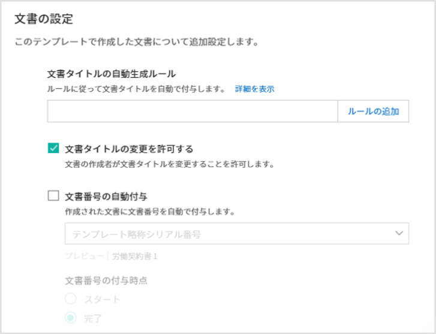
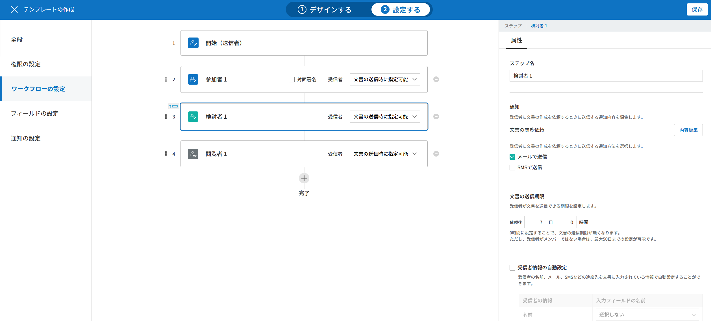
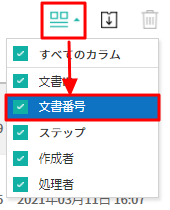
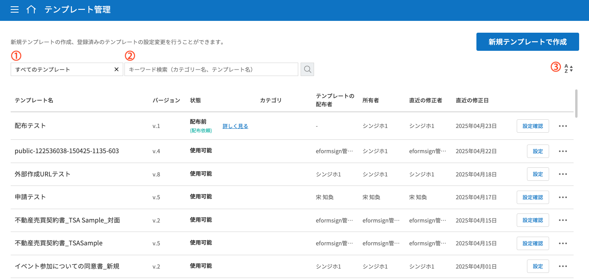

.. _template_wd:

======================================================
Webフォームデザイナーでテンプレート作成
======================================================

-----------------------------------------
テンプレートの概要
-----------------------------------------

**テンプレート**\ とは、eformsignで使用する **電子文書の書式**\ です。使用中の紙で作成した契約書、申請書、同意書などの基本的な文書書式を電子文書形式に変換したものを **テンプレート**\ と呼びます。テンプレートは、eformsignサービス内の **テンプレート管理** メニューまたは **Office製品**\ から作成し、アップロードすることができます。

.. tip::

   **❗テンプレートを使用するメリット**

   テンプレートは繰り返し・定期的に作成する文書を使用する際に役立ちます。
   テンプレートとして登録しておくことで、文書の作成のたびに文書をアップロードする必要がなくなり、素早く簡単に文書を送信できるようになります。

.. note::
   
   Office製品用eformsignアドイン(eformsign for Microsoft Office)によるテンプレートの設定と管理方法については、`Office製品からeformsignのテンプレートを作成 <chapter7.html#template_fb>`__\ をご参照ください。

**Webフォームデザイナーでテンプレートを作成する方法**
~~~~~~~~~~~~~~~~~~~~~~~~~~~~~~~~~~~~~~~~~~~~~~~~~~~~~~~~~~

.. note::

   Webフォームデザイナーの詳細については、 `Webフォームデザイナーのご紹介 <chapter4.html#webform>`__\ をご参照ください。

使用中の文書ファイルをWebフォームデザイナーにアップロードし、簡単にテンプレートを作成することができます。

.. note::

   アップロード可能なファイル形式は、pdf、hwp、doc、docx、xls、xlsx、ppt、pptx、odt、jpg、png、gif、tiffです。

   アップロード可能なファイルサイズは最大9MBです。ファイルを複数追加する場合、全てのファイルサイズの合計が9MBを超えないようにしてください。

1. **テンプレート管理** 画面から **新規テンプレートで作成**\ をクリックします。

   .. figure:: resources/template-manage-upload.png
      :alt: テンプレート管理>ファイルアップロード（1）
      :width: 700px

2. 新規テンプレートで作成した文書ファイルをドラック＆ドロップするか、 **PCからファイルを選択** をクリックしてテンプレートの元となるファイルをアップロードします。

   .. figure:: resources/template-manage-upload-popup.png
      :alt: テンプレート管理>ファイルアップロード（2）
      :width: 400px

2. 文書に合わせて文書参加者を追加し、役割を設定します。

   .. figure:: resources/wfd-participants.png
      :alt: 文書参加者の追加方法
      :width: 400px

3. 参加者が入力する入力項目を選択して文書にドラッグ&ドロップします。

   .. figure:: resources/web-form-designer1.png
      :alt: 入力項目の追加方法
      :width: 700px

4. 入力項目のサイズと位置を調整します。

5. 入力項目のプロパティで詳細設定を行います。

6. **プレビュー** ボタンをクリックして文書を確認します。

7. フォームのデザインが完了したら、**設定する**\ をクリックしてテンプレートの設定に移動します。

**テンプレートの設定**

テンプレートの詳細設定を行うことが可能です。

- `全般 <#general_wd>`__\

   テンプレート名、テンプレート名の略称、文書タイトル、文書番号などを設定します。

- `権限の設定 <#auth_wd>`__\

   テンプレートを使用して文書を作成できるテンプレート使用権限と、テンプレートを修正することができる修正権限を付与するメンバー/グループを指定します。

- `ワークフローの設定 <#workflow_wd>`__\

   文書の作成から完了までに作成した文書が処理されるステップを設定します。

- `フィールドの設定 <#field_wd>`__\

   フィールドの初期値、自動入力値などを設定します。

- `通知の設定 <#noti_wd>`__\

   テンプレートで作成した文書のステータス通知を受信する受信者の設定と、完了通知メッセージの内容を設定します。

.. _workflow:

---------------------
ワークフローの概要
---------------------

**ワークフロー**\ とは、文書を作成してから完了するまでの文書の依頼・処理プロセスです。
ワークフローは、テンプレート管理者がテンプレートごとに **テンプレートの設定** > **ワークフローの設定**\ から設定することができます。

ワークフローは、**開始 - 完了**\ が基本ステップです。また、以下のように **受信者のタイプ**\ を選択し、文書に合わせたワークフローを作成することができます。

.. figure:: resources/workflow_new.png
   :alt: ワークフローステップ
   :width: 500px

- **検討者**

   文書を確認後、承認または差し戻します。

- **参加者**

   文書の入力項目に入力・署名します。

-  **閲覧者** 

   文書の閲覧のみ行うことができます。 

.. _template_setting:

---------------------
テンプレートの設定
---------------------

アップロードしたファイルで作成するテンプレートの詳細を設定することができます。

.. note::

   この作業には、**代表管理者** または **テンプレート管理** 権限が必要です。PC、モバイル、アプリケーションで行うことができます。

.. _general_wd:

全般
~~~~~~~~~~~~~~~

.. figure:: resources/template-setting-general.png
   :alt: テンプレートの設定>全般
   :width: 600px

**テンプレートの基本情報の設定**
-----------------------------------

テンプレート名、カテゴリ、有効期限など、テンプレートに関する基本情報を設定します。

**① テンプレート名**
   **テンプレート管理** 、**テンプレートで文書を作成** メニュー画面に表示されるテンプレート名です。
   **テンプレート名**\ は、スペースを含めて11文字程度を推奨しています。11文字以上入力した場合、11文字以降は隠れて表示されません。完全なテンプレート名は、テンプレート名の上にマウスカーソルを置き、しばらく待つと確認できます。

   .. figure:: resources/template-name.png
      :alt: テンプレート名
      :width: 250px

**② テンプレートの略称**
   テンプレート名を簡略化した名称です。 2, 3文字程度の短い単語を推奨します。
   **テンプレートの略称**\ は、文書番号、文書タイトル、通知メールテンプレートなどで使用することができます。

**③ カテゴリ**
   テンプレートを種類ごとに分類するときに使用します。カテゴリ名で **テンプレート管理** 画面のテンプレートや、**文書トレイ**\、 **文書管理** メニューの文書をカテゴリ名でフィルタリングすることができます。既存のカテゴリから選択、または新規カテゴリの作成ができます。

   区切り文字( **/** )を使用すると、多階層カテゴリを設定できます。
   例) カテゴリを **人事チーム/休暇関連**\ と設定すると、第一階層のカテゴリ **人事チーム** 内に第二層カテゴリの **休暇関連** カテゴリが生成されます。

**④ 説明**
   テンプレートに関する説明文を入力します。この説明文は、テンプレートリスト及びテンプレートで作成するのテンプレート名の下に表示されます。

**⑤ テンプレート有効期限**
   テンプレートで文書を作成できる期限を設定します。開始日の初期値はテンプレートをアップロードした日付となり、任意の日付に変更できます。

   **期間の制限なし**\ にチェックを入れると、期限に関わらずいつでも文書を作成できます。**期間の制限なし** のチェックを外すと終了日を設定できます。終了日を設定すると、終了日が過ぎた場合当該テンプレートで文書を作成できなくなります。

**文書の設定**
-----------------------------------

テンプレートから作成した文書に対して、文書タイトルの自動生成ルールなどの追加設定を行います。

**⑥ 文書タイトルの自動生成ルール**
   テンプレートから文書を作成する際の、文書タイトルのルールを設定します。文書タイトルの自動生成ルールを設定しない場合、自動的にテンプレート名が文書タイトルになります。

**⑦ 文書タイトルの変更を許可する**
   **文書タイトルの変更を許可する**\ にチェックを入れると、**作成** ステップの文書作成者が文書タイトルを変更可能になります。

**⑧ 文書番号の自動付与**
   文書番号の自動付与にチェックを入れると、作成する文書に対して自動的に文書番号が付与されます。文書番号式の中から、文書番号の形式を指定できます。また、文書番号の付与タイミングを任意に選択できます。

   |image1|

**⑨ 文書の送信時に表示されるポップアップ画面を省略する**
   文書を少しでも早く作成・送信する必要がある場合に使用します。この項目にチェックを入れない状態で文書を送信した場合、**確認メッセージの入力** ポップアップウィンドウが表示されます。 **文書の送信時に表示されるポップアップ画面を省略する**\ にチェックを入れると **メッセージを入力** ポップアップウィンドウは表示されず、次のステップに進みます。

**➉ 文書の保管期間の設定**
   テンプレートで作成された文書の保存期間を設定します。
   設定していない場合、 会社の設定が適用されます。

   .. note::

      **最短1日～最長15年**\ まで設定することができます。

      **単位ごとの最大設定期間**
      
      - 15年
      - 180ヶ月
      - 5,475日

      💡会社全体の文書に対する保管期間設定の方法は `会社設定_文書の保管期間の設定 <chapter2.html#retention>`__\ からご確認ください。

-------------------------------------

.. _document_naming:

全般 > 文書タイトルルールを追加する
-------------------------------------

**テンプレートの設定**\ では、テンプレートから作成される文書のタイトル生成ルールを設定できます。

**テンプレート文書のタイトルルール**

文書に入力した内容、または文書作成に関する情報が文書タイトルに自動に入力されるように設定できます。

文書タイトルの自動生成ルールを設定すると、文書の作成時の情報に基づいて文書タイトルが生成されます。この文書タイトルは、すべての文書トレイ（進行中の文書、要処理文書、完了文書）と **文書管理** メニューの文書リストから確認することができます。

.. figure:: resources/document-list.png
   :alt: 文書管理 > 文書リスト
   :width: 700px

**文書タイトルのルールの設定方法**

1. サイドバーメニューから **テンプレート管理**\ に移動します。

2. テンプレートの **設定** アイコン（|image2|）をクリックして **テンプレートの設定** 画面に移動します。

3. **全般** 画面の **文書タイトルの自動生成ルール** の入力欄に、任意のタイトル規則を入力します。

4. 右上の **保存** ボタンをクリックして変更を保存します。

**ルールの追加方法**

.. figure:: resources/template-setting-general-doc-numering_rule_reserved.png
   :alt: ルールを使用して文書タイトルのルールを設定
   :width: 400px

- **文書入力項目**\ ： 入力欄に入力された内容を文書タイトルに追加します。

   **ルール追加** ボタンをクリック後、 **文書内の入力項目**\ をクリックするとテンプレートの入力項目IDのリストが表示されます。選択された入力項目内の情報が文書のタイトルに追加されます。

- **基本情報**\ ： 文書に関する情報をタイトルに追加します。

   **基本情報**\ をクリックすると以下の項目から、文書のタイトルに表示する情報を設定することができます。

+----------------------+-------------------------------------------------------------------+
| 情報タイプ           | 説明                                                              |
+======================+===================================================================+
| 現在日付             | 文書作成時点の日付（例：2020年02月20日)                           |
+----------------------+-------------------------------------------------------------------+
| 現在時刻             | 文書作成時点の時刻（例：午後02:59)                                |
+----------------------+-------------------------------------------------------------------+
| 現在日付時刻         | 文書作成時点の日付と時刻（例：2020年2月20日午後02:59）            |
+----------------------+-------------------------------------------------------------------+
| 文書作成者ID         | 文書を作成したメンバーのID                                        |
+----------------------+-------------------------------------------------------------------+
| 文書作成者名         | 文書を作成したメンバーの名前                                      |
+----------------------+-------------------------------------------------------------------+
| 文書作成者部門       | 文書を作成したメンバーの部署                                      |
+----------------------+-------------------------------------------------------------------+
| 文書作成者会社名     | 文書を作成したメンバーの会社名                                    |
+----------------------+-------------------------------------------------------------------+
| テンプレート名       | テンプレートの設定 > 全般に入力したテンプレート名                 |
+----------------------+-------------------------------------------------------------------+
| テンプレート略称     | テンプレートの設定 > 全般に入力したテンプレートの略称             |
+----------------------+-------------------------------------------------------------------+
| 文書ID               | 文書作成時に自動生成される文書固有の番号                          |
+----------------------+-------------------------------------------------------------------+
| 文書番号             | 「文書番号の自動付与」で作成したシリアル番号(通し番号)            |
+----------------------+-------------------------------------------------------------------+
| 会社名               | 会社管理 > 会社情報に登録されている会社名                         |
+----------------------+-------------------------------------------------------------------+
| 会社住所             | 会社管理 > 会社情報に登録されている住所                           |
+----------------------+-------------------------------------------------------------------+
| 会社連絡先           | 会社管理 > 会社情報に登録されている連絡先                         |
+----------------------+-------------------------------------------------------------------+
| 会社事業者登録番号   | 会社管理 > 会社情報に登録されている事業者登録番号                 |
+----------------------+-------------------------------------------------------------------+
| 会社ホームページ     | 会社管理 > 会社情報に登録されているホームページURL                |
+----------------------+-------------------------------------------------------------------+

.. tip::

   **文書タイトルの変更を許可する** の使用にチェックが入っているか確認してください！

   文書タイトルの自動生成ルールを設定しても、**文書タイトルの変更を許可する**\  にチェックが入っていると、文書作成者は任意に文書のタイトルを変更することができます。文書のタイトルの変更を望まない場合は、**文書のタイトルの変更を許可する**\ のチェックを外してください。

      .. figure:: resources/template-setting-general-doc-numering_rule_allow_change.png
         :alt: 文書タイトルの変更の許可を確認する
         :width: 500px

.. _docnumber_wd:

全般>文書番号の生成と確認
---------------------------------------

各テンプレートから作成された文書に連番の文書番号を付与することができます。
文書番号自動生成の有無を設定できるほか、4種類の文書番号形式のうち1つを選択して設定することができます。文書番号は、文書情報入力項目を使用して文書内に入力することができます。また、文書リストからの確認、文書番号での文書検索ができます。

**文書番号の生成方法**

1.サイドバーメニューから **テンプレート管理**\ に移動します。

2.テンプレートの **設定** アイコン(|image2|)をクリックして、 **テンプレートの設定** 画面に移動します。

3. **設定する** タブに移動し、 **全般** 項目の **文書番号の自動付与**\ にチェックを入れます。

   .. figure:: resources/template-setting-general-doc-numering1.png
      :alt: 文書番号の設定
      :width: 500px

   -  **文書番号ルールの選択**

      .. figure:: resources/template-setting-general-doc-numering1_1.png
         :alt: 文書番号ルールの選択

      - **▪ シリアル番号**
         文書の作成順に1番から生成します。

         例) 1、2、3...

      - **▪ 年度_シリアル番号**
         文書が作成された年度 + 文書の作成順に1番から生成します。

         例) 2020_1、2020_2...

      - **▪ テンプレート略称シリアル番号**
         テンプレート略称 + 番号1番から生成

         例) 申請書1、申請書2...

      - **▪ テンプレート略称年度_シリアル番号**
         テンプレート略称 + 文書が作成された年度 + 文書の作成順に1番から生成します。

         例) 申請書2020_1、申請書2020_2...

   - **文書番号の付与タイミングの選択**

      - **開始**
         文書の作成開始ステップで文書番号を生成します。

      - **完了**
         文書のすべてのワークフローの処理が終わり、文書が完了する際に文書番号を生成します。

4. 右上の **保存** ボタンをクリックして設定を保存します。

**文書番号の確認方法**

文書番号は、 **文書番号入力項目**\ を利用して文書内に入力することができます。また、文書リストから文書番号を確認することができます。

- **文書内に文書番号を表示る**

   文書番号は、文書番号入力項目を使用することで文書内に入力できます。

   1. Webフォームデザイナーに文書ファイルをアップロードします。

   2. 文書番号が入る位置に文書番号入力項目を追加します。

      |image4|

   3. **設定する** ボタンをクリックして **テンプレートの設定**\ に移動します。

   4. **テンプレートの設定　>　全般**\ から **文書番号の自動付与**\ 　にチェックを入れます。

   5. 文書番号ルールを選択します。

   6. **保存** ボタンをクリックして設定を保存します。

- **文書リストで文書番号を確認する**

   文書番号は、文書リストが確認できる文書トレイ（進行中の文書、要処理文書、完了文書）と文書管理メニュー（文書管理者権限が必要）で確認することができます。

   1. サイドバーメニューから **文書トレイ** または **文書管理** メニューに移動します。

   2. 画面右上の **カラムを設定** アイコンをクリックします。

   3. カラムリストの **文書番号**\ をチェックします。

   4. 文書リストに **文書番号** 列が追加されます。

   .. figure:: resources/doc-list-docnumber1.PNG
      :alt: 文書トレイ - 文書リスト
      :width: 700px

- **文書番号で文書を検索する**

   文書番号による検索は、詳細検索機能から行うことができます。

   |image6|

   1. **文書トレイ** または **文書管理** メニューに移動します。

   2. 文書リストの上側の **詳細** ボタンをクリックします。

   3. 条件の中から **文書番号**\ を選択します。

   4. 検索する単語または数字を入力します。

   5. 検索結果を確認します。

.. _auth_wd:

権限の設定
~~~~~~~~~~~~~~~

権限の設定画面では、テンプレートの使用権限、テンプレートの修正権限、文書の管理権限を設定できます。

.. figure:: resources/template-setting-auth-new.PNG
   :alt: テンプレートの設定 > 権限設定
   :width: 700px

- **テンプレートの使用権限**

   テンプレートを使用して文書を作成する際の権限を設定します。 テンプレートの使用権限が付与されたメンバーは **テンプレートで作成する** メニューにそのテンプレートが表示され、文書を作成することができます。会社に所属する全てのメンバーが使用できるように **すべて**\ に設定したり、特定の **グループ/メンバー**\ を検索し、選択することができます。

- **テンプレートの修正権限**

   テンプレートを修正することができる権限を設定します。テンプレート修正権限を持っていると、 **テンプレート管理** メニューからそのテンプレートを修正することができます。 権限を付与する **メンバー**\ を検索し、選択します。❗テンプレート管理者権限があるメンバーにのみ、テンプレートの修正権限を付与できます。

- **文書の管理権限**

   文書の管理権限は **会社管理 > 権限管理 > 文書管理者**\ から設定することができます。詳細な内容は `権限の区分 <chapter2.html#permissions>`__\ をご参照ください。

.. _workflow_wd:

ワークフローの設定
~~~~~~~~~~~~~~~~~~~

**テンプレートの設定** 画面で **ワークフローの設定** タブをクリックすることで、そのテンプレートのワークフローを作成・修正することができます。

.. figure:: resources/workflow-setting_new.PNG
   :alt: テンプレートの設定 > ワークフローの設定
   :width: 600px

**ワークフローステップの追加方法**
--------------------------------------------

1. **ワークフローの設定** タブをクリックして移動します。

2. 開始と完了の間のステップを追加（|image8|）ボタンをクリックします。

3. **受信先タイプを選択する**\ で追加する **受信先タイプ**\ を選択します。

   .. figure:: resources/workflow-steps-wd.PNG
      :alt: テンプレート設定 > ワークフローの設定
      :width: 600px

.. important::

   **❗参加者、検討者、閲覧者の違い**

   - **参加者**\ は、実際に文書に署名などの入力項目に **入力**\ することができます。

   - **検討者**\ は、文書に入力することはできず、文書の閲覧後、 **承認の有無のみ決定**\ します。

   - **閲覧者**\ は文書を承認したり、入力することはできず、 **閲覧**\ のみすることができます。

4. 選択時にワークフローにステップが追加されます。

.. tip::

   参加者は **フォームのデザイン** ステップで追加する必要があり、最大30人まで追加することが可能です。
   検討者を含むワークフローステップは、制限なしで追加することが可能です。ワークフローステップをドラッグ&ドロップして
   順序を変更することが可能です。ステップの右側にある **-**\ をクリックすることで、ステップを削除します。

   |image10|

.. tip::

   **ワークフローの結合 - 同時配信**

   ワークフローを追加すると、通常は設定された手順に従って各ステップの受信者に文書が送信されます。
   複数のステップのワークフローをマージした場合、マージされたワークフローのステップの受信者に文書を同時に送信することができます。

   1. **テンプレート管理** 画面から、テンプレートの **設定** をクリックします。
   2. 画面上部から **設定する**\ をクリック後、 **ワークフローの設定** をクリックします。
   3. 結合するワークフローステップのうち、 **下にあるワークフローをクリック**\ するとワークフローの左側に **送信順序を結合** アイコン(|image7|)が表示されます。 
   4. そのアイコン(|image7|)をクリックすると、下段と上段のワークフローが結合されます。

      .. figure:: resources/workflow_merge_wd.png
         :alt: テンプレートの設定 > ワークフローの設定 > 結合
         :width: 500px

      .. note::

         **結合したワークフローの分割**

         結合したワークフローをクリックすると、アイコンが表示されます。分割するワークフローのステップをクリック後、 **送信順序を分割** アイコン(|image9|)をクリックすると結合したワークフローが分割されます。

         .. figure:: resources/workflow_split_wd.png
            :alt: テンプレートの設定 > ワークフローの設定 > 分割
            :width: 500px

   **❗制限**

   - 結合したワークフローを含むテンプレートでは、 **一括作成はできません。**
   - 結合したワークフローのステップの受信者は、 **前の受信者**\ に設定できません。
   - 結合したワークフローの次のステップは、受信者を **グループまたはメンバー**\ に指定するか、 **完了** ステップに設定する必要があります。

**ワークフローの各ステップの詳細設定**
---------------------------------------------------

**[ステップ]**\ をクリックすることで、各ワークフローステップごとに詳細プロパティを設定できます。

.. _workflow_start:

開始
^^^^^^^^^^^^^

**開始：文書を作成を始めるためのステップです。**

.. figure:: resources/workflow-step-start-property.png
   :alt: ワークフローの設定 > 開始ステップ
   :width: 700px

- **文書生成数の制限**： テンプレートで作成可能な最大文書数を設定します。

- **URLでの文書作成を許可する**： メンバー以外の外部ユーザーに文書作成を依頼する際に使用します。eformsignにログインしなくても文書を作成できる、公開リンクを生成します。

-  **文書作成者の情報入力**: リンクから文書に入力を行う前に、文書作成者の氏名、メールアドレスなどの情報を入力するよう設定します。

-  **文書の二重送信防止**: 同じ作成者が文書を重複して送信できないよう設定します。

-  **文書作成前の本人確認設定**: リンクから文書を作成する前に、作成者の本人確認を行った後、文書を作成するよう設定します。

   - **メールやSMSで認証番号を送信**: 作成者のメール/携帯電話番号に6桁の認証コードを送信します。認証コードを認証ウィンドウに入力後、文書を閲覧することができます。

.. tip::

   **文書作成者の情報入力オプション** と **本人確認設定オプション** の両方を選択した場合、作成者は本人情報を入力して本人確認後、文書の作成を開始することができます。これらの情報は監査証跡証明書に残ります。

- **アクセス許可ドメイン/IP**： 特定のドメインまたはIPアドレスからのみ文書を作成できるように設定します。

- **ボットによる文書の自動生成防止**: URLで文書を生成し、提出時に自動登録防止(reCAPTCHA)チェックを行うことにより、悪質なボットが文書を繰り返し生成することを防止します。

   .. note::

 	 **ボットによる文書の自動提出の防止**

      このオプションを選択すると、URLにアクセスして文書作成後に提出ボタンをクリックすると、自動登録防止機能(reCAPTCHA)が文書提出ポップアップに表示されます。作成者は「私はロボットではありません」にチェック後、文書を提出することができるようになります。

      .. figure:: resources/URL-option-recaptcha.png
         :alt: reCAPTCHA
         :width: 250px

      ❗本オプションの設定をしない場合、文書生成URLからボットによって文書が大量に生成される可能性があります。この場合、文書生成による料金が過剰に発生する恐れがあります。

.. tip::

   **QRコード生成機能(URLでの文書作成)の活用方法**

   URLでの文書作成機能を使用する場合、URLからQRコードを作成することができます。
   作成したQRコードの画像をウェブサイトに掲示したり、QRコードを送信して文書作成を依頼することができます。QRコードを受け取った人は、モバイル端末のカメラでQRコードをスキャンして文書を作成・提出することができます。

   ワークフローの開始ステッププロパティから **URLでの文書作成を許可する** オプションにチェックを入れ、 
   **QRコード生成** ボタンをクリックするとQRコードの画像をダウンロードすることができます。

   
   .. figure:: resources/workflow-step-start-QRcode.png
      :alt: ワークフローの設定 > QRコードの作成
      :width: 400px

+++++++++++++++++++++++++++++++++++++++++++++++++++++++++++++++++++++++++++++++++++++++++

.. _workflow_signer:

参加者
^^^^^^^^^^^^^

**参加者：文書の入力項目に作成、署名などの文書に参加する受信者のステップです。**

.. figure:: resources/workflow-participant-properties.png
   :alt: ワークフローの設定 > 参加者ステップのプロパティ
   :width: 700px

- **通知**\ ：受信者に文書作成を依頼した際に、通知を送信する方法を設定します。通知内容を編集することもできます。

   - **通知方法の選択：** デフォルト設定では、通知は電子メールでのみ送信されます。 **SMSで送信**\ を選択すると、**SMS**\ でも送信できます。

   - **通知内容の編集：** 各ステップで受信者に送信する文書の通知内容を編集することができます。

- **文書の送信期限**\ ：受信者が文書を受信後、次のステップの受信者に文書を送信するまでの期限を設定します。

   .. tip::

      メンバーの場合、文書の送信期限を無期限に設定することができます。文書の送信期限を無期限に設定する場合は、 **文書の送信期限を0日0時間**\ に設定してください。
      外部のユーザーが受信者になる場合、文書の送信期限は最大50日まで設定することができます。 

- **受信者情報の自動設定**\ ：受信者に文書作成を依頼する際、文書に入力した情報を基に受信者の氏名・連絡先を自動的に設定します。

- **文書の閲覧前に本人確認する** ：本人確認をした後、文書を閲覧できるように設定します。

   - **文書のアクセスコード**\ : 受信者が文書閲覧前に入力するアクセスコードを設定します。正しいアクセスコードを入力後、文書を閲覧することができます。 **送信者が直接入力、受信者の氏名、文書に入力された内容**\ の中から選択します。

      .. figure:: resources/doc-password-setting.png
         :alt: 文書のアクセスコード設定
         :width: 400px

      - **送信者が直接入力:** 設定段階で予めパスワードを設定します。受信者は表示されるヒントを基にアクセスコードを入力します。 

      - **受信者の氏名:** 受信者の氏名に設定すると、受信者情報に入力した名前と一致する名前がアクセスコードに設定されます。

      - **文書に入力された内容:** 文書内の入力項目を選択して、その入力項目に入力された内容をアクセスコードに設定します。

   - **メールやSMSで認証番号を送信** ：受信者のメールアドレス/携帯電話番号宛てに6桁の認証番号を送信します。受信者は認証番号を認証ウィンドウに入力後、文書を閲覧することができます。
      
      .. figure:: resources/additional-verification.png
         :alt: メール/SMS認証
         :width: 400px

  .. tip::

     文書の完了後、文書の閲覧時にも、設定した認証を実施後閲覧するように設定するには、 **完了文書の閲覧時にも認証を行う**\ にチェックを入れてください。

  .. note::

     ❗SMS認証を行う場合、追加料金が発生します。

- **文書の非表示設定:** 2つ以上のファイルで構成された文書の場合、ファイル単位で一部を非表示に設定することができます。本設定は外部受信者がワークフローに設定されている場合にのみ表示され、外部受信者にのみ適用されます。

- **認証書による電子署名:** 事業者署名型(立会人)電子署名を行うよう設定します。第三者機関が発行した電子署名により署名者の本人性の担保と、誰が、いつ署名を行ったか記録します。署名された情報は完了文書をAdobe Acrobat Readerで開くことでご確認いただけます。

- **文書差戻し制限：** 受信者が文書を差し戻せないように設定します。オプションにチェックを入れると、その受信者の文書作成画面に **差戻し** ボタンが表示されなくなります。

.. tip::

   💡 **対面署名機能の活用**
    
   署名者と対面して、一つのデバイス(タブレットPCやスマホなど)で文書に署名を行うには、対面署名機能をご活用ください。
   対面署名機能を使用することで、各対面署名者に関する情報が文書履歴と監査証跡証明書に記録され、文書が完了すると、対面署名者に完了文書が自動的に送信されるように設定することができます。

   対面署名者に設定する受信者ステップで **対面署名**\ を選択します。
   当該ステップ **対面署名者**\ 、直前のステップは **立会人**\ になります。対面署名者は、文書署名前に本人確認を行うように設定することもできます。

   - **立会人:** 対面署名を開始・完了することができ、参加者であれば署名も行うことができます。メンバーのみ **立会人** になることができますが、閲覧者が **立会人** になることはできません。
   - **対面署名者：** 対面署名を行います。ワークフロー受信者タイプのうち、参加者のみが **対面署名者** になることができます。

      .. figure:: resources/inperson-signing-template.png
         :alt: 対面署名設定
         :width: 700px

   **❗注意事項**

      - **開始** ステップに **対面署名**\ が設定されている場合、 **一括作成**\ を行うことはできません。
      - **同時送信ワークフロー(送信順序の結合)**\ が設定されたワークフローステップでは **対面署名**\ の設定を行うことができず、 **対面署名**\ が設定されたステップの前後では **同時送信(送信順序の結合)**\ の設定を行うことはできません。

   ✅ 対面署名設定時の詳細な文書の作成方法は `こちら <https://www.eformsign.com/jp/blog/announcement-2022311/>`__\ をご参照ください。

.. note::

   **参加者/検討者/閲覧者ステップ - 受信者の設定**

   各ステップの受信者を事前に選択するか、文書送信時に送信者が選択するよう設定することができます。

   .. figure:: resources/workflow-participant-selected.png
      :alt: ワークフローの設定 > 参加者の受信者を指定する
      :width: 700px

   -  **文書の送信時に指定可能**: 文書の送信時に受信者情報を入力できるように設定します。受信者情報を入力しない場合、その手順はスキップして進行します。

   -  **文書の送信時に指定が必要**: 文書の送信時に受信者情報を入力を必ず行うように設定します。受信者情報を入力しないと、文書は送信されません。

   - **グループまたはメンバー**： 文書を処理するグループまたはメンバー1人を設定します。グループ/メンバーは複数選択することが可能ですが、選択されたグループ/メンバーのうち1人だけが文書を処理することができます。

   - **前の受信者**： 開始ステップを含む前のステップの受信者が文書を処理するように設定します。当該ステップより前のステップから選択できます。

+++++++++++++++++++++++++++++++++++++++++++++++++++++++++++++++++++++++++++++

.. _workflow_reviewer:

検討者
^^^^^^^^^^^^^

**検討者は、レビュー後に文書を承認または差し戻すことができます。**

- **ステップ名**\ ： ステップの名前を設定することができます。

- **通知**\ ： 受信者に文書作成を依頼する際の、通知を送信する方法を設定します。また、通知内容を編集することが可能です。

   - 通知方法の選択： デフォルト設定では、通知は電子メールでのみ送信されます。 **SMSで送信** を選択すると、**SMS**\ でも送信できます。

   - 通知内容の編集： 各ステップで受信者に送信される文書要請の通知内容を編集することが可能です。

- **文書の送信期限**\ ： 受信者が文書を受信した後、次のステップの受信者に文書を送信するまでの期限を設定します。文書の送信期限を設定する必要が無い場合は、0日0時間と入力してください。(受信者が内部メンバーの場合。外部受信者の場合最大50日まで設定可能)

- **認証書による電子署名:** 事業者署名型(立会人)電子署名を行うよう設定します。第三者機関が発行した電子署名により署名者の本人性の担保と、誰が、いつ署名を行ったか記録します。署名された情報は完了文書をAdobe Acrobat Readerで開くことでご確認いただけます。

- **文書差戻し制限：** 受信者が文書を差し戻せないように設定します。オプションにチェックを入れると、その受信者の文書作成画面に **差戻し** ボタンが表示されなくなります。

.. note::

   各受信者ステップの詳細プロパティは、 **内部メンバー受信者**\ と **外部受信者**\ によって異なります。ステップの受信者をメンバーではなく、 **外部受信者に指定** する場合は、 **受信者情報自動設定オプション**\ と **文書閲覧前に本人確認する**\ オプションを追加で設定することができます。

   ❗内部メンバーの場合、氏名、メールアドレスなど、eformsignに保存された情報で文書が送信されるように設定されます。eformsignにログインした後、依頼された文書を作成することができるため、ログイン段階で本人確認が行われたと見なして該当オプションを設定しません。

   - **受信者情報の自動設定**\：受信者に文書作成を依頼する際、文書に入力した情報を基に受信者の氏名・連絡先を自動的に設定します。

   - **文書の閲覧前に本人確認する** ：本人確認をした後、文書を閲覧できるように設定します。

	   - **文書のアクセスコード**\ : 受信者が文書閲覧前に入力するアクセスコードを設定します。正しいアクセスコードを入力後、文書を閲覧することができます。 **送信者が直接入力、受信者の氏名、文書に入力された内容**\ の中から選択します。
	
         .. figure:: resources/doc-password-setting.png
            :alt: 文書のアクセスコード設定
            :width: 400px

         - **送信者が直接入力:** 設定段階で予めパスワードを設定します。受信者は表示されるヒントを基にアクセスコードを入力します。 
	
	      - **受信者の氏名:** 受信者の氏名に設定すると、受信者情報に入力した名前と一致する名前がアクセスコードに設定されます。
	
	      - **文書に入力された内容:** 文書内の入力項目を選択して、その入力項目に入力された内容をアクセスコードに設定します。

	   - **メールやSMSで認証番号を送信** ：受信者のメールアドレス/携帯電話番号宛てに6桁の認証番号を送信します。受信者は認証番号を認証ウィンドウに入力後、文書を閲覧することができます。
      
         .. figure:: resources/additional-verification.png
            :alt: メール/SMS認証
            :width: 400px

      .. tip::

         文書の完了後、文書の閲覧時にも、設定した認証を実施後閲覧するように設定するには、 **完了文書の閲覧時にも認証を行う**\ にチェックを入れてください。

      .. caution::

         ❗SMS認証を行う場合、追加料金が発生します。

+++++++++++++++++++++++++++++++++++++++++++++++++++++++++++++++++++++++++++++++++++++++++++++

.. _workflow_needtoview:

閲覧者 
^^^^^^^^^^^^^^^^

**文書の閲覧のみ可能な受信者のステップです。**

.. figure:: resources/workflow-needtoview-properties.png
   :alt: ワークフローの設定 > 閲覧者ステッププロパティ
   :width: 700px

- **ステップ名**\ ： ステップの名前を設定することができます。

- **通知**\ ： 受信者に文書作成を依頼する際の、通知を送信する方法を設定します。また、通知内容を編集することが可能です。

   - 通知方法の選択： デフォルト設定では、通知は電子メールでのみ送信されます。 **SMSで送信** を選択すると、**SMS**\ でも送信できます。

   - 通知内容の編集： 各ステップで受信者に送信される文書要請の通知内容を編集することが可能です。

- **文書の送信期限**\ ： 受信者が文書を受信した後、次のステップの受信者に文書を送信するまでの期限を設定します。文書の送信期限を設定する必要が無い場合は、0日0時間と入力してください。(受信者が内部メンバーの場合。外部受信者の場合最大50日まで設定可能)

-  **文書送信オプション**\ : 各ステップで、文書を次のステップに送信する際の設定を選択します。

   - **受信者が文書を閲覧したら次のステップに送信:** 閲覧者ステップの受信者が文書を閲覧後、文書が次のステップに送信されます。
 
   - **受信者の文書閲覧有無に関わらず、即時次のステップに送信:** 閲覧者ステップの受信者が文書を閲覧せずとも、文書は次のステップに送信されます。

   .. figure:: resources/needtoview_option.png
      :width: 400px

.. note::

   各受信者ステップの詳細プロパティは、 **内部メンバー受信者**\ と **外部受信者**\ によって異なります。ステップの受信者をメンバーではなく、 **外部受信者に指定**\ する場合は、 **受信者情報自動設定オプション**\ と **文書閲覧前に本人確認する**\ オプションを追加で設定することができます。

   ❗内部メンバーの場合、氏名、メールアドレスなど、eformsignに保存された情報で文書が送信されるように設定されます。eformsignにログインした後、依頼された文書を作成することができるため、ログイン段階で本人確認が行われたと見なして該当オプションを設定しません。

   - **受信者情報の自動設定**\ ：受信者に文書作成を依頼する際、文書に入力した情報を基に受信者の氏名・連絡先を自動的に設定します。

   - **文書の閲覧前に本人確認する** ：本人確認をした後、文書を閲覧できるように設定します。

      - **文書のアクセスコード** : 受信者が文書閲覧前に入力するアクセスコードを設定します。正しいアクセスコードを入力後、文書を閲覧することができます。 **送信者が直接入力、受信者の氏名、文書に入力された内容**\ の中から選択します。

     	 .. figure:: resources/doc-password-setting.png
         	:alt: 文書のアクセスコード設定
        	:width: 400px

      	- **送信者が直接入力:** 設定段階で予めパスワードを設定します。受信者は表示されるヒントを基にアクセスコードを入力します。 

      	- **受信者の氏名:** 受信者の氏名に設定すると、受信者情報に入力した名前と一致する名前がアクセスコードに設定されます。

      	- **文書に入力された内容:** 文書内の入力項目を選択して、その入力項目に入力された内容をアクセスコードに設定します。

      - **メールやSMSで認証番号を送信** ：受信者のメールアドレス/携帯電話番号宛てに6桁の認証番号を送信します。受信者は認証番号を認証ウィンドウに入力後、文書を閲覧することができます。
      
      .. figure:: resources/additional-verification.png
         :alt: メール/SMS認証
         :width: 400px

      .. tip::

         文書の完了後、文書の閲覧時にも、設定した認証を実施後閲覧するように設定するには、 **完了文書の閲覧時にも認証を行う**\ にチェックを入れてください。

      .. caution::

         ❗SMS認証を行う場合、追加料金が発生します。

.. _hide:

**文書の一部のみ表示する(非表示)設定方法**
*******************************************************

.. tip::

   
   **文書の非表示設定**

   ファイルを追加して複数のファイルで文書を作成した場合、受信者に表示される文書の一部を非表示に設定できます。このように、1つのテンプレートから受信者に送信する部分と送信しない文書を区別できます。

   アップロードした文書ファイルが複数ある場合、ワークフローの **受信者ステップ** プロパティ設定に **文書の非表示設定**\ が表示されます。 文書に追加されたファイル名がリストとして表示され、各ファイルの **表示、非表示、または前段階のリクエスト者が選択**\ できるように設定できます。

   ❗文書の非表示機能は、文書の受信者が外部受信者である場合にのみ適用されます。(内部メンバーには適用されません。)

   **設定方法**

   1. ダッシュボード画面から **メニュー > テンプレート管理**\ に移動します。
   2. テンプレート名か右側の設定ボタンをクリックして、テンプレート設定画面に移動します。
   3. **ワークフロー設定** タブに移動します。
   4. **受信者** ステップを追加します。 
   5. 右側のプロパティ画面下側の **文書の非表示設定**\ にチェックを入れます。 
   6. 文書内のファイルごとに、表示/非表示を選択します。

      - **表示:** 受信者に各ファイルを表示します。

      - **選択:** 送信の段階で各ファイルの表示/非表示を選択します。

      - **非表示:** 受信者に各ファイルを表示しません。

   .. figure:: resources/hide-setting.png
      :alt: 文書の非表示設定
      :width: 500px

+++++++++++++++++++++++++++++++++++++++++++++++++++++++++++++++++++++++++++++

.. _workflow_complete:

完了
^^^^^^^^^^^^^^^^

**文書が全てのワークフローステップを経て、完了するステップです。**

|image18|

- **別のクラウドストレージに完了文書を保存する**：完了文書を、代表管理者/会社管理者が設定した外部クラウドストレージに保存されるように設定します。

- **完了文書にタイムスタンプを付与する**：完了文書が以降変更されていないことを証明する、タイムスタンプを文書に適用するように設定します。この機能は追加料金が発生します。

.. note::

   💡 **タイムスタンプとは？**

   タイムスタンプとは、電子文書の生成時点の確認（存在証明）と真正性確認（内容証明）のための公開鍵基盤（PKI:Public Key Infra Structure）の国際標準技術であり、電子文書がある特定の時刻に存在していたことを証明するとともに、その時刻以降にデータが変更されていないことを証明する電磁的技術です。

   文書にタイムスタンプを適用すると、特定の時点でその文書が存在し、それ以降変更されていない原本であることが認証機関によって客観的に証明されます。

.. _field_wd:

フィールド設定
~~~~~~~~~~~~~~~~~

**フィールド設定**\ では、文書リストとCSVにデータをダウンロードした時に表示されるカラムの表示有無と順序を設定できます。また、テンプレートに入るフィールドの初期値または自動入力値を設定できます。

.. figure:: resources/template-field-setting.png
   :alt: テンプレートの設定 > フィールド設定
   :width: 700px

フィールドの初期値は、**カスタムフィールド管理**\ に保存されている会社・グループ・メンバーの情報を入力するように設定するか、情報を選択して設定、直近の入力値を選択して設定、ユーザーが直接入力して設定のうちいずれかの入力方法を選択して設定できます。

.. tip::

   **自動入力の設定方法**

   文書に頻繁に入力する情報を事前に保存し、自動的に入力するように設定できます。

   例) 作成者の名前、連絡先などの作成者情報、部署名、責任者、会社の代表番号など、会社またはグループに関する情報を事前に保存して自動的に入力するように設定できます。関連フィールドの項目の追加と初期値の設定は、**会社管理 > カスタムフィールド管理**\ で行うことができます。

   1. **カスタムフィールドの管理** 画面でフィールドを追加します。

   2. **テンプレートの管理** メニューに移動します。

   3. **テンプレートの設定** アイコンをクリックします。

   4. **フィールドの設定** メニューに移動します。

   5. 自動入力するフィールドの初期値を入力します。

   6. 全ての設定が完了したら、 **保存** ボタンをクリックします。

.. _noti_wd:

通知設定
~~~~~~~~~~

テンプレートで作成された文書ステータスの通知や依頼を受信する受信者の設定や通知内容の確認、編集ができます。

**ステータス通知の設定**

当該テンプレートで作成した文書のステータスに関する通知の受信者設定、通知メッセージのプレビュー（文書の検討および作成/文書の差戻し/文書の無効化/文書の修正）、通知の編集（文書の完了）を行えます。

.. figure:: resources/template-setting-notification-channel.png
   :alt: 通知チャンネルの設定

.. note::

   **文書の作成者** オプションにチェックを入れ、**各ステップの処理者** オプションのチェックを外した場合、文書を最初に作成した人にステータス通知を送信します。

   **文書の作成者** オプションのチェックを外し、**各ステップの処理者** オプションにチェック入れた場合、最初に作成した人を除く、現在のステップより前に文書を処理した人にステータス通知を送信します。

   **文書の作成者**\ 、 **ステップごとの処理者** オプション両方にチェックを入れた場合、文書の作成者、現在ステップ以前に文書を処理した両者にステータス通知を送信します。

   **文書の作成者**\、 **ステップ別の処理者** オプション両方のチェックを外した場合、当該ステップのステータス通知は送信されません。

.. caution::

   ❗外部受信者には文書文書の完了通知のみ送信されます。
   外部受信者に完了文書を送信する場合、 **文書の完了 > 各ステップの処理者**\ を **メンバー外** または **すべて**\ に設定してください。

**文書の完了通知の編集**

.. figure:: resources/template-setting-notification-editl.png
   :alt: 通知内容の編集
   :width: 400px

- **通知テンプレートの選択:** 通知テンプレートはデフォルトのテンプレートとして設定されていますが、別途作成した通知テンプレートがあれば変更できます。新規通知テンプレートを追加する方法は `通知テンプレート管理 <chapter9.html#notification-template>`__\ をご参照ください。

- **メールのタイトル:** 文書の完了時に送信されるメールのタイトルを設定します。

- **SMSメッセージ:** 文書完了通知をSMSで送信する際に、SMSで送信するメッセージを設定します。設定したメッセージと一緒に、文書を確認できるリンクが送信されます。

.. note::

   SMSメッセージの長さは最大65バイト(全角文字32文字、半角65文字)までです。

- **本文の編集:** 通知メッセージの内容を編集することができます。

- **添付ファイルと添付方法:** 完了通知と一緒に送信するファイルの選択と、その添付方法を選択します。

   - **文書閲覧リンク:** 完了文書がリンク(ボタン)の形式でメール/SMSで送信されます。リンク(ボタン)をクリックすると文書閲覧ページが開きます。 ビューアから完了文書を閲覧・ダウンロードできます。

   - **ファイル添付:** 完了文書がメールにPDFファイルとして添付されて送信されます。 ただし、文書のファイルサイズが10MBを超えるか、SMS通知の場合は **ダウンロードリンク** 方式で送信されます。

   .. caution::

      **ファイル添付** 形式でメールにより通知を送ると、メールに完了文書を添付して送信されます。文書閲覧時に本人確認をするように設定しても、本人確認を行わずに文書を閲覧/ダウンロードできるため、ご注意ください。

------------------------
個別テンプレートメニュー
------------------------

**テンプレート管理** 画面で、テンプレート名の右側にある3点アイコン(⋯)をクリックすると、各テンプレートのメニューが表示されます。

|image23|

- **複製**： テンプレートを複製します。テンプレートの文書ファイルとテンプレートの設定を複製します。詳細設定の変更、保存が可能です。

- **削除**： テンプレートを削除します。テンプレートを削除すると、以後そのテンプレートでは文書を作成できなくなります。

- **無効化**： テンプレートを無効化します。テンプレートを無効化すると、他のメンバーの **テンプレートで文書を作成** ページにそのテンプレートが表示されなくなります。

- **所有者を変更**： テンプレートの所有者を変更できます。デフォルトでは、テンプレートの所有者はテンプレートの作成者になります。所有者を変更して他のメンバーに所有者を変更することも可能です。テンプレートの所有者は、テンプレートの管理権限を持つメンバーの中から選択できます。

   |image24|

- **文書番号設定変更**： テンプレートの設定で設定した文書番号設定を変更することができます。文書番号が採番されるテンプレートの開始番号を再設定することが可能です。

   .. caution::

      同じ文書番号で2つの文書が生成される可能性があるため、文書番号の重複が無いことを確認してから変更してください。

   |image26|

---------------------------------------------------
テンプレートの検索と設定
---------------------------------------------------

**テンプレート管理** 画面では、テンプレートをカテゴリでフィルタ、検索、ソートすることができます。

|image27|

**①　テンプレート検索**
   クリックすると、テンプレートのステータス、カテゴリでテンプレートをフィルタできます。 **×** をクリックすると、全てのカテゴリを表示します。

   カテゴリの作成は、 **テンプレートの設定>全般**\ から行うことができます。

**②　テンプレート検索**
   検索キーワードを入力することで、テンプレートを検索することができます。

**③　ソート**
   テンプレートをテンプレート名またはカテゴリで昇順、降順に並び替えます。

.. |image1| image:: resources/template-setting-general-doc-numering.png
.. |image2| image:: resources/config-icon.PNG
   :width: 20px
.. |image3| image:: resources/config-icon.PNG
   :width: 20px
.. |image4| image:: resources/web-form-designer-document-component.png
   :width: 700px

.. |image6| image:: resources/doc-number-search.png
   :width: 600px
.. |image7| image:: resources/workflow_merge_icon.png
   :width: 30px

.. |image9| image:: resources/workflow_unmerge_icon.png
   :width: 30px
.. |image10| image:: resources/workflow-step-added.png
   :width: 400px
.. |image11| image:: resources/workflow-step-item-manage.png
   :width: 700px
.. |image12| image:: resources/workflow-step-start-property.png
   :width: 700px
.. |image13| image:: resources/workflow-step-approval-property.png
   :width: 700px
.. |image14| image:: resources/template-approval-property-displayname.png
   :width: 250px
.. |image15| image:: resources/workflow-step-internal-recipient-property.png
   :width: 700px
.. |image16| image:: resources/workflow-step-external-recipient-property.png
   :width: 700px
.. |image17| image:: resources/workflow-step-external-recipient-property-pw.png
   :width: 400px
.. |image18| image:: resources/workflow-step-complete-property.png
   :width: 700px
.. |image19| image:: resources/template-setting-notification-edit.png
   :width: 450px
.. |image20| image:: resources/template-setting-notification-edit-email.png
   :width: 700px
.. |image21| image:: resources/template-setting-notification-status.png
   :width: 500px
.. |image22| image:: resources/template-hamburgericon.png
.. |image23| image:: resources/template-manage-menu-wfd.png
   :width: 500px
.. |image24| image:: resources/template-owner-change.PNG
.. |image25| image:: resources/document-manager-setting.PNG
.. |image26| image:: resources/template-manage-menu-wfd-numbersetting.png
   :width: 400px

