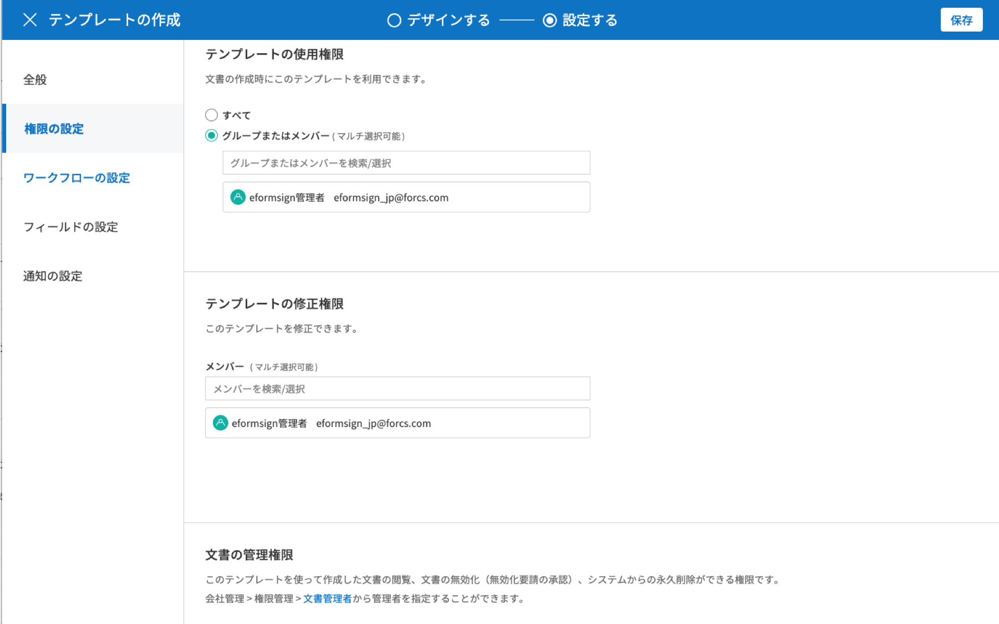
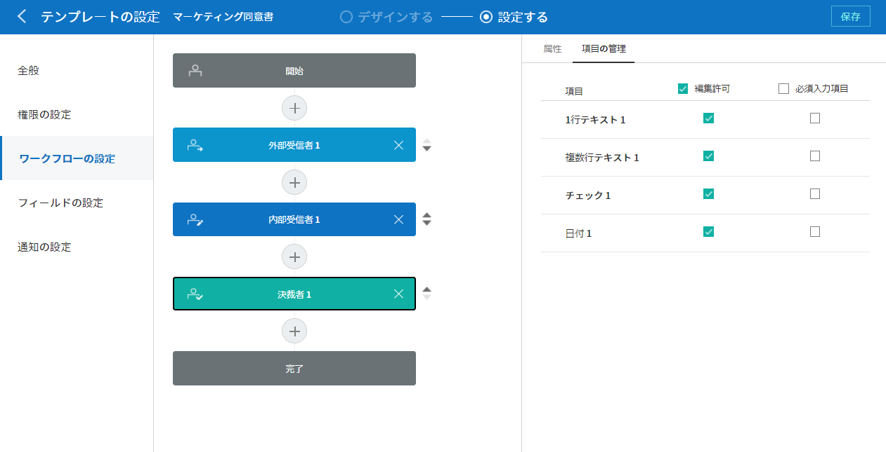
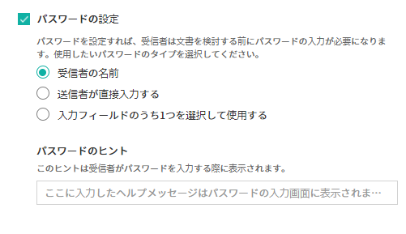

.. _template_wd:

======================================================
ウェブフォームデザイナーでテンプレートを作成する
======================================================

-----------------------------------------
テンプレートの概要
-----------------------------------------

テンプレートとは、eformsignで使用する**電子文書の書式**\ です。既存の紙で作成していた契約書、申請書、同意書などの基本的な文書書式を電子文書形式に変換したものを**テンプレート**\ と呼びます。テンプレートは、eformsignサービス内の**ウェブフォームデザイナー**または**eformsign フォームビルダー**を使用して作成およびアップロードできます。

.. tip::

   テンプレートは、頻繁にまたは定期的に作成する必要がある文書を使用する際に役立ちます。
   テンプレートとして登録しておくと、文書を作成するたびに文書のアップロードをしなくても、すばやく簡単に文書を送信することができます。

.. note::
   
   フォームビルダーによるテンプレートの設定と管理方法については、`フォームビルダーでテンプレートを作成する <chapter7.html#template_fb>`__\ をご参照ください。

**ウェブフォームデザイナーでテンプレートを作成する方法**
~~~~~~~~~~~~~~~~~~~~~~~~~~~~~~~~~~~~~~~~~~~~~~~~~~~~~~~~~~

.. note::

   ウェブフォームデザイナーの詳細については、 `ウェブフォームデザイナー <chapter4.html#webform>`__\ を参照してください。

既存の文書ファイルをウェブフォームデザイナーにアップロードすることで簡単にテンプレートを作成することが可能です。

.. note::

   アップロード可能なファイル形式は、pdf、hwp、doc、docx、xls、xlsx、ppt、pptx、odt、jpg、png、gif、tiffです。
   ファイルサイズは最大9MBまでアップロード可能です。

1.テンプレートにする文書ファイルを直接ドラッグ&ドロップするか、**PCからファイルを選択**\ をクリックし、ファイルを選択してアップロードします。

   .. figure:: resources/template-manage-upload.png
      :alt: テンプレート管理>ファイルアップロード（1）
      :width: 700px

   .. figure:: resources/template-manage-upload-popup.png
      :alt: テンプレート管理>ファイルアップロード（2）
      :width: 400px

2.文書に合わせて文書参加者を追加し、役割を設定します。

   .. figure:: resources/wfd-participants.png
      :alt: 入力項目をドラッグする方法
      :width: 400px

3.参加者が入力する必要がある入力項目を選択して文書にドラッグ&ドロップします。

   .. figure:: resources/web-form-designer1.png
      :alt: 入力項目をドラッグする方法
      :width: 700px

4.入力項目のサイズと位置を調整します。

5. 該当する入力項目の属性で詳細設定を行います。

6. **プレビュー** ボタンをクリックして文書を確認します。

7. フォームのデザインが完了したら、**設定する**\ をクリックしてテンプレートの設定に移動します。

**テンプレートの設定**

テンプレートの詳細設定を行うことが可能です。

- `全般 <#general_wd>`__\

   テンプレート名、テンプレート名の略称、文書タイトル、文書番号などを設定します。

- `権限の設定 <#auth_wd>`__\

   該当テンプレートを使用して文書を生成できるテンプレート使用権限と、生成された文書を管理するメンバーまたはグループを指定します。

- `ワークフローの設定 <#workflow_wd>`__\

   文書の作成から完了までに作成された文書が処理されるステップを設定します。

- `フィールドの設定 <#field_wd>`__\

   フィールドの初期値、自動入力値などを設定します。

- `通知の設定 <#noti_wd>`__\

   テンプレートで作成された文書の状態変更時に通知を受信する受信者、または通知メッセージの内容などを設定します。

.. _workflow:

---------------------
ワークフローの概要
---------------------

**ワークフロー**\ とは、文書が作成され、文章の作成から完了までの、文書のリクエストおよび処理プロセスを言います。

ワークフローは、テンプレート管理者がテンプレートごとに**テンプレートの設定** > **ワークフローの設定**\ で設定を行えます。

ワークフローは、**開始 - 完了**\ が基本ステップです。また、以下のように **検討者**\、**参加者**\の2つのステップを必要に応じて追加してワークフローを作成することも可能です。

.. figure:: resources/workflow_new.png
   :alt: ワークフローステップ
   :width: 500px

- **検討者**

   文書を確認後、承認または返戻します。

- **参加者**

   文書の入力コンポーネントに入力または署名します。

.. _template_setting:

---------------------
テンプレートの設定
---------------------

アップロードしたファイルで作成するテンプレートの詳細を設定できます。

.. note::

   この作業には、**代表管理者**または**テンプレート管理** 権限が必要です。PC、モバイル、アプリケーションで行うことができます。

.. _general_wd:

全般
~~~~~~~~~~~~~~~

.. figure:: resources/template-setting-general.png
   :alt: テンプレートの設定>全般
   :width: 700px

**テンプレートの基本情報の設定**
-----------------------------------

テンプレート名、カテゴリ、有効期限など、テンプレートに関する基本情報を設定します。

**① テンプレート名**
   **テンプレート管理**、**テンプレートで文書を作成** メニュー画面に表示されるテンプレート名です。

   **テンプレート名**\ はスペースを含む11文字程度を推奨しています。 11文字以上入力した場合、11文字以降は隠れて表示されません。完全なテンプレート名は、テンプレート名の上にマウスを置き、しばらく待つと確認することができます。

   .. figure:: resources/template-name.png
      :alt: テンプレート名
      :width: 250px

         

**② テンプレートの略称**
   テンプレート名を簡略化した名称です。 2, 3文字程度の短い単語を推奨します。

   **テンプレートの略称**\ は、文書番号、文書タイトル、通知メールテンプレートなどで使用できます。

         

**③ カテゴリ**
   テンプレートを種類別に分けるときに使用します。**テンプレート管理**\ 画面のテンプレート、**文書トレイ**\、 **文書管理**\メニューの文書をカテゴリー名でフィルタリングすることができます。既存のカテゴリから選択、または新規カテゴリ作成が可能です。

   区切り文字（ **/** ）を使用すると、多階層カテゴリを設定できます。例えば、カテゴリーを **人事チーム/休暇関連**\と設定すると、第一階層のカテゴリ**人事チーム**内に第二層カテゴリの **休暇関連** カテゴリーが生成されます。

**④ 説明**
   テンプレートに関する説明文を入力します。この説明文は、テンプレートリスト及び **テンプレートで作成する**\を開く際に表示されます

**⑤ テンプレート有効期限**
   テンプレートで文書を作成できる期限を設定します。開始日の初期値はテンプレートをアップロードした日付となり、任意の日付に変更できます。

   **期間の制限なし**\ にチェックを入れると、期限に関わらずいつでも文書を作成できます。**期間の制限なし** のチェックを外すと終了日を設定できます。終了日を設定すると、終了日が過ぎた場合当該テンプレートで文書を作成できなくなります。

**文書の設定**
-----------------------------------

テンプレートから作成した文書に対して、文書タイトルの自動生成ルールなどの追加設定を行います。

**⑥ 文書タイトルの自動生成ルール**
   テンプレートから文書を作成する際の、文書タイトルのルールを設定します。文書タイトルの自動生成ルールを設定しない場合、自動的にテンプレート名が文書タイトルになります。

**⑦ 文書タイトルの変更を許可する**
   **文書タイトルの変更を許可する**\ にチェックを入れると、*作成* ステップの文書作成者が文書タイトルを変更可能になります。

**⑧ 文書番号の自動付与**
   文書番号の自動付与にチェックを入れると、作成する文書に対して自動的に文書番号が付与されます。文書番号式の中から、文書番号の形式を指定できます。ま文書番号の付与タイミングを任意に選択できます。

   |image1|

**⑨ 文書の送信時に表示されるポップアップ画面を省略する**
   文書をすばやく作成して送信することが多い場合に使用します。この項目にチェックを入れない状態で文書を送信した場合、**確認メッセージの入力**\ ポップアップウィンドウが表示されます。 **文書の送信時に表示されるポップアップ画面を省略する**\ にチェックを入れると**メッセージを入力** ポップアップウィンドウが表示されないまま、次のステップに進みます。

.. _document_naming:

全般 > 文書タイトルルールを追加する
-----------------------------------

**テンプレートの設定**\ では、テンプレートから作成される文書のタイトル生成ルールを設定できます。

**テンプレート文書のタイトルルール**
^^^^^^^^^^^^^^^^^^^^^^^^^^^^^^^^^^^^^^^^^

文書に入力した内容、または文書作成に関する情報が文書タイトルに自動に入力されるように設定できます。文書タイトルの自動生成ルールを設定すると、文書の作成時の情報に基づいて文書タイトルが生成されます。、この文書タイトルは、すべての文書トレイ（進行中の文書、要処理文書、完了文書）と**文書管理**\ メニューの文書リストから確認できます。

.. figure:: resources/document-list.png

   :alt:文書管理　>　文書リスト
   :width: 700px

**文書タイトルのルールを設定する方法**
+++++++++++++++++++++++++++++++++++++++++++++++++

.. figure:: resources/template-setting-general-doc-numering_rule.png
   :alt: テンプレートの設定 > 文書タイトルルールの設定
   :width: 600px

1.サイドバーメニューから　**テンプレート管理**\ 　に移動します。

2.テンプレートの　**設定**　アイコン（|image2|）をクリックして **テンプレートの設定** 画面に移動します。

3. **全般** 画面の **文書タイトルの自動生成ルール** の入力欄に、任意のタイトル規則を入力します。

4. 右上の **保存** ボタンをクリックして変更を保存します。

**ルールを追加する方法**
+++++++++++++++++++++++++++++++++++++++++

.. figure:: resources/template-setting-general-doc-numering_rule_reserved.png
   :alt: ルールを使用して文書タイトルのルールを設定

- **文書入力項目**\ ： 入力欄に入力された内容を文書タイトルに追加します。

   **ルール追加** ボタンをクリック後、**文書の入力コンポーネント**\ をクリックするとテンプレートのコンポーネントIDのリストが表示されます。選択された入力コンポーネント内の情報が文書のタイトルに追加されます。

- **基本情報**\ ： 文書に関する情報をタイトルに追加します。

   **基本情報**\ をクリックすると以下の項目から、文書のタイトルに表示する情報を設定できます。

+----------------------+---------------------------------------------------------+
| 情報タイプ           | 説明                                                    |
+======================+=========================================================+
| 現在日付             | 文書作成時点の日付（例：2020年02月20日)                 |
+----------------------+---------------------------------------------------------+
| 現在時刻             | 文書作成時点の時刻（例：午後02:59)                      |
+----------------------+---------------------------------------------------------+
| 現在日付時刻         | 文書作成時点の日付と時刻（例：2020年2月20日午後02:59）    |
+----------------------+---------------------------------------------------------+
| 文書作成者ID         | 文書を作成したメンバーのID                              |
+----------------------+---------------------------------------------------------+
| 文書作成者名         | 文書を作成したメンバーの名前                            |
+----------------------+---------------------------------------------------------+
| 文書作成者部門       | 文書を作成したメンバーの部署                            |
+----------------------+---------------------------------------------------------+
| 文書作成者会社名     | 文書を作成したメンバーの会社名                          |
+----------------------+---------------------------------------------------------+
| テンプレート名       | テンプレートの設定 > 全般に入力したテンプレート名       | 
+----------------------+---------------------------------------------------------+
| テンプレート略称     | テンプレートの設定 > 全般に入力したテンプレートの略称   |
+----------------------+---------------------------------------------------------+
| 会社名               | 会社管理 > 会社情報に入力した会社名                     |
+----------------------+---------------------------------------------------------+
| 会社住所             | 会社管理 > 会社情報に入力した住所                       |
+----------------------+---------------------------------------------------------+
| 会社連絡先           | 会社管理 > 会社情報に入力した連絡先                     |
+----------------------+---------------------------------------------------------+
| 会社事業者登録番号   | 会社管理 >                                              |
|                      | 会社情報に入力した事業者登録番号                        |
+----------------------+---------------------------------------------------------+
| 会社ホームページ     | 会社管理 > 会社情報に入力したホームページURL            |
+----------------------+---------------------------------------------------------+

.. tip::

   **文書タイトルの変更を許可する** にチェックが入っているか確認してください！

   文書タイトルの自動生成ルールを設定しても、**文書タイトルの変更を許可する**\  にチェックが入っていると、文書作成者は文書のタイトルを任意に変更することが可能です。文書のタイトルを変更したくない場合は、**文書のタイトルの変更を許可する**\ のチェックを外してください。

.. figure:: resources/template-setting-general-doc-numering_rule_allow_change.png

   :alt:文書タイトルの変更を許可するかどうかを確認する

.. _docnumber_wd:

全般>文書番号の生成と確認
---------------------------------------

テンプレートごとに作成された文書に連番の文書番号を付与できます。文書番号自動生成の有無を設定でき、4つある文書番号形式の中から1つを選択して設定できます。文書番号は、文書コンポーネントを使用して文書内に入力することができます。また、文書リストからの確認、文書番号での文書検索が可能です。

**文書番号の生成方法**
^^^^^^^^^^^^^^^^^^^^^^^^^^^^

.. figure:: resources/template-setting-general-doc-numering1.png

   :alt:文書番号を設定する
   :width: 600px

1.サイドバーメニューから **テンプレート管理**\ に移動します。

2.テンプレートの **設定** アイコン（|image3|）をクリックして **テンプレートの設定** 画面に移動します。

3. **全般** 画面の **文書番号の自動付与**\ にチェックを入れます。

   - **文書番号ルールを選択**

   .. figure:: resources/template-setting-general-doc-numering1_1.png
      :alt: 文書番号ルールの選択

   **▪ シリアル番号**
      文書の作成順に1番から生成します。

      例）1、2、3...

   **▪ 年度_シリアル番号**
      文書が作成された年度 + 文書の作成順に1番から生成します。

      例）2020_1、2020_2...

   **▪ テンプレート略称シリアル番号**
      テンプレート略称 + 番号1番から生成

      例）申請書1、申請書2...

   **▪ テンプレート略称年度_シリアル番号**
      テンプレート略称 + 文書が作成された年度 + 文書の作成順に1番から生成します。

      例）申請書2020_1、申請書2020_2...

   - **文書番号の付与タイミングを選択**

   ▪ **スタート**
      文書の作成開始ステップで文書番号を生成します。

   ▪ **完了**
      文書がすべてのワークフローを経て、文書が完了する際に文書番号を生成します。

4.右上の **保存** ボタンをクリックして設定を保存します。

**文書番号を確認する方法**
^^^^^^^^^^^^^^^^^^^^^^^^^^^^

文書番号は、文書コンポーネントを利用することで文書内に入力できます。また、文書リストから文書番号を確認することができます。

- **文書内に文書番号を表示する**

   文書番号は、文書番号コンポーネントを使用することで文書内に入力できます。

   1. ウェブフォームデザイナーに文書ファイルをアップロードします。

   2. 文書番号が入るパスに文書番号コンポーネントを追加します。

      |image4|

   3. **設定する**　ボタンをクリックして　**テンプレートの設定**\ 　に移動します。

   4. **テンプレートの設定　>　全般**\ 　で　**文書番号の自動付与**\ 　にチェックを入れます。

   5.　文書番号ルールを選択します。

   6. **保存**　ボタンをクリックして設定を保存します。

- **文書リストで文書番号を確認する**

   .. figure:: resources/doc-list-docnumber1.PNG
      :alt: 完了文書 - 文書リスト
      :width: 700px

   .. figure:: resources/doc-list-docnumber2.png
      :alt: 完了文書 - 文書リスト - 文書番号の確認
      :width: 700px

   文書番号は、文書リストが確認できる文書トレイ（進行中の文書、要処理文書、完了文書）および文書管理メニュー（文書管理権限が必要）で確認できます。

   1.　サイドバーメニューの　**文書トレイ**　または　**文書管理**　メニューに移動します。

   2. 右上の　**列設定**　アイコンをクリックします。

   3. 列リストの **文書番号**\ をチェックします。

      |image5|

   4.　カラムリストに　**文書番号**　列が追加されていることを確認します。

- **文書番号で文書を検索する**

   |image6|

   文書番号による検索は、詳細検索機能から行うことができます。

   1. **文書トレイ**　または　**文書管理**　メニューに移動します。

   2.　文書リストの上部にある　**詳細**　ボタンをクリックします。

   3.　条件の中から　**文書番号**\ 　を選択します。

   4.　検索する単語または数字を入力します。

   5. 検索結果を確認します。

.. _auth_wd:

権限の設定
~~~~~~~~~~~~~~~

権限の設定画面では、テンプレートの使用権限、テンプレートの修正権限、文書の管理権限を設定することが可能です。

**テンプレートの使用権限**

テンプレートを使用して文書を作成する際の権限を設定します。**すべて**\ に設定すると、会社に属する全てのメンバーが使用できます。特定のグループ、メンバーにのみ作成の権限を与えたい場合は**グループまたはメンバー**\ を選択すると、権限を与えるグループ、メンバーを指定して権限を付与できます。

**テンプレートの修正権限**

対象のテンプレートを修正可能となる権限を設定します。**メンバー**\ 　を検索して選択します。

**文書の管理権限**

テンプレートを使用して作成された文書の閲覧、完了文書の無効化の依頼の承認、文書を永久削除する権限を付与できます。 権限はグループ、メンバーを選択して付与することができます。

- **すべての文書を閲覧する（デフォルト権限）：**\ 文書管理者のデフォルト権限です。文書管理の権限があるグループまたはメンバーには、本項目の選択に関係なく、全ての文書を閲覧する権限が付与されます。

- **文書を無効化する（オプション）：**\ 完了した文書に対して文書作成者が無効化を要請した場合、要請を承認してその文書を無効化できる権限です。

- **文書を永久削除する（オプション）：**\ システムから文書を永久に削除する権限です。

.. _workflow_wd:

ワークフローの設定
~~~~~~~~~~~~~~~~~~~

**テンプレートの設定** 画面で **ワークフローの設定** タブをクリックすることで、そのテンプレートのワークフローを作成または修正できます。

.. figure:: resources/workflow-setting_new.PNG
   :alt: テンプレートの設定 > ワークフローの設定
   :width: 600px

**ワークフローステップを追加する方法**
--------------------------------------------

1. **ワークフローの設定** タブをクリックして移動します。

2. 開始と完了の間のステップを追加（|image8|）ボタンをクリックします。

3. **受信先タイプを選択する**\ で追加したい **受信先タイプ**\ を選択します。

   |image9|

4. 選択時にワークフローにステップが追加されます。
.. tip::

   参加者は **フォームのデザイン** ステップで追加する必要があり、最大30人まで追加することが可能です。
   検討者を含むワークフローステップは、制限なしで追加することが可能です。ワークフローステップをドラッグ&ドロップして順序を調整することが可能で、ステップの右側にある **-**\ をクリックするとステップが削除されます。

   |image10|

**ワークフローステップ別詳細設定**
-------------------------------------

[ステップ]をクリックすることで、各ワークフローステップごとに詳細プロパティを設定できます。

**開始：文書を作成するステップです。**

+++++++++++++++++++++++++++++++++++++++++++++++++++++++

|image12|

- **文書生成数の制限**：　チェックをいれることで、該当テンプレートで作成可能な最大文書数を設定します。

- **URLで文書作成を許可する**：　メンバー以外の外部ユーザーに文書作成を要請する際に使用します。eformsignへのログイン無しで、文書を作成できる公開リンクを生成します。

- **アクセス許可ドメイン/IP**：　特定のドメインまたはIPからのみ文書を作成できるように設定できます。

- **文書の重複転送を防止する**：　選択したフィールドについて重複の有無を確認し、文書を重複して送信することを防ぎます。

**参加者：文書の入力項目に作成、署名などの文書に参加する受信者のステップです。**

++++++++++++++++++++++++++++++++++++++++++++++++++++ +++++++++++++++++++++++++++++++++++++++++++++++

.. figure:: resources/workflow-participant-properties.png

   :alt:　ワークフローの設定>参加者レベルのプロパティ
   :width: 700px

- **通知**\ ：　受信者に文書作成を要請した際に、通知を送信する方法を設定します。通知内容は編集が可能です。

   - **通知方法の選択：**　通知はデフォルトで電子メールでのみ送信されます。SMSを選択すると、**文字**\ 　SMSでも送信可能です。

   - **通知内容の編集：**　各ステップで受信者に送信される文書の通知内容を編集することができます。

- **文書の送信期限**\ ：　受信者が文書を受信した後、次のステップの受信者に文書を送信するまでの期限を設定します。文書の送信期限を設定する必要が無い場合は、0日0時間と入力してください。
   

- **受信者情報の自動設定**\ ：　受信者に文書作成を依頼する際、文書に入力した情報を基に受信者の氏名および連絡先を自動的に設定できます。

- **文書の閲覧前に本人確認する**\ ：本人確認をした後、文書を閲覧できるように設定します。

   - **本人確認情報**\ : **受信者の名前**\ 、**入力フィールドから選択**\ 、または**送信者が直接入力する**\ 　の中から選択して受信者が文書閲覧する前に入力が必要な情報を設定します。

   - **追加認証手段**\ ：　本人確認の手段を追加で設定します。電子メール認証と携帯電話認証の両方が設定されている場合、受信者は本人確認の際に任意の認証方法を1つ選択し認証できます。
      
         - **メール認証**\ ：　受信者のメールアドレスに6桁の認証番号が送信されます。送信された認証番号を本人確認ウィンドウに入力することで認証が完了します。

         - **携帯電話本人確認**\: 携帯電話番号による本人確認を行います。本機能は本人名義の携帯電話番号が必須です。

**参加者/検討者 - 受信者の設定**

.. figure:: resources/workflow-participant-selected.png

   :alt:ワークフローの設定>参加者の受信者を指定する
   :width: 700px

当該ステップの受信者を事前に設定する機能です。

- **グループまたはメンバー**： 文書を処理するグループまたはメンバー1人を設定します。グループまたはメンバーは複数選択することが可能ですが、選択されたグループ及びメンバー中1人だけが文書を処理することができます。

- **前の受信者**： 開始ステップを含む前のステップの受信者が文書を処理するように設定します。当該ステップより前のステップから選択できます。

**検討者：検討者は、レビュー後に文書を承認または返戻することが可能です。**

++++++++++++++++++++++++++++++++++++++++++++++++++++ +++++++++++++++++++++++++++++

.. figure:: resources/workflow-reviewer-properties.png

   :alt:ワークフローの設定>検討者
   :width: 700px

- **ステップ名**\ ： ステップの名前を設定することができます。

- **通知**\ ： 受信者に文書作成を要請した時に通知を送信する方法を設定し、通知内容を編集することが可能です。

   - 通知方法の選択： 通知はデフォルトで電子メールで送信されます。　SMSを選択すると、**文字**\ 　SMSで送信されます。

   - 通知内容の編集： 各ステップで受信者に送信される文書要の請通知内容を編集することが可能です。

- **文書の送信期限**\ ： 受信者が文書を受信した後、次のステップの受信者に文書を送信するまでの期限を設定します。文書の送信期限を設定する必要が無い場合は、0日0時間と入力してください。

**完了： 文書がすべてのワークフローステップを経て最終的に完了されるステップです。**

++++++++++++++++++++++++++++++++++++++++++++++++++++ +++++++++++++++++++++++++++++

|image18|

- **別のクラウドストレージに完了文書を保存する**：完了文書を、代表管理者または会社管理者が別途に設定した外部クラウドストレージに保存するように設定します。

- **完了文書にタイムスタンプを付与する**：完了した文書が以降変更されていないことを証明するタイムスタンプを文書に適用するように設定します。この機能は追加料金が発生します。

.. _field_wd:

フィールド設定
~~~~~~~~~~~~~~~~~

**フィールド設定**\ 　では、文書リストとCSVにデータをダウンロードした時に表示されるコンポーネントの列の表示可否と順序を設定できます。また、テンプレートに入るフィールドの初期値または自動入力値を設定できます。

.. figure::resources/template-field-setting.png
   :alt:テンプレートの設定>フィールド設定
   :width: 700px

フィールドの初期値は、**カスタムフィールド管理**\ に保存されている会社・グループ・メンバーの情報を入力するように設定するか、情報を選択して設定、最近の入力値を選択して設定、ユーザーが直接入力して設定のうちいずれかの入力方法を選択して設定できます。

.. tip::

   **自動入力を設定する方法**

   文書に頻繁に入力する情報を事前に保存し、自動的に入力するように設定できます。

   例えば、作成者の名前、連絡先などの作成者情報、部署名、責任者、会社の代表番号など、会社またはグループに関する情報を事前に保存して自動的に入力するように設定できます。。関連フィールドの項目の追加と初期値の設定は、**会社管理　>　カスタムフィールド管理**\ 　で行うことができます。

   1. **カスタムフィールドの管理**　画面でフィールドを追加します。

   2. **テンプレートの管理**　メニューに移動します。

   3. **テンプレートの設定**　アイコンをクリックします。

   4. **フィールドの設定**　メニューに移動します。

   5.　自動入力するフィールドの初期値を入力します。

   6. 全ての設定が完了されたら、**保存**　ボタンをクリックします。

.. _noti_wd:

通知設定
~~~~~~~~~~

テンプレートで作成された文書ステータスの通知や依頼を受信する受信者の設定や通知内容の確認、編集ができます。

**ステータス通知の設定**

当該テンプレートで作成した文書のステータスに関する通知の受信者設定、通知メッセージのプレビュー（文書の検討および作成/文書の返戻/文書の無効化/文書の修正）または通知編集（文書の完了通知）を行うことができます。

.. figure:: resources/template-setting-notification-channel.png
   :alt: 通知チャンネルの設定

.. figure:: resources/template-setting-notification-editl.png
   :alt: 通知内容の編集
   :width: 400px

.. note::

   **文書の作成者** オプションにチェックを入れ、**各ステップの処理者** オプションのチェックを外した場合、文書を最初に作成した人にステータス通知を送信します。

   **文書の作成者**\ オプションのチェックを外し、**各ステップの処理者**\ オプションにチェック入れた場合、最初に作成した人を除く、現在のステップの前に文書を処理した人にステータス通知を送信します。

   **文書の作成者**\、**ステップごとの処理者**\ オプション両方にチェックを入れた場合、文書の作成者・現在ステップ以前に文書を処理した処理両者にステータス通知を送信します。

   **文書の作成者**\、**ステップ別の処理者**\ オプション両方のチェックを外した場合、当該ステップのステータス通知は送信されません。

------------------------
個別テンプレートメニュー
------------------------

**テンプレート管理**\ 画面で、テンプレート名の右側にあるメニューアイコンをクリックすると、各テンプレートごとのメニューが表示されます。

|image23|

- **複製**：　テンプレートを複製します。テンプレートの文書ファイルとテンプレートの設定が複製されます。詳細設定の変更、保存が可能です。

- **削除**：　テンプレートを削除します。テンプレートを削除すると、今後そのテンプレートでは文書を作成できなくなります。

- **無効化**：　テンプレートを無効化します。テンプレートを無効化すると、他のメンバーの　**テンプレートで文書を作成**　ページに当該テンプレートが表示されなくなります。

- **所有者を変更**：　テンプレートの所有者を変更できます。デフォルトでは、テンプレートの所有者はテンプレートをの作成者になります。所有者を変更して他のメンバーに所有者を変更することも可能です。テンプレートの所有者は、テンプレートの管理権限を持つメンバーの中から選択できます。

   |image24|

- **文書管理者の設定：**　当該テンプレートで作成される文書の文書管理者を設定できます。 **　テンプレートの設定>権限の設定>文書の管理権限**\ とです。

   |image25|

- **文書番号設定変更**：　テンプレートの設定で設定した文書番号設定を変更できる機能です。文書番号が採番されるテンプレートの開始番号を再設定することが可能です。

   .. caution::

      同じ文書番号で2つの文書が生成される可能性がありますので、文書番号の重複が無いよう、確認してから変更してください。

   |image26|

-----------------
テンプレート検索
-----------------

**テンプレート管理**　画面では、テンプレートをカテゴリでフィルタ、検索、ソートできます。

|image27|

**①　テンプレート検索**
   クリックすると、テンプレートの状態、カテゴリでテンプレートをフィルタできます。 **X** をクリックすると、全てのカテゴリを表示します。
   カテゴリの作成は、**テンプレートの設定>全般**\ で行うことが可能です。

**②　テンプレート検索**
   テンプレート名やカテゴリー名などの検索キーワードを入力することで、テンプレートを検索できます。

**③　ソート**
   テンプレートをテンプレート名またはカテゴリで昇順、降順に並び替えます。

.. |image1| image:: resources/template-setting-general-doc-numering.png
.. |image2| image:: resources/config-icon.PNG
.. |image3| image:: resources/config-icon.PNG
.. |image4| image:: resources/web-form-designer-document-component.png
   :width: 700px
.. |image5| image:: resources/columnlist-docnum.png
.. |image6| image:: resources/doc-number-search.png
   :width: 600px
.. |image7| image:: resources/template-setting-auth-doc-new.PNG
   :width: 700px
.. |image8| image:: resources/workflow-addstep-plus-button.png
.. |image9| image:: resources/workflow-addstep-type2.png
   :width: 700px
.. |image10| image:: resources/workflow-step-added.png
   :width: 400px

.. |image12| image:: resources/workflow-step-start-property.png
   :width: 700px
.. |image13| image:: resources/workflow-step-approval-property.png
   :width: 700px
.. |image14| image:: resources/template-approval-property-displayname.png
   :width: 250px
.. |image15| image:: resources/workflow-step-internal-recipient-property.png
   :width: 700px

.. |image18| image:: resources/workflow-step-complete-property.png
   :width: 700px
.. |image19| image:: resources/template-setting-notification-edit.png
   :width: 450px
.. |image20| image:: resources/template-setting-notification-edit-email.png
   :width: 700px
.. |image21| image:: resources/template-setting-notification-status.png
   :width: 500px
.. |image22| image:: resources/template-hamburgericon.png
.. |image23| image:: resources/template-manage-menu-wfd.png
   :width: 500px
.. |image24| image:: resources/template-owner-change.PNG
.. |image25| image:: resources/document-manager-setting.PNG

.. |image27| image:: resources/template-manage-search.png
   :width: 700px
   