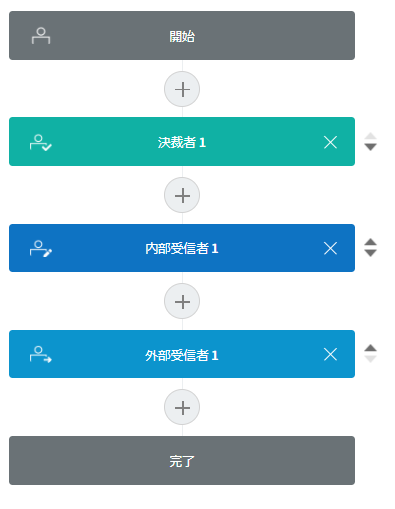
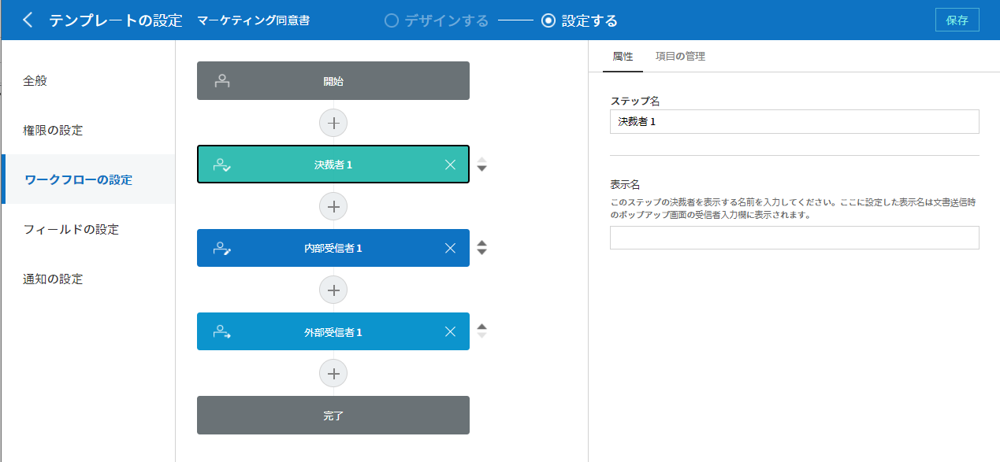

.. _template_wd:

テンプレートの作成：Web フォームデザイナー
==========================================

テンプレートの紹介
---------------------

eformsign で使用する **電子文書の書式** です。契約書、申込書、同意書などのように従来は紙で書かれていたものを電子書式の形に変換したものをテンプレートと言います。テンプレートは、eformsign サービスの **Web フォームデザイナー** 、または Microsoft Office に Add-in される **フォームビルダー** を使用して作成およびアップロードすることができます。フォームビルダーを使用したテンプレートの設定および管理する方法については、`フォームビルダー <chapter7.html#template_fb>`__\ をご参照ください。

テンプレートの概要
~~~~~~~~~~~~~~~~~~~~~~

eformsign を使用して電子文書を作成して送信するには、まず電子文書を生成できるテンプレートを作成した後、配布する必要があります。

**Web フォームデザイナーでテンプレートを作成する方法**

文書をオンラインで直接アップロードしてテンプレートを作成します。

.. note::

   テンプレートの詳細な説明については、`Web フォームデザイナーの紹介 <chapter4.html#webform>`__\ をご参照ください。

既存の文書を PDF ファイルに変換し、Web フォームデザイナーにアップロードすることで、テンプレートを簡単に作成できます。

1. 作成したい PDF ファイルをテンプレート作成カードに直接ドラッグするか、\ **PCからファイルを選択** をクリックしてファイルを選択し、アップロードします。

   .. figure:: resources/template-manage-upload.png
      :alt: テンプレート管理 > ファイルのアップロード (1)
      :width: 700px

   .. figure:: resources/template-manage-upload-popup.png
      :alt: テンプレート管理 > ファイルのアップロード (2)
      :width: 700px

2. コンポーネントのタイプを選択し、アップロードされたファイルにドラッグします。

   .. figure:: resources/web-form-designer1.png
      :alt: コンポーネントをドラッグする方法
      :width: 700px

3. コンポーネントのサイズと位置を調整します。

4. コンポーネントの **プロパティ** で詳細設定を行います。

5. **プレビュー** ボタンをクリックして、文書を表示します。

6. フォームのデザインを終えた後、 **次へ** をクリックして **テンプレートの設定** に移動します。

**テンプレートの設定**

作成するテンプレートの詳細設定を行うことができます。

-  `全般 <#general_wd>`__

   テンプレート名、略称、文書のタイトル、文書番号などを設定します。

-  `権限の設定 <#auth_wd>`__

   テンプレートを使って文書を作成できるテンプレートの使用権限、および作成された文書を管理するメンバーまたはグループを指定します。

-  `ワークフローの設定 <#workflow_wd>`__

   文書の作成から完了までのステップをを設定します。

-  `フィールドの設定 <#field_wd>`__

   フィールドの表示有無、順番、基本値、自動入力値などのデフォルト値を設定します。

-  `通知の設定 <#noti_wd>`__

   テンプレートによって作成される文書を依頼する場合、または、状態の変更がある場合、どのチャンネルで、誰（受信者）に、どうした内容の通知メッセージを送信するかを設定します。

ワークフローの概要
~~~~~~~~~~~~~~~~~~~~~~

ワークフローとは、文書の作成から完了までの依頼と処理のフローを言います。

ワークフローの設定は、テンプレート管理者がテンプレート毎に **テンプレートの設定** > **ワークフローの設定** で行えます。

ワークフローは **開始 ― 終了** がデフォルトのステップであり、次のように **決裁者、内部受信者**\ 、\ **外部受信者** の3つのタイプのいずれかを追加し、ワークフローを作成することができます。

-  **決裁者**

   同じ会社のメンバーから文書の決裁を依頼するステップです。

-  **内部受信者**

   メンバーに文書の処理を依頼するステップです。

-  **外部受信者**

   会社のメンバーではない外部のユーザーに文書の処理を依頼するステップです。

   .. important::

      **決裁者と内部受信者の違い！**

      決裁者と内部受信者は両方とも、依頼された文書を承認または返戻できますが、内部受信者として文書処理の依頼を受けたメンバーの場合、文書を検討および作成した後、次のステップの受信者（処理の担当者）を指定することができます。

      つまり、内部受信者ステップの後に、外部受信者、内部受信者、または決裁者を指定できます。

      たとえば、他部署の決裁手順を指定せず、その文書への協力を別の部署に依頼する場合は、その他部署の担当者を内部受信者のステップに指定します。他部署の担当者は、その部署の決裁手順を別途設定して文書を処理できます。

テンプレートの設定
---------------------

アップロードされたファイルで作成するテンプレートの詳細を設定できます。

.. note::

   この作業を行うには、代表管理者の権限またはテンプレートの管理権限が必要です。

   この作業は、PC、モバイル、およびアプリケーションで実行できます。

**テンプレート設定の画面に移動する方法**

1. サイドバーのメニューで **テンプレート管理** に移動します。

2. 目的のテンプレートの **名前** または **設定** アイコン（\ |image1|\ ）をクリックします。

   |image2|

.. _general_wd:

全般
~~~~~~~~

.. figure:: resources/template-setting-general.png
   :alt: テンプレート設定 > 全般
   :width: 700px

基本設定
   テンプレート名、カテゴリー、有効期限など、テンプレートに関する基本情報を設定します。

① テンプレート名
   **テンプレート管理**\ 、\ **文書の新規作成** メニュー画面に表示されるテンプレートの名前です。

   **テンプレート名** は、スペースを含めて11文字以内を推奨しています。11文字を超える場合は、名前の上にマウスを置くと、テンプレートの完全な名前を確認することができます。

   .. figure:: resources/template-name.png
      :alt: テンプレート名
      :width: 250px

② テンプレートの略称
   テンプレートを簡単に表示するための短い名前です。2~3 文字の簡単な単語で設定してください。

   **テンプレートの略称**
   は、文書番号、文書タイトル、通知メールテンプレートなどで **$$** を入力して使用することができます。

   .. figure:: resources/template-short-name.png
      :alt: テンプレートの略称

③ カテゴリ
   テンプレートをタイプごとに区分するために使用します。カテゴリー名で\ **テンプレート管理** 画面のテンプレート、または **文書トレイ**\ 、\ **文書管理**
   メニューで文書をフィルタリングできます。既存のカテゴリーから選択することも、新しい名前を入力して新しいカテゴリーを作成することもできます。

   区切り文字（\ **/**\ ）を使用すれば、サブカテゴリーを含むマルチレベルのカテゴリーを設定できます。たとえば、カテゴリーを **人事チーム/休暇** で設定すれば、最上位レベルのカテゴリーである **人事チーム** に第2レベルのサブカテゴリーである **休暇** カテゴリーが生成されます。

④ 説明
   テンプレートに関する追加の説明を入力します。この説明は、テンプレートリストと文書の新規作成リストのテンプレート名の下部に表示されます。

⑤ テンプレート有効期限
   テンプレートで文書を作成できる期限を設定します。開始日はテンプレートがアップロードされた日付がデフォルトで設定されますが、変更も可能です。

   **期間の制限無し**
   にチェックを入れると、有効期限無しで文書を作成できます。\ **期間の制限無し** のチェックを外した後、日付を設定すると、文書は設定した日付までしか作成できません。

文書の設定
   テンプレートで作成した文書に対して、文書タイトルの自動生成ルールなどの追加設定を行います。

⑥ 文書タイトルの自動生成ルール
   テンプレートで文書を作成するときの文書のタイトルを設定します。文書タイトルの生成ルールを設定しない場合、テンプレート名が文書タイトルになります。
   文書タイトルには **$$** と **{{** を使用して予約語を追加できます。

⑦ 文書タイトルの変更を許可する
   **文書のタイトルの変更を許可する** にチェックを入れれば、 **作成** ステップの文書の作成者が文書のタイトルを変更できます。

⑧ 文書番号の自動付与
   文書番号の自動付与にチェックを入れると、作成された文書に対して文書番号が自動で付与されます。文書番号の表現式のうち、必要な文書番号の表現式を選択し、文書番号を生成する時期と番号の採番時点を選択します。

   |image3|

⑨ 文書の送信時に表示されるポップアップ画面を省略する
   文書の作成と送信を迅速に行うことの多いケースに使用します。この設定にチェックを入れないと、文書の送信時に **確認メッセージを入力する** ポップアップウィンドウが表示されます。\ **文書の送信時に表示されるポップアップ画面を省略する** にチェックを入れれば、 **メッセージを入力する** ポップアップウィンドウが表示されずに、次のステップに進みます。

全般 > 文書タイトルの自動生成ルールの作成
~~~~~~~~~~~~~~~~~~~~~~~~~~~~~~~~~~~~~~~~~

**テンプレートの設定** では、テンプレートで生成される文書のタイトルルールを設定できます。

文書に関する情報が文書タイトルに自動で入力されるよう設定することができます。文書タイトルの自動生成ルールを設定すると、文書の作成時の情報に基づいて文書タイトルが生成されます。この文書タイトルは、すべての文書トレイ（要処理、進行中、完了文書）と 文書管理メニューの文書リストで確認できます。

.. note::

   この作業は **代表管理者** または **テンプレート管理** の権限が必要です。

.. figure:: resources/document-list.png
   :alt: 文書管理 > 文書リスト
   :width: 700px

**文書タイトルの自動生成ルールを設定する方法**

.. figure:: resources/template-setting-general-doc-numering_rule.png
   :alt: テンプレート設定 > 文書タイトルの自動生成ルールの設定
   :width: 600px

1. サイドバーのメニューで **テンプレート管理** に移動します。

2. テンプレートの **設定** アイコン (|image4|) をクリックして **テンプレートの設定** メニューに移動します。

3. **全般** 画面上の **文書タイトルの自動生成ルール** の入力欄に、目的のタイトルルールを入力します。

4. 右上の **保存** ボタンをクリックして、変更内容を保存します。

**予約語を使用する方法 テンプレート 予約語**

.. figure:: resources/template-setting-general-doc-numering_rule_reserved.png
   :alt: 予約語を使用して文書タイトルの自動生成ルールの設定

**{{** 文書に入力した内容を文書タイトルに追加したい場合には、

   **文書タイトルの自動生成ルール** の入力欄に **{{** を入力すると、テンプレートに追加されているコンポーネントの **名前** のリストが表示され、目的の **名前** を選択すると、そのコンポーネントに入力される内容が文書タイトルに追加されます。

**$$** 文書に関連する情報をタイトルに追加したい場合には、

   **文書タイトルの自動生成ルール** の入力欄に **$$** を入力すると、ドロップダウンメニューが表示され、以下の情報から目的の情報を選択できます。

   +----------------------+-----------------------------------------------+
   | 情報タイプ           | 説明                                          |
   +======================+===============================================+
   | 現在日付             | 文書を作成した時点の日付（例：2020年02月20日) |
   +----------------------+-----------------------------------------------+
   | 現在時刻             | 文書を作成した時点の時刻（例：午後02:59)      |
   +----------------------+-----------------------------------------------+
   | 現在日付時刻         | 文書を作成した時                              |
   |                      | 点の日付と時刻（例：2020年2月20日午後02:59）  |
   +----------------------+-----------------------------------------------+
   | 最初作成者ID         | 文書を作成したメンバーの ID                   |
   +----------------------+-----------------------------------------------+
   | 最初作成者名         | 文書を作成したメンバーの名前                  |
   +----------------------+-----------------------------------------------+
   | 最初作成者部門       | 文書を作成したメンバーの部署                  |
   +----------------------+-----------------------------------------------+
   | 最初作成者会社名     | 文書を作成したメンバーの会社名                |
   +----------------------+-----------------------------------------------+
   | テンプレート名       | テンプレートの設定 > 全般                     |
   |                      | で入力したテンプレート名                      |
   +----------------------+-----------------------------------------------+
   | テンプレート略称     | テンプレートの設定 > 全般                     |
   |                      | で入力したテンプレートの略称                  |
   +----------------------+-----------------------------------------------+
   | 会社名               | 会社管理 > 会社情報に入力されている会社名     |
   +----------------------+-----------------------------------------------+
   | 会社住所             | 会社管理 > 会社情報に入力されている住所       |
   +----------------------+-----------------------------------------------+
   | 会社連絡先           | 会社管理 > 会社情報に入力されている連絡先     |
   +----------------------+-----------------------------------------------+
   | 会社事業者登録番号   | 会社管理 >                                    |
   |                      | 会社情報に入力されている事業者登録番号        |
   +----------------------+-----------------------------------------------+
   | 会社ホームページ     | 会社管理 >                                    |
   |                      | 会社情報に入力されているホームページのURL     |
   +----------------------+-----------------------------------------------+

.. tip::

   **文書のタイトルの変更を許可する** にチェックが入っているかどうかを確認してください！

   文書タイトルの自動生成ルールを設定しておいても、**文書のタイトルの変更を許可する** にチェックが入っていると、文書の作成者は任意で文書のタイトルを変更できます。文書タイトルの変更を希望しない場合は、**文書のタイトルの変更を許可する** でチェックを外してください。

.. figure:: resources/template-setting-general-doc-numering_rule_allow_change.png
   :alt: 文書タイトルの変更を許可するを確認

.. _docnumber_wd:

全般 > 文書番号の自動生成
~~~~~~~~~~~~~~~~~~~~~~~~~~~~~

eformsign で生成される文書に連続する文書番号を付与することができます。テンプレートごとに文書番号を自動的に生成するかどうかを設定できます。文書番号を自動的に生成するためには、4つの文書番号の形式のいずれかを選択する必要があります。文書番号は、\ **文書** コンポーネントを使用して文書内に入力できます。また、文書リストに別のカラムがあり、文書番号で文書を検索することもできます。

**文書番号を生成する方法**

.. note::

   この作業は **代表管理者** または **テンプレート管理** の権限が必要です。

.. figure:: resources/template-setting-general-doc-numering1.png
   :alt: 文書番号の設定
   :width: 600px

1. サイドバーのメニューで **テンプレート管理** に移動します。

2. テンプレートの **設定** アイコン（\ |image5|\ ）をクリックして **テンプレートの設定** メニューに移動します。

3. **全般** 画面上の **文書番号の自動付与** にチェックを入れます。

   -  **文書番号の自動付与ルールの選択**

   .. figure:: resources/template-setting-general-doc-numering1_1.png
      :alt: 文書番号の生成ルールの選択

   **▪ シリアル番号**
      文書の作成順に1番から生成します。

      例）1、2、3...

   **▪ 年度_シリアル番号**
      文書が作成された年度+1番から生成します。

      例）2020_1、2020_2...

   **▪ テンプレート略称シリアル番号**
      テンプレート略称 + 1番から生成します。

      例）申込書1、申込書2...

   **▪ テンプレート略称年度_シリアル番号**
      テンプレートの略称+文書が作成された年度+1番から生成します。

      例）申込書2020_1、申込書2020_2...

   -  **文書に番号を付与する時点の選択**

   ▪ **開始**
      文書の作成を開始するときに、文書番号を生成します。

   ▪ **完了**
      文書がすべてのワークフローを経て完了すると、文書番号を生成します。

4. 右上の **保存** ボタンをクリックして設定を保存します。

**文書番号を確認する方法**

生成された文書番号は、\ **文書** コンポーネントを使用して文書内に入力することができ、文書リストでも確認できます。

-  **文書内に文書番号を表示する**

   文書番号は、\ **文書** コンポーネントを使用して文書内に入力できます。

   1. Web フォームデザイナーで PDF ファイルをアップロードします。

   2. 文書番号を入れたい箇所に **文書** コンポーネントを追加します。

      |image6|

   3. **次へ** ボタンをクリックして **テンプレートの設定** に移動します。

   4. **テンプレート設定 > 全般** で **文書番号の自動付与** にチェックを入れます。

   5. 文書番号の自動付与ルールを選択します。

   6. **保存** ボタンをクリックして設定を保存します。

-  **文書リストで文書番号を確認する**

   .. figure:: resources/doc-list-docnumber1.PNG
      :alt: 完了文書-文書リスト
      :width: 700px

   .. figure:: resources/doc-list-docnumber2.png
      :alt: 完了文書-文書リスト-文書番号の確認
      :width: 700px

   文書番号は、文書リストを表示する **文書トレイ**\ （要処理文書、進行中文書、完了文書）と **文書管理** メニュー（文書の管理権限が必要）で確認できます。

   1. サイドバーのメニューで **文書トレイ** または\ **文書管理** メニューに移動します。

   2. 右上の **カラム設定** アイコンをクリックします。

   3. カラムリストの **文書番号** にチェックを入れます。

      |image7|

   4. 文書リストに **文書番号** カラムが追加されていることが確認できます。

-  **文書番号で文書を検索する**

   |image8|

   文書番号の検索は、詳細検索機能で確認できます。

   1. **文書トレイ** または **文書管理** メニューに移動します。

   2. 文書リストの上部にある **詳細** ボタンをクリックします。

   3. 検索条件の中から **文書番号** を選択します。

   4. 検索したい単語または数字を入力します。

   5. 検索結果を確認します。

.. _auth_wd:

権限の設定
~~~~~~~~~~~~~~

**権限の設定** 画面では、\ **テンプレートの使用権限** と **文書の管理権限** を設定できます。

.. figure:: resources/template-setting-auth-new.PNG
   :alt: テンプレート設定 > 権限の設定
   :width: 700px

**テンプレートの使用権限**

テンプレートを使用して文書を作成する権限を設定し、会社のすべてのメンバーが使用できるように **すべて** を選択するか、または **グループまたはメンバー** を検索して選択することができます。

**文書の管理権限**

グループまたはメンバーを選択して、テンプレートを使用して作成された文書を閲覧したり、完了文書の無効化の依頼を承認したりでき、文書を永久削除する権限をすべて、または各々を設定できます。

-  **すべての文書を閲覧する (デフォルト権限)：**
   文書管理者の基本権限で、文書管理の権限のあるグループまたはメンバーには、選択に関係なく、すべての文書を閲覧する権限が付与されます。

-  **完了文書の無効化を承認する (選択した場合)：**
   文書作成者が完了文書の無効化を依頼した場合、文書の管理権限で付与された権限があれば、文書の無効化を承認できます。

-  **文書を永久削除する (選択した場合)：**
   システムから文書を永久に削除する権限で、文書の管理権限で付与された権限があれば、永久に削除できます。

|image9|

.. _workflow_wd:

ワークフローの設定
~~~~~~~~~~~~~~~~~~~~~~

**テンプレートの設定** 画面で **ワークフローの設定** タブをクリックして、そのテンプレートのワークフローを作成または変更できます。

.. figure:: resources/workflow-setting_new.PNG
   :alt: テンプレートの設定 > ワークフローの設定
   :width: 500px

**ワークフローのステップを追加する方法**

1. **ワークフローの設定** タブをクリックして、そのタブに移動します。

2. **開始** と **完了** の間にあるステップの **追加** (|image10|\ ）ボタンをクリックします。

3. **受信者タイプの選択** で 追加したい **受信者のタイプ** を選択します。

   |image11|

4. 選択すると、ワークフローにステップが追加されます。

.. tip::

   ワークフローのステップは個数に関係なく、いくつでも追加できます。ワークフローのステップの横にある矢印をクリックすると、ステップの順序を変更できます。

   ステップを削除するには、ステップの右側に位置する **X** をクリックすれば、削除されます。

   |image12|

**各ステップの詳細設定**

**ステップ** をクリックすると、ワークフローの各ステップの属性、項目の管理、通知などの詳細を設定できます。

-  **属性** では、ステップ名と状態の設定、および各ステップの設定を細部設定できます。

-  **項目の管理** では、ワークフローの各ステップで受信者が編集できるよう許可する **編集許可** 項目と、必須で入力が必要な **必須入力** 項目を設定できます。

   |image13|

**開始：文書を作成するステップ ワークフロー 開始**
   |image14|

   -  **ステップ名**\ （共通）：デフォルトで設定されているステップ名は変更できます。

   -  **文書作成数の制限**\ ：チェックを入れて、そのテンプレートで生成される文書の最大数を設定します。

   -  **URL での文書作成を許可する**\ ：メンバーではない外部ユーザーに依頼する場合には、URL でアクセスできるパブリックリンクを作成し、ログインせずに文書を処理します。

   -  **文書の重複送信を防止する**\ ：文書を重複して送信することを防止し、フィールドを選択し、そのフィールドに基づいて重複の有無をチェックします。

**決裁者：社内の決裁者に文書の決裁を依頼するステップ**
   |image15|

   -  **表示名**\ ：文書を作成した後、決裁をする際や外部受信者が処理する際に表示される名前を設定します。入力しない場合、デフォルトは以下のように表示されます。

      |image16|

**内部受信者 (メンバー)：会社の内部メンバーに文書処理を依頼するステップ**
   |image17|

   -  **受信者**\ ：内部受信者のステップを処理するメンバーを設定します。

      -  **前の作成者または内部受信者**\ ：開始ステップを含めて前のステップの内部受信者が文書を処理するように設定します。ステップを選択できます。

      -  **グループまたはメンバー**\ ：グループまたはメンバーのうち一人が文書を処理するように設定します。グループまたはメンバーには、マルチ選択が可能です。

**外部受信者：メンバーではない外部のユーザーに文書処理を依頼するステップ **
   |image18|

   -  **文書の送信期限**\ ：外部受信者に送信される URL リンクが、一定期間後に期限切れになるように設定します。

   -  **受信者情報の自動設定**\ ：外部受信者に文書を依頼する場合、文書に入力された情報に基づいて、外部受信者の名前と連絡先を自動設定できます。

   -  **パスワードの設定**\ ：外部受信者が文書を検討するときに入力する必要のあるパスワード（受信者の名前、送信者が直接入力する、入力フィールドのうち1つを選択して使用するのうち、１つを選択）を設定できます。

   -  **パスワードのヒント**\ ：外部受信者が文書を閲覧する際、パスワードを入力する必要のある場合に表示されるヘルプメッセージを設定できます。

      |image19|

   -  **文書の検討前に携帯番号で本人確認する**\ ：外部受信者が文書を閲覧する前に携帯電話で本人確認を行うように設定します。この機能には追加料金が発生します。

**完了：文書がワークフローのすべてのステップを経て最終的に完了するステップ **
   |image20|

   -  **別のクラウドストレージに完了文書を保存する**\ ：外部クラウドストレージに文書を保存するように設定します。外部クラウドストレージは、代表管理者または会社管理の権限を持つメンバーが別途で設定します。

   -  **完了文書にタイムスタンプを付与する**\ ：完了した文書がそれ以降に変更されていないことを証明するタイムスタンプを設定します。この機能には追加料金が発生します。

.. _field_wd:

フィールドの設定
~~~~~~~~~~~~~~~~~~~~

**フィールドの設定** では、文書のリストと CSV 形式でデータをダウンロードするときに表示されるコンポーネントフィールドの表示有無および表示順を設定できます。また、テンプレート内のコンポーネントフィールドのデフォルト値または自動入力値を設定し、フィールドの順序を並べ替えることができます。

.. figure:: resources/template-field-setting.png
   :alt: テンプレートの設定 > フィールドの設定
   :width: 700px

カスタムフィールド管理に保存されている会社/グループ/メンバー情報を入力するフィールドのデフォルト値を設定したり、最近の入力値を選択したり、自分で入力したりすることができます。

.. tip::

   **自動入力の設定方法**

   文書に頻繁に入力する情報を事前に保存し、自動的に入力されるように設定することができます。

   たとえば、名前、連絡先などの作成者の情報、部署名、責任者、会社の代表番号などの会社またはグループに関する情報を事前に保存して自動で入力されるように設定することができます。関連フィールドのコンポーネントの追加しおよびデフォルト値の設定は **会社管理 > カスタムフィールド管理** で行えます。

   1. **カスタムフィールド管理** 画面でフィールドを追加します。

   2. **テンプレート管理** メニューに移動します。

   3. **テンプレートの設定** アイコンをクリックします。

   4. **フィールドの設定** メニューに移動します。

   5. 自動で入力されるように設定するフィールドのデフォルト値を入力します。

   6. すべての設定が完了したら、\ **保存** ボタンをクリックします。

.. _noti_wd:

通知の設定
~~~~~~~~~~~~~~

テンプレートで作成された文書の状態の通知や依頼を受信するチャンネルの選択、受信者への依頼メッセージの編集ができます。

**通知チャンネルの設定**

内部受信者および外部受信者に送信する通知チャンネルを設定します。\ **メール** または **SMS** のうち1つ、または両方を選択できます。

.. note::

   **SMS** は有料プランを購読中の会社のみ選択でき、選択すれば、追加料金が発生します。

SMS を選択すると、\ **SMSで送信する** と **カカオトークで送信し、失敗時にはSMSで再送信する** が活性化します。

-  **SMSで送信する**\ ：受信者に通知メッセージを SMS で送信します。

-  **カカオトークで送信し、失敗時にはSMSで再送信する**\ ：受信者にカカオトークで通知メッセージを送信し、カカオトークを使用していない受信者には SMS で送信します。

.. figure:: resources/template-setting-notification-channel.png
   :alt: 通知チャンネルの設定
   :width: 450px

**依頼メッセージの編集**

このテンプレートで作成された文書を受信者に依頼するときに、受信者に送信される通知メッセージを確認および編集できます。

.. note::

   SMS テンプレートは、有料プランを購読中の会社のみ編集できます。

各通知テンプレートのメッセージは **会社管理 > 通知テンプレート管理** ページで設定した内容がデフォルトで適用されています。\ **編集** ボタンをクリックして、メッセージを直接編集でき、その依頼を受けた受信者に通知を送信するかどうかを設定できます。

|image21|

|image22|

-  **文書の検討および作成依頼 > 内部**\ ：内部受信者に文書の検討および作成を依頼するときに、内部受信者に送信される依頼メッセージを編集できます。

-  **文書の検討および作成依頼 > 外部**\ ：外部受信者に文書の検討および作成を依頼したときに、外部受信者に送信する依頼メッセージを編集できます。

-  **文書決裁の依頼**\ ：決裁者に文書の決裁を依頼するときに、決裁者に送信する依頼メッセージを編集できます。

-  **文書返戻による修正依頼**\ ：決裁者、内部受信者および外部受信者が文書を返戻する際に、文書の依頼者に送信する依頼通知メッセージを編集できます。

**文書状態についての通知**

テンプレートで生成された文書の進行状態の通知を受信する受信者を設定し、通知メッセージのプレビュー（承認/検討および作成/返戻/無効化/修正の通知）と編集（完了の通知）ができます。

.. note::

   返戻の通知、無効化の通知、修正の通知は、メールテンプレートのみ提供され、SMS は送信されません。

   完了の通知（内部/外部）のSMS テンプレートは有料プランを購読中の会社のみが編集できます。

|image23|

.. note::

   **文書の作成者**
   オプションにチェックを入れて、\ **各ステップの処理者** オプションはチェックを外すと、文書を作成した人に文書状態の通知が送信されます。

   **文書の作成者**
   オプションはチェックを外して、\ **各ステップの処理者** オプションにチェックを入れると、文書の作成者を除いて現在のステップの前に文書を処理した人々に、文書状態の通知が送信されます。

   **文書の作成者**\ 、\ **各ステップの処理者** オプションに両方ともチェックを入れると、文書の作成者と、現在のステップの前に文書を処理した人々の両方に、文書状態の通知が送信されます。

   **文書の作成者**\ 、\ **各ステップの処理者** オプションに両方ともチェックを外すと、そのステップの文書状態の通知は送信されません。

-  **文書の承認**\ ：決裁者が文書を承認すると、文書が承認されたことを知らせる通知が送信されます。

-  **文書の検討および作成**\ ：内部受信者または外部受信者が文書を処理すると、文書が検討および作成されたことを知らせる通知が送信されます。

-  **文書の返戻**\ ：決裁者、内部受信者、または外部受信者が文書を返戻すると、文書が返戻されたことを知らせる通知が送信されます。

-  **文書の無効化の通知**\ ：無効化の依頼のあった文書の無効化が承認された場合、文書が無効化されたことを知らせる通知が送信されます。

-  **文書の修正**\ ：文書の作成者が文書を修正した場合、文書が修正されたことを知らせる通知が送信されます。

-  **文書の完了 > 内部**\ ：文書が完了すると、文書の作成者、決裁者、および文書の内部受信者に文書が完了したことを知らせる通知が送信されます。

-  **文書の完了 > 外部**\ ：文書が完了すると、文書が完了したことを知らせる通知が外部受信者に送信されます。

   .. note::

      **文書の完了 > 外部**\ の\ **文書の作成者** オプションにチェックが入っていると、メンバーではない外部のユーザーが URL 経由で文書を作成して送信するときに、完了の通知を受信するための受信先の情報を提供する必要があり、入力した受信先に状態の通知が送信されます。

テンプレートの個別操作メニュー
------------------------------

**テンプレート管理** 画面で、テンプレート名の右側にあるメニューアイコン (|image24|) をクリックすると、各テンプレートを設定できるメニューが表示されます。

|image25|

-  **複製**\ ：テンプレートを複製します。テンプレートのフォームファイルとテンプレートの詳細設定が複製されます。複製した設定を変更して保存できます。

-  **削除**\ ：テンプレートを削除します。テンプレートを削除すると、そのテンプレートでは文書を作成できなくなります。

-  **非活性化**\ ：テンプレートを非活性化すると、他のメンバーの **文書の新規作成** ページに表示されなくなります。

-  **所有者を変更**\ ：テンプレートの所有者を変更できます。デフォルトでは、テンプレートの所有者としては、テンプレートを作成した人が自動的に指定されます。後でテンプレートの所有者を別のメンバーに変更できます。テンプレートの所有者は、テンプレートの管理権限を持つメンバーの中から選択できます。

   |image26|

-  **文書管理者の設定：**\ テンプレートで作成した文書の管理者を設定できます。\ **テンプレートの設定 > 権限の設定** と同じです。

   |image27|

-  **文書番号の設定を変更：テンプレート設定** で設定した文書番号の設定を変更できる機能です。文書番号の採番が設定されているテンプレートの開始番号を再設定できます。

   .. caution::

      ただし、重複した文書番号が生成される可能性がありますので、確認が必要です。

   |image28|

テンプレートの検索
---------------------

**テンプレート管理** 画面では、テンプレートをカテゴリーで照会、検索できます。

|image29|

① **テンプレートの照会**
   **テンプレートの照会** をクリックすると、テンプレートの状態やカテゴリーでテンプレートを照会できます。\ **X** をクリックして、カテゴリーリストに戻ります。

   テンプレートは、Sample
   カテゴリーに基本テンプレートが保存されます。カテゴリーの作成は **テンプレート設定 > 全般** で行えます。

**② テンプレートの検索**
   検索したいテンプレートの検索キーワードを入力します。

③ **ソート**
   テンプレートの並び順を、テンプレート名またはカテゴリーを基準に昇順および降順に設定します。

.. |image1| image:: resources/config-icon.PNG
.. |image2| image:: resources/template-settings.png
   :width: 700px
.. |image3| image:: resources/template-setting-general-doc-numering.png
.. |image4| image:: resources/config-icon.PNG
.. |image5| image:: resources/config-icon.PNG
.. |image6| image:: resources/web-form-designer-document-component.png
   :width: 700px
.. |image7| image:: resources/columnlist-docnum.png
.. |image8| image:: resources/doc-number-search.png
   :width: 600px
.. |image9| image:: resources/template-setting-auth-doc-new.PNG
   :width: 700px
.. |image10| image:: resources/workflow-addstep-plus-button.png

.. |image12| image:: resources/workflow-step-added.png
   :width: 700px
.. |image13| image:: resources/workflow-step-item-manage.png
   :width: 700px
.. |image14| image:: resources/workflow-step-start-property.png
   :width: 700px

.. |image16| image:: resources/template-approval-property-displayname.png
   :width: 250px
.. |image17| image:: resources/workflow-step-internal-recipient-property.png
   :width: 700px
.. |image18| image:: resources/workflow-step-external-recipient-property.png
   :width: 700px
.. |image19| image:: resources/workflow-step-external-recipient-property-pw.png
   :width: 400px
.. |image20| image:: resources/workflow-step-complete-property.png
   :width: 700px
.. |image21| image:: resources/template-setting-notification-edit.png
.. |image22| image:: resources/template-setting-notification-edit-email.png
   :width: 500px

.. |image24| image:: resources/template-hamburgericon.png
.. |image25| image:: resources/template-manage-menu-wfd.png
   :width: 700px
.. |image26| image:: resources/template-owner-change.PNG
.. |image27| image:: resources/document-manager-setting.PNG
.. |image28| image:: resources/template-manage-menu-wfd-numbersetting.png
   :width: 400px
.. |image29| image:: resources/template-manage-search.png
   :width: 700px
