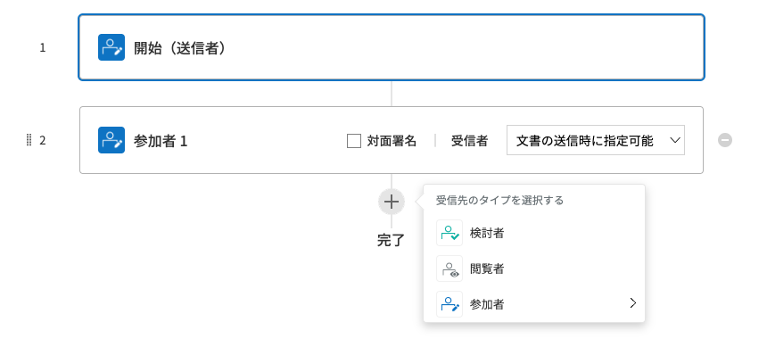
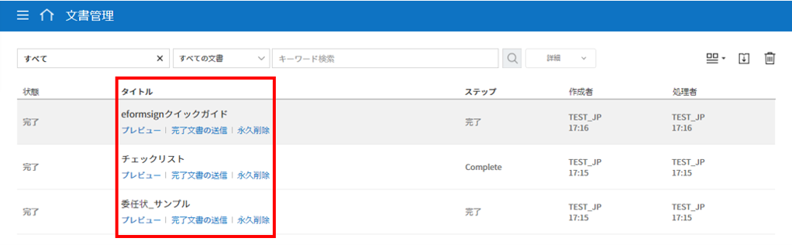
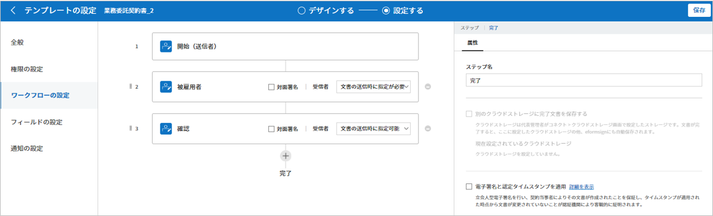

.. _template_fb:

====================================
フォームビルダーでテンプレート作成
====================================

--------------------
テンプレートの概要
--------------------

**テンプレート**\ とは、eformsignで使用する **電子文書の書式**\ です。これまで紙で作成していた契約書、申込書、同意書など、基本的な文書書式を電子文書形式に変換したものを **テンプレート**\ と言います。テンプレートは、eformsignサービス内の **ウェブフォームデザイナー**\ または **eformsignフォームビルダー**\ によって作成し、アップロードすることができます。

.. tip::

   **❗テンプレートのメリット**

   テンプレートは繰り返し作成する文書や、定期的に作成する文書の作成の際に役立ちます。

   テンプレートとして登録しておくことで、文書を作成するたびに文書のアップロードをしなくても、素早く簡単に文書を作成することができます。

.. note::  

   Webフォームデザイナーによるテンプレートの設定および管理方法については、`Webフォームデザイナーでテンプレート作成 <chapter6.html#template_wd>`__\ をご参照ください。

**フォームビルダーでテンプレートを作成する方法**
~~~~~~~~~~~~~~~~~~~~~~~~~~~~~~~~~~~~~~~~~~~~~~~~~~~~~~~

フォームビルダーを使用すると、現在ご使用中のWord、Excel、PowerPointなど、Microsoft Office製品で作成された文書ファイルを電子文書書式に変換し、すぐにeformsignにテンプレートとしてアップロードすることができます。テンプレートを作成するには、まずeformsign `フォームビルダーをダウンロード <https://www.eformsign.com/eform/dev_tool.html>`__\ する必要があります。

.. note::

   フォームビルダーの詳細な説明については、`フォームビルダー <chapter5.html#formbuilder>`__\ をご参照ください。

.. figure:: resources/formbuilder-execute.png
   :alt: フォームビルダーのリボンメニュー

1. Word/Excel/PowerPointファイルを開きます。

2. **OZ in Word(Excel/Powerpoint)** のメニューに移動します。

3. コンポーネントを追加する箇所を選択します。

4. コンポーネントのタイプを選択します。

5. 追加したコンポーネントのサイズと位置を調整します。

6. **実行** ボタンをクリックして、コンポーネントの動作を確認します。

7. **アップロード** ボタンをクリックして、テンプレートをアップロードします。

8. 新しいテンプレートを選択し、テンプレートの詳細設定を行います。 

**テンプレートの設定**

テンプレートの詳細設定を行うことができます。

-  `全般 <#general_fb>`__

   テンプレート名、テンプレートの略称、文書のタイトル、文書番号などを設定します。

-  `権限の設定 <#auth_fb>`__

   テンプレートを使って文書を作成できるテンプレートの使用権限と、作成された文書を管理するメンバー/グループを指定します。

-  `ワークフローの設定 <#workflow_fb>`__

   文書の作成から完了まで、作成された文書を処理するステップを設定します。

-  `フィールドの設定 <#field_fb>`__

   フィールドの既定値、自動入力値などのデフォルト値を設定します。

-  `通知の設定 <#noti_fb>`__

   テンプレートによって作成された文書の状態が変わる際に通知を受信する受信者・通知メッセージ内容などを設定します。

.. _workflow_fb_overview:

---------------------
ワークフロー概要
---------------------

**ワークフロー**\ とは、文章の作成から完了までの、文書のリクエストと処理プロセスです。

ワークフローは、テンプレート管理者が各テンプレートに対し **テンプレートの設定** > **ワークフローの設定**\ から設定を行えます。

ワークフローは、**開始 - 完了**\ が基本ステップです。また、以下のように任意の受信者のタイプを追加してワークフローを作成することもできます。

-  **受信者**

   文書の検討後に承認/差戻し、もしくは文書の入力項目に入力/署名します。

-  **閲覧者**

   文書の閲覧のみ行うことができます。

.. _template_setting_fb:

---------------------
テンプレートの設定
---------------------

アップロードしたファイルで作成する、テンプレートの詳細を設定することができます。

.. note::

   この作業を行うには、**代表管理者** または **テンプレート管理者** 権限が必要です。PC/モバイル/アプリから設定を行うことができます。

**テンプレート設定画面への移動方法**

1. サイドバーのメニューから **テンプレート管理**\ に移動します。

2. テンプレート名、もしくは設定アイコン(|image1|)をクリックします。

.. figure:: resources/template-settings.png
   :alt: テンプレート管理 > 設定
   :width: 700px

.. _general_fb:

全般
~~~~~~~~~~~

**テンプレートの基本設定**
-----------------------------------

テンプレート名、カテゴリ、有効期限など、テンプレートに関する基本情報を設定します。

**① フォームファイル**
   **フォームビルダー**\ を使用してWord/PowerPoint/Excelからeformsignにアップロードしたファイルのファイル名です。フォームファイルの名前を変更するには、アップロード元のWord/PowerPoint/Excelファイルのファイル名を変更後、フォームを再度アップロードする必要があります。

**② テンプレート名**
   **テンプレート管理**\、**テンプレートで作成する** メニュー画面に表示されるテンプレートの名前です。

   **テンプレート名**\ は、スペースを含めて11文字以内を推奨しています。11文字以上入力した場合、11文字以降は隠れて表示されません。この場合のテンプレート名は、テンプレート名の上に数秒マウスカーソルを置くと表示されます。

   .. figure:: resources/template-name.png
      :alt: テンプレート名
      :width: 250px

**③ テンプレートの略称**
   テンプレート名を簡略化した名称です。2, 3文字程度の短い単語を推奨しています。

   **テンプレートの略称**\ は、文書番号、文書タイトル、通知メールテンプレートなどで、 **$$**\ を入力して使用することができます。

   .. figure:: resources/template-short-name.png
      :alt: テンプレートの略称

**④ カテゴリ**
   テンプレートを種類ごとに分ける際に使用します。 **テンプレート管理** 画面のテンプレートや、 **文書トレイ**\ 、 **文書管理** メニューの文書をカテゴリ名でフィルタリングすることができます。既存のカテゴリから選択、または新規カテゴリ作成をすることができます。

   区切り文字（ **/** ）を使用すると、多階層カテゴリを設定することができます。
   例) カテゴリを **人事チーム/休暇関連**\ と設定すると、第一階層のカテゴリ **人事チーム** 内に第二層カテゴリの **休暇関連** カテゴリが生成されます。

**⑤ 説明** 
   テンプレートに関する説明文を入力します。この説明文は、リストと、 **テンプレートで作成する** を開く際に表示されます。

**⑥ テンプレート有効期限**
   テンプレートで文書を作成することができる期限を設定します。開始日の初期値はテンプレートをアップロードした日付となり、任意の日付に変更できます。

   **期間の制限無し**\ にチェックを入れると、期限に関わらずいつでも文書を作成できます。 **期間の制限無し** のチェックを外すと終了日を設定できます。終了日を設定すると、終了日が過ぎた場合そのテンプレートで文書を作成できなくなります。

**文書の設定**
---------------------------
   
テンプレートから作成した文書に対して、文書タイトルの自動生成ルールなどの追加設定を行います。

**⑦ 文書タイトルの自動生成ルール**
   テンプレートから文書を作成する際の、文書タイトルのルールを設定します。文書タイトルの自動生成ルールを設定しない場合、自動的にテンプレート名が文書タイトルになります。

**⑧ 文書タイトルの変更を許可する**
   **文書のタイトルの変更を許可する**\ にチェックを入れると、**作成** ステップの文書作成者が文書タイトルを変更可能になります。

**⑨ 文書番号の自動付与**
   文書番号の自動付与にチェックを入れると、作成する文書に対して自動的に文書番号が付与されます。文書番号式の中から、文書番号の形式を任意に指定することができます。また、文書番号の付与タイミングを選択することができます。

   |image3|

**⑩ 文書の送信時に表示されるポップアップ画面を省略する**
   文書を素早く作成して送信する場合に使用します。この項目にチェックを入れない状態で文書を送信した場合、 **確認メッセージを入力する** ポップアップウィンドウが表示されます。 **文書の送信時に表示されるポップアップ画面を省略する**\ にチェックを入れると、 **メッセージを入力する** ポップアップウィンドウは表示されず、次のステップに進みます。

**⑪ 文書の保管期間の設定**
   テンプレートで作成された文書の保存期間を設定します。
   設定しない場合は、会社の設定が適用されます。

   .. note::

      **最短1日から最長15年**\ の間で設定することができます。

      **単位ごとの設定可能な期間**

      - 15年
      - 180ヶ月
      - 5,475日

      💡会社全体の文書に対する保管期間の設定方法は `会社設定_文書の保管期間の設定 <chapter2.html#retention>`__\ からご確認ください。

-------------------

.. _document_naming:

全般 > 文書タイトルの自動生成ルールの作成
----------------------------------------------

**テンプレートの設定**\ では、テンプレートから作成される文書のタイトル生成ルールを設定することができます。

文書に入力した内容や、文書作成に関する情報が文書タイトルに自動的に入力されるように設定できます。文書タイトルの自動生成ルールを設定すると、文書の作成時の情報に基づいて文書タイトルが生成されます。この文書タイトルは、全ての文書トレイ（進行中の文書、要処理文書、完了文書）と **文書管理** メニューの文書リストから確認できます。

**文書タイトルの自動生成ルールの設定方法**
^^^^^^^^^^^^^^^^^^^^^^^^^^^^^^^^^^^^^^^^^^^^^^^

.. figure:: resources/template-setting-general-doc-numering_rule.png
   :alt: テンプレート設定 > 文書タイトルの自動生成ルールの設定
   :width: 400px

1. サイドバーのメニューで **テンプレート管理**\ に移動します。

2. テンプレートの **設定** アイコン (|image1|) をクリックして **テンプレートの設定** 画面に移動します。

3. **全般** 画面の **文書タイトルの自動生成ルール** の入力欄に、任意のタイトルルールを入力します。

4. 右上の **保存** ボタンをクリックして、変更内容を保存します。

**予約語の追加方法**
^^^^^^^^^^^^^^^^^^^^^^^^^^^^^^

.. figure:: resources/template-setting-general-doc-numering_rule_reserved.png
   :alt: 予約語を使用した文書タイトルの自動生成ルール設定
   :width: 400px

-  **文書入力項目**\ : 文書に入力した内容を文書タイトルに追加します。 

   **ルールの追加** ボタンをクリック後、**文書の入力コンポーネント**\ をクリックするとテンプレートのコンポーネントIDのリストが表示されます。選択されたコンポーネント内の情報が文書のタイトルに追加されます。

-  **基本情報**\ : 文書に関連する情報をタイトルに追加します。

   **基本情報**\ をクリックすると以下の項目から、文書のタイトルに表示する情報を設定できます。

+----------------------+--------------------------------------------------------+
| 情報タイプ           | 説明                                                   |
+======================+========================================================+
| 現在日付             | 文書を作成した時点の日付（例：2020年02月20日) 　     　|
+----------------------+--------------------------------------------------------+
| 現在時刻             | 文書を作成した時点の時刻（例：午後02:59)  　     　    |
+----------------------+--------------------------------------------------------+
| 現在日付時刻         | 文書作成時点の日付と時刻（例：2020年2月20日午後02:59） |
+----------------------+--------------------------------------------------------+
| 文書作成者ID         | 文書を作成したメンバーのID           　　　            |
+----------------------+--------------------------------------------------------+
| 文書作成者名         | 文書を作成したメンバーの名前                           |
+----------------------+--------------------------------------------------------+
| 文書作成者部門       | 文書を作成したメンバーの部署                           |
+----------------------+--------------------------------------------------------+
| 文書作成者会社名     | 文書を作成したメンバーの会社名                         |
+----------------------+--------------------------------------------------------+
| テンプレート名       | テンプレートの設定 > 全般に入力したテンプレート名      |
+----------------------+--------------------------------------------------------+
| テンプレート略称     | テンプレートの設定 > 全般に入力したテンプレートの略称  |
+----------------------+--------------------------------------------------------+
| 文書ID               | 文書作成時に自動生成される文書固有の番号               |
+----------------------+--------------------------------------------------------+
| 文書番号             | 「文書番号の自動付与」で作成したシリアル番号(通し番号) |
+----------------------+--------------------------------------------------------+
| 会社名               | 会社管理 > 会社情報に登録されている会社名              |
+----------------------+--------------------------------------------------------+
| 会社住所             | 会社管理 > 会社情報に登録されている住所                |
+----------------------+--------------------------------------------------------+
| 会社連絡先           | 会社管理 > 会社情報に登録されている電話番号            |
+----------------------+--------------------------------------------------------+
| 会社事業者登録番号   | 会社管理 > 会社情報に登録されている事業者登録番号      |
+----------------------+--------------------------------------------------------+
| 会社ホームページ     | 会社管理 > 会社情報に登録されているホームページのURL   |
+----------------------+--------------------------------------------------------+

.. tip::

   **文書のタイトルの変更を許可する** にチェックが入っているかご確認ください。
   
   文書タイトルの自動生成ルールを設定しても、**文書のタイトルの変更を許可する**\ にチェックが入っていると、文書作成者が文書のタイトルを変更することができます。文書タイトルの変更を変更したくない場合は、**文書のタイトルの変更を許可する**\ のチェックを外してください。

   .. figure:: resources/template-setting-general-doc-numering_rule_allow_change.png
      :alt: 文書タイトルの変更を許可するの変更有無
      :width: 400px

-------------------

.. _docnumber_fb:

全般 > 文書番号の自動付与
-----------------------------------------

作成する文書にテンプレートごとの文書番号を連番で付与できます。
テンプレートごとに文書番号自動生成の有無を設定でき、4つある文書番号形式の中から1つを選んで設定することができます。また、文書番号は文書コンポーネントを使用して文書に入力することができるほか、文書リストからの表示、文書番号での文書検索が可能です。

**文書番号の生成方法**
^^^^^^^^^^^^^^^^^^^^^^^^^^^^^^^^^

1. サイドバーのメニューから **テンプレート管理**\ に移動します。

2. テンプレートの **設定** アイコン(|image5|)をクリックして **テンプレートの設定** 画面に移動します。

3. **全般** 画面上の **文書番号の自動付与**\ にチェックを入れます。

	.. figure:: resources/template-setting-general-doc-numering1.png
	   :alt: 文書番号の設定
	   :width: 600px

   ▪  **文書番号の自動付与ルールの選択**

      .. figure:: resources/template-setting-general-doc-numering1_1.png
         :alt: 文書番号の自動付与ルールの選択
         :width: 600px

      - **シリアル番号**
         文書の作成順に1番から生成します。

         例) 1、2、3...

      - **年度_シリアル番号**
         文書が作成された年度 + 文書の作成順に1番から生成します。

         例) 2020_1、2020_2...

      - **テンプレート略称シリアル番号**
         テンプレート略称 + 文書の作成順に1番から生成します。

         例) 申込書1、申込書2...

      - **テンプレート略称年度_シリアル番号**
         テンプレートの略称 + 文書が作成された年度 + 文書の作成順に1番から生成します。

         例) 申込書2020_1、申込書2020_2...

   ▪  **文書への番号付与タイミングの選択**

      - **開始**
         文書の作成開始ステップで文書番号を生成します。

      - **完了**
         文書が全てのワークフローを経て完了する際に文書番号を生成します。

4. 右上の **保存** ボタンをクリックして設定を保存します。

**文書番号の確認方法**
^^^^^^^^^^^^^^^^^^^^^^^^^^^^

文書番号は、文書コンポーネントを利用することで文書内に入力したり、文書リストから確認することができます。

**文書内に文書番号を表示**

文書番号は **フォームビルダー**\ の文書コンポーネントを使用することで、文書内に入力することができます。

   1. Word/Excel/PowerPointのテンプレートファイルを開きます。

   2. 文書番号を入れる箇所に文書コンポーネントを追加します。

   3. **アップロード** ボタンをクリックして、文書をeformsignにアップロードします。

   4. **テンプレート設定 > 全般**\ から **文書番号の自動付与**\ にチェックを入れます。

   5. 文書番号の自動付与ルールを選択します。

   6. **保存** ボタンをクリックして設定を保存します。

**文書リストからの文書番号の確認方法**

   文書番号は文書リストが確認できる文書トレイ（進行中の文書、要処理文書、完了文書）および文書管理メニュー（要文書管理権限）で確認することができます。

   1. サイドバーメニューの **文書トレイ** または **文書管理** メニューに移動します。

   2. 右上の **カラム設定** アイコンをクリックします。

   3. カラムリストの **文書番号**\ にチェックを入れます。

   4. 文書リストに **文書番号** カラムが追加されていることを確認します。

      |image6|

**文書番号で文書を検索する**

   |image7|

   文書番号による検索は、詳細検索機能から行うことができます。

   1. **文書トレイ** または **文書管理** メニューに移動します。

   2. 文書リストの上部にある **詳細** ボタンをクリックします。

   3. 検索条件の中から **文書番号**\ を選択します。

   4. 検索する単語または数字を入力します。

   5. 検索結果を確認します。

-------------------

.. _auth_fb:

権限の設定
~~~~~~~~~~~

権限の設定画面では、テンプレートの使用権限、テンプレートの修正権限、文書の管理権限を設定することができます。

.. figure:: resources/template-setting-auth-new.PNG
   :alt: テンプレート設定 > 権限の設定
   :width: 700px

**テンプレートの使用権限**

テンプレートを使用して文書を作成する際の権限を設定します。テンプレート使用権限を持つメンバーは **テンプレートで文書を作成する** にテンプレートが表示され、文書を作成できます。会社に属する全てのメンバーが使用できるようにしたい場合は **すべて** を、特定のグループ/メンバーにのみ作成の権限を与えたい場合は **グループまたはメンバー**\ を選択し、グループ/メンバーを指定します。

**テンプレートの修正権限**

テンプレートの修正が可能となる権限を設定します。テンプレート修正権限を持つメンバーは **テンプレート管理** メニューからそのテンプレートを修正することができます。権限を付与する **メンバー**\ を検索して選択します。❗テンプレートの修正権限はテンプレート管理権限を持つメンバーのみ指定することができます。

**文書の管理権限**

文書管理権限は **会社管理 > 権限管理 > 文書管理者**\ で設定することができます。詳細な内容は `権限の区分 <chapter2.html#permissions>`__\ をご参照ください。

-------------------

.. _workflow_fb:

ワークフローの設定
~~~~~~~~~~~~~~~~~~~~~~~

**テンプレートの設定** 画面で **ワークフローの設定** タブをクリックして、そのテンプレートのワークフローを作成・変更できます。

.. figure:: resources/workflow-setting_new.PNG
   :alt: テンプレートの設定 > ワークフローの設定
   :width: 500px

**ワークフローのステップの追加方法**
------------------------------------------------

1. **ワークフローの設定** タブをクリックして移動します。

2. 開始と完了の間のステップ追加(|image9|) ボタンをクリックします。

3. 受信者がワークフローのステップに追加されます。

   .. figure:: resources/workflow-steps-fb.PNG
      :alt: テンプレート設定 > ワークフローの設定
      :width: 600px

   .. tip::

      ワークフローのステップは個数の制限無く追加することができます。ワークフローのステップをドラッグ&ドロップで順序を調整することができ、ステップの右側にある **(-)**\ をクリックするとステップが削除されます。

   .. tip::

      **ワークフローの結合 - 同時送信**

      ワークフローを追加すると、通常は設定された手順に従って各ステップの受信者に文書が送信されます。
      複数のステップのワークフローをマージした場合、マージされたワークフローのステップの受信者に文書を同時に送信することができます。

      1. **テンプレート管理** 画面からテンプレート設定アイコン(歯車)をクリックします。
      2. 画面上部から **設定する**\ をクリック後、 **ワークフローの設定** をクリックします。
      3. 結合するワークフローステップのうち、 **下にあるワークフローをクリック**\ するとワークフローの左側に **送信順序を結合** アイコン(|image8|)が表示されます。 
      4. そのアイコン(|image8|)をクリックすると、下段と上段のワークフローが結合されます。

      .. figure:: resources/workflow_merge_fb.png
         :alt: テンプレートの設定 > ワークフローの設定 > 結合
         :width: 500px

      .. note::

         **結合したワークフローの分割**

         結合したワークフローをクリックすると、アイコンが表示されます。分割するワークフローのステップをクリック後、送信順序を分割アイコン(|image10|)をクリックすると結合したワークフローが分割されます。

         .. figure:: resources/workflow_split_fb.png
            :alt: テンプレートの設定 > ワークフローの設定 > 分割
            :width: 500px
   
      **❗注意事項**

      - 結合したワークフローを含むテンプレートでは、 **一括作成はできません。**
      - 結合したワークフローのステップの受信者は、 **前の受信者**\ に設定できません。
      - 結合したワークフローの次のステップは、受信者を **グループまたはメンバー**\ に指定するか、 **完了** ステップに設定する必要があります。

**ワークフローステップごとの詳細設定**
----------------------------------------

ステップをクリックすることで、各ワークフローステップの詳細プロパティを設定することができます。

-  **属性**\ では、ステップ名と状態の設定以外にも、ステップごとに詳細な設定をすることができます。

-  **項目の管理**\ では、ワークフローの各ステップで受信者がコンポーネント(入力項目)に入力できるよう許可する **編集許可** 項目と、入力が必須となる **必須入力** 項目を設定することができます。

|image12|

++++++++++++++++++++++++++++++++++++++++++++++++++++++

.. _workflow_fb_start:

開始
^^^^^^^^^^^^^

**：文書作成を始めるステップです。**

-  **ステップ名**\ （共通）：デフォルトで設定されているステップ名を変更することができます。

-  **文書作成数の制限**\  ：テンプレートで作成可能な文書の最大数を設定します。

-  **URLでの文書作成を許可する**\ ：メンバー以外の外部ユーザーに文書作成を依頼する際に使用します。eformsignへのログイン無しで、文書を作成できる公開リンクを生成します。

-  **文書作成者の情報入力**: リンクから文書に入力を行う前に、文書作成者の氏名、メールアドレスなどの情報を入力するよう設定します。

-  **文書の二重送信防止**: 同じ作成者が文書を重複して送信できないよう設定します。

-  **文書作成前の本人確認設定**: リンクから文書を作成する前に、作成者の本人確認を行った後、文書を作成するよう設定します。

   - **メールやSMSで認証番号を送信**: 作成者のメール/携帯電話番号に6桁の認証コードを送信します。認証コードを認証ウィンドウに入力後、文書を閲覧することができます。

.. tip::

   **文書作成者の情報入力オプション** と **本人確認設定オプション** の両方を選択した場合、作成者は本人情報を入力して本人確認後、文書の作成を開始することができます。これらの情報は監査証跡証明書に残ります。

-  **アクセス許可ドメイン・IP**\ :　特定のドメイン/IPアドレスからのみ文書を作成できるように設定します。

-  **ボットによる文書の自動生成防止**: URLで文書を生成し、提出時に自動登録防止(reCAPTCHA)チェックを行うことにより、悪質なボットが文書を繰り返し生成することを防止します。

   .. note::

      **ボットによる文書の自動生成防止**

      このオプションを選択すると、URLにアクセスして文書作成後に提出ボタンをクリックすると、自動登録防止機能(reCAPTCHA)が文書提出ポップアップに表示されます。作成者は「私はロボットではありません」にチェック後、文書を提出することができるようになります。

      .. figure:: resources/URL-option-recaptcha.png
         :alt: reCAPTCHA
         :width: 250px

      ❗本オプションをONにしない場合、文書生成URLからボットによって文書が大量に作成される可能性があります。この場合、文書作成による料金が高額に発生する可能性があります。

.. tip::

   **QRコード生成機能(URLでの文書作成)の活用方法**

   URLでの文書作成機能を使用する場合、URLからQRコードを作成することができます。
   作成したQRコード画像をウェブサイトに掲示したり、QRコードを送信して文書作成を依頼することができます。QRコードを受け取った人は、モバイル端末のカメラでQRコードをスキャンして文書を作成・送信することができます。

   ワークフローの開始ステッププロパティから **URLでの文書作成を許可する** オプションにチェックを入れ、 
   **QRコード生成** ボタンをクリックするとQRコードの画像をダウンロードすることができます。

   
   .. figure:: resources/workflow-step-start-QRcode.png
      :alt: ワークフローの設定 > QRコードの作成
      :width: 400px

+++++++++++++++++++++++++++++++++++++++++++++++++++++++++++++++++++++++++++++++++++++++++++++

.. _workflow_signer:

受信者
^^^^^^^^^^^^^

**文書の入力項目に作成、署名などの文書に参加する受信者のステップです。**

.. note::

   受信者段階別の詳細プロパティは、 **内部メンバー受信者**\ と **外部受信者**\ によって異なります。ステップ受信者を内部メンバーではない **外部受信者に指定**\ する場合は **受信者情報の自動設定**\ と **文書閲覧前に本人確認する**\ オプションを追加で設定することができます。

   内部メンバーの場合、名前、メールアドレスなど、eformsignに保存された情報で文書が送信されるように設定されます。内部メンバーはeformsignにログイン後、依頼された文書を処理するため、ログインした時点で本人確認が行われたと見なして、オプションは適用されません。

.. figure:: resources/workflow-participant-properties-fb.png
   :alt: ワークフローの設定 > 受信者ステップのプロパティ
   :width: 700px

-  **ステップ名**\ : ステップの名前を設定することができます。

-  **通知**\ : 受信者に文書作成を依頼した際に、通知を送信する方法を設定します。通知内容は編集が可能です。

   - **通知方法の選択**\ :通知はデフォルトでメールでのみ送信されます。SMSを選択すると、**SMS**\ でも送信可能です。

   - **通知メッセージの編集**\ :各ステップで受信者に送信される文書の通知内容を編集できます。

-  **文書の送信期限**\ : 受信者が文書を受信した後、次のステップの受信者に文書を送信するまでの期限を設定します。

   .. tip::

      受信者がメンバーの場合、文書の送信期限を無期限に設定することができます。 **文書送信期限を0日0時間**\ と設定してください。
      受信者がメンバーではない場合、文書の送信期限は最大50日まで設定することができます。

-  **受信者情報の自動設定**\ : 受信者に文書作成を依頼する際、文書に入力した情報を基に受信者の氏名・連絡先を自動的に設定できます。

-  **文書の閲覧前に本人確認する** : 文書を閲覧する前に本人確認をした後、文書を閲覧できるように設定します。複数の認証手段を組み合わせることで、二段階認証を行うことができます。

   - **文書のアクセスコード**\ : 受信者が文書閲覧前に入力するアクセスコードを設定します。正しいアクセスコードを入力後、文書を閲覧することができます。 **送信者が直接入力、受信者の氏名、文書に入力された内容**\ の中から選択します。

      .. figure:: resources/doc-password-setting.png
         :alt: 文書のアクセスコード設定
         :width: 400px

      - **送信者が直接入力:** 設定段階で予めパスワードを設定します。受信者は表示されるヒントを基にアクセスコードを入力します。 

      - **受信者の氏名:** 受信者の氏名に設定すると、受信者情報に入力した名前と一致する名前がアクセスコードに設定されます。

      - **文書に入力された内容:** 文書内の入力項目を選択して、その入力項目に入力された内容をアクセスコードに設定します。

   - **メールやSMSで認証番号を送信:** 受信者のメールアドレス/携帯電話番号宛てに6桁の認証番号を送信します。受信者は認証番号を認証ウィンドウに入力後、文書を閲覧することができます。

      .. figure:: resources/additional-verification.png
         :alt: メール/SMS認証
         :width: 400px

   - **メール/SMS認証:** ：受信者のメールアドレスに6桁の認証番号が送信されます。送信された認証番号を本人確認ウィンドウに入力することで認証が完了します。

   .. tip::

      文書の完了後、文書の閲覧時にも、設定した認証を実施後閲覧するように設定するには、 **完了文書の閲覧時にも認証を行う**\ にチェックを入れてください。

   .. note::

      ❗SMS認証を行う場合、追加料金が発生します。

-  **文書の非表示設定:** 2つ以上のファイルで構成された文書の場合、ファイル単位で一部を非表示に設定することができます。本設定は外部受信者がワークフローに設定されている場合にのみ表示され、外部受信者にのみ適用されます。

- **認証書による電子署名:** 事業者署名型(立会人)電子署名を行うよう設定します。第三者機関が発行した電子署名により署名者の本人性の担保と、誰が、いつ署名を行ったか記録します。署名された情報は完了文書をAdobe Acrobat Readerで開くことでご確認いただけます。

-  **文書差戻し制限:** 受信者が文書を差戻しできないように設定します。オプションにチェックを入れると、設定された受信者の文書画面には **差戻し** ボタンが表示されません。

.. tip::

   💡 **対面署名の使い方**
    
   署名者と対面してタブレットやスマホなど、一つのデバイスで文書に署名を行う場合は、対面署名機能が便利です。
   対面署名機能を使用すると、各署名者に関する情報が文書履歴と監査証跡証明書に記録され、文書が完了すると、署名者に完了文書が自動的に送信されます。

   対面署名を使うには、対面署名者に設定する受信者ステップで **対面署名** を選択します。 
   このステップは **対面署名者** 、直前のステップは **立会人** になります。対面署名者は、文書に署名する前に本人確認を行うように設定することもできます。

   - **立会人:** 対面署名の開始・完了と、署名を行うことができます。メンバーのみ設定することができ、閲覧者が立会人になることはできません。
   - **対面署名者:** 署名を行います。閲覧者が対面署名者になることはできません。
   
   .. figure:: resources/inperson-signing-fb.png
      :alt: 対面署名設定
      :width: 700px
   
   **❗注意事項**
      - **開始** ステップに **対面署名**\ が設定された場合、 **一括署名**\ を行うことはできません。
      - **同時送信(送信順序の結合)**\ が設定されたワークフローのステップは **対面署名**\ を設定することはできず、 **対面署名**\ が設定されたステップの前後に **同時送信(送信順序の結合)** を設定することはできません。

   ✅ 対面署名の設定を行った場合の文書への記入方法は `こちら <https://www.eformsign.com/jp/blog/announcement-202311/>`__\ をご参照ください。

.. note:: 

   **受信者の設定**

   各ステップの受信者を選択したり、文書送信時に送信者が選択できるように事前に設定します。

   .. figure:: resources/workflow-participant-selected-fb.png
      :alt: ワークフローの設定 > 参加者・受信者の設定
      :width: 700px

   -  **文書の送信時に指定可能** : 文書の送信時に受信者情報を入力できるように設定します。受信者情報を入力しない場合、その手順はスキップして進みます。

   -  **文書の送信時に指定が必要** : 文書送信時に受信者が情報を必ず入力/選択するように設定します。受信者が情報を入力後、文書が送信されます。

   -  **グループまたはメンバー** : 文書を処理するグループまたはメンバー1人を設定します。グループまたはメンバーは複数選択することが出来ますが、選択されたグループ及びメンバー中1人だけが文書を処理することができます。

   -  **前の受信者** : 開始ステップを含む前のステップの受信者が文書を処理するように設定します。当該ステップより前のステップから選択できます。

.. _hide:

**文書内の一部のファイルを非表示にする方法**
^^^^^^^^^^^^^^^^^^^^^^^^^^^^^^^^^^^^^^^^^^^^^^^^^^^^^^^^^^^^^^^^^^^^^^^^^^^^

.. tip::

   **文書の一部を非表示にする**

   文書が複数のファイルで構成されている場合、外部の受信者に表示する文書の一部を非表示にすることができます。

   アップロードした文書に複数のファイルが含まれていると、ワークフローの外部受信者ステップの属性設定に、 **文書の非表示設定**\ が表示されます。文書に含まれているファイルが一覧で表示され、各ファイルの **表示/非表示/選択(前の処理者が表示/非表示を選択)**\ を指定することができます。

   ❗文書の一部を非表示にする機能は、文書の受信者が外部ユーザーである場合にのみ適用されます。

   **設定方法**

   1. ダッシュボード **メニュー > テンプレート管理**\ に移動します。
   2. テンプレートの **設定アイコン（⚙）**\ をクリックしてテンプレート設定画面に移動します。
   3. **ワークフローの設定** タブに移動します。
   4. **受信者** ステップを追加します。
   5. 右側のプロパティの下部にある **文書の非表示設定**\ にチェックを入れます。
   6. 文書内のファイルごとに表示/非表示/選択を設定します。

      - **表示:** 受信者にファイルを表示します。

      - **選択:** 当該ステップの受信者が表示/非表示を選択します。

      - **非表示:** 受信者にファイルを表示しません。

   |image19|

+++++++++++++++++++++++++++++++++++++++++++++++++++++++++++++++++++++++++++++++++++++++++++++

.. _workflow_fb_needtoview:

閲覧者 
^^^^^^^^^^^^^^^^

**文書の閲覧のみ可能な受信者ステップです。**

.. figure:: resources/workflow-needtoview-properties.png
   :alt: ワークフローの設定 > 閲覧者ステッププロパティ
   :width: 700px

-  **ステップ名**\ : ステップの名前を設定することができます。

-  **通知**\ : 受信者に文書作成を依頼する際の、通知を送信する方法を設定します。また、通知内容を編集することが可能です。

   - **通知方法の選択:** デフォルト設定では、通知は電子メールでのみ送信されます。 **SMSで送信**\ を選択すると、**SMS**\ でも送信できます。

   - **通知内容の編集:** 各ステップで受信者に送信される文書要請の通知内容を編集することが可能です。

-  **文書の閲覧期限**\ : 受信者が文書を受信した後、次のステップの受信者に文書を送信するまでの期限を設定します。文書の送信期限を設定する必要が無い場合は、0日0時間と入力してください。(受信者が内部メンバーの場合。外部受信者の場合最大50日まで設定可能)

-  **文書送信オプション**\ : 各ステップで、文書を次のステップに送信する際の設定を選択します。

   - **受信者が文書を閲覧したら次のステップに送信:** 閲覧者ステップの受信者が文書を閲覧後、文書が次のステップに送信されます。
 
   - **受信者の文書閲覧有無に関わらず、即時次のステップに送信:** 閲覧者ステップの受信者が文書を閲覧せずとも、文書は次のステップに送信されます。

   .. figure:: resources/needtoview_option.png
      :width: 300px

+++++++++++++++++++++++++++++++++++++++++++++++++++++++++++++++++++++++++++++++++++++++++++++

.. _workflow_fb_complete:

完了
^^^^^^^^^^^^^^^^

**完了: 文書が全てのワークフローのステップを経て、完了するステップです。**

-  **別のクラウドストレージに完了文書を保存する**: 完了文書を、代表管理者/会社管理者が設定した外部クラウドストレージに保存されるように設定します。

-  **完了文書にタイムスタンプを付与する**: 完了文書が以降変更されていないことを証明する、タイムスタンプを文書に適用するように設定します。この機能は追加料金が発生します。

.. note::

   💡 **タイムスタンプとは？**

   タイムスタンプとは、電子文書の生成時点の確認（存在証明）と真正性確認（内容証明）のための公開鍵基盤（PKI:Public Key Infra Structure）の国際標準技術であり、電子文書がある特定の時刻に存在していたことを証明するとともに、その時刻以降にデータが変更されていないことを証明する電磁的技術です。

   文書にタイムスタンプを適用すると、特定の時点でその文書が存在し、それ以降変更されていない原本であることが認証機関によって客観的に証明されます。

-------------------

.. _field_fb:

フィールドの設定
~~~~~~~~~~~~~~~~~~~

**フィールドの設定**\ では、文書リストとCSVにデータをダウンロードした時に表示されるコンポーネントの列の表示可否と順序を設定できます。また、テンプレートに入るフィールドの初期値または自動入力値を設定できます。

.. figure:: resources/template-field-setting.png
   :alt: テンプレートの設定 > フィールドの設定
   :width: 700px

フィールドの初期値は **カスタムフィールド管理**\ に保存されている会社・グループ・メンバー情報を選択して設定、最近の入力値を選択して設定、ユーザーが直接入力して設定のうちいずれかの入力方法を選択して設定できます。

.. tip::

   **自動入力の設定方法**

   文書に繰り返し入力する情報を事前に保存し、自動的に入力されるように設定できます。

   例) 作成者の名前、連絡先などの作成者情報、部署名、責任者、会社の代表番号などの会社またはグループに関する情報を事前に保存して自動的に入力されるように設定できます。関連フィールドの項目の追加と初期値の設定は、 **会社管理 > カスタムフィールド管理**\ で行うことができます。

   1. **カスタムフィールド管理** 画面でフィールドを追加します。

   2. **テンプレート管理** メニューに移動します。

   3. **テンプレートの設定** アイコンをクリックします。

   4. **フィールドの設定** メニューに移動します。

   5. 自動入力するフィールドの初期値を入力します。

   6. 全ての設定が完了したら、 **保存** ボタンをクリックします。

-------------------

.. _noti_fb:

通知設定
~~~~~~~~~~~~~~~~~

テンプレートで作成された文書ステータスの通知や依頼を受信する受信者の設定や通知内容の確認、編集ができます。

**ステータス通知の設定**

当該テンプレートで作成した文書のステータスに関する通知の受信者設定、通知メッセージのプレビュー（文書の検討および作成/文書の差戻し/文書の無効化/文書の修正）、通知の編集（文書の完了）を行えます。

.. figure:: resources/template-setting-notification-channel.png
   :alt: 通知チャンネルの設定

.. note::

   **文書の作成者** オプションにチェックを入れ、**各ステップの処理者** オプションのチェックを外した場合、文書を最初に作成した人にステータス通知を送信します。

   **文書の作成者** オプションのチェックを外し、**各ステップの処理者** オプションにチェック入れた場合、最初に作成した人を除く、現在のステップより前に文書を処理した人にステータス通知を送信します。

   **文書の作成者** 、 **ステップごとの処理者** オプション両方にチェックを入れた場合、文書の作成者、現在ステップ以前に文書を処理した両者にステータス通知を送信します。

   **文書の作成者** 、 **ステップ別の処理者** オプション両方のチェックを外した場合、当該ステップのステータス通知は送信されません。

.. caution::

   ❗外部受信者には文書文書の完了通知のみ送信されます。

   外部受信者に完了文書を送信する場合、 **文書の完了 > 各ステップの処理者**\ を **メンバー外** または **すべて**\ に設定してください。

**文書の完了通知の編集**

   .. figure:: resources/template-setting-notification-editl.png
      :alt: 通知内容の編集
      :width: 400px

- **通知テンプレートの選択:** 通知テンプレートはデフォルトのテンプレートとして設定されていますが、別途作成した通知テンプレートがあれば変更できます。 新規通知テンプレートを追加する方法は `通知テンプレート管理 <chapter9.html#notification-template>`__\ をご参照ください。  

- **メールのタイトル:** 文書の完了時に送信されるメールのタイトルを設定します。

- **SMSメッセージ:** 文書完了通知をSMSで送信する際に、SMSで送信するメッセージを設定します。 設定したメッセージと一緒に、文書を確認できるリンクが送信されます。

.. note::

   メッセージの長さは最大65バイト(全角32文字、半角65文字)までです。 

- **添付ファイルと添付方法:** 完了通知と一緒に送信するファイルの選択と、その添付方法を選択します。

   - **文書閲覧リンク:** 完了文書がリンク(ボタン)の形式でメール/SMSで送信されます。リンク(ボタン)をクリックすると文書閲覧ページが開きます。 ビューアから完了文書を閲覧・ダウンロードできます。

   - **ファイル添付:** 完了文書がメールにPDFファイルとして添付されて送信されます。 ただし、文書のファイルサイズが10MBを超えるか、SMS通知の場合は **ダウンロードリンク** 方式で送信されます。

   .. caution::

      **ファイル添付** 形式でメールにより通知を送ると、メールに完了文書を添付して送信されます。文書閲覧時に本人確認をするように設定しても、本人確認を行わずに文書を閲覧/ダウンロードできるため、ご注意ください。

- **本文の編集:** 通知メッセージの本文を編集することができます。

---------------------------------
テンプレートの個別操作メニュー
---------------------------------

**テンプレート管理** 画面で、テンプレート名の右側にあるメニューアイコン (|image24|) をクリックすると、各テンプレートのメニューが表示されます。

|image25|

-  **複製** ：テンプレートを複製します。テンプレートの文書ファイルとテンプレートの設定が複製されます。詳細設定の変更、保存が可能です。

-  **削除** ：テンプレートを削除します。テンプレートを削除すると、以後そのテンプレートでは文書を作成できなくなります。

-  **ファイルをダウンロード** ：ファイルをダウンロードをクリックすると、アップロードしたファイルの形式でダウンロードされます。 例) Word、Excelファイルなど

-  **非活性化** ：テンプレートを非活性化すると、他のメンバーの **テンプレートで作成する** ページにそのテンプレートが表示されなくなります。

-  **所有者を変更** ：テンプレートの所有者を変更できます。デフォルトでは、テンプレートの所有者はテンプレートを作成した人になります。所有者を変更して他のメンバーに所有者を変更することもできます。テンプレートの所有者は、テンプレートの管理権限を持つメンバーの中から選択できます。

   |image26|

---------------------------------------------------
テンプレート検索とテンプレート表示形式の設定
---------------------------------------------------

**テンプレート管理** 画面では、テンプレートをカテゴリでフィルタ、検索、ソートすることができます。

|image27|

**① テンプレートの照会**
   クリックすると、テンプレートの状態やカテゴリでテンプレートをフィルタできます。 **X** をクリックすると、全てのカテゴリを表示します。

   カテゴリの作成は **テンプレート設定 > 全般**\ から行うことができます。

**② テンプレートの検索**
   検索キーワードを入力することで、テンプレートを検索できます。
   
**③ ソート**
   テンプレートをテンプレート名またはカテゴリで昇順、降順に並び替えます。

**④ 表示形式の設定**
   テンプレート管理画面の表示形式形式をサムネイル形式/リスト形式から選択することができます。

   - サムネイル形式: テンプレートのサムネイルを表示し、テンプレートの概要を画像形式で確認することができます。 

      .. figure:: resources/template-lists-thumnail.png
         :alt: テンプレートの表示形式-サムネイル
         :width: 600px

   - リスト形式: テンプレートをリスト形式で一覧表示します。 

      .. figure:: resources/template-lists.png
         :alt: テンプレートの表示形式-リスト
         :width: 600px

.. |image1| image:: resources/config-icon.PNG
   :width: 20px
.. |image2| image:: resources/template-settings.png
   :width: 700px
.. |image3| image:: resources/template-setting-general-doc-numering.png
   :width: 500px
.. |image4| image:: resources/config-icon.PNG
.. |image5| image:: resources/config-icon.PNG
.. |image6| image:: resources/columnlist-docnum.png
.. |image7| image:: resources/doc-number-search.png
   :width: 600px
.. |image8| image:: resources/workflow_merge_icon.png
   :width: 30px
.. |image9| image:: resources/workflow-addstep-plus-button.png
   :width: 30px

.. |image12| image:: resources/template-setting-FB-workflow-field-control.png
   :width: 700px
.. |image13| image:: resources/workflow-step-start-property.png
   :width: 700px
.. |image14| image:: resources/template-setting-FB-workflow-step-approval.png
   :width: 700px
.. |image15| image:: resources/template-approval-property-displayname.png
   :width: 250px
.. |image16| image:: resources/template-setting-FB-workflow-step-internal-recipient.png
   :width: 700px
.. |image17| image:: resources/template-setting-FB-workflow-step-external-recipient.png
   :width: 700px
.. |image18| image:: resources/workflow-step-external-recipient-property-pw.png
   :width: 400px
.. |image19| image:: resources/template-fb-setting-workflow-outsider-1.png
   :width: 700px
.. |image20| image:: resources/template-setting-FB-workflow-step-complete.png
   :width: 700px
.. |image21| image:: resources/template-setting-notification-edit.png
   :width: 400px
.. |image22| image:: resources/template-setting-notification-edit-email.png
   :width: 700px
.. |image23| image:: resources/template-setting-notification-status.png
   :width: 500px
.. |image24| image:: resources/template-hamburgericon.png
   :width: 20px
.. |image25| image:: resources/template-manage-menu.png
   :width: 700px
.. |image26| image:: resources/template-owner-change.PNG
.. |image27| image:: resources/document-manager-setting.PNG
.. |image28| image:: resources/template-manage-search.png
   :width: 700px
