.. _template_fb:

====================================
フォームビルダーでテンプレート作成
====================================

--------------------
テンプレートの概要
--------------------

テンプレートとは、 eformsignで使用する **電子文書の書式**\ です。既存の紙で作成していた契約書、申込書、同意書など、基本的な文書書式を電子文書形式に変換したものを **テンプレート**\ と言います。テンプレートは、eformsignサービス内の **ウェブフォームデザイナー**\ または **eformsignフォームビルダー**\ を通して作成しアップロードすることができます。

.. tip::

   テンプレートは頻繁に、または定期的に作成する必要がある文書を作成する際に役立ちます。
   テンプレートとして登録しておくと、文書を作成するたびに文書のアップロードをしなくても、素早く簡単に文書を作成できます。

.. note::  

   Webフォームデザイナーを通じたテンプレートの設定および管理方法については、`Webフォームデザイナーでテンプレート作成 <chapter6.html#template_wd>`__\ をご参照ください。

**フォームビルダーでテンプレートを作成する方法**
~~~~~~~~~~~~~~~~~~~~~~~~~~~~~~~~~~~~~~~~~~~~~~~~~~~~~~~

フォームビルダーを使用すると、既存のワード・エクセル・パワーポイントなどMS Officeで作られた文書ファイルを電子文書書式に変換し、すぐにeformsignにテンプレートとしてアップロードすることができます。テンプレートを作成するには、まずeformsign `フォームビルダーをダウンロード <https://www.eformsign.com/eform/dev_tool.html>`__\ する必要があります。

.. note::

   フォームビルダーの詳細な説明については、`フォームビルダー <chapter5.html#formbuilder>`__\ をご参照ください。

1. Word、Excel、または PowerPoint ファイルを開きます。

2. **OZ in Word(Excel または PPT)**\ のメニューに移動します。

3. コンポーネントを追加する箇所を選択します。

4. コンポーネントのタイプを選択します。

5. 追加したコンポーネントのサイズと位置を調整します。

6. **実行**\ ボタンをクリックして、コンポーネントの動作を確認します。

7. **アップロード**\ ボタンをクリックして、テンプレートをアップロードします。

8. 新しいテンプレートを選択し、テンプレートの詳細設定を行います。 

.. figure:: resources/formbuilder-execute.png
   :alt: フォームビルダーリボンメニュー

**テンプレートの設定**

テンプレートの詳細設定を行うことができます。

-  `全般 <#general_fb>`__

   テンプレート名、テンプレートの略称、文書のタイトル、文書番号などを設定します。

-  `権限の設定 <#auth_fb>`__

   当該テンプレートを使って文書を作成できるテンプレートの使用権限、および作成された文書を管理するメンバーまたはグループを指定します。

-  `ワークフローの設定 <#workflow_fb>`__

   文書の作成から完了まで、作成された文書を処理する段階を設定します。

-  `フィールドの設定 <#field_fb>`__

   フィールドの既定値、自動入力値などのデフォルト値を設定します。

-  `通知の設定 <#noti_fb>`__

   当該テンプレートによって作成される文書の状態変更する際、通知を受信する受信者・通知メッセージ内容などを設定します。

---------------------
ワークフロー概要
---------------------

**ワークフロー**\ とは、文章の作成から完了までの、文書のリクエストおよび処理プロセスを言います。

ワークフローは、テンプレート管理者がテンプレート別に **テンプレートの設定**\ > **ワークフローの設定**\ で設定を行えます。

ワークフローは、**開始 - 完了**\ が基本ステップです。また、以下のように **検討者**\、**参加者**\ の2つのステップを必要に応じて追加してワークフローを作成することも可能です。

.. figure:: resources/workflow_new.png
   :alt: ワークフローの段階
   :width: 500px

-  **検討者**

   文書の検討後、承認または返戻します。

-  **参加者**

   文書の入力項目に入力または署名します。

---------------------
テンプレートの設定
---------------------

アップロードしたファイルで作成するテンプレートの詳細を設定できます。

.. note::

   この作業を行うには、**代表管理者**\ または **テンプレート管理**\　権限が必要です。PC・モバイル、およびアプリケーションで行うことができます。

**テンプレート設定の画面に移動する方法**

1. サイドバーのメニューで **テンプレート管理**\ に移動します。

2. 目的のテンプレート名や設定アイコン(|image1|)をクリックします。

   |image2|

.. _general_fb:

全般
~~~~~~~~~~~

.. figure:: resources/template-setting-general-formbuilder.png
   :alt: テンプレートの設定 > 全般
   :width: 700px

**基本設定**
-----------------------------------

テンプレート名、カテゴリー、有効期限など、テンプレートに関する基本情報を設定します。

**① フォームファイル**
   **フォームビルダー**\ を使用して Word、PowerPoint、Excel で eformsign にアップロードしたファイルのファイル名です。フォームファイルの名前を変更するには、アップロード元のWord、PowerPoint、および Excel ファイルのファイル名を変更後、当該フォームを更新する必要があります。

**② テンプレート名**
   **テンプレート管理**\、**テンプレートで作成する**\ メニュー画面に表示されるテンプレートの名前です。

   **テンプレート名**\ は、スペースを含めて11文字以内を推奨しています。11文字以上入力した場合、11文字以降は隠れて表示されません。完全なテンプレート名は、テンプレート名の上にマウスを置き、しばらく待つと確認することができます。

   .. figure:: resources/template-name.png
      :alt: テンプレート名
      :width: 250px

**③ テンプレートの略称**
   テンプレート名を簡略化した名称です。2, 3文字程度の短い単語を推奨します。

   **テンプレートの略称**\ は、文書番号、文書タイトル、通知メールテンプレートなどで使用できます。

   .. figure:: resources/template-short-name.png
      :alt: テンプレートの略称

**④ カテゴリー**
   テンプレートを種類別に分けるときに使用します。**テンプレート管理**\ 画面のテンプレート、**文書トレイ**\、 **文書管理**\ メニューの文書をカテゴリー名でフィルタリングすることができます。既存のカテゴリから選択、または新規カテゴリ作成が可能です。

   区切り文字（ **/** ）を使用すると、多階層カテゴリを設定できます。例えば、カテゴリーを **人事チーム/休暇関連**\ と設定すると、第一階層のカテゴリ **人事チーム**\ 内に第二層カテゴリの **休暇関連**\ カテゴリーが生成されます。

**⑤ 説明**
   テンプレートに関する説明文を入力します。この説明文は、テンプレートリスト及び 'テンプレートで作成する'を開く際に表示されます。

**⑥ テンプレート有効期限**
   テンプレートで文書の作成できる期限を設定します。開始日の初期値はテンプレートをアップロードした日付となり、任意の日付に変更できます。

   **期間の制限無し**\ にチェックを入れると、期限に関わらずいつでも文書を作成できます。 **期間の制限無し**\ のチェックを外すと終了日を設定できます。終了日を設定すると、終了日が過ぎた場合当該テンプレートで文書を作成できなくなります。

**文書の設定**
---------------------------
   
テンプレートから作成した文書に対して、文書タイトルの自動生成ルールなどの追加設定を行います。

**⑦ 文書タイトルの自動生成ルール**
   テンプレートから文書を作成する際の、文書タイトルのルールを設定します。文書タイトルの自動生成ルールを設定しない場合、自動的にテンプレート名が文書タイトルになります。
   

**⑧ 文書タイトルの変更を許可する**
   **文書のタイトルの変更を許可する**\ にチェックを入れると、**作成**\ ステップの文書作成者が文書タイトルを変更可能になります。

**⑨ 文書番号の自動付与**
   文書番号の自動付与にチェックを入れると、作成する文書に対して自動的に文書番号が付与されます。文書番号式の中から、文書番号の形式を指定できます。また、文書番号の付与タイミングを任意に選択できます。
   |image3|

**⑩ 文書の送信時に表示されるポップアップ画面を省略する**
   文書をすばやく作成して送信することが多い場合に使用します。この項目にチェックを入れない状態で文書を送信した場合、 **確認メッセージを入力する**\ ポップアップウィンドウが表示されます。 **文書の送信時に表示されるポップアップ画面を省略する**\ にチェックを入れると、 **メッセージを入力する**\ ポップアップウィンドウが表示されないまま、次のステップに進みます。

全般 > 文書タイトルの自動生成ルールの作成
----------------------------------------------

**テンプレートの設定**\ では、テンプレートから作成される文書のタイトル生成ルールを設定できます。

文書に入力した内容、または文書作成に関する情報が文書タイトルに自動に入力されるように設定できます。文書タイトルの自動生成ルールを設定すると、文書の作成時の情報に基づいて文書タイトルが生成されます。、この文書タイトルは、すべての文書トレイ（進行中の文書、要処理文書、完了文書）と**文書管理**\ メニューの文書リストから確認できます。

.. figure:: resources/document-list.png
   :alt: 文書管理 > 文書リスト
   :width: 700px

**文書タイトルの自動生成ルールを設定する方法**
^^^^^^^^^^^^^^^^^^^^^^^^^^^^^^^^^^^^^^^^^^^^^^^

.. figure:: resources/template-setting-general-doc-numering_rule.png
   :alt: テンプレート設定 > 文書タイトルの自動生成ルールの設定
   :width: 600px

1. サイドバーのメニューで **テンプレート管理**\ に移動します。

2. テンプレートの **設定**\ アイコン (|image4|) をクリックして **テンプレートの設定**\ 画面に移動します。

3. **全般** 画面上の **文書タイトルの自動生成ルール**\ の入力欄に、任意のタイトルルールを入力します。

4. 右上の **保存**\ ボタンをクリックして、変更内容を保存します。

**予約語を追加する方法**
^^^^^^^^^^^^^^^^^^^^^^^^^^^^^^

.. figure:: resources/template-setting-general-doc-numering_rule_reserved.png
   :alt: ルールを使用して文書タイトルの自動生成ルールの設定

-  **文書入力項目**\ : 文書に入力した内容を文書タイトルに追加します。 

   **ルールの追加**\ ボタンをクリック後、**文書の入力コンポーネント**\ をクリックするとテンプレートのコンポーネントIDのリストが表示されます。選択された入力コンポーネント内の情報が文書のタイトルに追加されます。

-  **システム情報**\ : 文書に関連する情報をタイトルに追加します。

   **システム情報**\ をクリックすると以下の項目から、文書のタイトルに表示する情報を設定できます。

   +----------------------+--------------------------------------------------------+
   | 情報タイプ           | 説明                                                   |
   +======================+========================================================+
   | 現在_日付            | 文書を作成した時点の日付（例：2020年02月20日) 　     　|
   +----------------------+--------------------------------------------------------+
   | 現在_時刻            | 文書を作成した時点の時刻（例：午後02:59)    　     　  |
   +----------------------+--------------------------------------------------------+
   | 現在_日付時刻        | 文書を作成した時点の日付・時刻                         |
   |                      |（例：2020年2月20日午後02:59） 　　  　　            　 |
   +----------------------+--------------------------------------------------------+
   | 文書_作成者_ID       | 文書を作成したメンバーの ID           　　　           |
   +----------------------+--------------------------------------------------------+
   | 文書_作成者_名       | 文書を作成したメンバーの名前                           |
   +----------------------+--------------------------------------------------------+
   | 文書_作成者_部門     | 文書を作成したメンバーの部署                           |
   +----------------------+--------------------------------------------------------+
   | 文書_作成者_会社名   | 文書を作成したメンバーの会社名                         |
   +----------------------+--------------------------------------------------------+
   | テンプレート名       | テンプレートの設定 > 全般に入力したテンプレート名      |
   +----------------------+--------------------------------------------------------+
   | テンプレート_略称    | テンプレートの設定 > 全般に入力したテンプレートの略称  |
   +----------------------+--------------------------------------------------------+
   | 会社名               | 会社管理 > 会社情報に入力されている会社名              |
   +----------------------+--------------------------------------------------------+
   | 会社_住所            | 会社管理 > 会社情報に入力されている住所                |
   +----------------------+--------------------------------------------------------+
   | 会社_連絡先          | 会社管理 > 会社情報に入力されている連絡先              |
   +----------------------+--------------------------------------------------------+
   | 会社_事業者_登録_番号| 会社管理 > 会社情報に入力されている事業者登録番号      |
   +----------------------+--------------------------------------------------------+
   | 会社_ホームページ    | 会社管理 >  会社情報に入力されているホームページのURL  |
   +----------------------+--------------------------------------------------------+

.. tip::

   **文書のタイトルの変更を許可する**\ にチェックが入っているかを確認してください！

   文書タイトルの自動生成ルールを設定しても、**文書のタイトルの変更を許可する**\ にチェックが入っていると、文書作成者は文書のタイトルを任意に変更することが可能です。文書タイトルの変更を変更したくない場合は、**文書のタイトルの変更を許可する**\ のチェックを外してください。

.. figure:: resources/template-setting-general-doc-numering_rule_allow_change.png
   :alt: 文書タイトルの変更を許可するを確認

.. _docnumber_fb:

全般 > 文書番号の自動付与
-----------------------------------------

作成する文書にテンプレートごとの文書番号を連番で付与できます。
テンプレートごとに文書番号自動生成の有無を設定でき、4つある文書番号形式の中から1つを選んで設定できます。また、文書リストから別の列での確認、文書番号での文書検索が可能です。

**文書番号を生成する方法**
^^^^^^^^^^^^^^^^^^^^^^^^^^^^^^^^^

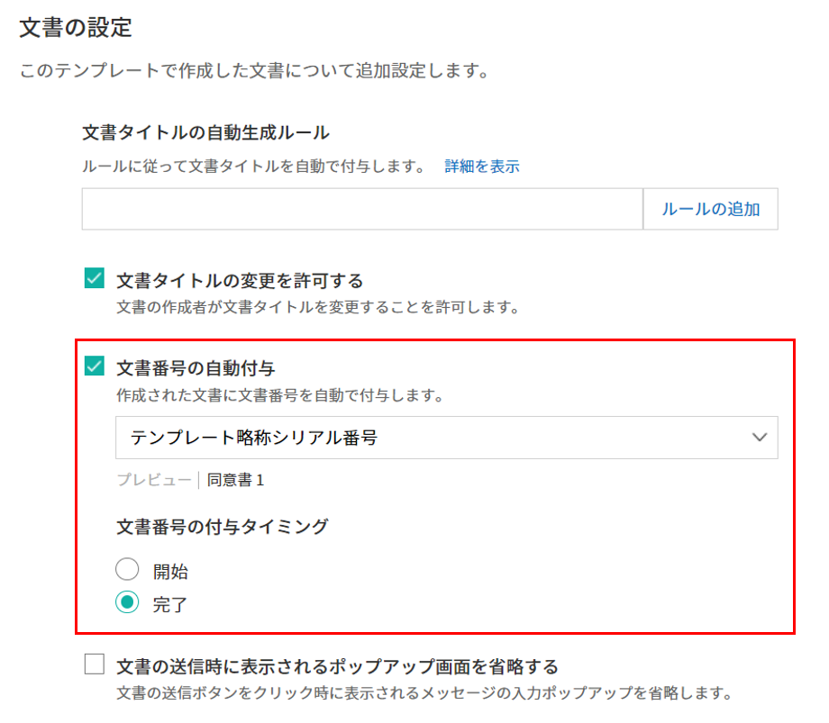

1. サイドバーのメニューから **テンプレート管理**\ に移動します。

2. テンプレートの **設定**\ アイコン(|image5|)をクリックして **テンプレートの設定**\ 画面に移動します。

3. **全般**\ 画面上の **文書番号の自動付与**\ にチェックを入れます。

   ▪  **文書番号の自動付与ルールの選択**

   .. figure:: resources/template-setting-general-doc-numering1_1.png
      :alt: 文書番号の自動付与ルールの選択
      :width: 600px

   - **シリアル番号**
      文書の作成順に1番から生成します。

      （例：1、2、3...）

   - **年度_シリアル番号**
      文書が作成された年度 + 文書の作成順に1番から生成します。

      （例：2020_1、2020_2...）

   - **テンプレート略称のシリアル番号**
      テンプレート略称 + 文書の作成順に1番から生成します。

      （例：申込書1、申込書2...）

   - **テンプレート略称年度_シリアル番号**
      テンプレートの略称 + 文書が作成された年度 + 文書の作成順に1番から生成します。

      （例：申込書2020_1、申込書2020_2...）

▪  **文書に番号を付与する時点の選択**

   - **開始**
      文書の作成開始ステップで文書番号を生成します。

   - **完了**
      文書がすべてのワークフローを経て完了する際に文書番号を生成します。

4. 右上の **保存**\ ボタンをクリックして設定を保存します。

**文書番号を確認する方法**
^^^^^^^^^^^^^^^^^^^^^^^^^^^^

文書番号は、文書コンポーネントを利用することで文書内に入力できます。また、文書リストから文書番号を確認することができます。

-  **文書内に文書番号を表示する**

+++++++++++++++++++++++++++++++++++++++

   文書番号は **フォームビルダー**\ の文書コンポーネントを使用することで、文書内に入力できます。

   1. Word、Excel、または PowerPoint のテンプレートファイルを開きます。

   2. 文書番号を入れたい箇所に文書コンポーネントを追加します。

   3. **アップロード**\ ボタンをクリックして、文書を eformsign にアップロードします。

   4. **テンプレート設定 > 全般**\ で **文書番号の自動付与**\ にチェックを入れます。

   5. 文書番号の自動付与ルールを選択します。

   6. **保存**\ ボタンをクリックして設定を保存します。

-  **文書リストで文書番号を確認する**

++++++++++++++++++++++++++++++++++++++++

   .. figure:: resources/doc-list-docnumber1.PNG
      :alt: 文書トレイ - 文書リスト
      :width: 700px

   .. figure:: resources/doc-list-docnumber2.png
      :alt: 文書トレイ - 文書リスト - 文書番号の確認
      :width: 700px

   文書番号は文書リストが確認できる文書トレイ（進行中の文書、要処理文書、完了文書）および文書管理メニュー（文書管理権限が必要）で確認できます。

   1. サイドバーメニューの **文書トレイ**\ または **文書管理**\ メニューに移動します。

   2. 右上の **カラム設定**\ アイコンをクリックします。

   3. カラムリストの **文書番号**\ にチェックを入れます。

      |image6|

   4. 文書リストに **文書番号**\ カラムが追加されていることを確認します。

-  **文書番号で文書を検索する**

+++++++++++++++++++++++++++++++++++++++

   |image7|

   文書番号による検索は、詳細検索機能から行うことができます。

   1. **文書トレイ**\ または **文書管理**\ メニューに移動します。

   2. 文書リストの上部にある **詳細**\ ボタンをクリックします。

   3. 検索条件の中から **文書番号**\ を選択します。

   4. 検索する単語または数字を入力します。

   5. 検索結果を確認します。

.. _auth_fb:

権限の設定
~~~~~~~~~~~

権限の設定画面では、テンプレートの使用権限、テンプレートの修正権限、文書の管理権限を設定することができます。

.. figure:: resources/template-setting-auth-new.PNG
   :alt: テンプレート設定 > 権限の設定
   :width: 700px

**テンプレートの使用権限**

テンプレートを使用して文書を作成する際の権限を設定します。**すべて**\ に設定すると、会社に属する全てのメンバーが使用できます。特定のグループ、メンバーにのみ作成の権限を与えたい場合は **グループまたはメンバー**\ を選択すると、権限を与えるグループ、メンバーを指定して権限を付与できます。

**テンプレートの修正権限**

当該テンプレートの修正が可能となる権限を設定します。**メンバー**\ を検索して選択します。

**文書管理権限**

テンプレートを使用して作成された文書の閲覧、完了文書の無効化の依頼の承認、文書を永久削除する権限を付与できます。権限はグループ、メンバーを選択して付与することができます。

-  **すべての文書を閲覧する (デフォルト権限)：** 文書管理者のデフォルト権限です。文書管理の権限があるグループまたはメンバーには、本項目の選択に関係なく、全ての文書を閲覧する権限が付与されます。

-  **完了文書の無効化を承認する (選択した場合)：** 完了した文書に対して文書作成者が無効化を要請した場合、要請を承認してその文書を無効化できる権限です。

-  **文書を永久削除する (選択した場合)：** システムから文書を永久に削除する権限です。

|image8|

.. _workflow_fb:

ワークフローの設定
~~~~~~~~~~~~~~~~~~~~~~~

**テンプレートの設定**\ 画面で **ワークフローの設定**\ タブをクリックして、そのテンプレートのワークフローを作成または変更できます。

.. figure:: resources/workflow-setting_new.PNG
   :alt: テンプレートの設定 > ワークフローの設定
   :width: 500px

**ワークフローのステップを追加する方法**
------------------------------------------------

1. **ワークフローの設定**\ タブをクリックして移動します。

2. 開始と完了の間のステップを追加(|image9|) ボタンをクリックします。

3. 受信者がワークフローのステップに追加されます。

   |image10|

   .. tip::

      ワークフローのステップは制限なしで追加することができます。ワークフローのステップをドラッグ&ドロップで順序を調整することができ、ステップの右側にある **(-)**\ をクリックするとステップが削除されます。

**ワークフローステップ別の詳細設定**
----------------------------------------

[ステップ]をクリックすることで、各ワークフローステップごとに詳細プロパティを設定できます。

-  **属性**\ では、ステップ名と状態の設定以外にも、ステップごとに設定が必要な項目の詳細な設定ができます。

-  **項目の管理**\ では、ワークフローの各ステップで受信者が編集できるよう許可する **編集許可**\ 項目と、必須で入力が必要な **必須入力**\ 項目を設定できます。

|image12|

**開始：文書を作成するステップ**
 
+++++++++++++++++++++++++++++++++++++++++++++++++++++++++++++++++++++++++++++

|image13|

   -  **ステップ名**\ （共通）：デフォルトで設定されているステップ名を変更することができます。

   -  **文書作成数の制限**\  ：チェックを入れることで、そのテンプレートで生成可能な文書の最大数を設定します。

   -  **URLでの文書作成を許可する**\ ：メンバー以外の外部ユーザーに文書作成を要請する際に使用します。eformsignへのログイン無しで、文書を作成できる公開リンクを生成します。

   -  **アクセス許可ドメイン・IP**\ :　特定のドメインまたはからのみ文書を作成できるように設定できます。

   -  **文書の重複送信を防止する**\ ：選択したフィールドについて重複の有無を確認し、文書を重複して送信することを防ぎます。

**受信者：文書の入力項目に作成、署名などの文書に参加する受信者のステップです。**

++++++++++++++++++++++++++++++++++++++++++++++++++++++++++++++++++++++++++++++++++++++++++

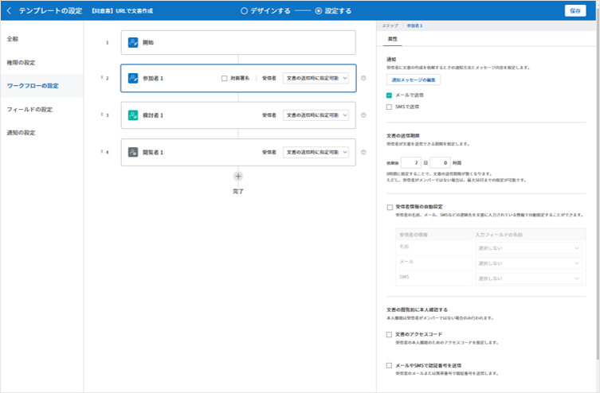

-  **ステップ名**\ : 当該ステップの名前を設定できます。

-  **通知**\ : 受信者に文書作成を要請した際に、通知を送信する方法を設定します。通知内容は編集が可能です。

   - **通知方法の選択:**\ 通知はデフォルトで電子メールでのみ送信されます。SMSを選択すると、**SMS**\ でも送信可能です。

   - **通知内容編集:**\ 各ステップで受信者に送信される文書の通知内容を編集できます。

-  **文書の送信期限**\ : 受信者が文書を受信した後、次のステップの受信者に文書を送信するまでの期限を設定します。文書の送信期限を設定したくない場合は0日0時間と入力してください。 

-  **受信者情報の自動設定**\ : 受信者に文書作成を依頼する際、文書に入力した情報を基に受信者の氏名および連絡先を自動的に設定できます。

-  **文書の閲覧前に本人確認する**\ : 文書を閲覧する前に本人確認をした後、文書を閲覧できるように設定します。  

   - **本人確認情報**\ : **受信者の名前**\、 **入力フィールドから選択**\、または **送信者が直接入力する**\  の中で1つを選択して受信者が文書閲覧する前に入力が必要な情報を設定します。

-  **文書一部を非表示にする:**\ 2つ以上のシートで作られたExcel文書または2つ以上の区域で分けたWordファイルの場合、設定することができます。

.. note:: 

   **受信者の設定**

   .. figure:: resources/workflow-participant-selected.png
      :alt: ワークフローの設定 > 参加者、受信者の設定
      :width: 700px

   当該ステップの受信者を事前に設定することが可能な機能です。

   -  **グループまたはメンバー**\ : 文書を処理するグループまたはメンバー1人を設定します。グループまたはメンバーは複数選択することが出来ますが、選択されたグループ及びメンバー中1人だけが文書を処理することができます。

   -  **前の受信者**\ : 開始ステップを含む前のステップの受信者が文書を処理するように設定します。当該ステップより前のステップから選択できます。
  

.. _hide:

**文書にて一部のシートまたはセクションのみ見えるように設定する方法**
^^^^^^^^^^^^^^^^^^^^^^^^^^^^^^^^^^^^^^^^^^^^^^^^^^^^^^^^^^^^^^^^^^^^^^^^^^^^

.. tip::

   
   **文書一部を非表示にする**

   文書が複数のシートまたはセクションで構成されたファイルである場合、外部の受信者に表示する文書の一部を非表示にすることができます。

   アップロードした文書に複数のシートまたはセクションが含まれている場合、ワークフローの外部受信者ステップの属性設定にて、文書の一部を非表示にする設定項目が表示されます。文書に含まれたシートまたはセクションがリストで表示され、各シートまたはセクション別に表示・非表示または前の要請者が選択出来るように設定できます。

   |image19|

**完了: 文書が全てのワークフローのステップを経て最終完了されるステップです。**
+++++++++++++++++++++++++++++++++++++++++++++++++++++++++++++++++++++++++++++++++++++++

|image18|

-  **別途のファイルストレージに完了文書を保存する**: 完了文書を、代表管理者または会社管理者が別途に設定した外部クラウドストレージに保存するように設定します。

-  **完了文書にタイムスタンプを付与する**: 完了した文書が以降変更されていないことを証明するタイムスタンプを文書に適用するように設定します。本機能は追加料金が発生します。

.. _field_fb:

フィールドの設定
~~~~~~~~~~~~~~~~~~~

**フィールドの設定**\ では、文書リストとCSVにデータをダウンロードした時に表示されるコンポーネントの列の表示可否と順序を設定できます。また、テンプレートに入るフィールドの初期値または自動入力値を設定できます。

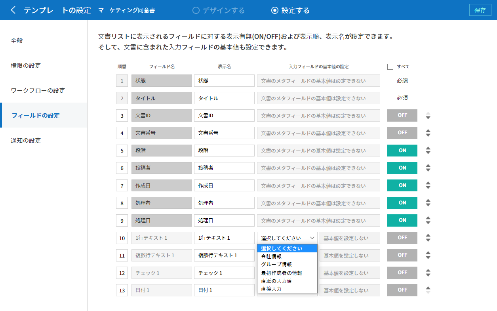

フィールドの初期値は **カスタムフィールド管理**\ に保存されている会社・グループ・メンバー情報を選択して設定、最近の入力値を選択して設定、ユーザーが直接入力して設定のうちいずれかの入力方法を選択して設定できます。

.. tip::

   **自動入力の設定方法**

   文書に頻繁に入力する情報を事前に保存し、自動的に入力されるように設定できます。

   例えば、作成者の名前、連絡先などの作成者情報、部署名、責任者、会社の代表番号などの会社またはグループに関する情報を事前に保存して自動的に入力されるように設定できます。関連フィールドの項目の追加と初期値の設定は、 **会社管理 > カスタムフィールド管理**\ で行うことができます。

   1. **カスタムフィールド管理**\ 画面でフィールドを追加します。

   2. **テンプレート管理**\ メニューに移動します。

   3. **テンプレートの設定**\ アイコンをクリックします。

   4. **フィールドの設定**\ メニューに移動します。

   5. 自動入力するフィールドの初期値を入力します。

   6. 全ての設定が完了したら、 **保存**\ ボタンをクリックします。

.. _noti_fb:

通知設定
~~~~~~~~~~~~~~~~~

テンプレートで作成された文書ステータスの通知や依頼を受信する受信者の設定および通知内容の確認・編集できます。

**文書状態についての通知**

当該テンプレートで作成した文書のステータスに関する通知の受信者設定、通知メッセージのプレビュー（文書の検討および作成/文書の返戻/文書の無効化/文書の修正）または通知編集（文書の完了通知）を行うことができます。

.. figure:: resources/template-setting-notification-channel.png
   :alt: 通知チャンネルの設定

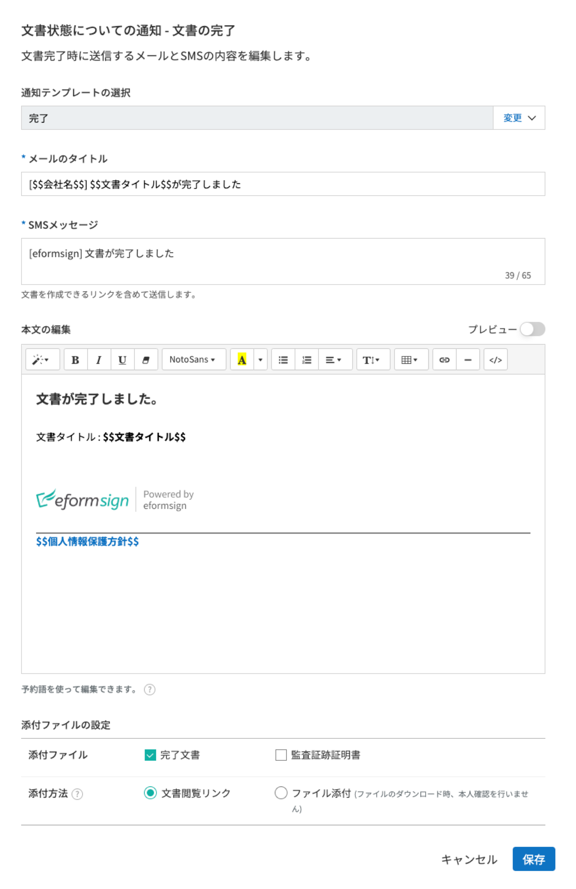

.. note::

   **文書の作成者**\ オプションにチェックを入れ、 **各ステップの処理者**\ オプションのチェックを外した場合、文書を最初に作成した人にステータス通知を送信します。

   **文書の作成者**\ オプションのチェックを外し、 **各ステップの処理者**\ オプションにチェックを入れた場合、文書の作成者を除く、現在のステップの前に文書を処理した人にステータス通知を送信します。

   **文書の作成者**\ , **各ステップの処理者**\ オプション両方にチェックを入れた場合、文書の作成者・現在ステップ以前に文書を処理した処理者全員に状態通知を送信します。
   

   **文書の作成者**\ , **各ステップの処理者**\ オプション両方のチェックを外した場合、当該ステップのステータス通知は送信されません。

---------------------------------
テンプレートの個別操作メニュー
---------------------------------

**テンプレート管理** 画面で、テンプレート名の右側にあるメニューアイコン (|image24|) をクリックすると、各テンプレートごとのメニューが表示されます。

|image25|

-  **複製** ：テンプレートを複製します。テンプレートの文書ファイルとテンプレートの設定が複製されます。詳細設定の変更、保存が可能です。

-  **削除** ：テンプレートを削除します。テンプレートを削除すると、今後そのテンプレートでは文書を作成できなくなります。

-  **ファイルをダウンロード** ：ファイルをダウンロードをクリックすると、アップロードしたファイルの形式でダウンロードされます。（例：Word、Excel ファイルなど）

-  **非活性化** ：テンプレートを非活性化すると、他のメンバーの **テンプレートで作成する**\ ページに当該テンプレートが表示されなくなります。

-  **所有者を変更** ：テンプレートの所有者を変更できます。デフォルトでは、テンプレートの所有者はテンプレートを作成した人になります。所有者を変更して他のメンバーに所有者を変更することもできます。テンプレートの所有者は、テンプレートの管理権限を持つメンバーの中から選択できます。

   |image26|

-  **文書管理者の設定：** 当該テンプレートで作成される文書の文書管理者を設定できます。 **テンプレート設定 > 権限の設定**\ と同様です。

   |image27|

--------------------------
テンプレートの検索
--------------------------

**テンプレート管理**\ 画面では、テンプレートをカテゴリでフィルタ、検索等ができます。

|image28|

**① テンプレートの照会**
   クリックすると、テンプレートの状態やカテゴリーでテンプレートをフィルタできます。 **X**\ をクリックすると、全てのカテゴリを表示します。

   カテゴリーの作成は **テンプレート設定 > 全般**\ で行えます。

**② テンプレートの検索**
   テンプレート名やカテゴリー名などの検索キーワードを入力することで、テンプレートを検索できます。
   
**③ ソート**
   テンプレートをテンプレート名またはカテゴリで昇順、降順に並び替えます。

.. |image1| image:: resources/config-icon.PNG
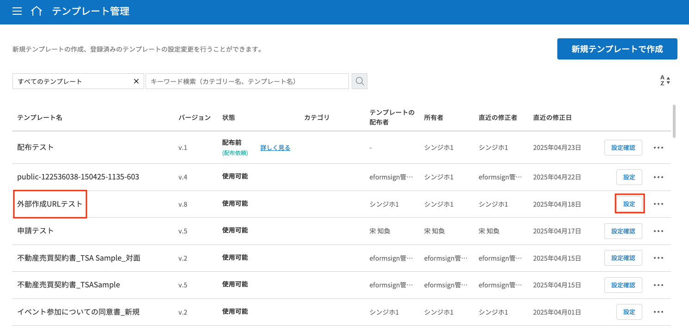
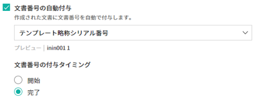
.. |image4| image:: resources/config-icon.PNG
.. |image5| image:: resources/config-icon.PNG
.. |image6| image:: resources/columnlist-docnum.png
.. |image7| image:: resources/doc-number-search.png
   :width: 600px
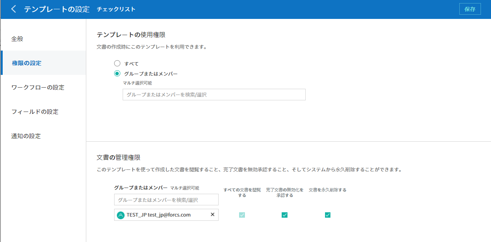
.. |image9| image:: resources/workflow-addstep-plus-button.png
.. |image10| image:: resources/template-setting-FB-workflow-add-step.png
   :width: 700px
.. |image11| image:: resources/template-setting-FB-workflow-add-step-change.png
   :width: 700px

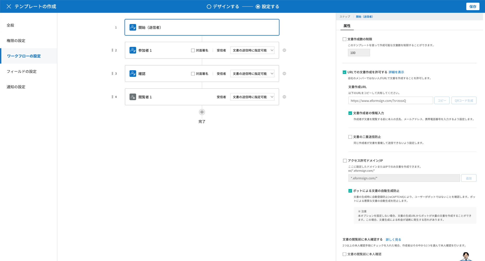
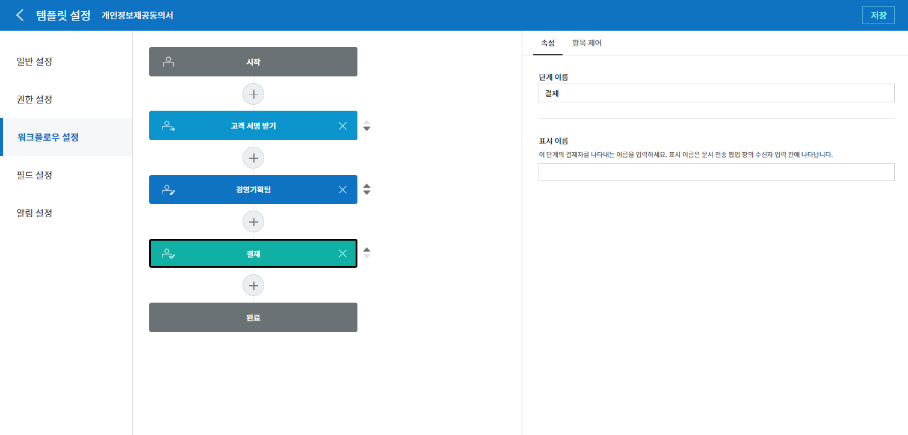
.. |image15| image:: resources/template-approval-property-displayname.png
   :width: 250px
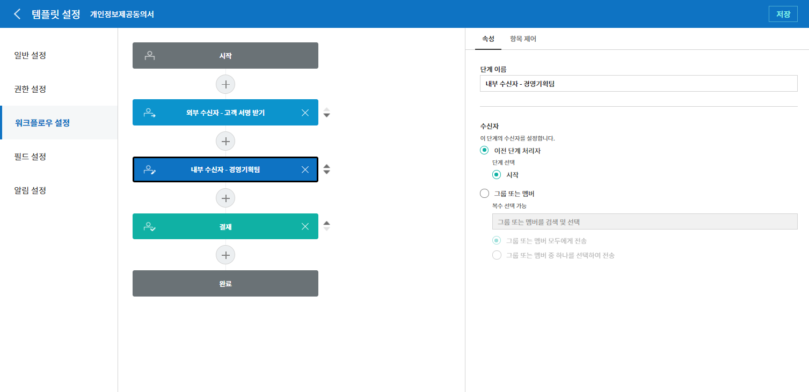

.. |image18| image:: resources/workflow-step-external-recipient-property-pw.png
   :width: 400px
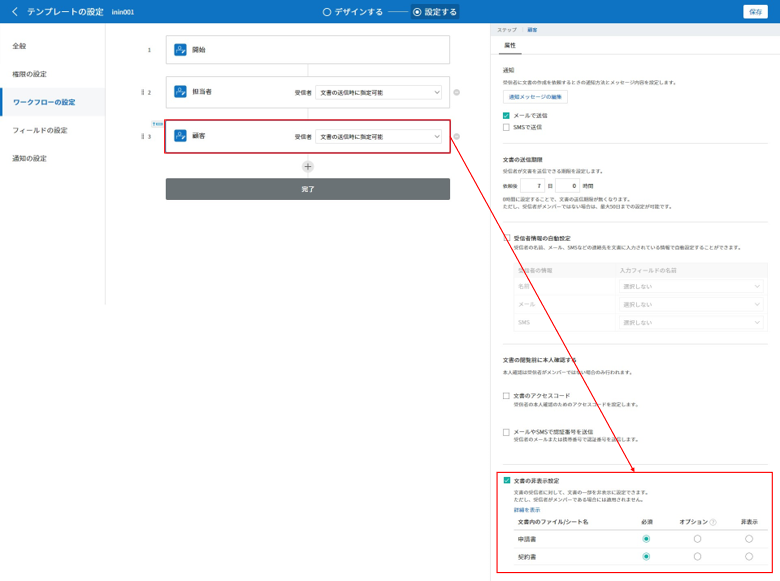

.. |image21| image:: resources/template-setting-notification-edit.png
   :width: 400px
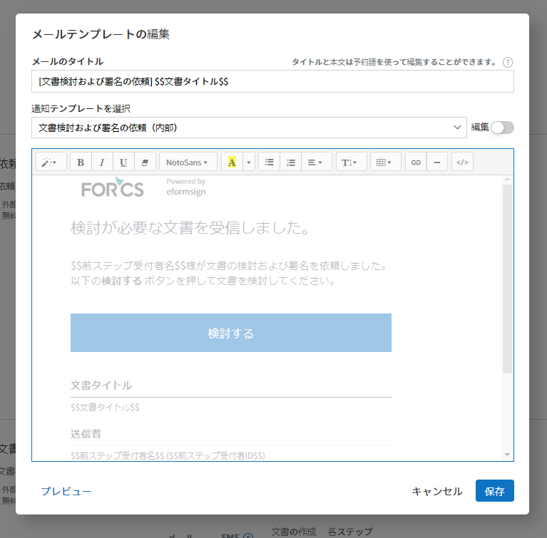
.. |image23| image:: resources/template-setting-notification-status.png
   :width: 500px

.. |image26| image:: resources/template-owner-change.PNG
.. |image27| image:: resources/document-manager-setting.PNG
.. |image28| image:: resources/template-manage-search.png
   :width: 700px
