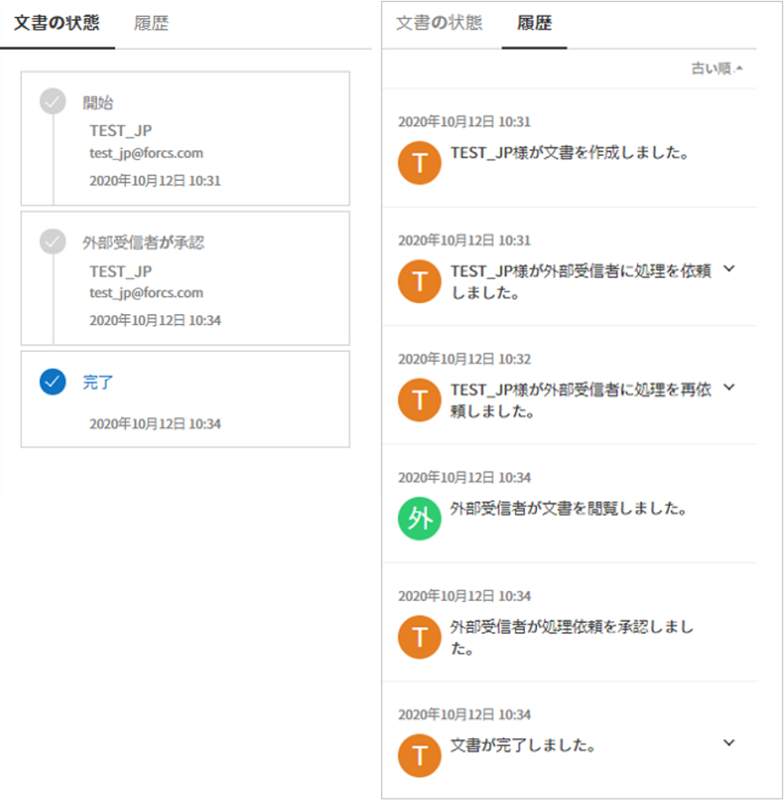
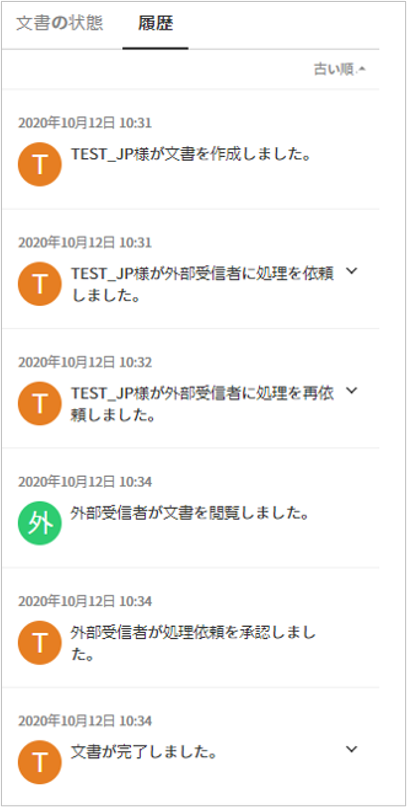
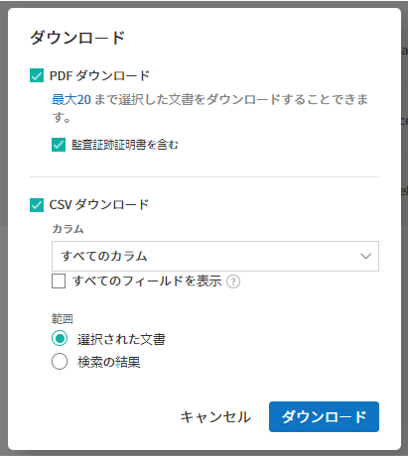
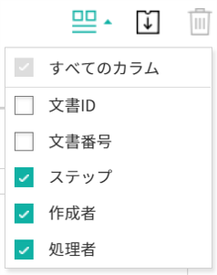
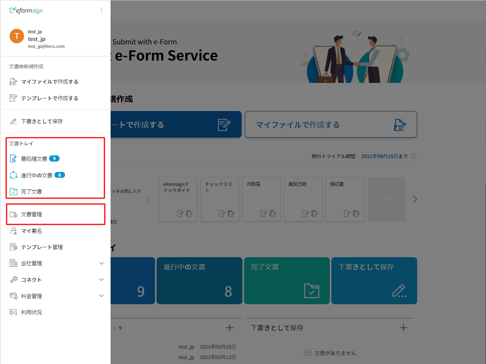
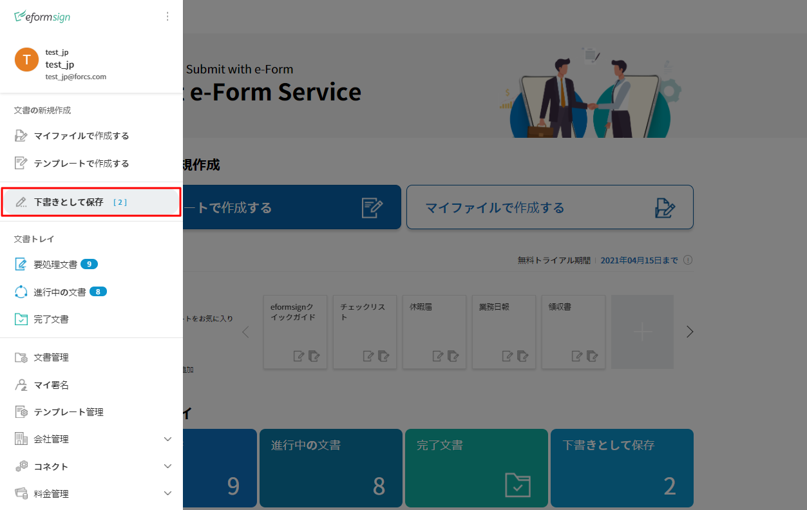
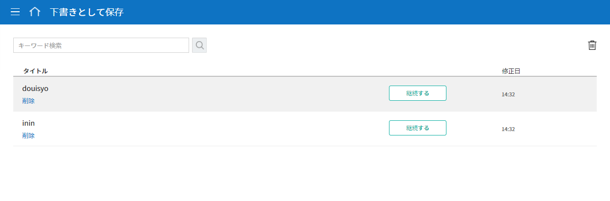

==============
文書トレイ
==============

----------------
文書トレイ
----------------

作成した文書はその状態により、3つの文書トレイに分けて保存されます。

.. note::

   一括作成した文書は `一括作成文書 <#bulksend-documents>`__ で確認できます。

文書トレイ内の各文書の状態と履歴を詳細情報を確認・管理でき、文書の処理、再転送、完了文書の転送など、追加アクションを行うことができます。文書作成途中に一時保存した文書は、 **要処理文書** に表示され、リストから文章を選択し、転送できます。

文書トレイでは、すべての文書および関連作業を記録および保存できます。また、文書の状態と履歴に関する詳細情報も確認できます。

-  **要処理文書：** 一時保存した文書、処理が必要な文書（他のメンバーから作成または決裁の依頼のあった文書）、または外部受信者に送信した文書のうち、未処理の文書のリストを確認できます。

-  **進行中の文書：** 作成または処理済みで、完了していない文書のリストを確認できます。

-  **完了文書：** 自分が作成または処理した全ての文書のリストを確認できます。

**文書管理** メニューではテンプレート設定で文書管理権限を付与されたメンバーが、当該テンプレートで作成された全ての文書を確認できます。

-  **文書管理：** このメニューには、文書管理の権限を持つメンバーのみアクセスできます。文書管理の権限を持つ場合、管理権限を持つテンプレートで作成された全ての文書を照会できます。

.. note::

   代表管理者は、全ての文書を照会および管理できます。

|image1|

.. note::

   各文書トレイと管理画面の構成はほぼ同じですが、表示される文書は、文書の状態または保有中の権限によって異なります。

.. figure:: resources/inbox_layout.png
   :alt: 文書トレイのタイプ
   :width: 700px

--------------------
文書トレイの構成
--------------------

文書トレイは、次の5つの主要項目で構成されています。

① **メニュー**\ （\ |image1|\ ）と\ **ホーム**\ （\ |image2|\ ）アイコンをクリックすることで、別のメニューまたはダッシュボードに移動できます。また、現在表示されている文書トレイの名前を確認できます。

メニュー(|image2|)とホーム(|image3|) アイコンをクリックすることで、別のメニューまたはダッシュボードに移動できます。 また、現在表示されている文書トレイの名前を確認できます。

②`カテゴリー <#category>`__ 表示欄, フィルター、コンボボックスおよび検索ボックス
   **テンプレート管理** メニューで設定したカテゴリー別に文書を表示したり、フィルターを使って必要な文書だけがリストに表示されるように設定できます。
   キーワード検索に加え、タイトルと内容の組み合わせによる検索、数字や日付の範囲を指定した検索、カスタムフィルターによる検索など、様々な検索方法が用意されています。

③ 文書リストおよび `作業項目 <#additional_work>`__
   1ページに20件の文書を表示することができます。文書が20件を超える場合は次のページに表示します。
   文書の状態、 タイトル、 ステップ、 作成者、作成日、処理者、処理日、文書ID、文書番号などのカラムを基に文書リストの内容を表示します。
表示するカラムの種類は、右上のアイコンのうち、カラム(|image4|)アイコンをクリックすることで表示される `カラムのチェックボックス <#document_column>`__\ で選択できます。
   文書リストで実行できる追加アクションには、**プレビュー、削除の依頼、再依頼、完了文書の送信** などがあります。

④ `文書の状態と履歴の表示 <#history>`__
   文書の状態と履歴を確認できます。

   **文書の状態** では、文書がいつ作成、処理、完了したかを文書の観点から確認できます。

   **履歴** では、作成者と受信者の観点から誰がどのような作業を実行したかを確認できます。

⑤ `文書トレイのフィールドの調整 <#document_column>`__、`文書のダウンロード <#document_download>`__ および `削除 <#document_delete>`__ アイコン
   文書トレイのカラム(|image5|)アイコンをクリックすると、表示項目の種類が表示されます。カラムのチェックボックスからリストに表示する項目を選択できます。
   
   文書のダウンロードをクリックし、リストからダウンロードしたい文書を選択(複数選択可能)することで、PDF文書、監査証跡証明、および選択フィールドのCSVデータをダウンロードできます。

   .. note::

      **文書の削除方法**

      文書トレイでは、文書の削除アイコンが非活性化されています。

      文書の削除は **文書管理**\ メニューでのみ可能で、削除には **文書管理権限**\ が必要です。

      文書の管理権限は、代表管理者またはテンプレート管理者が、**テンプレート管理 > テンプレート設定 > 権限設定 > 文書管理権限**\ から付与することができます。

      文書の管理権限は、各テンプレートごとに指定でき、指定すれば **文書管理**\ メニューから当該テンプレートで作成された文書を閲覧、削除およびダウンロード(PDF,CSV)することができる権限が与えられます。

.. _category:

カテゴリー、キーワードおよびフィルター検索
~~~~~~~~~~~~~~~~~~~~~~~~~~~~~~~~~~~~~~~~~~

カテゴリー、キーワードおよびフィルターの検索は、各文書トレイ画面の左上にあるボックスから可能です。また、文書の状態ごとのフィルター機能も備えています。

-  **要処理文書/進行中文書/完了文書**

   文書トレイ画面の左上には、カテゴリー別検索バー、文書の状態別フィルター、キーワード検索バーが表示されます。

-  **文書管理**

   文書トレイの左上には、カテゴリー別の検索バー、文書/状態別のフィルター、およびキーワードの検索バーが表示されます。

**カテゴリー検索**

**カテゴリー検索** のコンボボックスでは、**テンプレート管理** メニューで設定したカテゴリーごとに文書を表示でき、任意のカテゴリーまたは文書を確認することができます。

**カテゴリー検索** のコンボボックスの **X** アイコンをクリックすると、以下のようにテンプレートで設定したカテゴリーに合わせて文書が表示されます。

.. figure:: resources/category_search.png
   :alt: カテゴリー検索のコンボボックス
   :width: 500px

**文書の状態別検索**
------------------------

-  **要処理文書**

|image6|

-  **進行中の文書**

|image7|

-  **完了文書**

|image8|

-  **文書管理**

   |image9|

 

**キーワード及びフィルター検索**
--------------------------------------

キーワード検索に加え、詳細検索を行うことでタイトルと内容の組み合わせによる検索、数字や日付の範囲を指定した検索、カスタムフィルターによる検索など、さまざまな検索方法を備えています。また、カスタムフィルターを設定することで、文書のフィールドの入力値を詳細検索することも可能です。また、カスタムフィルターを使用することで、数字の範囲や日付の期間を設定して検索することもできます。

使用可能なフィルターの種類は以下の通りです。また、カスタムフィルターは、\ **完了文書** と **文書管理** でのみ使用できます。

================= ======================= ====================== ======================
要処理文書   　　　進行中の文書        　    完了文書        　 　　　文書管理
================= ======================= ====================== ======================
タイトル+内容        タイトル+内容     　　　  タイトル+内容        タイトル+内容
タイトル            タイトル            　 　 タイトル              タイトル
内容            　　 内容             　　　 内容              　 　内容
文書 ID         　   文書 ID           　　　 文書 ID            　　文書 ID  
文書番号        　　 文書番号         　　　  文書番号        　　　文書番号
テンプレート名   　 テンプレート名        　　　ステップ                ステップ
ステップ          　ステップ             　　　作成者              作成者
作成者            　作成者            　　　 作成日              　　作成日
作成日            　作成日             　　　処理者              　　処理者
依頼者            　処理者             　　　処理日             　　処理日
依頼日            　処理日             　　カスタムフィルター  　　カスタムフィルター          
                 　文書処理の経過日数                  
================= ======================= ====================== ======================

**カスタムフィルターの使用方法**
^^^^^^^^^^^^^^^^^^^^^^^^^^^^^^^^^^^

1. 詳細のコンボボックスから、**カスタムフィルター**\ を選択します。

   |image10|

2. フィールド名、フィールドタイプ、検索値を設定します。

   フィールド名のデフォルト値は空です。検索する場合、検索したい文書入力フィールドの表示名（テンプレートのフィールド設定の表示名）を直接入力する必要があります。

   .. note::

      1.存在しない文書入力フィールド名を入力し検索した場合、文書は照会されません。

      2.\ **フィールド名** に特殊文字（”、'、;、<、>、\\）を使用することはできません。

      3.\ **フィールド名** の前後のスペースは削除されます。例：「休暇　申込書 」>「休暇　申込書」

      4.追加/修正の際、既存のカスタムフィルターと同名のフィールド名を入力すると、以前のフィールドタイプとフィールドの検索値が表示されます。例）既存のカスタムフィルター「勤続年数」：5 ～ 10 を追加した状態でカスタムフィルターを再度追加する場合、フィールド名に同名の「勤続年数」と入力すると、フィールドタイプは「範囲」、検索値1は「5」、検索値2は「10」と既存の設定が表示されます。

   フィールドタイプとしてキーワード、範囲、期間のうち1つを選択します。デフォルト値はキーワードです。

   フィールドタイプの選択によって、検索値の入力欄として表示される入力ボックスが変わります。

   ================ ============== ==============
   フィールドタイプ 入力ボックス 1 入力ボックス 2
   ================ ============== ==============
   キーワード          1行テキスト    
   範囲             開始値         終了値
   期間             開始日         終了日
   ================ ============== ==============

   -  **キーワード**

      コンマ（ , ）で区切ることで、複数の値を設定できます。デフォルト値は空の値です。

      設定したテキストを含む値が検索されます。これは、複数のキーワードのうち1つ以上を含む文書を検索します。

      例) フィールド名：果物 / フィールドタイプ：キーワード / 値1：イチゴ、リンゴ　→　果物に「イチゴ」と「リンゴ」、2つのうち1つ以上を含む文書を検索します。

   -  **範囲**

      数字や一定の日付の間の値を検索する際に使用します。例）数字：100-200 / 期間：2019/01/01~2019/06/30

      設定した開始値と終了値の間の値が検索されます。開始値のみを入力した場合は、開始値以上の値を検索します。終了値のみを入力した場合は、終了値以下の値を検索します。例）年収：1000~ / 年収：~5000

   -  **期間**

      表示されるカレンダーから、日付の期間を設定します。デフォルト値は直近の1週間です。

      設定した開始日と終了日の間の日付を検索します。

3. **検索の追加** (|image11|)ボタンをクリックすることで、検索キーワードに追加し、設定した条件で文書を検索します。

   .. note::

      1.複数のカスタムフィルターの追加およびカスタムフィルターの変更、削除ができます。

      2.重複したフィールド名のカスタムフィルターを複数追加することはできません。

      3.設定済みのカスタムフィルターに変更を加えると、フィールドタイプと検索値は最新の入力値に更新されます。

**検索キーワードの表示方法及び修正/削除方法**
^^^^^^^^^^^^^^^^^^^^^^^^^^^^^^^^^^^^^^^^^^^^^^^

1. 検索キーワードは **フィールド名：値**\ の形式で、次のように追加されます。

   -  キーワード：「勤務形態：正社員、契約社員」

   -  範囲：「勤続年数：5~10」

   -  期間：「労働契約期間_年月日：2018-01-01~2018-12-31」

2. 追加した検索キーワードを選択して、カスタムフィルターを修正します。修正時には、詳細検索フィルターの項目が **カスタムフィルター** に変わり、選択した\ **フィルターのフィールド名、フィールドタイプ、検索値**\ が表示されます。

3. 追加した検索キーワードを削除するには、キーワードの右側の **X** アイコンをクリックします。

.. _additional_work:

各文書トレイの作業項目
~~~~~~~~~~~~~~~~~~~~~~~~~~~~~

各文書リストで実行できる追加アクションには、プレビュー、削除依頼、再要請、完了文書送信予約などがあります。

-  **要処理文書**

   編集、検討する、再要請、プレビュー、修正、無効化、完了文書送信予約、ダウンロードができます。

-  **進行中の文書**

   再要請、プレビュー、修正、無効化、完了文書送信予約、ダウンロードができます。

-  **完了文書**

   プレビュー、無効化、完了文書の送信、ダウンロードを行うことができます。

-  **文書管理**

   プレビュー、無効化、完了文書の送信、永久削除、ダウンロードの他、文書の削除を行うことができます。文書は、\ *文書管理*\ でのみ削除できます。

.. _history:

状態および履歴の表示
~~~~~~~~~~~~~~~~~~~~~~~~~~~

文書トレイのリストから文書を1つ選択すると、その文書の状態と履歴が画面の右側に表示されます。

**文書の状態** ：ワークフローのステップごとに文書がいつ、誰によって作成/処理されたか表示する。

.. _document_download:

文書のダウンロード 
~~~~~~~~~~~~~~~~~~~~~~

eformsignで作成されるほとんどの文書は、長期間安全に保管する必要がある文書です。全ての文書は長期アーカイブファイル形式（PDF/A）で保存され、指定された管理者のみが文書・データの閲覧および削除ができます。

1. 文書トレイのリストの右側にあるダウンロード(|image12|)アイコンをクリックします。

2. ダウンロードしたい文書を選択し、 **ダウンロード** ボタンをクリックします。

.. note::

   **CSVダウンロード**\ は、文書に入力されたデータをエクセルファイルでダウンロードできる機能です。
   CSVダウンロードを選択し、ダウンロードしたデータを確認後 **ダウンロード** ボタンをクリックします。

.. _document_delete:

文書の削除
~~~~~~~~~~~~~~~~~

eformsign では、指定された管理者のみが文書を削除できます。

1. 文書トレイのリストの右上にある **削除**\ （\ |image13|\ ）アイコンをクリックします。

2. 削除したい文書を選択後、 **削除** ボタンをクリックします。

3. 削除の確認ポップアップウィンドウで **はい** をクリックすると、文書が削除されます。

.. _document_column:

文書トレイのカラムの設定
~~~~~~~~~~~~~~~~~~~~~~~~

文書トレイの右上にあるアイコンのうち、カラム(|image14|)アイコンをクリックすることで、リストに表示したい項目を選択できます。

.. _drafts:

-------------------
下書きとして保存
-------------------

**下書きとして保存**\ には **マイファイルで作成する** で **文書作成をスタート** をクリックする前に **下書きとして保存**\ をクリックすることで、下書き保存した文書が保存されます。
**下書きとして保存**\　に保存されたファイルはいつでも作成を継続したり、文書を削除することもできます。

1. サイドバーのメニューから **下書きとして保存** をクリックして移動します。

   |image15|

2. 下書き保存された文書のリストから、任意の文書の **継続する**\ ボタンをクリックします。

   |image16|

3. **マイファイルで作成する**\ 画面が表示されます。文書を修正後、送信します。

.. |image2| image:: resources/menu_icon_2.png
   :width: 25px
.. |image3| image:: resources/home_icon_2.png
   :width: 25px
.. |image4| image:: resources/column_icon.png
   :width: 35px
.. |image5| image:: resources/column_icon.png
   :width: 35px
.. |image6| image:: resources/actionrequiredbox-status-search.png
   :width: 700px
.. |image7| image:: resources/inprocessbox-status-search.png
   :width: 700px
.. |image8| image:: resources/completedbox-status-search.png
   :width: 700px
.. |image9| image:: resources/documentmanage_status_search.png
   :width: 700px
.. |image10| image:: resources/userdefined_search1.png
.. |image11| image:: resources/searchplus.png
.. |image12| image:: resources/download_icon.png
.. |image13| image:: resources/delete_icon1.png
.. |image14| image:: resources/column_icon.png
   :width: 35px

