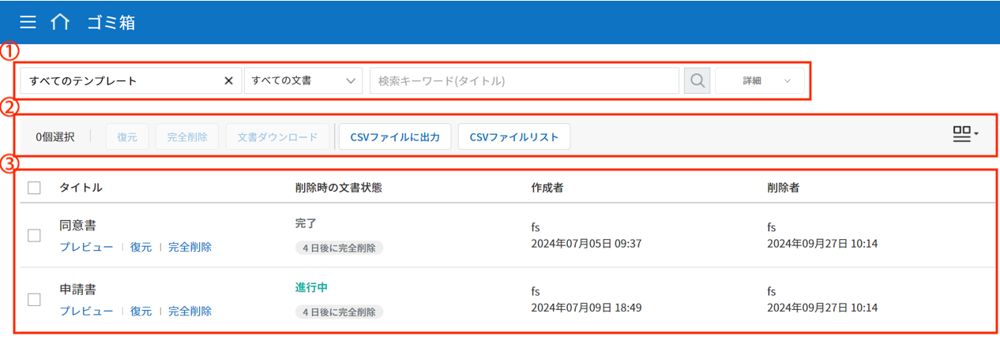

.. _documents:

==============
文書トレイ
==============

--------------------
文書トレイ
--------------------

作成した文書はその状態により、3つの文書トレイに分けて保存されます。

文書トレイでは各文書の状態と履歴、詳細情報を確認・管理することできるほか、文書の処理・再送信・完了文書の送信なども行うことができます。文書作成中に一時保存した文書は、 **要処理文書** に表示され、リストから文書を選択し、送信することができます。

-  **要処理文書：** 一時保存した文書、処理が必要な文書（他のメンバーが作成を依頼した文書）、または外部受信者に送信した文書のうち、未処理の文書のリストを確認できます。

-  **進行中の文書：** 作成または処理した文書のうち、完了していない文書のリストを確認できます。

-  **完了文書：** 自分が作成した全ての文書のリストを確認できます。

-  **一括作成文書トレイ:** 自分が一括作成した文書の進行状況など、一括作成文書の状況を確認することができます。(一括作成文書トレイの説明は `一括作成文書トレイ <#bulksend-documents>`__\ を参照)

----------------------------------------------------

- **共有文書トレイ:** 所有している文書を他のメンバーに共有したり、共有文書トレイへのアクセス権を持っていれば共有された文書を確認することができます。 (共有文書トレイの説明は `共有文書トレイ <#shared-documents>`__\ を参照)

- **ゴミ箱:** 文書トレイ/文書管理メニューから削除された文書を確認することができます。 (ゴミ箱の説明は `ゴミ箱 <#trash>`__\ を参照)

----------------------------------------------------

**文書管理/一括作成文書管理** メニューは、文書管理者のための文書トレイです。 **文書管理者** 権限を持つ文書を確認することができます。

.. note::

   文書管理者の設定方法は `文書管理者の設定 <chapter2.html#docmanager-permissions>`__\ をご確認ください。代表管理者はすべての文書を照会・管理することができます。

-  **文書管理：** 文書管理の権限を持つメンバーのみアクセス可能なメニューです。文書管理の権限を持つ場合、管理権限を持つテンプレートで作成された全ての文書を照会することができます。

-  **一括作成文書管理:** 文書管理者権限を持つメンバーのみアクセス可能なメニューです。文書管理権限を持つテンプレートで一括作成された文書を照会することができます。

.. figure:: resources/document_inbox.png
   :alt: 文書トレイメニュー
   :width: 700px

--------------------
文書トレイの構成
--------------------

.. note::

   各文書トレイと管理画面の構成はほぼ同じですが、表示される文書は文書の状態・保有中の権限によって異なります。

文書トレイは、次の5つの項目で構成されます。

.. figure:: resources/inbox_layout.png
   :alt: 文書トレイの構成
   :width: 700px

① メニューとホームアイコン、文書トレイ名
   メニュー（|image2|）とホーム（|image3|）アイコンをクリックすることで、別のメニューまたはダッシュボードに移動できます。また、現在表示されている文書トレイ名を確認することができます。

②  `カテゴリ <#category>`__ 表示欄、 フィルター、コンボボックス・検索ボックス
   テンプレート管理メニューで設定したカテゴリーごとに文書を表示したり、フィルターを使って必要な文書だけがリストに表示されるように設定することができます。

   キーワード検索に加え、タイトルと内容の組み合わせによる検索、数字や日付の範囲を指定した検索、カスタムフィルターによる検索など、様々な方法で検索することができます。

③ 文書リストと `作業項目 <#additional_work>`__
   1ページに20件までの文書を表示することができます。

   文書の状態、 タイトル、 ステップ、 作成者、作成日、処理者、処理日、文書ID、文書番号などのカラムを基に、文書リストの内容を表示します。
   表示するカラムの種類は、右上のアイコンのうち、カラム(|image4|)アイコンをクリックすることで表示される `カラムチェックボックス <#document-column>`__\ から選択することができます。

   文書リストで実行できる追加アクションには、 **プレビュー、削除の依頼、再依頼、完了文書の送信** などがあります。

④ `文書の状態と履歴の表示 <#history>`__
   文書の状態と履歴を確認することができます。

   - **文書の状態**\ では、文書がいつ作成、処理、完了したかを文書の観点から確認できます。

   - **履歴**\ では、作成者と受信者の観点から誰がどのような作業を実行したかを確認できます。

⑤ 共有、`文書トレイのカラムの調整 <#document-column>`__、`文書のダウンロード <#document-download>`__ と `削除 <#document-delete>`__ アイコン

   - 共有 (|image1|): アイコンをクリックし文書を選択すろと、共有文書トレイに文書を共有することができます。

   - 文書トレイのカラム (|image4|): 文書トレイのカラムの種類が表示され、文書リストにどんな項目を表示するか選択することができます。

   -文書のダウンロード (|image5|): 文書をPDFファイルまたはデータファイル(CSV)形式でダウンロードすることができます。また、データファイルの生成リストを確認することができます。

   .. note::

      **文書の削除方法**

      文書トレイでは、文書の削除アイコンが非活性化されています。

      文書の削除は **文書管理** メニューでのみ行うことができ、削除には **文書管理権限**\ が必要です。

      文書管理者設定は、代表管理者のみ行うことができ、**会社管理 > 文書管理者設定**\ メニューから行うことができます。

      文書管理者は、テンプレートごとに指定できます。指定されると **文書管理** メニューから指定されたテンプレートで作成された文書を閲覧、削除・ダウンロード(PDF、CSV形式)することができるようになります。

.. _category:

カテゴリー、キーワード・フィルター検索
~~~~~~~~~~~~~~~~~~~~~~~~~~~~~~~~~~~~~~~~~~

カテゴリー、キーワード・フィルターの検索は、各文書トレイ画面の左上にあるボックスから可能です。
また、文書の状態別のフィルター機能も備えています。

-  **要処理文書/進行中の文書/完了文書**

   文書トレイ画面の左上には、カテゴリー別検索バー、文書の状態別フィルター、キーワード検索バーが表示されます。

-  **文書管理**

   文書トレイの左上には、カテゴリー別の検索バー、文書/状態別のフィルター・キーワードの検索バーが表示されます。

カテゴリー検索
-------------------

カテゴリー検索のコンボボックスでは、**テンプレート管理** メニューで設定したカテゴリーごとに文書を表示でき、任意のカテゴリーや文書を確認することができます。

コンボボックスの **×** アイコンをクリックすると、以下のようにテンプレートで設定したカテゴリーに合わせて文書が表示されます。

.. figure:: resources/category_search.png
   :alt: カテゴリー検索のコンボボックス
   :width: 500px

文書の状態別検索
------------------------

各文書トレイで文書の状態別に検索することができます。

-  **要処理文書**

|image6|

-  **進行中の文書**

|image7|

-  **完了文書**

|image8|

-  **文書管理**

|image9|

**キーワード・フィルター検索**
--------------------------------------

キーワード検索に加え、詳細検索を行うことでタイトルと内容の組み合わせによる検索、数字や日付の範囲を指定した検索、カスタムフィルターによる検索など、さまざまな検索方法を備えています。また、カスタムフィルターを設定することで、文書のフィールドの入力値を詳細検索することも可能なほか、数字の範囲や日付の期間を設定して検索することもできます。

使用可能なフィルターの種類は以下の通りです。また、カスタムフィルターは、完了文書と文書管理でのみ使用できます。

.. table:: **フィルターの種類一覧**

   ================= ======================= ====================== ======================
   要処理文書   　    進行中の文書        　　完了文書        　 　 文書管理
   ================= ======================= ====================== ======================
   タイトル+内容      タイトル+内容     　　　タイトル+内容      　　タイトル+内容
   タイトル           タイトル            　  タイトル               タイトル
   内容               内容                    内容              　   内容
   文書 ID            文書 ID           　　　文書 ID            　  文書 ID
   文書番号           文書番号         　　 　文書番号        　　   文書番号
   テンプレート名   　テンプレート名        　ステップ               ステップ
   ステップ           ステップ              　作成者                 作成者
   作成者             作成者            　  　作成日                 作成日
   作成日             作成日            　  　受信者                 受信者
   依頼者             文書処理の経過日数      カスタムフィルター     カスタムフィルター
   依頼日             受信者 
   受信者             
   ================= ======================= ====================== ======================

**カスタムフィルターの使用方法**

1. **詳細** コンボボックスから、**カスタムフィルター**\ を選択します。

   |image10|

2. フィールド名、フィールドタイプ、検索値を設定します。

   フィールド名のデフォルト値は空です。検索する文書入力フィールドの表示名（テンプレートのフィールド設定の表示名）を入力する必要があります。

   .. note::

      1.存在しない文書入力フィールド名を入力して検索した場合、文書は照会されません。

      2. フィールド名に記号（”、'、;、<、>、\\）を使用することはできません。

      3. フィールド名の前後のスペースは削除されます。（例：「休暇申込書 」>「休暇申込書」）

      4.追加/修正の際、既存のカスタムフィルターと同名のフィールド名を入力すると、以前のフィールドタイプとフィールドの検索値が表示されます。

      （例：既存のカスタムフィルター「勤続年数」：5 ～ 10を追加した状態でカスタムフィルターを再度追加する場合、フィールド名に同名の「勤続年数」と入力すると、フィールドタイプは「範囲」、検索値1は「5」、検索値2は「10」と既存の設定が表示されます。）

   フィールドタイプとしてキーワード、範囲、期間のうち1つを選択します。デフォルト値はキーワードです。

   フィールドタイプの選択によって、検索値の入力欄として表示される入力ボックスが変わります。

   ================ ============== ==============
   フィールドタイプ 入力ボックス 1 入力ボックス 2
   ================ ============== ==============
   キーワード          1行テキスト    
   範囲             開始値         終了値
   期間             開始日         終了日
   ================ ============== ==============

   -  **キーワード**

      カンマ（,）で区切ることで、複数の値を設定できます。デフォルト値は空の値です。

      設定したテキストを含む値が検索されます。これは、複数のキーワードのうち1つ以上を含む文書を検索します。

      例) フィールド名：果物 / フィールドタイプ：キーワード / 値1：イチゴ、リンゴ　→　果物に「イチゴ」と「リンゴ」、2つのうち1つ以上を含む文書を検索します。

   -  **範囲**

      数字や一定の日付の間の値を検索する際に使用します。

      例) 数字：100-200 / 期間：2019/01/01~2019/06/30

      設定した開始値と終了値の間の値が検索されます。開始値のみを入力した場合は、開始値以上の値を検索します。終了値のみを入力した場合は、終了値以下の値を検索します。 

      例) 年収：100~ / 年収：~500）

   -  **期間**

      表示されるカレンダーから、日付の期間を設定します。デフォルト値は直近の1週間です。

      設定した開始日と終了日の期間を検索します。

3. 検索の追加(|image11|)ボタンをクリックすることで、検索キーワードとして追加し、設定した条件で文書を検索します。

   .. note::

      1.複数のカスタムフィルターの追加、追加したカスタムフィルターの変更/削除をすることができます。

      2.重複したフィールド名のカスタムフィルターを複数追加することはできません。

      3.設定済みのカスタムフィルターに変更を加えると、フィールドタイプと検索値は最新の入力値に更新されます。

**検索キーワードの表示方法及び修正/削除方法**

1. 検索キーワードは **フィールド名：値**\ の形式で、次のように追加されます。

   -  キーワード：「雇用形態：正社員、契約社員」

   -  範囲：「勤続年数：5~10」

   -  期間：「雇用契約期間_年月日：2018-01-01~2018-12-31」

2. 追加した検索キーワードを選択して、カスタムフィルターを修正します。
   修正時には、詳細検索フィルターの項目がカスタムフィルターに変わり、選択したフィルターのフィールド名、フィールドタイプ、検索値が表示されます。

3. 追加した検索キーワードを削除するには、キーワードの右側の **×**\ アイコンをクリックします。

.. _additional_work:

各文書トレイの作業項目
~~~~~~~~~~~~~~~~~~~~~~~~~~~~~

各文書リストで実行できる追加アクションには、プレビュー、再要請、完了文書送信などがあります。

-  **要処理文書トレイ**

   編集、検討する、再要請、プレビュー、修正、無効化、共有、完了文書送信予約、ダウンロードができます。

-  **進行中の文書トレイ**

   再依頼、プレビュー、修正、無効化、共有、完了文書送信予約、ダウンロードができます。

-  **完了文書トレイ**

   プレビュー、共有、完了文書の送信、新規文書の作成、リマインダー設定、ダウンロードを行うことができます。

-  **文書管理**

   プレビュー、無効化、完了文書の送信、永久削除、ダウンロードのほか、文書の削除を行うことができます。文書は、 **文書管理**\ でのみ削除することができます。

.. _history:

状態および履歴の表示
~~~~~~~~~~~~~~~~~~~~~~~~~~~

文書トレイのリストから文書を1つ選択すると、その文書の状態と履歴が画面の右側に表示されます。

-  **文書の状態**\ ：ワークフローのステップごとに文書がいつ、誰によって作成/処理されたか表示します。

-  **履歴**\ : 作成者と受信者の観点から、時系列順に誰がどんな作業を行ったか表示します。

   .. figure:: resources/document_status.png
      :alt: 文書状態タブ
      :width: 300px

.. _document_download:

文書のダウンロード 
~~~~~~~~~~~~~~~~~~~~~~

eformsingで作成された文書は **PDFとしてダウンロード**\ 、入力された内容を含む **データファイル**\ のダウンロードを行うことができます。

.. note::

   💡 **データファイルとは？**

   文書内に入力された内容を含む、文書タイトル、文書ID、受信者などの文書メタデータを確認できるファイルです。CSVファイル形式でダウンロードできます。

PDFファイル形式でダウンロード
-------------------------------

1. **文書トレイ/文書管理** 文書トレイのリストの右側にあるダウンロード(|image12|)アイコンをクリックします。
2. 文書リストの左側に表示されたチェックボックスを選択し、ダウンロードする文書を選択します。
3. **文書のダウンロード** ボタンをクリックします。
4. 文書のダウンロードポップアップで **監査証跡証明書を含む** かを選択し、 **ダウンロード** ボタンをクリックします。

   .. figure:: resources/download_popup.png
      :alt: 文書のダウンロードのポップアップ
      :width: 400px

データファイルのダウンロード
-------------------------------

1. **完了文書ボックス/文書管理** メニューからデータファイル生成(|image14|)アイコンをクリックします。
2. 文書リストの左側に表示されているチェックボックスを選択して、ダウンロードする文書を選択します。
3. **データファイルの作成** ボタンをクリックします。
4. **データファイルの生成** ポップアップでカラム及び範囲などを選択し、文書に入力された内容を含めるには、**すべてのテンプレートフィールド表示**\ を選択します。
5. **作成** ボタンをクリックします。

   .. figure:: resources/cvs_file_popup.png
      :alt: データファイル生成ポップアップ
      :width: 400px

6. データファイル名を入力後、確認をクリックします。

   .. figure:: resources/cvs_file_name_popup.png
      :alt: データファイル生成ファイル名ポップアップ
      :width: 400px

7. **データファイル生成リスト** ポップアップでCSVファイルの生成状態を確認し、生成が完了したらダウンロードできます。
 
   .. figure:: resources/cvs_file_list_popup.png
      :alt: データファイル生成リストポップアップ
      :width: 600px

.. note::

   **データファイル生成リスト**

   データファイル生成リスト(|image17|)アイコンをクリックすると、生成済みのファイル、作成中のファイル一覧を確認することができます。
   ファイルが作成中の場合は途中でキャンセルでき、作成済みのドキュメントはリストから再ダウンロードまたは削除できます。 データ ファイルは、作成後 7 日以内にいつでも再ダウンロードでき、7日後には自動削除されます。

   .. figure:: resources/cvs_file_list_popup1.png
      :alt: データファイル生成リストポップアップ
      :width: 600px

.. tip::

   **一括作成文書トレイ/一括作成文書管理からの文書のダウンロード**

   一括作成で送信した文書は、一括作成文書トレイからダウンロードできます。

   1. **一括作成文書トレイ** のリストからダウンロードする文書の **詳細を表示**\ をクリックします。

   2. ダウンロードする文書をリストから選択し、 **文書ダウンロード** または **データファイル作成**\ をクリックします。

   .. figure:: resources/bulksend_download.png
      :alt: CSVファイルの出力リストポップアップ
      :width: 700px

.. _set_reminder:

リマインダーの設定
~~~~~~~~~~~~~~~~~~~~~~~~~~~~~

完了文書トレイでは、文書のリマインダーを設定することができます。例として更新契約を行う場合、更新日が来たことを知らせるリマインダーを設定することができます。

1. 完了文書トレイに移動します。
2. リマインダーを設定する文書の下にあるリマインダー設定ボタンをクリックします。

   .. figure:: resources/set_reminder.png
      :alt: 完了文書トレイ-リマインダー設定
      :width: 600px

3. リマインダー通知設定ポップアップで、通知日、メッセージ、受信者を設定します。受信者にはグループ/メンバーのみ選択できます。

   .. figure:: resources/set_reminder_popup.png
      :alt: リマインダー設定のポップアップ
      :width: 500px

4. 保存ボタンをクリックすると、リマインダー設定が保存されます。
5. リマインダーに設定した時間に、受信者のメールにリマインダーが届きます。

.. note::

   リマインダーが設定されている場合、文書の下のボタン名が **リマインダーの変更**\ となり、 **リマインダーの変更**\ をクリックすると設定を変更することができます。

   .. figure:: resources/edit_reminder.png
      :alt: リマインダーの修正
      :width: 400px

.. _document_delete:

文書の削除
~~~~~~~~~~~~~~~~~

eformsignでは、指定された管理者のみ文書を削除することができます。

1. 文書トレイのリストの右上にある削除（|image13|）アイコンをクリックします。

2. 削除したい文書を選択後、 **削除** ボタンをクリックします。

3. 削除の確認ポップアップウィンドウで **はい**\ をクリックすると、文書が削除されます。

.. _document_column:

文書トレイのカラムの設定
~~~~~~~~~~~~~~~~~~~~~~~~

文書トレイの右上にあるアイコンのうち、カラム(|image4|)アイコンをクリックすることで、リストに表示する項目を選択することができます。

   .. figure:: resources/column_type.png
      :alt: 文書トレイのカラムの設定アイコン

---------------------------------------------------

.. _mydocuments:

-------------------
マイ文書トレイ
-------------------

**マイ文書トレイ** には、[マイファイルで文書作成] の過程で [文書作成をスタート] の前に [保存] をクリックして保存した文書が保存されます。

**マイファイルで文書作成**\ から作成した文書を保存しておけば、毎回新規作成せずとも、テンプレートのように使うことができます。

1. サイドバーのメニューから **下書きとして保存**\ をクリックして移動します。

   .. figure:: resources/draftbox-menu.png
      :alt: マイ文書トレイメニュー
      :width: 700px

2. 保存された文書のリストから、任意の文書の **開く** ボタンをクリックします。

   .. figure:: resources/draftbox-documentlist.png
      :alt: 下書きとして保存
      :width: 700px

3. **マイファイルで作成する** 画面が表示されます。文書を修正後、送信します。

.. tip::

   **マイファイルで作成する**\ をクリックすると、文書ファイルの選択ポップアップが表示され **PCからファイルを選択**\ または **最近使った文書**\ から選択することができます。この時、最近使った文書には **マイ文書トレイ**\ 内の文書が最新順で表示されます。

.. note::

   マイファイルで文書を作成する方法は `マイファイルで作成する <chapter3.html#id2>`__ をご参照ください。

--------------------------------------------------

.. _bulksend_documents:

-------------------------
一括作成文書トレイ
-------------------------

一括作成文書トレイでは、一括作成で送信した文書を確認することができます。一括作成した文書の進行状況を確認し、予約送信の変更、キャンセルまたは再依頼ができます。 

.. figure:: resources/bulksend-documents.png
   :alt: 一括作成文書

一括作成した文書リストから **詳細を表示**\ をクリックすると、送信された文書の進行状況などを確認することができます。

- 文書の処理状態を確認
- 一括または個別で再依頼、無効化、ダウンロード（PDC、CSVファイル）が可能
- 文書別ステップ、状態・履歴確認が可能

.. figure:: resources/bulksend-documents-detail.png
   :alt: 一括作成文書トレイ - 詳細を見る

.. caution::

   **再依頼の際、受信者情報を修正して送信できますか？**

   一括で再依頼を行うと受信者情報は修正できず、最初に入力したメールアドレスまたは携帯電話番号宛てに送信されます。

   一括で再依頼を行う場合には受信者の情報を修正することができず、最初に入力したメールアドレスまたは携帯電話番号宛てに送信されます。
   受信者の情報を変更する必要がある場合、個別に再依頼ボタンをクリックします。個別に再依頼をする場合、メールアドレスまたは携帯電話番号を修正して送信することができます。

予約送信した文書の場合、予約変更または無効化ができます。

.. figure:: resources/bulksend-schedule-change.png
   :alt: 一括作成文書トレイ- 予約変更
   :width: 300px

.. note::

   一度に大量の文書を送信することができる、文書一括作成の方法は `一括作成で文書を送信する <chapter3.html#bulksend>`__ をご参照ください。

--------------------------------------------------

.. _shared_documents:

-------------------------
共有文書トレイ
-------------------------

共有文書トレイでは、共有文書トレイを作成し、自分が所有している文書を他のメンバーと共有したり、他のメンバーが自分に共有した文書を確認することができます。

メンバーは共有文書トレイメニューから共有文書ボックスを作成することができ、その共有文書ボックスにアクセスできるメンバー/グループを選択できます。

共有文書トレイに追加したい文書がある場合は、要処理文書トレイ/進行中の文書トレイ/完了文書ボックスで任意の文書を共有文書トレイに追加できます。

**共有文書トレイの作成**

1. サイドバーメニューから共有文書トレイをクリックします。
2. 共有文書トレイの追加ボタンをクリックして、共有文書トレイのフォルダを作成します。
3. ポップアップウィンドウに文書トレイ名と説明を入力し、文書トレイへのアクセス権を付与するメンバー/グループを選択します。

   .. figure:: resources/create-shared-documentbox.png
      :alt: 共有文書トレイの作成

4. 作成した共有文書トレイの横にある詳細(⋯)ボタンをクリックして、文書トレイの設定をします。

   .. figure:: resources/shared-documentbox-setting.png
      :alt: 共有文書トレイの設定

- **基本設定:**\ 文書トレイ名、説明、文書トレイへのアクセス権限を付与するメンバーを設定します。

- **自動共有ルールの設定:**\ 文書トレイに自動的に共有される文書のルールを設定します。
    文書のタイトルに含まれている単語と文書のタイプを設定すると、指定したルールに従って自動的に共有文書トレイ内で文書が共有されます。

    例) 文書タイトルに含まれる単語を「契約書」に設定し、文書のタイプを「テンプレートなしでマイファイルで作成された文書」に設定すると、マイファイルで作成した文書のうち、文書タイトルに「契約書」が含まれている文書はその文書トレイに共有されます。

- **所有者の変更:**\ 文書トレイの所有者を変更します。

   .. note::

      ❗共有文書トレイを作成したメンバーは、自動的にその共有文書トレイの所有者になります。

- **削除:** 共有文書トレイを削除します。文書トレイを削除すると、文書トレイに共有されている全ての文書の共有が解除されます。

.. tip::

   **Tip. 自動共有ルールの設定方法**

   1. 自動共有ルールを設定する共有文書トレイの横にある詳細(⋯)ボタンをクリックし、自動共有ルール設定オプションをクリックします。

   2. ポップアップウィンドウで、共有文書トレイに特定の文書を自動的に共有するためのルールを設定します。以下の2つの条件のうち1つ、もしくは両方設定できます。

      - **文書タイトルに含まれる単語:** 単語を追加すると、その単語が文書タイトルに含まれている文書が自動的に共有文書トレイに追加されます。複数のフレーズを設定することができ、設定したフレーズのうち1つだけが文書タイトルに含まれる場合は、文書が共有されます。

      - **文書のタイプ:** 共有するテンプレート名を選択すると、そのテンプレートで文書作成する際に共有文書トレイに自動的に共有されます。テンプレートなしでマイファイルで作成された文書を選択すると、マイファイルで作成した文書全て、または文書タイトルに含まれる単語に設定された単語がある場合、その単語が含まれている文書が共有文書トレイに共有されます。

    例) 文書タイトルに含まれる単語を「契約書」に設定し、文書のタイプを「テンプレートなしでマイファイルで作成された文書」に設定すると、マイファイルで作成した文書のうち、文書タイトルに「契約書」が含まれている文書はその文書トレイに共有されます。

      .. figure:: resources/shared-rule-setting.png
         :alt: 自動共有ルール
         :width: 300px

**共有文書トレイに文書を追加**

.. note::

  作成された文書は、 **要処理文書トレイ、進行中の文書トレイ、完了文書トレイ**\ で共有できます。

1. 任意の文書トレイに移動します。
2. 文書トレイ名の下にある **共有**\ をクリックし、共有する共有文書トレイを選択します。

   .. figure:: resources/share-document.png
      :alt: 文書の共有

.. tip::

   メールボックスリストで複数の文書を同時に共有するには、文書トレイ右上の **共有アイコン**\ (|image1|)をクリックします。
   共有する文書をチェックし、 **共有** ボタンをクリックし、共有する文書トレイを選択します。

--------------------------------------------------

.. _trash:

-------------------------
ゴミ箱
-------------------------

自身が作成した文書、文書管理権限を持つ文書を削除するか、設定された文書の保管期間を過ぎた場合、その文書はゴミ箱に移動されます。 ゴミ箱に移動された文書は14日間保管され、その後完全に削除されます。

**①   カテゴリ表示、フィルタコンボボックス、検索窓**
カテゴリ別に文書を表示することができるほか、フィルタを使用して表示する文書をさらに絞り込むことができます。また、キーワードを入力して文書を検索することができます。

**②   文書の復元、削除、ダウンロードなど**
   •  復元: 選択した文書を復元します。復元ボタンをクリックすると、文書の削除前にあった文書トレイに文書が復元されます。
   •  完全削除: 選択した文書をシステム上から完全に削除します。本人が削除した文書のみ完全削除することができます。
   •  文書ダウンロード: 文書をPDF形式のファイルでダウンロードします。任意でダウンロードの理由も入力します。
   •  CSVファイルに出力: 文書内に入力されたデータをCSV形式のファイルで出力します。
   •  CSVファイルリスト: CSVファイルに出力したファイルをリスト形式で確認することができ、出力したCSVファイルをダウンロードすることができます。
   •  文書トレイのカラム(|image4|): 文書トレイのカラムの種類が表示されます。文書リストにどの項目を表示するか選択することができます。

**③   文書リストと操作項目**
１ページに最大20件の文書がリスト形式で表示されます。文書タイトル、削除時の文書状態、作成者、削除者を確認することができます。
また、文書リスト内の各文書に対してプレビュー、復元、完全削除を行うことができます。

.. caution::

   - ゴミ箱メニューはすべてのメンバーに表示されますが、権限(代表管理者、文書管理者、メンバー)により、表示される文書と行える操作は異なります。
   - 削除された文書はゴミ箱に14日間保管された後、完全に削除されます。ゴミ箱内の文書は手動による完全削除、復元を行うことができます。
   - 文書の復元は、手動で削除された文書に対してのみ行うことができます。
   - ゴミ箱内の文書のうち、本人が削除したもののみ完全削除することができます。自動削除された文書は代表管理者か文書管理者のみが完全削除することができます。 権限によって完全削除できる文書は異なります。
   - 一度完全削除された文書を復元することはできません。
   - 権限によって削除することができる文書は異なります。各権限の違いは以下の通りです。
      - 代表管理者: 文書管理メニューで確認することができる社内メンバーが作成した全ての文書
      - 文書管理者: 文書管理メニュー内の文書のうち削除権限を持つ文書
      - メンバー: 要処理文書トレイで本人が作成した下書き文書と、本人が作成した文書のうち本人に対して差し戻された文書

.. |image1| image:: resources/share_icon.png
   :width: 25px
.. |image2| image:: resources/menu_icon_2.png
   :width: 25px
.. |image3| image:: resources/home_icon_2.png
   :width: 25px
.. |image4| image:: resources/column_icon.png
   :width: 35px
.. |image5| image:: resources/download_icon.png
   :width: 60px
.. |image6| image:: resources/actionrequiredbox-status-search.png
   :width: 700px
.. |image7| image:: resources/inprocessbox-status-search.png
   :width: 700px
.. |image8| image:: resources/completedbox-status-search.png
   :width: 700px
.. |image9| image:: resources/documentmanage_status_search.png
   :width: 700px
.. |image10| image:: resources/userdefined_search1.png
.. |image11| image:: resources/searchplus.png
.. |image12| image:: resources/pdf_download_icon.png
   :width: 25px

.. |image14| image:: resources/csv_download_icon.png
   :width: 25px
.. |image17| image:: resources/csv_file_list_icon.png
   :width: 25px
